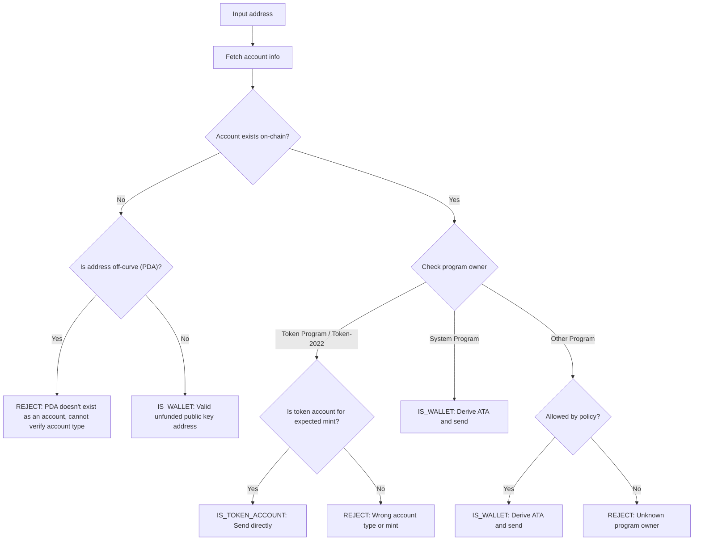

Tokenien lähettäminen väärään osoitteeseen voi johtaa varojen pysyvään
menetykseen. Osoitteen vahvistaminen varmistaa, että lähetät tokeneita vain
osoitteisiin, jotka voivat asianmukaisesti vastaanottaa ja käyttää niitä.

<Callout>
  Katso [Miten maksut toimivat Solanassa](/docs/payments/how-payments-work)
  maksun peruskäsitteitä varten.
</Callout>

## Solanan osoitteiden ymmärtäminen

Solana-tileillä on kahdenlaisia osoitteita: käyrällä olevat ja käyrän
ulkopuoliset.

### Käyrällä olevat osoitteet

Tavalliset osoitteet ovat Ed25519-avainparien julkisia avaimia. Nämä osoitteet:

- Niillä on vastaava yksityinen avain, joka voi allekirjoittaa transaktioita
- Niitä käytetään lompakko-osoitteina

### Käyrän ulkopuoliset osoitteet (PDA:t)

[Program Derived Address -osoitteet](/docs/core/pda) johdetaan deterministisesti
ohjelmatunnisteesta ja siemenistä. Nämä osoitteet:

- **Eivät** sisällä vastaavaa yksityistä avainta
- Vain ohjelma, josta osoite on johdettu, voi allekirjoittaa niiden puolesta

## Tilityypit maksuissa

Käytä osoitetta [tilin](/docs/core/accounts) hakemiseen verkosta, tarkista sen
ohjelmaomistaja ja tilityyppi määrittääksesi, miten osoitetta käsitellään.

<Callout>
  Sen tietäminen, onko osoite käyrällä vai käyrän ulkopuolella, ei kerro, minkä
  tyyppinen tili se on, mikä ohjelma omistaa sen tai onko kyseisessä osoitteessa
  olemassa tiliä. Sinun on haettava tili verkosta näiden tietojen
  määrittämiseksi.
</Callout>

### System Program -tilit (lompakot)

System Program -ohjelman omistamat tilit ovat tavallisia lompakoita.
Lähettääksesi SPL-tokeneita lompakolle, johdat ja käytät sen
[associated token account -tiliä (ATA)](/docs/tokens/basics/create-token-account#whats-an-associated-token-account).

Kun olet johtanut ATA-osoitteen, tarkista, onko token account olemassa
lohkoketjussa. Jos ATA:ta ei ole olemassa, voit sisällyttää ohjeen
vastaanottajan token account -tilin luomiseksi samaan transaktioon siirron
kanssa. Tämä kuitenkin edellyttää vuokran maksamista uudesta token account
-tilistä. Koska vastaanottaja omistaa ATA:n, vuokrasta maksettu SOL ei ole
lähettäjän palautettavissa.

<Callout type="warn">
  Ilman suojatoimia ATA:n luomisen tukemista voidaan hyväksikäyttää. Haitallinen
  käyttäjä voisi pyytää siirtoa, saada ATA:nsa luotua kustannuksellasi, sulkea
  ATA:n saadakseen rent-SOL:n takaisin ja toistaa prosessin.
</Callout>

### Token accountit

[Token accountit](/docs/tokens/basics/create-token-account) ovat Token Programin
tai Token-2022 Programin omistuksessa ja sisältävät token-saldoja. Jos saamasi
osoite on token programin omistuksessa, sinun tulee varmistaa, että tili on
token account (ei mint account) ja vastaa odotettua token mint accountia ennen
lähettämistä.

<Callout type="info">
  Token Programit validoivat automaattisesti, että molemmat token accountit
  siirrossa sisältävät saman mintin tokeneita. Jos validointi epäonnistuu,
  transaktio hylätään eikä varoja menetä.
</Callout>

### Mint accountit

[Mint accountit](/docs/tokens/basics/create-mint) seuraavat tietyn tokenin
tarjontaa ja metadataa. Mint accountit ovat myös Token Programien omistuksessa,
mutta eivät ole **kelvollisia** vastaanottajia token-siirroille. Yritys lähettää
tokeneita mint-osoitteeseen johtaa epäonnistuneeseen transaktioon, mutta varoja
ei menetä.

### Muut accountit

Muiden programien omistamat accountit vaativat linjapäätöksen. Jotkin accountit
(esim. multisig-lompakot) voivat olla kelvollisia token accountin omistajia, kun
taas toiset tulisi hylätä.

## Validointiprosessi

Seuraava kaavio näyttää viitepäätöspuun osoitteen validointiin:



<Steps>
<Step>

### Hae account

Käytä osoitetta accountin tietojen hakemiseen verkosta.

</Step>
<Step>

### Accountia ei ole olemassa

Jos osoitteessa ei ole accountia, tarkista onko osoite on-curve vai off-curve:

- **Käyrän ulkopuolella (PDA)**: Hylkää osoite varmuuden vuoksi välttääksesi
  lähettämisen ATA:han, joka saattaa olla saavuttamaton. Ilman olemassa olevaa
  tiliä et voi pelkästään osoitteesta määrittää, mikä ohjelma johti tämän PDA:n
  tai onko osoite ATA:ta varten. ATA:n johtaminen tälle osoitteelle tokenien
  lähettämistä varten voisi johtaa varojen lukittumiseen saavuttamattomaan
  token-tiliin.

- **Käyrällä**: Tämä on kelvollinen lompakko-osoite (julkinen avain), jota ei
  ole vielä rahoitettu. Johda ATA, tarkista onko se olemassa ja lähetä tokenit
  siihen. Sinun on tehtävä linjapäätös siitä, rahoitetaanko ATA:n luominen, jos
  sitä ei ole olemassa.

</Step>
<Step>

### Tili on olemassa

Jos tili on olemassa, tarkista mikä ohjelma omistaa sen:

- **System Program**: Tämä on tavallinen lompakko. Johda ATA, tarkista onko se
  olemassa ja lähetä tokenit siihen. Sinun on tehtävä linjapäätös siitä,
  rahoitetaanko ATA:n luominen, jos sitä ei ole olemassa.

- **Token Program / Token-2022**: Varmista, että tili on token-tili (ei mint
  account) ja että se sisältää tokenin (mintin), jonka aiot lähettää. Jos
  kelvollinen, lähetä tokenit suoraan tähän osoitteeseen. Jos kyseessä on mint
  account tai token-tili eri mintille, hylkää osoite.

- **Muu ohjelma**: Tämä vaatii linjapäätöksen. Jotkin ohjelmat, kuten
  multisig-lompakot, voivat olla hyväksyttäviä token-tilien omistajia. Jos
  linjauksesi sallii sen, johda ATA ja lähetä. Muussa tapauksessa hylkää osoite.

</Step>
</Steps>

## Demo

Seuraava esimerkki näyttää vain osoitteen validointilogiikan. Tämä on
referenssikoodia havainnollistamistarkoituksiin.

<Callout>
  Demo ei näytä, miten ATA johdetaan tai miten rakennetaan transaktio tokenien
  lähettämiseksi. Katso esimerkkikoodia [token
  account](/docs/tokens/basics/create-token-account#how-to-create-an-associated-token-account)-
  ja [token transfer](/docs/tokens/basics/transfer-tokens) -dokumentaatiosta.
</Callout>

Alla oleva demo käyttää kolmea mahdollista tulosta:

| Tulos              | Merkitys                    | Toimenpide                                  |
| ------------------ | --------------------------- | ------------------------------------------- |
| `IS_WALLET`        | Kelvollinen lompakko-osoite | Johda ja lähetä associated token accountiin |
| `IS_TOKEN_ACCOUNT` | Kelvollinen token account   | Lähetä tokenit suoraan tähän osoitteeseen   |
| `REJECT`           | Virheellinen osoite         | Älä lähetä                                  |

<CodeTabs flags="r">

```ts !! title="Demo"
// !collapse(1:35) collapsed

import {
  type Address,
  type Rpc,
  type GetAccountInfoApi,
  createSolanaRpc,
  fetchJsonParsedAccount,
  isOffCurveAddress,
  generateKeyPairSigner,
  getProgramDerivedAddress
} from "@solana/kit";

// =============================================================================
// Constants
// =============================================================================

const defaultRpc = createSolanaRpc("https://api.mainnet-beta.solana.com");

const SYSTEM_PROGRAM = "11111111111111111111111111111111" as Address;
const TOKEN_PROGRAM = "TokenkegQfeZyiNwAJbNbGKPFXCWuBvf9Ss623VQ5DA" as Address;
const TOKEN_2022_PROGRAM =
  "TokenzQdBNbLqP5VEhdkAS6EPFLC1PHnBqCXEpPxuEb" as Address;

// =============================================================================
// Validation Function
// =============================================================================

/**
 * Possible validation results for an input address.
 */
export type ValidationResult =
  | { type: "IS_TOKEN_ACCOUNT" }
  | { type: "IS_WALLET" }
  | { type: "REJECT"; reason: string };

/**
 * Validates an input address and classifies it as a wallet, token account, or invalid.
 *
 * @param inputAddress - The address to validate
 * @param rpc - Optional RPC client (defaults to mainnet)
 * @returns Classification result:
 *   - IS_WALLET: Valid wallet address
 *   - IS_TOKEN_ACCOUNT: Valid token account
 *   - REJECT: Invalid address for transfers
 */
export async function validateAddress(
  inputAddress: Address,
  rpc: Rpc<GetAccountInfoApi> = defaultRpc
): Promise<ValidationResult> {
  const account = await fetchJsonParsedAccount(rpc, inputAddress);
  // Log the account data for demo
  console.log("\nAccount:", account);

  // Account doesn't exist on-chain
  if (!account.exists) {
    // Off-curve = PDA that doesn't exist as an account
    // Reject conservatively to avoid sending to an address that may be inaccessible.
    if (isOffCurveAddress(inputAddress)) {
      return { type: "REJECT", reason: "PDA doesn't exist as an account" };
    }
    // On-curve = valid keypair address, treat as unfunded wallet
    return { type: "IS_WALLET" };
  }

  // Account exists, check program owner
  const owner = account.programAddress;

  // System Program = wallet
  if (owner === SYSTEM_PROGRAM) {
    return { type: "IS_WALLET" };
  }

  // Token Program or Token-2022, check if token account
  if (owner === TOKEN_PROGRAM || owner === TOKEN_2022_PROGRAM) {
    const accountType = (
      account.data as { parsedAccountMeta?: { type?: string } }
    ).parsedAccountMeta?.type;

    if (accountType === "account") {
      return { type: "IS_TOKEN_ACCOUNT" };
    }
    // Reject if not a token account (mint account)
    return {
      type: "REJECT",
      reason: "Not a token account"
    };
  }

  // Unknown program owner
  return { type: "REJECT", reason: "Unknown program owner" };
}

// =============================================================================
// Examples
// =============================================================================
// !collapse(1:1000) collapsed

// Wallets
const EXISTING_WALLET =
  "H8sMJSCQxfKiFTCfDR3DUMLPwcRbM61LGFJ8N4dK3WjS" as Address;
const NEW_WALLET = (await generateKeyPairSigner()).address;

// Token accounts
const USDC_TOKEN_ACCOUNT =
  "3emsAVdmGKERbHjmGfQ6oZ1e35dkf5iYcS6U4CPKFVaa" as Address;
const PYUSD_TOKEN_ACCOUNT =
  "47od2TPRvqJipfPVWZdyenLEngPw8hC36nDxiLyvGsEP" as Address;

// Token mints (should be rejected)
const USDC_MINT = "EPjFWdd5AufqSSqeM2qN1xzybapC8G4wEGGkZwyTDt1v" as Address;
const PYUSD_MINT = "2b1kV6DkPAnxd5ixfnxCpjxmKwqjjaYmCZfHsFu24GXo" as Address;

// PDA that doesn't exist (should be rejected)
const [NON_EXISTENT_PDA] = await getProgramDerivedAddress({
  programAddress: (await generateKeyPairSigner()).address,
  seeds: ["seed"]
});

// Program account (should be rejected)
const PROGRAM_ACCOUNT =
  "p1exdMJcjVao65QdewkaZRUnU6VPSXhus9n2GzWfh98" as Address;

async function runExample(label: string, address: Address) {
  console.log(`\n${"─".repeat(60)}`);
  console.log(`Example: ${label}`);
  console.log(`Input: ${address}`);
  console.log(`${"─".repeat(60)}`);

  const result = await validateAddress(address);
  console.log("\nResult:", result);
}

console.log("\n" + "═".repeat(60));
console.log("  IS_WALLET Examples");
console.log("═".repeat(60));

await runExample("Existing funded wallet", EXISTING_WALLET);
await runExample("New wallet (unfunded)", NEW_WALLET);

console.log("\n" + "═".repeat(60));
console.log("  IS_TOKEN_ACCOUNT Examples");
console.log("═".repeat(60));

await runExample("USDC token account (Token Program)", USDC_TOKEN_ACCOUNT);
await runExample("PYUSD token account (Token-2022)", PYUSD_TOKEN_ACCOUNT);

console.log("\n" + "═".repeat(60));
console.log("  REJECT Examples");
console.log("═".repeat(60));

await runExample("USDC mint address", USDC_MINT);
await runExample("PYUSD mint address", PYUSD_MINT);
await runExample("Non-existent PDA", NON_EXISTENT_PDA);
await runExample("Program account", PROGRAM_ACCOUNT);

console.log("\n" + "═".repeat(60));
console.log("  Done!");
console.log("═".repeat(60) + "\n");
```

</CodeTabs>
