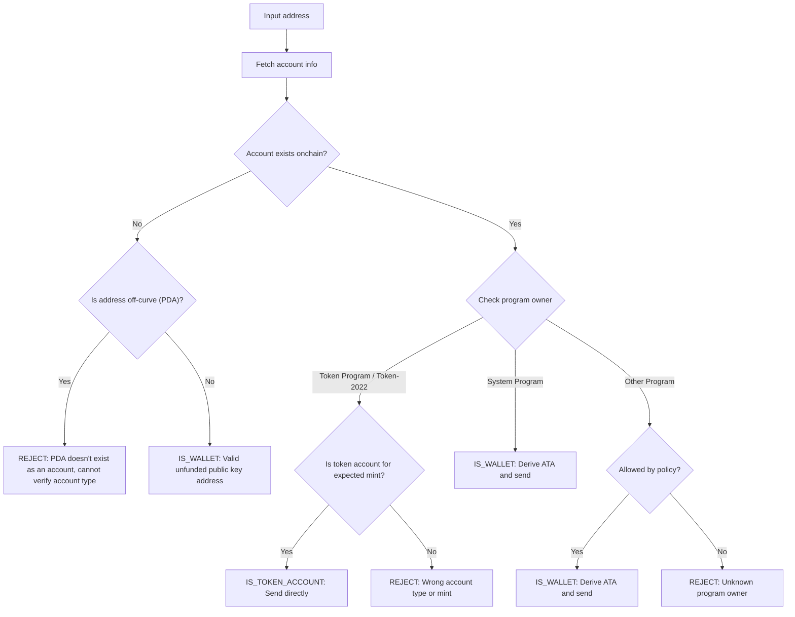

Varojen lähettäminen väärään osoitteeseen voi johtaa pysyvään menetykseen.
Osoitteen varmennus varmistaa, että lähetät vain osoitteisiin, jotka voivat
asianmukaisesti vastaanottaa ja käyttää varoja.

Validointi riippuu siitä, mitä lähetät:

- **SPL-tokenit** ovat osittain itsensä suojaavia. Token Program hylkää siirron,
  jonka tilit eivät vastaa odotettua rahapajaa, joten väärin kohdistettu token-
  siirto epäonnistuu ilman varojen menetystä. Suurin osa tästä sivusta
  käsittelee SPL-tokenien lähetystä.
- **Natiivilla SOL:lla** ei ole tällaista suojaa. System Program -siirto
  onnistuu mille tahansa tilille, joten väärä vastaanottaja lukitsee SOL:n
  pysyvästi. Katso [Natiivin SOL:n lähettäminen](#sending-native-sol).

<Callout>
  Katso [Miten maksut toimivat Solanassa](/docs/payments/how-payments-work)
  keskeisten maksukäsitteiden osalta.
</Callout>

## Solana-osoitteiden ymmärtäminen

Solana-tileillä on kahdenlaisia osoitteita: käyrällä olevat ja käyrän
ulkopuoliset.

### Käyrällä olevat osoitteet

Vakio-osoitteet ovat julkisia avaimia Ed25519 keypair -pareista. Nämä osoitteet:

- Sisältävät vastaavan yksityisen avaimen, joka voi allekirjoittaa transaktioita
- Niitä käytetään lompakko-osoitteina

### Käyrän ulkopuoliset osoitteet (PDA:t)

[Program Derived Addresses](/docs/core/pda) johdetaan deterministisesti ohjelman
tunnuksesta ja siemenistä. Nämä osoitteet:

- Eivät **omaa** vastaavaa yksityistä avainta
- Vain ohjelma, josta osoite on johdettu, voi allekirjoittaa niiden puolesta

## Tilityypit maksuissa

Käytä osoitetta hakeaksesi [tilin](/docs/core/accounts) verkosta, tarkista sen
ohjelman omistaja ja tilityyppi määrittääksesi, kuinka osoitetta käsitellään.

<Callout>
  Se, onko osoite käyrällä vai käyrän ulkopuolella, ei kerro sinulle, minkä
  tyyppinen tili on kyseessä, mikä ohjelma omistaa sen tai onko kyseisessä
  osoitteessa olemassa tiliä. Sinun on haettava tili verkosta näiden tietojen
  selvittämiseksi.
</Callout>

### System Program -tilit (lompakot)

System Program -omistamat tilit ovat tavallisia lompakoita. Lähettääksesi
SPL-tokeneita lompakkoon, johdat ja käytät sen
[Associated Token Account (ATA)](/docs/tokens/basics/create-token-account#whats-an-associated-token-account)
-tiliä.

ATA-osoitteen johtamisen jälkeen tarkista, onko token account olemassa
onchainissa. Jos ATA ei ole olemassa, voit sisällyttää saman transaktion
yhteyteen ohjeen vastaanottajan token accountin luomiseksi. Tämä kuitenkin
edellyttää rent-maksun suorittamista uudelle token accountille. Koska
vastaanottaja omistaa ATA:n, lähettäjä ei voi palauttaa rent-maksuna maksettua
SOL:ia.

<Callout type="warn">
  Ilman suojatoimia ATA:n luomisen subventoimista voidaan hyödyntää
  haitallisesti. Pahantahtoinen käyttäjä voi pyytää siirtoa, antaa ATA:nsa luoda
  kulujesi kustannuksella, sulkea ATA:n periäkseen rent SOL:in takaisin ja
  toistaa prosessin.
</Callout>

### Token Accountit

[Token accountit](/docs/tokens/basics/create-token-account) ovat Token Program-
tai Token-2022 Program -ohjelmien omistamia ja pitävät sisällään token-saldot.
Jos vastaanottamasi osoite on token-ohjelman omistama, sinun tulee varmistaa,
että tili on token account (ei mint account) ja vastaa odotettua token mint
accountia ennen lähettämistä.

<Callout type="info">
  Token Programs vahvistavat automaattisesti, että siirron molemmat token
  accountit sisältävät saman mintin tokeneita. Jos vahvistus epäonnistuu,
  transaktio hylätään eikä varoja menetetä.
</Callout>

### Mint Accountit

[Mint accountit](/docs/tokens/basics/create-mint) seuraavat tietyn tokenin
tarjontaa ja metatietoja. Mint accountit ovat myös Token Programs -ohjelmien
omistamia, mutta ne **eivät** ole kelvollisia vastaanottajia token-siirroille.
Tokenien lähettäminen mint-osoitteeseen johtaa epäonnistuneeseen transaktioon,
mutta varoja ei menetetä.

### Muut tilit

Muiden ohjelmien omistamat tilit edellyttävät käytäntöpäätöstä. Jotkut tilit
(esim. multisig-lompakot) voivat olla kelvollisia token account -omistajia, kun
taas toiset tulisi hylätä.

## Natiivin SOL:n lähettäminen

Yllä oleva luokittelu määrittää, minne SPL-tokenit voivat mennä. Natiivi SOL on
tiukempi: ainoa turvallinen vastaanottaja on **System Program -lompakko** (tai
rahoittamaton käyrällä oleva osoite, josta sellainen tulee).

System Program -siirto lisää lamport-yksiköitä mille tahansa tilille, mukaan
lukien mintit, token accountit, ohjelmat ja PDA:t. Lamporteja voi siirtää pois
vain tilin omistavan ohjelman kautta, joten SOL:n lähettäminen väärään
vastaanottajaosoitteeseen voi johtaa varojen pysyvään menetykseen.

Toisin kuin SPL-tokenisiirto, transaktio **ei** epäonnistu, kun vastaanottaja on
odottamaton osoite.

Natiivia SOL:a lähetettäessä hyväksyttävä tulos on vain `IS_WALLET`.
`IS_TOKEN_ACCOUNT` **ei** ole: token account sisältää SPL-tokeneita, ja sinne
lähetetty SOL on lähettäjän hallinnan ulkopuolella.

<Callout type="warn">
  Tämä on yleinen tapa menettää SOL: käyttäjä liittää tokenin mint-osoitteen
  (tai ohjelman osoitteen) SOL-nostoon. Siirto onnistuu ja SOL on
  palautumattomasti menetetty. Luokittele vastaanottaja aina ennen SOL-siirron
  allekirjoittamista.
</Callout>

## Vahvistusprosessi

Seuraava kaavio näyttää viitemuotoisen päätöspuun osoitteen vahvistamiseksi:


```mermaid title="Address Verification Flow"
flowchart TD
    A["Input address"]
    B["Fetch account info"]

    A --> B
    B --> C{"Account exists onchain?"}

    %% --- Non-existent account path ---
    C -- "No" --> D{"Is address off-curve (PDA)?"}
    D -- "Yes" --> R1["REJECT: PDA doesn't exist as an account, cannot verify account type"]
    D -- "No" --> W1["IS_WALLET: Valid unfunded public key address"]

    %% --- Existing account path ---
    C -- "Yes" --> F{"Check program owner"}

    F -- "Token Program / Token-2022" --> G{"Is token account for expected mint?"}
    G -- "Yes" --> T1["IS_TOKEN_ACCOUNT: Send directly"]
    G -- "No" --> R2["REJECT: Wrong account type or mint"]

    F -- "System Program" --> W2["IS_WALLET: Derive ATA and send"]

    F -- "Other Program" --> K{"Allowed by policy?"}
    K -- "Yes" --> W3["IS_WALLET: Derive ATA and send"]
    K -- "No" --> R3["REJECT: Unknown program owner"]
```

<Steps>
<Step>

### Hae tili

Käytä osoitetta tilin tietojen hakemiseen verkosta.

</Step>
<Step>

### Tiliä ei ole olemassa

Jos tässä osoitteessa ei ole tiliä, tarkista onko osoite käyrällä vai käyrän
ulkopuolella:

- **Käyrän ulkopuolella (PDA)**: Hylkää osoite varovaisuuden vuoksi, jotta
  vältytään lähettämästä varoja ATA:lle, joka saattaa olla saavuttamattomissa.
  Ilman olemassa olevaa tiliä et voi pelkän osoitteen perusteella selvittää,
  mikä ohjelma on johtanut tämän PDA:n tai onko osoite tarkoitettu ATA:lle.
  ATA:n johtaminen tähän osoitteeseen tokeneita varten voi johtaa varojen
  jumiutumiseen saavuttamattomassa token accountissa.

- **Käyrällä**: Tämä on voimassa oleva lompakko-osoite (julkinen avain), jota ei
  ole vielä rahoitettu. Johdeta ATA, tarkista onko se olemassa, ja lähetä siihen
  tokeneita. Sinun täytyy tehdä käytäntöpäätös siitä, rahoitatko ATA:n luomisen,
  jos sitä ei ole olemassa.

</Step>
<Step>

### Tili on olemassa

Jos tili on olemassa, tarkista mikä ohjelma omistaa sen:

- **System Program**: Tämä on tavallinen lompakko. Johdeta ATA, tarkista onko se
  olemassa, ja lähetä siihen tokeneita. Sinun täytyy tehdä käytäntöpäätös siitä,
  rahoitatko ATA:n luomisen, jos sitä ei ole olemassa.

- **Token Program / Token-2022**: Varmista, että tili on token account (ei mint
  account) ja että se sisältää tokenin (mintin), jonka aiot lähettää. Jos tili
  on voimassa, lähetä tokenit suoraan tähän osoitteeseen. Jos kyseessä on mint
  account tai token account eri mintille, hylkää osoite.

- **Muu ohjelma**: Tämä edellyttää käytäntöpäätöstä. Jotkut ohjelmat, kuten
  multisig-lompakot, voivat olla hyväksyttäviä token account -omistajia. Jos
  käytäntösi sen sallii, johdeta ATA ja lähetä. Muussa tapauksessa hylkää
  osoite.

</Step>
</Steps>

## Demo

Seuraava esimerkki näyttää ainoastaan osoitteen validointilogiikan. Tämä on
viitekoodi havainnollistamista varten.

<Callout>
  Demo ei näytä, miten ATA johdetaan tai miten rakennetaan transaktio tokeneiden
  lähettämiseksi. Katso esimerkkikoodia [token
  account](/docs/tokens/basics/create-token-account#how-to-create-an-associated-token-account)
  - ja [token transfer](/docs/tokens/basics/transfer-tokens) -dokumentaatiosta.
</Callout>

Demo alla käyttää kolmea mahdollista lopputulosta:

| Tulos              | Merkitys                       | Toimenpide                                          |
| ------------------ | ------------------------------ | --------------------------------------------------- |
| `IS_WALLET`        | Voimassa oleva lompakko-osoite | Johdata ja lähetä associated token account -tilille |
| `IS_TOKEN_ACCOUNT` | Voimassa oleva token account   | Lähetä tokenit suoraan tähän osoitteeseen           |
| `REJECT`           | Virheellinen osoite            | Älä lähetä                                          |

Se sitten kartoittaa jokaisen tuloksen omaisuuserän hyväksyttävyyteen
`canReceiveNativeSol` (vain lompakot) ja `canReceiveSplToken` (lompakot tai
token accounts). Token account palauttaa `IS_TOKEN_ACCOUNT`, joten se voi
vastaanottaa SPL-tokeneita, mutta **ei** natiiveja SOL — tämä ero estää SOL:n
lukittumisen.

<CodeTabs flags="r">

```ts !! title="Demo"
// !collapse(1:35) collapsed

import {
  type Address,
  type Rpc,
  type GetAccountInfoApi,
  createSolanaRpc,
  fetchJsonParsedAccount,
  isOffCurveAddress,
  generateKeyPairSigner,
  getProgramDerivedAddress
} from "@solana/kit";

// =============================================================================
// Constants
// =============================================================================

const defaultRpc = createSolanaRpc("https://api.mainnet-beta.solana.com");

const SYSTEM_PROGRAM = "11111111111111111111111111111111" as Address;
const TOKEN_PROGRAM = "TokenkegQfeZyiNwAJbNbGKPFXCWuBvf9Ss623VQ5DA" as Address;
const TOKEN_2022_PROGRAM =
  "TokenzQdBNbLqP5VEhdkAS6EPFLC1PHnBqCXEpPxuEb" as Address;

// =============================================================================
// Validation Function
// =============================================================================

/**
 * Possible validation results for an input address.
 */
export type ValidationResult =
  | { type: "IS_TOKEN_ACCOUNT" }
  | { type: "IS_WALLET" }
  | { type: "REJECT"; reason: string };

/**
 * Validates an input address and classifies it as a wallet, token account, or invalid.
 *
 * @param inputAddress - The address to validate
 * @param rpc - Optional RPC client (defaults to mainnet)
 * @returns Classification result:
 *   - IS_WALLET: Valid wallet address
 *   - IS_TOKEN_ACCOUNT: Valid token account
 *   - REJECT: Invalid address for transfers
 */
export async function validateAddress(
  inputAddress: Address,
  rpc: Rpc<GetAccountInfoApi> = defaultRpc
): Promise<ValidationResult> {
  const account = await fetchJsonParsedAccount(rpc, inputAddress);
  // Log the account data for demo
  console.log("\nAccount:", account);

  // Account doesn't exist onchain
  if (!account.exists) {
    // Off-curve = PDA that doesn't exist as an account
    // Reject conservatively to avoid sending to an address that may be inaccessible.
    if (isOffCurveAddress(inputAddress)) {
      return { type: "REJECT", reason: "PDA doesn't exist as an account" };
    }
    // On-curve = valid keypair address, treat as unfunded wallet
    return { type: "IS_WALLET" };
  }

  // Account exists, check program owner
  const owner = account.programAddress;

  // System Program = wallet
  if (owner === SYSTEM_PROGRAM) {
    return { type: "IS_WALLET" };
  }

  // Token Program or Token-2022, check if token account
  if (owner === TOKEN_PROGRAM || owner === TOKEN_2022_PROGRAM) {
    const accountType = (
      account.data as { parsedAccountMeta?: { type?: string } }
    ).parsedAccountMeta?.type;

    if (accountType === "account") {
      return { type: "IS_TOKEN_ACCOUNT" };
    }
    // Reject if not a token account (mint account)
    return {
      type: "REJECT",
      reason: "Not a token account"
    };
  }

  // Unknown program owner
  return { type: "REJECT", reason: "Unknown program owner" };
}

/**
 * Native SOL is only safe to send to a wallet. Any other account locks it.
 */
function canReceiveNativeSol(result: ValidationResult): boolean {
  return result.type === "IS_WALLET";
}

/**
 * SPL tokens can go to a wallet (via its ATA) or directly to a token account.
 */
function canReceiveSplToken(result: ValidationResult): boolean {
  return result.type === "IS_WALLET" || result.type === "IS_TOKEN_ACCOUNT";
}

// =============================================================================
// Examples
// =============================================================================
// !collapse(1:1000) collapsed

// Wallets
const EXISTING_WALLET =
  "H8sMJSCQxfKiFTCfDR3DUMLPwcRbM61LGFJ8N4dK3WjS" as Address;
const NEW_WALLET = (await generateKeyPairSigner()).address;

// Token accounts
const USDC_TOKEN_ACCOUNT =
  "3emsAVdmGKERbHjmGfQ6oZ1e35dkf5iYcS6U4CPKFVaa" as Address;
const PYUSD_TOKEN_ACCOUNT =
  "47od2TPRvqJipfPVWZdyenLEngPw8hC36nDxiLyvGsEP" as Address;

// Token mints (should be rejected)
const USDC_MINT = "EPjFWdd5AufqSSqeM2qN1xzybapC8G4wEGGkZwyTDt1v" as Address;
const PYUSD_MINT = "2b1kV6DkPAnxd5ixfnxCpjxmKwqjjaYmCZfHsFu24GXo" as Address;

// PDA that doesn't exist (should be rejected)
const [NON_EXISTENT_PDA] = await getProgramDerivedAddress({
  programAddress: (await generateKeyPairSigner()).address,
  seeds: ["seed"]
});

// Program account (should be rejected)
const PROGRAM_ACCOUNT =
  "p1exdMJcjVao65QdewkaZRUnU6VPSXhus9n2GzWfh98" as Address;

async function runExample(label: string, address: Address) {
  console.log(`\n${"─".repeat(60)}`);
  console.log(`Example: ${label}`);
  console.log(`Input: ${address}`);
  console.log(`${"─".repeat(60)}`);

  const result = await validateAddress(address);
  console.log("\nResult:", result);
  console.log(
    `Can receive SOL?   ${canReceiveNativeSol(result) ? "YES" : "NO"}`
  );
  console.log(
    `Can receive token? ${canReceiveSplToken(result) ? "YES" : "NO"}`
  );
}

console.log("\n" + "═".repeat(60));
console.log("  IS_WALLET Examples");
console.log("═".repeat(60));

await runExample("Existing funded wallet", EXISTING_WALLET);
await runExample("New wallet (unfunded)", NEW_WALLET);

console.log("\n" + "═".repeat(60));
console.log("  IS_TOKEN_ACCOUNT Examples");
console.log("═".repeat(60));

await runExample("USDC token account (Token Program)", USDC_TOKEN_ACCOUNT);
await runExample("PYUSD token account (Token-2022)", PYUSD_TOKEN_ACCOUNT);

console.log("\n" + "═".repeat(60));
console.log("  REJECT Examples");
console.log("═".repeat(60));

await runExample("USDC mint address", USDC_MINT);
await runExample("PYUSD mint address", PYUSD_MINT);
await runExample("Non-existent PDA", NON_EXISTENT_PDA);
await runExample("Program account", PROGRAM_ACCOUNT);

console.log("\n" + "═".repeat(60));
console.log("  Done!");
console.log("═".repeat(60) + "\n");
```

</CodeTabs>
