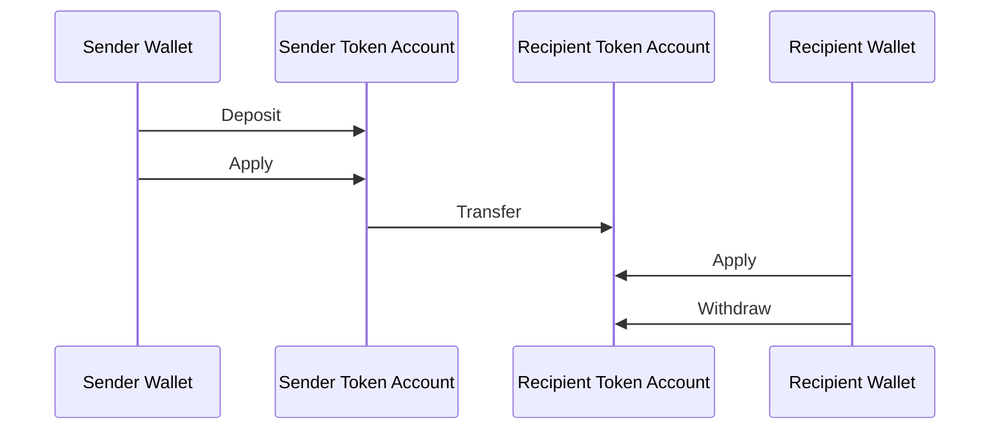
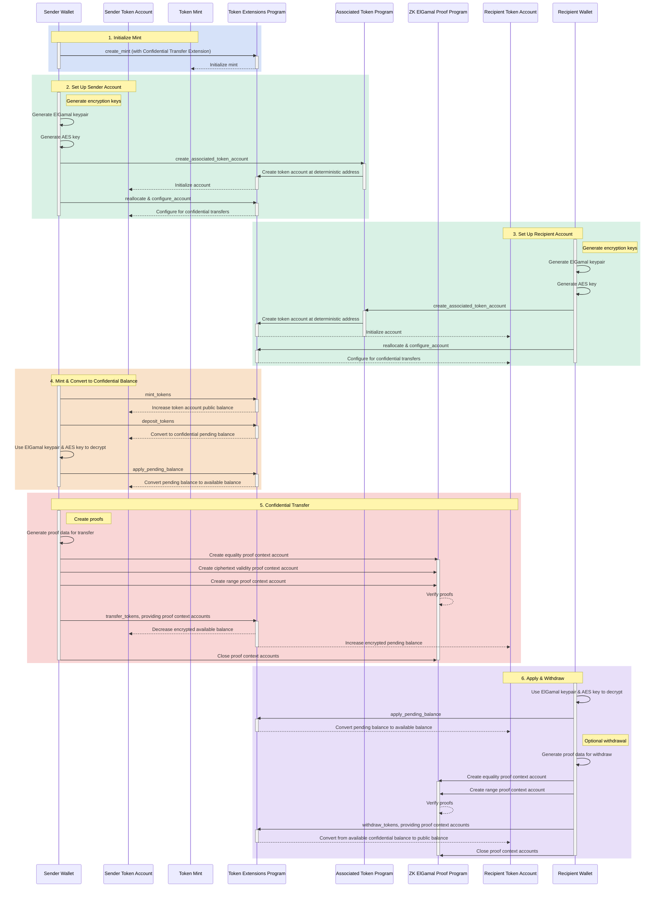

## Mitä ovat luottamukselliset siirrot?

<Embed url="https://youtu.be/Bqs95tFcRIU" />

Luottamukselliset siirrot mahdollistavat tokenien siirtämisen token account
-tilien välillä paljastamatta siirrettävää summaa. Tämä on hyödyllistä
yksityisyyttä suojaavissa transaktioissa. Ainoastaan siirrettävät summat ja
token-saldot ovat yksityisiä. Token account -osoitteet pysyvät julkisina.

- [Protokollan yleiskatsaus](https://www.solana-program.com/docs/confidential-balances/overview) -
  Tietoja taustalla olevasta kryptografisesta protokollasta
- [Pikaopas](https://www.solana-program.com/docs/confidential-balances#setup) -
  Asennus ja perus-CLI-komennot
- [Confidential Balances Cookbook](https://github.com/solana-developers/Confidential-Balances-Sample) -
  Koodiesimerkkejä Confidential Transfer -laajennuksen käyttämisestä

### Miten se toimii?

Confidential Transfer -laajennus lisää
[ohjeita](https://github.com/solana-program/token-2022/blob/efd0c957fefbd79882d77df5fb2dac88c001249c/program/src/extension/confidential_transfer/instruction.rs#L29)
Token Extensions Program -ohjelmaan, jonka avulla voit siirtää tokeneita tilien
välillä paljastamatta siirrettävää summaa.

Luottamuksellisten token-siirtojen peruskulku on seuraava:

1. Luo mint account Confidential Transfer -laajennuksella.
2. Luo token account -tilit Confidential Transfer -laajennuksella lähettäjälle
   ja vastaanottajalle.
3. Luo tokeneita lähettäjän tilille.
4. **Talleta** lähettäjän julkinen saldo **luottamukselliseen odottavaan
   saldoon**.
5. **Käytä** lähettäjän odottava saldo **luottamukselliseen käytettävissä
   olevaan saldoon**.
6. **Siirrä** tokenit luottamuksellisesti lähettäjän token account -tililtä
   vastaanottajan token account -tilille.
7. **Käytä** vastaanottajan odottava saldo **luottamukselliseen käytettävissä
   olevaan saldoon**.
8. **Nosta** vastaanottajan luottamuksellinen käytettävissä oleva saldo
   **julkiseksi saldoksi**.

Lisätietoja luottamuksellisen siirron vaiheiden yksityiskohdista löydät
vastaavista sivuista:

<Cards>
  <Card
    title="Luo mint account"
    href="/docs/tokens/extensions/confidential-transfer/create-mint"
  >
    Kuinka luoda mint account Confidential Transfer -laajennuksella
  </Card>
  <Card
    title="Luo token account"
    href="/docs/tokens/extensions/confidential-transfer/create-token-account"
  >
    Kuinka määrittää token account Confidential Transfer -laajennuksella
  </Card>
  <Card
    title="Talleta tokeneita"
    href="/docs/tokens/extensions/confidential-transfer/deposit-tokens"
  >
    Kuinka tallettaa tokeneita luottamukselliseen odottavaan saldoon
  </Card>
  <Card
    title="Käytä odottava saldo"
    href="/docs/tokens/extensions/confidential-transfer/apply-pending-balance"
  >
    Kuinka käyttää odottava saldo käytettävissä olevaan luottamukselliseen
    saldoon
  </Card>
  <Card
    title="Nosta tokeneita"
    href="/docs/tokens/extensions/confidential-transfer/withdraw-tokens"
  >
    Kuinka nostaa tokeneita luottamuksellisesta käytettävissä olevasta saldosta
  </Card>
  <Card
    title="Siirrä tokeneita"
    href="/docs/tokens/extensions/confidential-transfer/transfer-tokens"
  >
    Kuinka siirtää tokeneita luottamuksellisesti token account -tilien välillä
  </Card>
  <Card
    title="Integraatio-opas"
    href="/docs/tokens/extensions/confidential-transfer/integration-guide"
  >
    Kuinka lompakot, selaimet ja pörssit voivat tukea luottamuksellisia
    siirtotokeneita
  </Card>
  <Card
    title="Liikkeeseenlaskijan opas"
    href="/docs/tokens/extensions/confidential-transfer/issuer-guide"
  >
    Kuinka laskea liikkeelle ja hallita luottamuksellista siirtotokenia
    (hyväksymiskäytäntö, auditoijat, maksut, luominen ja polttaminen)
  </Card>
</Cards>

Alla oleva kaavio näyttää yksityiskohtaisen tapahtumasarjan luottamuksellisten
token-siirtojen peruskululle:

## Luottamuksellisten siirtojen ohjeet

Täydellinen luettelo Confidential Transfer -laajennuksen
[ohjeista](https://github.com/solana-program/token-2022/blob/efd0c957fefbd79882d77df5fb2dac88c001249c/program/src/extension/confidential_transfer/instruction.rs#L29)
on seuraava:

| Ohje                                | Kuvaus                                                                                                                                                                       |
| ----------------------------------- | ---------------------------------------------------------------------------------------------------------------------------------------------------------------------------- |
| _rs`InitializeMint`_                | Määrittää mint account -tilin luottamuksellisia siirtoja varten. Tämä ohje on sisällytettävä samaan transaktioon kuin _rs`TokenInstruction::InitializeMint`_-ohje.           |
| _rs`UpdateMint`_                    | Päivittää luottamuksellisten siirtojen asetukset mintille.                                                                                                                   |
| _rs`ConfigureAccount`_              | Määrittää token account -tilin luottamuksellisia siirtoja varten.                                                                                                            |
| _rs`ApproveAccount`_                | Hyväksyy token account -tilin luottamuksellisia siirtoja varten, jos mint vaatii hyväksynnän uusille token account -tileille.                                                |
| _rs`EmptyAccount`_                  | Tyhjentää odottavan ja käytettävissä olevan luottamuksellisen saldon token account -tilin sulkemisen mahdollistamiseksi.                                                     |
| _rs`Deposit`_                       | Muuntaa julkisen token-saldon odottavaksi luottamukselliseksi saldoksi.                                                                                                      |
| _rs`Withdraw`_                      | Muuntaa käytettävissä olevan luottamuksellisen saldon takaisin julkiseksi saldoksi.                                                                                          |
| _rs`Transfer`_                      | Siirtää tokenit token account -tilien välillä luottamuksellisesti.                                                                                                           |
| _rs`ApplyPendingBalance`_           | Muuntaa odottavan saldon käytettävissä olevaksi saldoksi talletusten tai siirtojen jälkeen.                                                                                  |
| _rs`EnableConfidentialCredits`_     | Sallii token account -tilin vastaanottaa luottamuksellisia token-siirtoja.                                                                                                   |
| _rs`DisableConfidentialCredits`_    | Estää saapuvat luottamukselliset siirrot samalla kun julkiset siirrot ovat edelleen sallittuja.                                                                              |
| _rs`EnableNonConfidentialCredits`_  | Sallii token account -tilin vastaanottaa julkisia token-siirtoja.                                                                                                            |
| _rs`DisableNonConfidentialCredits`_ | Estää tavalliset siirrot, jotta tili vastaanottaa vain luottamuksellisia siirtoja.                                                                                           |
| _rs`TransferWithFee`_               | Siirtää tokenit token account -tilien välillä luottamuksellisesti maksun kanssa.                                                                                             |
| _rs`ConfigureAccountWithRegistry`_  | Vaihtoehtoinen tapa määrittää token account -tilit luottamuksellisia siirtoja varten käyttämällä _rs`ElGamalRegistry`_ -tiliä _rs`VerifyPubkeyValidity`_-todistuksen sijaan. |
