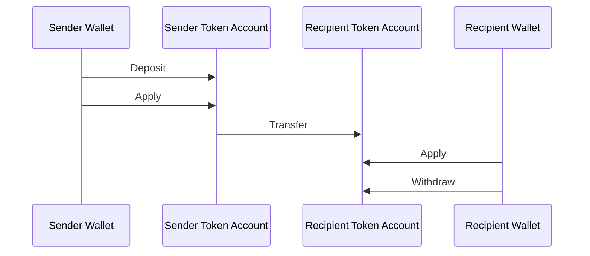
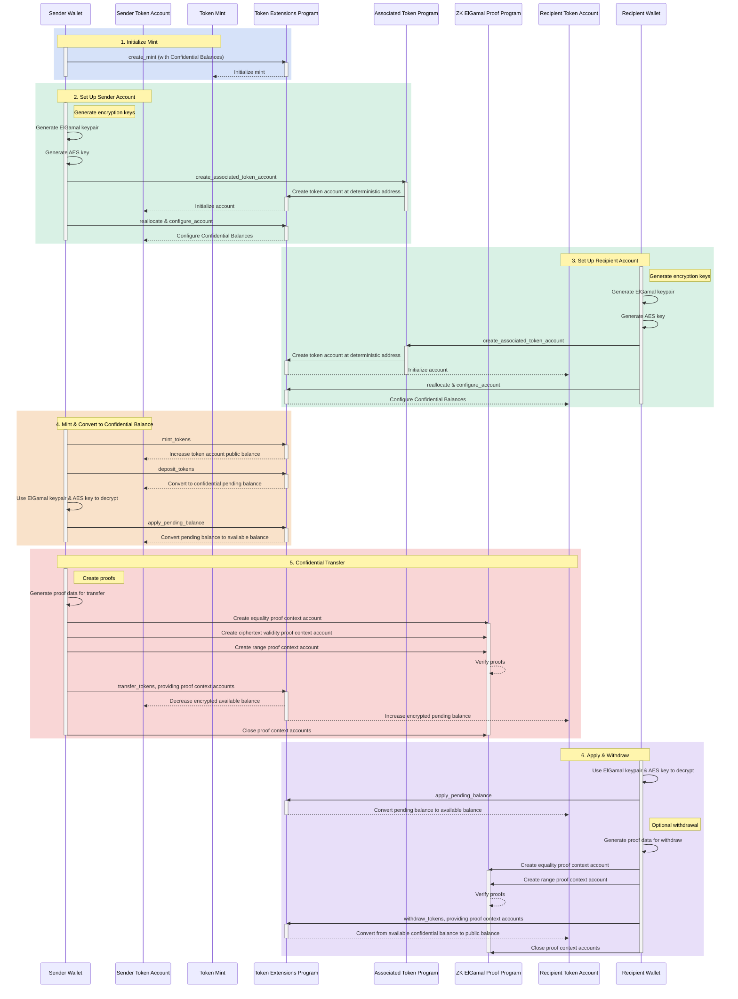

## Mitä ovat luottamukselliset saldot?

<Embed url="https://youtu.be/Bqs95tFcRIU" />

Confidential Balances on Token-2022-laajennus, jonka avulla voit siirtää tokeneita token accountien välillä paljastamatta siirron summaa. Tämä on hyödyllistä yksityisyyttä suojaavissa transaktioissa. Ainoastaan siirtosummat ja token-saldot ovat yksityisiä. Token account -osoitteet pysyvät julkisina.

- [Protokollan yleiskatsaus](https://www.solana-program.com/docs/confidential-balances/overview) -
  Tietoja taustalla olevasta kryptografisesta protokollasta
- [Pikaopas](https://www.solana-program.com/docs/confidential-balances#setup) -
  Asennus ja perus-CLI-komennot
- [Confidential Balances Cookbook](https://github.com/solana-developers/Confidential-Balances-Sample) -
  Koodiesimerkkejä Confidential Balancesin käyttämisestä

### Miten se toimii?

Confidential Balances -laajennus lisää
[ohjeita](https://github.com/solana-program/token-2022/blob/efd0c957fefbd79882d77df5fb2dac88c001249c/program/src/extension/confidential_transfer/instruction.rs#L29)
Token Extension -ohjelmaan, joiden avulla voit siirtää tokeneita tilien välillä paljastamatta siirron summaa.

```mermaid title="Confidential Balances Basic Overview"
    sequenceDiagram

    participant A as Sender Wallet
    participant AA as Sender Token Account
    participant BB as Recipient Token Account
    participant B as Recipient Wallet

    A->>AA: Deposit
    A->>AA: Apply

    AA->>BB: Transfer
    B->>BB: Apply

    B->>BB: Withdraw

```

Luottamuksellisten token-siirtojen peruskulku on seuraava:

1. Luo mint account, jossa Confidential Balances on käytössä.
2. Luo token accountit, joissa Confidential Balances on käytössä lähettäjälle ja
   vastaanottajalle.
3. Luo tokeneita lähettäjän tilille.
4. **Talleta** lähettäjän julkinen saldo **luottamukselliseen odottavaan
   saldoon**.
5. **Käytä** lähettäjän odottava saldo **luottamukselliseen käytettävissä
   olevaan saldoon**.
6. **Siirrä** tokenit luottamuksellisesti lähettäjän token account -tililtä
   vastaanottajan token account -tilille.
7. **Käytä** vastaanottajan odottava saldo **luottamukselliseen käytettävissä
   olevaan saldoon**.
8. **Nosta** vastaanottajan luottamuksellinen käytettävissä oleva saldo
   **julkiseksi saldoksi**.

### Tarkastajan avaimet

Confidential Balances -mint voi tallentaa valinnaisen globaalin tarkastajan ElGamal-julkisen avaimen. Kun sellainen on määritetty, jokainen luottamuksellinen siirto sisältää lähettäjälle, vastaanottajalle ja tarkastajalle salatun summan. Siirtotodiste vahvistaa, että kaikki kolme salatekstiä sisältävät saman summan. Yleisö ei edelleenkään voi lukea summaa, mutta tarkastajan salaisen avaimen haltija voi purkaa kyseisen mintin siirtosummat.

Confidential Balances -auktoriteetti asettaa tarkastajan avaimen laajennusta alustettaessa tai muuttaa sitä myöhemmin _rs`UpdateMint`_-komennolla. Auktoriteetti voi kiertää tai poistaa avaimen. Kierrätys koskee vain tulevia siirtoja, joten säilytä aiemmat salaiset avaimet, jos historiallinen tarkastuspääsy on tarpeen. Tarkastajan avaimet tarjoavat lukuoikeuden; ne eivät valtuuta token-siirtoja eivätkä paljasta tilin koko luottamuksellista saldoa.

Asetus- ja kierrätysesimerkkejä varten katso
[Tarkastajan määrittäminen](/docs/tokens/extensions/confidential-transfer/issuer-guide#configure-an-auditor).
Lompakoiden, selainten, pörssien ja vaatimustenmukaisuuden tarjoajien tulee myös tutustua
[tarkastajan integrointioppaaseen](/docs/tokens/extensions/confidential-transfer/integration-guide#auditors-and-compliance).

Lisätietoja luottamuksellisen siirron vaiheiden yksityiskohdista löydät
vastaavista sivuista:

<Cards>
  <Card
    title="Luo mint account"
    href="/docs/tokens/extensions/confidential-transfer/create-mint"
  >
    Kuinka luoda mint account, jossa Confidential Balances on käytössä
  </Card>
  <Card
    title="Luo token account"
    href="/docs/tokens/extensions/confidential-transfer/create-token-account"
  >
    Kuinka määrittää token account, jossa Confidential Balances on käytössä
  </Card>
  <Card
    title="Talleta tokeneita"
    href="/docs/tokens/extensions/confidential-transfer/deposit-tokens"
  >
    Kuinka tallettaa tokeneita luottamukselliseen odottavaan saldoon
  </Card>
  <Card
    title="Käytä odottava saldo"
    href="/docs/tokens/extensions/confidential-transfer/apply-pending-balance"
  >
    Kuinka käyttää odottava saldo käytettävissä olevaan luottamukselliseen
    saldoon
  </Card>
  <Card
    title="Nosta tokeneita"
    href="/docs/tokens/extensions/confidential-transfer/withdraw-tokens"
  >
    Kuinka nostaa tokeneita luottamuksellisesta käytettävissä olevasta saldosta
  </Card>
  <Card
    title="Siirrä tokeneita"
    href="/docs/tokens/extensions/confidential-transfer/transfer-tokens"
  >
    Kuinka siirtää tokeneita luottamuksellisesti token account -tilien välillä
  </Card>
  <Card
    title="Integraatio-opas"
    href="/docs/tokens/extensions/confidential-transfer/integration-guide"
  >
    Kuinka lompakot, selaimet ja pörssit voivat tukea Confidential Balances -tokeneita
  </Card>
  <Card
    title="Liikkeeseenlaskijan opas"
    href="/docs/tokens/extensions/confidential-transfer/issuer-guide"
  >
    Kuinka laskea liikkeeseen ja hallita Confidential Balances -tokenia (hyväksymiskäytäntö, tarkastajat, maksut, mint ja burn)
  </Card>
</Cards>

Alla oleva kaavio näyttää yksityiskohtaisen tapahtumasarjan luottamuksellisten
token-siirtojen peruskululle:

```mermaid title="Confidential Balances Detailed Overview"
sequenceDiagram
    participant Sender as Sender Wallet
    participant SenderAccount as Sender Token Account
    participant Mint as Token Mint
    participant Token22 as Token Extensions Program
    participant ATAProgram as Associated Token Program
    participant ElGamal as ZK ElGamal Proof Program
    participant RecipientAccount as Recipient Token Account
    participant Recipient as Recipient Wallet

    rect rgba(120, 160, 235, 0.3)
    Note over Sender,Mint: 1. Initialize Mint

    activate Sender
    Sender->>Token22: create_mint (with Confidential Balances)
    activate Token22
    Token22-->>Mint: Initialize mint
    deactivate Token22
    deactivate Sender
    end

    rect rgba(130, 210, 170, 0.3)
    Note over Sender,SenderAccount: 2. Set Up Sender Account

    activate Sender
    Note right of Sender: Generate encryption keys
    Sender->>Sender: Generate ElGamal keypair
    Sender->>Sender: Generate AES key

    Sender->>ATAProgram: create_associated_token_account
    activate ATAProgram
    ATAProgram->>Token22: Create token account at deterministic address
    activate Token22
    Token22-->>SenderAccount: Initialize account
    deactivate Token22
    deactivate ATAProgram

    Sender->>Token22: reallocate & configure_account
    activate Token22
    Token22-->>SenderAccount: Configure Confidential Balances
    deactivate Token22
    deactivate Sender
    end

    rect rgba(130, 210, 170, 0.3)
    Note over Recipient,RecipientAccount: 3. Set Up Recipient Account

    activate Recipient
    Note right of Recipient: Generate encryption keys
    Recipient->>Recipient: Generate ElGamal keypair
    Recipient->>Recipient: Generate AES key

    Recipient->>ATAProgram: create_associated_token_account
    activate ATAProgram
    ATAProgram->>Token22: Create token account at deterministic address
    activate Token22
    Token22-->>RecipientAccount: Initialize account
    deactivate Token22
    deactivate ATAProgram

    Recipient->>Token22: reallocate & configure_account
    activate Token22
    Token22-->>RecipientAccount: Configure Confidential Balances
    deactivate Token22
    deactivate Recipient
    end

    rect rgba(235, 160, 80, 0.3)
    Note over Sender,SenderAccount: 4. Mint & Convert to Confidential Balance

    activate Sender
    Sender->>Token22: mint_tokens
    activate Token22
    Token22-->>SenderAccount: Increase token account public balance
    deactivate Token22

    Sender->>Token22: deposit_tokens
    activate Token22
    Token22-->>SenderAccount: Convert to confidential pending balance
    deactivate Token22

    Sender->>Sender: Use ElGamal keypair & AES key to decrypt
    Sender->>Token22: apply_pending_balance
    activate Token22
    Token22-->>SenderAccount: Convert pending balance to available balance
    deactivate Token22
    deactivate Sender
    end

    rect rgba(235, 120, 120, 0.3)
    Note over Sender,RecipientAccount: 5. Confidential Transfer

    activate Sender
    Note right of Sender: Create proofs
    Sender->>Sender: Generate proof data for transfer

    Sender->>ElGamal: Create equality proof context account
    activate ElGamal
    Sender->>ElGamal: Create ciphertext validity proof context account
    Sender->>ElGamal: Create range proof context account
    ElGamal-->>ElGamal: Verify proofs

    Sender->>Token22: transfer_tokens, providing proof context accounts
    activate Token22
    Token22-->>SenderAccount: Decrease encrypted available balance
    Token22-->>RecipientAccount: Increase encrypted pending balance
    deactivate Token22

    Sender->>ElGamal: Close proof context accounts
    deactivate ElGamal
    deactivate Sender
    end

    rect rgba(180, 150, 235, 0.3)
    Note over Recipient,RecipientAccount: 6. Apply & Withdraw

    activate Recipient
    Recipient->>Recipient: Use ElGamal keypair & AES key to decrypt
    Recipient->>Token22: apply_pending_balance
    activate Token22
    Token22-->>RecipientAccount: Convert pending balance to available balance
    deactivate Token22

    Note right of Recipient: Optional withdrawal
    Recipient->>Recipient: Generate proof data for withdraw

    Recipient->>ElGamal: Create equality proof context account
    activate ElGamal
    Recipient->>ElGamal: Create range proof context account
    ElGamal-->>ElGamal: Verify proofs

    Recipient->>Token22: withdraw_tokens, providing proof context accounts
    activate Token22
    Token22-->>RecipientAccount: Convert from available confidential balance to public balance
    deactivate Token22

    Recipient->>ElGamal: Close proof context accounts
    deactivate ElGamal
    deactivate Recipient
    end
```

## Confidential Balances -ohjeet

Täydellinen lista Confidential Balances -laajennuksen
[ohjeista](https://github.com/solana-program/token-2022/blob/efd0c957fefbd79882d77df5fb2dac88c001249c/program/src/extension/confidential_transfer/instruction.rs#L29)
on seuraava:

| Ohje                         | Kuvaus                                                                                                                                                       |
| ----------------------------------- | ----------------------------------------------------------------------------------------------------------------------------------------------------------------- |
| _rs`InitializeMint`_                | Ottaa Confidential Balancesin käyttöön mint accountissa. Tämä ohje on sisällytettävä samaan transaktioon kuin _rs`TokenInstruction::InitializeMint`_ -ohje. |
| _rs`UpdateMint`_                    | Päivittää mintin tilin hyväksymiskäytännön ja valinnaisen globaalin tarkastajan ElGamal-julkisen avaimen.                                                                        |
| _rs`ConfigureAccount`_              | Ottaa Confidential Balancesin käyttöön token accountissa.                                                                                                                 |
| _rs`ApproveAccount`_                | Hyväksyy token accountin Confidential Balancesia varten, jos mint edellyttää hyväksyntää uusille token accounteille.                                                          |
| _rs`EmptyAccount`_                  | Tyhjentää odottavan ja käytettävissä olevan luottamuksellisen saldon token account -tilin sulkemisen mahdollistamiseksi.                                                                         |
| _rs`Deposit`_                       | Muuntaa julkisen token-saldon odottavaksi luottamukselliseksi saldoksi.                                                                                                  |
| _rs`Withdraw`_                      | Muuntaa käytettävissä olevan luottamuksellisen saldon takaisin julkiseksi saldoksi.                                                                                                   |
| _rs`Transfer`_                      | Siirtää tokenit token account -tilien välillä luottamuksellisesti.                                                                                                           |
| _rs`ApplyPendingBalance`_           | Muuntaa odottavan saldon käytettävissä olevaksi saldoksi talletusten tai siirtojen jälkeen.                                                                                      |
| _rs`EnableConfidentialCredits`_     | Sallii token account -tilin vastaanottaa luottamuksellisia token-siirtoja.                                                                                                   |
| _rs`DisableConfidentialCredits`_    | Estää saapuvat luottamukselliset siirrot samalla kun julkiset siirrot ovat edelleen sallittuja.                                                                                     |
| _rs`EnableNonConfidentialCredits`_  | Sallii token account -tilin vastaanottaa julkisia token-siirtoja.                                                                                                         |
| _rs`DisableNonConfidentialCredits`_ | Estää tavalliset siirrot, jotta tili vastaanottaa vain luottamuksellisia siirtoja.                                                                                     |
| _rs`TransferWithFee`_               | Siirtää tokenit token account -tilien välillä luottamuksellisesti maksun kanssa.                                                                                                |
| _rs`ConfigureAccountWithRegistry`_  | Vaihtoehtoinen tapa määrittää token accountit Confidential Balancesia varten käyttämällä _rs`ElGamalRegistry`_ -tiliä _rs`VerifyPubkeyValidity`_ -todisteen sijaan.         |
