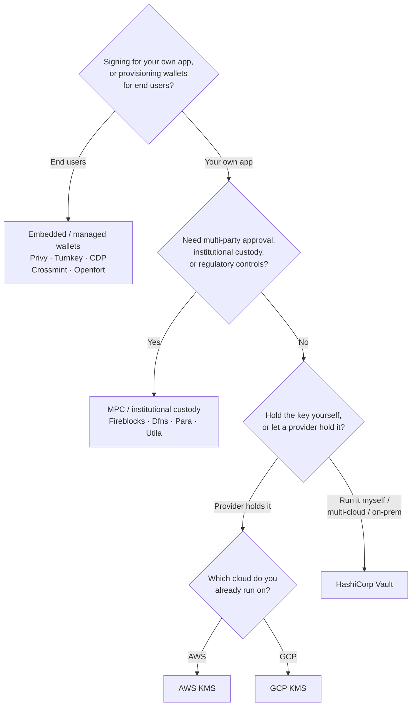

Keychain tarjoaa yhden `SolanaSigner`-rajapinnan kaikkiin taustapalveluihin,
joten valinta on operatiivinen, ei arkkitehtuurinen — voit vaihtaa sen myöhemmin
konfiguraation kautta. Siksi **aloita vaatimuksistasi, älä tuotteesta.** Kaksi
kysymystä ratkaisee suurimman osan: _missä yksityinen avain sijaitsee, ja
kenellä on oikeus valtuuttaa allekirjoitus sillä?_

Yhtä parasta taustapalvelua ei ole olemassa. Jokainen sopii tiettyyn joukkoon
rajoitteita — pilveen, jota jo käytät, siihen haluatko ylläpitää
avaininfrastruktuuria, sekä siihen mitä säilytys- ja hyväksyntäkontrolleja
sinulta vaaditaan. Alla oleva kaavio yhdistää nämä rajoitteet taustapalveluun.

<Callout type="info">
  Tämä opas kattaa taustapalvelun (palvelinpuolen) allekirjoituksen. Kun
  loppukäyttäjäsi allekirjoittavat omia transaktioitaan selaimessa, käytä
  lompakkoa Wallet Standardin kautta — katso [Allekirjoittaminen
  tuotannossa](/docs/core/transactions/signing-in-production).
</Callout>

## Päätöskaavio

<Callout type="info">
  Paikallinen kehitys ja testit eivät tarvitse mitään tästä — käytä
  **Memory**-taustapalvelua prototyyppien tekemiseen, ja vaihda sitten johonkin
  yllä olevista tuotantotaustapalveluista konfiguraation kautta.
</Callout>

## Käy kysymykset läpi

<Steps>

<Step>

### Allekirjoitatko omalle sovelluksellesi vai loppukäyttäjillesi?

Jos tarjoat lompakkoja, jotka **loppukäyttäjät** omistavat ja hallinnoivat
(kuluttajasovellukset, käyttöönottovirrat), käytä **upotettua / hallittua
lompakkoa** taustapalveluna — Privy, Turnkey, CDP, Crossmint tai Openfort. Nämä
hallitsevat käyttäjäkohtaisia lompakkoja ja todennusta puolestasi.

Jos allekirjoitat **omana sovelluksenasi** — maksun maksajana, kassanhoitajana
tai taustapalvelun automaationa — jatka alla.

</Step>

<Step>

### Tarvitsetko moniosapuolisen hyväksynnän, institutionaalisen säilytyksen tai sääntelylliset kontrollit?

Jos allekirjoitusten on läpäistävä hyväksymiskäytäntö, käyttöraja tai
vaatimustenmukaisuusprosessi ennen niiden tuottamista — tai tarvitset säännellyn
säilyttäjän avainten hallintaan — käytä **MPC / institutionaalinen säilytys**
-taustapalvelua: Fireblocks, Dfns, Para tai Utila. Nämä jakavat avaimen tai
pitävät sitä hallussaan ja allekirjoittavat käytäntösi mukaisesti.

Jos tarvitset vain avaimen, joka allekirjoittaa pyynnöstä, jatka alla.

</Step>

<Step>

### Haluatko pitää avaimen itselläsi vai antaa palveluntarjoajan hallita sitä?

Jos pilvipalveluntarjoajan tulisi säilyttää avain laitteistopohjaisessa
infrastruktuurissa ja IAM-käytäntösi hallitsee allekirjoitusoikeuksia, käytä
kyseisen pilvipalvelun KMS:ää:

- **AWS:llä** → AWS KMS
- **GCP:llä** → GCP KMS

Jos haluat operoida avaininfrastruktuuria itse — tai käytät useita
pilvipalveluita tai on-prem-ympäristöä — käytä **HashiCorp Vaultia**. Sinä
hallinnoit ja auditoit sen; avain pysyy Transit-moottorin sisällä ja
allekirjoittaa pyynnöstä.

</Step>

</Steps>

## Säilytysmallit

Taustapalvelut ryhmittyvät viiteen säilytysmalliin. Yllä oleva kulku ohjaa sinut
yhteen niistä.

- **Itsesäilytys (prosessissa)** — sovelluksesi pitää hallussaan raakaa
  yksityistä avainta. Kätevä kehityskäyttöön, mutta soveltumaton
  tuotantokäyttöön. Taustapalvelu: **Memory**.
- **Itsehostattu avaintenhallinta** — operoiit itse avaininfrastruktuuria; avain
  pysyy sen sisällä ja allekirjoittaa pyynnöstä. Taustapalvelu: **HashiCorp
  Vault**.
- **Pilvi-KMS / HSM** — pilvipalveluntarjoaja säilyttää avainta
  laitteistopohjaisessa infrastruktuurissa; avain ei koskaan poistu palvelusta
  ja IAM-käytäntösi hallitsee allekirjoitusoikeuksia. Taustapalvelut: **AWS
  KMS**, **GCP KMS**.
- **MPC ja institutionaalinen säilytys** — avain on jaettu tai säilytetty
  palveluntarjoajan toimesta, joka allekirjoittaa käytäntösi mukaisesti
  (hyväksynnät, rajat). Taustapalvelut: **Fireblocks**, **Dfns**, **Para**,
  **Utila**.
- **Upotetut ja hallinnoidut lompakot** — palveluntarjoaja hallinnoi lompakoita
  puolestasi, usein loppukäyttäjien käyttöönottoa varten. Taustapalvelut:
  **Privy**, **Turnkey**, **CDP**, **Crossmint**, **Openfort**.

## Taustajärjestelmien vertailu

| Taustajärjestelmä | Säilytysmalli                            | Parhaiten sopii                                        | Huomioita                                                      |
| ----------------- | ---------------------------------------- | ------------------------------------------------------ | -------------------------------------------------------------- |
| Memory            | Oma säilytys (prosessissa)               | Paikallinen kehitys, testit, CI                        | Raaka avain prosessissa — älä käytä tuotannossa                |
| HashiCorp Vault   | Itse isännöity avainten hallinta         | Tiimit, jotka ylläpitävät omaa avaininfrastruktuuriaan | Transit-moottori; sinä hallinnoit ja auditoit sen              |
| AWS KMS           | Pilvi-KMS / HSM                          | Taustajärjestelmät, jotka toimivat AWS:ssä             | Avain ei koskaan poistu KMS:stä; IAM hallitsee allekirjoitusta |
| GCP KMS           | Pilvi-KMS / HSM                          | Taustajärjestelmät, jotka toimivat GCP:ssä             | Avain ei koskaan poistu KMS:stä; IAM hallitsee allekirjoitusta |
| Fireblocks        | MPC / institutionaalinen säilytys        | Treasuries, pörssit, säädelty säilytys                 | Käytäntömoottori ja hyväksyntätyönkulut                        |
| Dfns              | MPC-lompakkoinfrastruktuuri              | Ohjelmistopohjaiset lompakot käytäntöohjauksella       | Ed25519-allekirjoitus                                          |
| Para              | MPC-lompakot                             | Sovellukset, jotka haluavat MPC-pohjaiset lompakot     | API-avain + lompakko-ID                                        |
| Utila             | MPC-säilytys + rinnakkaisallekirjoittaja | Olemassa olevat Utila-hallinnoidut Solana-lompakot     | `signMessage` ei tuettu; sinä lähetät transaktion              |
| Privy             | Upotetut lompakot                        | Kuluttajasovellukset, jotka ottavat käyttäjiä mukaan   | Sovelluksen hallinnoimat upotetut lompakot                     |
| Turnkey           | Ei-huoltajapohjainen avainten hallinta   | Ohjelmistollinen, käytäntöportattu allekirjoitus       | Ei-huoltajapohjainen avainten hallinta                         |
| CDP               | Hallittu lompakko (Coinbase)             | Sovellukset Coinbase Developer Platformilla            | `signMessage` hyväksyy vain UTF-8-sisältöä                     |
| Crossmint         | Hallitut lompakot                        | Markkinapaikat ja hallittujen lompakoiden sovellukset  | `smart` ja `mpc` lompakot; `signMessage` ei tuettu             |
| Openfort          | Upotetut taustajärjestelmälompakot       | Palvelinpuolen lompakot                                | TEE:hen tallennetut avaimet                                    |

## Yritysskenaariot

Yksittäinen sovellus tarvitsee usein useampaa kuin yhtä näistä samanaikaisesti.
Koska rajapinta on identtinen, voit käyttää eri taustapalvelua kullekin roolille
muuttamatta kutsupisteitä.

- **Kassaoperaatiot** — erottele toiminnallinen "kuuma" allekirjoittaja
  "kylmästä" kassaallekirjoittajasta. Tue kassaa MPC-säilytyksellä tai
  pilvi-HSM:llä ja edellytä hyväksymiskäytäntöjä ennen suuriarvoiset
  allekirjoituksia.
- **Hyväksymistyönkulut** — MPC- ja säilytystaustapalvelut (esim. Fireblocks)
  edellyttävät usean osapuolen hyväksynnän ennen allekirjoituksen tuottamista.
- **Vaatimustenmukaisuus ja auditointi** — pilvi-KMS (AWS/GCP) ja Vault
  tuottavat allekirjoituksen auditointilokeja; institutionaaliset säilyttäjät
  lisäävät käytäntöjen täytäntöönpanon ja raportoinnin.
- **Säännellyt ympäristöt** — pidä avainmateriaali HSM:ssä, KMS:ssä tai
  institutionaalisessa säilyttäjässä, jotta raakaavaimet eivät koskaan koske
  sovellustasi.

Katso
[Tuotannon parhaat käytännöt](/docs/tools/keychain/production-best-practices)
näiden taustapalvelujen turvallista käyttöä varten.

<Cards>
  <Card title="Rust-opas" href="/docs/tools/keychain/getting-started/rust">
    Konfiguroi jokainen taustapalvelu Rustilla.
  </Card>
  <Card
    title="TypeScript-opas"
    href="/docs/tools/keychain/getting-started/typescript"
  >
    Konfiguroi jokainen taustapalvelu TypeScriptillä.
  </Card>
</Cards>
