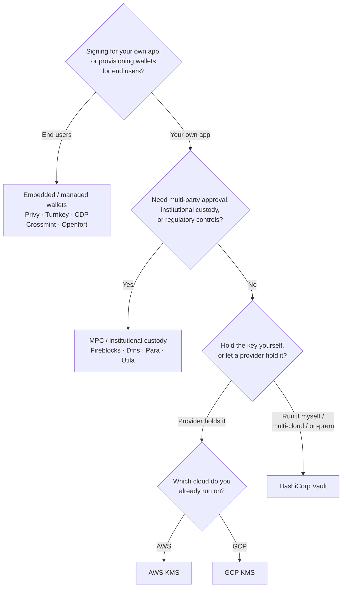

Keychain tarjoaa yhden `SolanaSigner`-rajapinnan kaikkiin taustajärjestelmiin,
joten valinta on operatiivinen, ei arkkitehtuurinen — voit muuttaa sitä
myöhemmin konfiguraation kautta. Tämän vuoksi **aloita vaatimuksistasi, älä
tuotteesta.** Kaksi kysymystä ratkaisee suurimman osan: _missä yksityinen avain
sijaitsee, ja kuka saa valtuuttaa allekirjoituksen sillä?_

Yksikään taustajärjestelmä ei ole paras kaikissa tilanteissa. Jokainen sopii
parhaiten tiettyihin rajoitteisiin — pilveen, jota jo käytät, siihen haluatko
ylläpitää avaininfrastruktuuria, sekä siihen, mitä säilytys- ja
hyväksyntäkontrolleja sinulta vaaditaan. Alla oleva kaavio yhdistää nämä
rajoitteet taustajärjestelmään.

<Callout type="info">
  Tämä opas käsittelee palvelinpuolen allekirjoittamista. Kun loppukäyttäjäsi
  allekirjoittavat omat transaktionsa selaimessa, käytä lompakkoa Wallet
  Standard -protokollan kautta — katso [Allekirjoittaminen
  tuotannossa](/docs/core/transactions/signing-in-production).
</Callout>

## Päätöskaavio

<Callout type="info">
  Paikallinen kehitys ja testit eivät tarvitse mitään tästä — käytä **Memory**-
  taustajärjestelmää prototyyppien tekemiseen, ja vaihda sitten johonkin yllä
  olevista tuotantotaustajärjestelmistä konfiguraation kautta.
</Callout>

## Käy kysymykset läpi

<Steps>

<Step>

### Allekirjoitatko omalle sovelluksellesi vai loppukäyttäjillesi?

Jos tarjoat lompakkoja, jotka **loppukäyttäjät** omistavat ja käyttävät
(kuluttajasovellukset, käyttöönottoprosessit), käytä **upotettua / hallinnoitua
lompakkoa** taustajärjestelmänä — Privy, Turnkey, CDP, Crossmint tai Openfort.
Nämä hallinnoivat käyttäjäkohtaisia lompakkoja ja todennusta puolestasi.

Jos allekirjoitat **omana sovelluksenasi** — maksajana, kassana tai
taustapalvelun automaationa — jatka alempana.

</Step>

<Step>

### Tarvitsetko usean osapuolen hyväksynnän, institutionaalisen säilytyksen tai sääntelyyn liittyvät kontrollit?

Jos allekirjoitusten on läpäistävä hyväksyntäkäytäntö, käyttöraja tai
vaatimustenmukaisuustyönkulku ennen niiden tuottamista — tai tarvitset
säännellyn säilyttäjän hallussapitämään avaimet — käytä **MPC /
institutionaalinen säilytys** -taustapalvelua: Fireblocks, Dfns, Para tai Utila.
Nämä jakavat tai säilyttävät avaimen ja allekirjoittavat yhdessä käytäntösi
mukaisesti.

Jos tarvitset vain avaimen, joka allekirjoittaa pyydettäessä, jatka alempana.

</Step>

<Step>

### Haluatko hallita avainta itse vai antaa palveluntarjoajan hallita sitä?

Jos pilvipalveluntarjoajan tulisi säilyttää avain laitteistopohjaisessa
infrastruktuurissa ja IAM-käytäntösi hallitsee allekirjoitusoikeuksia, käytä
kyseisen pilvipalvelun KMS:ää:

- **AWS:llä ajettaessa** → AWS KMS
- **GCP:llä ajettaessa** → GCP KMS

Jos haluat hallita avaininfrastruktuuria itse — tai olet
multi-cloud-ympäristössä tai on-prem-ympäristössä — käytä **HashiCorp Vaultia**.
Sinä ajat ja auditoit sen; avain pysyy Transit-moottorin sisällä ja
allekirjoittaa pyydettäessä.

</Step>

</Steps>

## Säilytysmallit

Taustapalvelut ryhmittyvät viiteen säilytysmalliin. Yllä oleva kulku johtaa
sinut yhteen niistä.

- **Oma hallinta (prosessin sisällä)** — sovelluksesi pitää hallussaan raakaa
  yksityisavainta. Kätevä kehityskäyttöön, mutta sopimaton tuotantoon.
  Taustapalvelu: **Memory**.
- **Itse isännöity avaintenhallinta** — sinä hallinnoit avaininfrastruktuuria;
  avain pysyy sen sisällä ja allekirjoittaa pyydettäessä. Taustapalvelu:
  **HashiCorp Vault**.
- **Pilvi-KMS / HSM** — pilvipalveluntarjoaja säilyttää avaimen
  laitteistopohjaisessa infrastruktuurissa; avain ei koskaan poistu palvelusta
  ja IAM-käytäntösi hallitsee allekirjoitusoikeuksia. Taustapalvelut: **AWS
  KMS**, **GCP KMS**.
- **MPC ja institutionaalinen säilytys** — avain on jaettu tai säilytetty
  palveluntarjoajalla, joka allekirjoittaa yhdessä käytäntösi mukaisesti
  (hyväksynnät, rajat). Taustapalvelut: **Fireblocks**, **Dfns**, **Para**,
  **Utila**.
- **Upotetut ja hallinnoidut lompakot** — palveluntarjoaja hallinnoi lompakoita
  puolestasi, usein loppukäyttäjien käyttöönoton helpottamiseksi.
  Taustapalvelut: **Privy**, **Turnkey**, **CDP**, **Crossmint**, **Openfort**.

## Taustajärjestelmien vertailu

| Taustajärjestelmä | Säilytysmalli                            | Parhaiten sopii                                          | Huomiot                                                        |
| ----------------- | ---------------------------------------- | -------------------------------------------------------- | -------------------------------------------------------------- |
| Memory            | Oma säilytys (prosessissa)               | Paikallinen kehitys, testit, CI                          | Raaka avain prosessissa — älä käytä tuotannossa                |
| HashiCorp Vault   | Itse isännöity avainten hallinta         | Tiimit, jotka ylläpitävät omaa avaininfrastruktuuriaan   | Transit-moottori; käytät ja auditoit itse                      |
| AWS KMS           | Pilvi-KMS / HSM                          | Taustajärjestelmät AWS:ssä                               | Avain ei koskaan poistu KMS:stä; IAM hallitsee allekirjoitusta |
| GCP KMS           | Pilvi-KMS / HSM                          | Taustajärjestelmät GCP:ssä                               | Avain ei koskaan poistu KMS:stä; IAM hallitsee allekirjoitusta |
| Fireblocks        | MPC / institutionaalinen säilytys        | Kassanhallinta, pörssit, säännelty säilytys              | Käytäntömoottori ja hyväksymistyönkulut                        |
| Dfns              | MPC-lompakkoinfrastruktuuri              | Ohjelmallisет lompakot käytäntöhallinnalla               | Ed25519-allekirjoitus                                          |
| Para              | MPC-lompakot                             | Sovellukset, jotka haluavat MPC-tuetut lompakot          | API-avain + lompakko-ID                                        |
| Utila             | MPC-säilytys + rinnakkaisallekirjoittaja | Olemassa olevat Utila-hallinnoidut Solana-lompakot       | `signMessage` ei tuettu; lähetät transaktion itse              |
| Privy             | Upotetut lompakot                        | Kuluttajasovellukset, jotka ottavat käyttäjät mukaan     | Sovelluksen hallinnoimat upotetut lompakot                     |
| Turnkey           | Ei-huoltajallinen avainten hallinta      | Ohjelmallinen, käytäntöportattu allekirjoitus            | Ei-huoltajallinen avainten hallinta                            |
| CDP               | Hallinnoitu lompakko (Coinbase)          | Sovellukset Coinbase Developer Platformilla              | `signMessage` hyväksyy vain UTF-8-hyötykuormat                 |
| Crossmint         | Hallinnoidut lompakot                    | Markkinapaikat ja hallinnoitujen lompakoiden sovellukset | `smart` ja `mpc` lompakot; `signMessage` ei tuettu             |
| Openfort          | Upotetut taustajärjestelmälompakot       | Palvelinpuolen lompakot                                  | TEE:hen tallennetut avaimet                                    |

## Yritysskenaariot

Yksittäinen sovellus tarvitsee usein useampaa kuin yhtä näistä samanaikaisesti.
Koska rajapinta on identtinen, voit käyttää eri taustapalvelua kullekin roolille
muuttamatta kutsupisteitä.

- **Kassatoiminnot** — erota operatiivinen "kuuma" allekirjoittaja "kylmästä"
  kassanallekirjoittajasta. Tue kassaa MPC-säilytyksellä tai pilvi-HSM:llä ja
  vaadi hyväksymiskäytännöt ennen suuriarvoisia allekirjoituksia.
- **Hyväksymistyönkulut** — MPC- ja säilytystaustapalvelut (esim. Fireblocks)
  edellyttävät usean osapuolen hyväksyntää ennen allekirjoituksen tuottamista.
- **Vaatimustenmukaisuus ja auditointi** — pilvi-KMS (AWS/GCP) ja Vault
  tuottavat allekirjoituksen auditointilokeja; institutionaaliset säilyttäjät
  lisäävät käytäntöjen valvonnan ja raportoinnin.
- **Säännellyt ympäristöt** — pidä avainmateriaali HSM:ssä, KMS:ssä tai
  institutionaalisella säilyttäjällä, jotta raakaavaimet eivät koskaan koske
  sovellustasi.

Katso
[Tuotannon parhaat käytännöt](/docs/tools/keychain/production-best-practices)
näiden taustapalveluiden turvalliseen käyttöön.

<Cards>
  <Card title="Rust-opas" href="/docs/tools/keychain/getting-started/rust">
    Määritä kukin taustapalvelu Rustissa.
  </Card>
  <Card
    title="TypeScript-opas"
    href="/docs/tools/keychain/getting-started/typescript"
  >
    Määritä kukin taustapalvelu TypeScriptissä.
  </Card>
</Cards>
