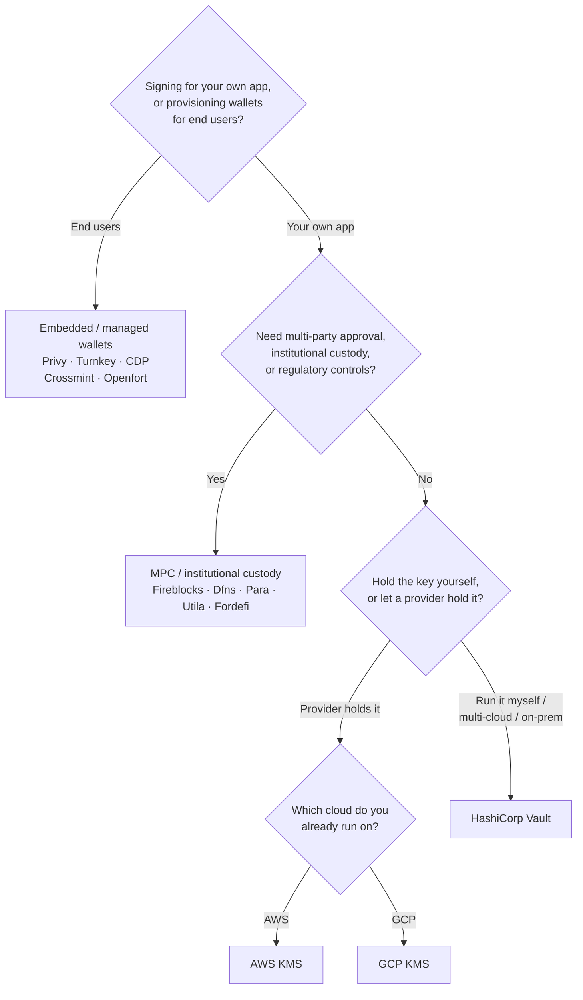

Keychain tarjoaa yhden `SolanaSigner`-perusrajapinnan kaikille taustajärjestelmille, joten
useimmiten valinta on operatiivinen, ei arkkitehtuurinen: voit vaihtaa sitä
myöhemmin konfiguraation kautta. Poikkeus on transaktion muoto. Crossmint
ja Fordefin natiivi auto-tila allekirjoittavat ja lähettävät transaktion palvelinpuolella, ja Fordefin natiivi
manuaalitila muokkaa transaktiota ennen allekirjoittamista, joten siirtyminen näihin tai niistä pois
muuttaa tapaa, jolla kutsut allekirjoittajaa. Siksi **lähde liikkeelle omista
vaatimuksistasi, älä tuotteesta.** Kaksi kysymystä ratkaisee suurimman osan: _missä
yksityinen avain sijaitsee, ja kuka saa valtuuttaa sillä allekirjoituksen?_

Jokainen taustajärjestelmä Ledgeriä lukuun ottamatta on saatavilla kaikilla neljällä kielellä (Rust, TypeScript,
Python ja Go). Ledger on vain Rustille, ja se vaatii erikseen käyttöön otettavan `ledger`-ominaisuuden.

Yhtä parasta taustajärjestelmää ei ole. Kukin sopii paremmin tiettyihin
reunaehtoihin: pilvipalveluun, jota jo käytät, siihen, haluatko ylläpitää avaininfrastruktuuria itse,
ja siihen, mitä säilytys- ja hyväksyntäkontrolleja sinulta vaaditaan.
Alla oleva kulkukaavio yhdistää nämä reunaehdot taustajärjestelmään.

<Callout type="info">
  Tämä opas käsittelee taustajärjestelmän (palvelinpuolen) allekirjoitusta. Kun loppukäyttäjäsi allekirjoittavat
  omat transaktionsa selaimessa, käytä sen sijaan lompakkoa Wallet Standardin kautta. Katso [Allekirjoittaminen
  tuotannossa](/docs/core/transactions/signing-in-production).
</Callout>

## Päätöskaavio

```mermaid title="Choosing a Keychain backend"
flowchart TD
    Start{Signing for your own app,<br/>or provisioning wallets<br/>for end users?}
    Start -->|End users| Managed[Embedded / managed wallets<br/>Privy · Turnkey · CDP<br/>Crossmint · Openfort]
    Start -->|Your own app| Q2{Need multi-party approval,<br/>institutional custody,<br/>or regulatory controls?}
    Q2 -->|Yes| MPC[MPC / institutional custody<br/>Fireblocks · Dfns · Para · Utila · Fordefi]
    Q2 -->|No| Q3{Hold the key yourself,<br/>or let a provider hold it?}
    Q3 -->|Provider holds it| Q4{Which cloud do you<br/>already run on?}
    Q4 -->|AWS| AWS[AWS KMS]
    Q4 -->|GCP| GCP[GCP KMS]
    Q3 -->|Run it myself /<br/>multi-cloud / on-prem| Vault[HashiCorp Vault]
```

<Callout type="info">
  Paikallinen kehitys ja testit eivät tarvitse mitään tästä: käytä **Memory**-taustajärjestelmää
  prototypointiin ja vaihda sitten johonkin yllä olevista tuotannon taustajärjestelmistä
  konfiguraation kautta.
</Callout>

## Käy kysymykset läpi

<Steps>

<Step>

### Allekirjoitatko oman sovelluksesi vai loppukäyttäjiesi puolesta?

Jos luot lompakoita, joita **loppukäyttäjät** omistavat ja käyttävät (kuluttajasovellukset,
käyttöönottoprosessit), käytä **upotettua / hallinnoitua lompakkoa** tarjoavaa taustajärjestelmää: Privy, Turnkey,
CDP, Crossmint tai Openfort. Ne hallinnoivat käyttäjäkohtaisia lompakoita ja todennusta
puolestasi.

Jos allekirjoitat **oman sovelluksesi** puolesta (maksun suorittaja eli fee payer, treasury, taustaautomaatio),
jatka alla.

</Step>

<Step>

### Tarvitsetko monenvälistä hyväksyntää, institutionaalista säilytystä tai sääntelyn mukaisia kontrolleja?

Jos allekirjoitusten on läpäistävä hyväksyntäkäytäntö, kulutusraja tai vaatimustenmukaisuusprosessi
ennen kuin ne tuotetaan, tai tarvitset säännellyn säilyttäjän, joka pitää avaimia hallussaan,
käytä **MPC- / institutionaalista säilytystä** tarjoavaa taustajärjestelmää: Fireblocks, Dfns, Para,
Utila tai Fordefi. Ne jakavat avaimen tai säilyttävät sen ja allekirjoittavat yhdessä
käytäntösi mukaisesti.

Jos tarvitset vain avaimen, joka allekirjoittaa pyynnöstä, jatka alla.

</Step>

<Step>

### Haluatko pitää avaimen itse vai antaa palveluntarjoajan säilyttää sen?

Jos pilvipalveluntarjoajan tulee säilyttää avainta laitteistotuetussa infrastruktuurissa ja
IAM-käytäntösi määrittää, kuka voi allekirjoittaa, käytä kyseisen pilven KMS:ää:

- **AWS:llä** → AWS KMS
- **GCP:llä** → GCP KMS

Jos haluat ylläpitää avaininfrastruktuuria itse tai käytät useita pilvipalveluja tai
omia palvelimia (on-prem), käytä **HashiCorp Vaultia**. Ajat ja auditoit sitä itse; avain pysyy
Transit-moottorin sisällä ja allekirjoittaa pyynnöstä.

</Step>

</Steps>

## Säilytysmallit

Taustajärjestelmät jakautuvat kuuteen säilytysmalliin. Yllä oleva kulkukaavio ohjaa sinut
yhteen niistä.

- **Oma säilytys (prosessin sisällä)**: sovelluksesi pitää raakaa yksityistä avainta hallussaan.
  Kätevä kehityksessä, mutta sopimaton tuotantoon. Taustajärjestelmä:
  **Memory**.
- **Oma säilytys (laitteistolompakko)**: avain ei koskaan poistu Ledger-laitteelta, ja
  henkilö vahvistaa jokaisen allekirjoituksen laitteen näytöllä. Sopii interaktiiviseen
  operaattorin allekirjoitukseen, ei valvomattomiin palveluihin. Vain Rust, erikseen käyttöön otettava, eikä auditoinnin piirissä.
  Taustajärjestelmä: **Ledger**.
- **Itse ylläpidetty avainhallinta**: ylläpidät avaininfrastruktuuria itse; avain
  pysyy sen sisällä ja allekirjoittaa pyynnöstä. Taustajärjestelmä: **HashiCorp Vault**.
- **Pilvi-KMS / HSM**: pilvipalveluntarjoaja säilyttää avainta laitteistotuetussa
  infrastruktuurissa; avain ei koskaan poistu palvelusta, ja IAM-käytäntösi määrittää,
  kuka voi allekirjoittaa. Taustajärjestelmät: **AWS KMS**, **GCP KMS**.
- **MPC ja institutionaalinen säilytys**: avain jaetaan tai sitä säilytetään
  palveluntarjoajalla, joka allekirjoittaa yhdessä kanssasi käytäntösi mukaisesti (hyväksynnät, rajat).
  Taustajärjestelmät: **Fireblocks**, **Dfns**, **Para**, **Utila**, **Fordefi**.
- **Upotetut ja hallinnoidut lompakot**: palveluntarjoaja hallinnoi lompakoita
  puolestasi, usein loppukäyttäjien käyttöönottoa varten. Taustajärjestelmät: **Privy**, **Turnkey**, **CDP**,
  **Crossmint**, **Openfort**.

## Taustajärjestelmien vertailu

| Taustajärjestelmä         | Säilytysmalli                  | Parhaiten sopii                                     | Huomiot                                                                                                              |
| --------------- | ------------------------------ | -------------------------------------------- | ------------------------------------------------------------------------------------------------------------------ |
| Memory          | Oma säilytys (prosessissa)      | Paikallinen kehitys, testit, CI                 | Raaka avain prosessissa; älä käytä tuotannossa                                                                       |
| Ledger          | Oma säilytys (laitteistolompakko) | Interaktiivinen operaattorin allekirjoitus Rust-työkaluista | Vain Rust, erikseen käyttöön otettava `ledger`-ominaisuus, auditoimaton; jokainen allekirjoitus vahvistetaan laitteella                                 |
| HashiCorp Vault | Itse isännöity avainten hallinta     | Tiimit, jotka ylläpitävät omaa avaininfrastruktuuriaan   | Transit-moottori; käytät ja auditoit itse                                                                           |
| AWS KMS         | Pilvi-KMS / HSM                | Taustajärjestelmät AWS:ssä                      | Avain ei koskaan poistu KMS:stä; IAM hallitsee allekirjoitusta                                                                         |
| GCP KMS         | Pilvi-KMS / HSM                | Taustajärjestelmät GCP:ssä                      | Avain ei koskaan poistu KMS:stä; IAM hallitsee allekirjoitusta                                                                         |
| Fireblocks      | MPC / institutionaalinen säilytys    | Kassanhallinta, pörssit, säännelty säilytys     | Käytäntömoottori ja hyväksymistyönkulut                                                                               |
| Dfns            | MPC-lompakkoinfrastruktuuri      | Ohjelmallisет lompakot käytäntöhallinnalla    | Ed25519-allekirjoitus                                                                                                    |
| Para            | MPC-lompakot                    | Sovellukset, jotka haluavat MPC-tuetut lompakot            | API-avain + lompakko-ID                                                                                                |
| Utila           | MPC-säilytys + rinnakkaisallekirjoittaja        | Olemassa olevat Utila-hallinnoidut Solana-lompakot        | `signMessage` ei tuettu; lähetät transaktion itse                                                                    |
| Fordefi         | MPC / institutionaalinen säilytys    | Institutionaalinen säilytys käytäntökontrolleilla   | Musta laatikko: lähetät itse. Natiivi auto: Fordefi muokkaa ja lähettää. Natiivi manuaali: Fordefi muokkaa, sinä lähetät tuloksen |
| Privy           | Upotetut lompakot               | Kuluttajasovellukset, jotka ottavat käyttäjät mukaan    | Sovelluksen hallinnoimat upotetut lompakot                                                                                       |
| Turnkey         | Ei-huoltajallinen avainten hallinta   | Ohjelmallinen, käytäntöportattu allekirjoitus           | Ei-huoltajallinen avainten hallinta                                                                                       |
| CDP             | Hallinnoitu lompakko (Coinbase)      | Sovellukset Coinbase Developer Platformilla      | `signMessage` hyväksyy vain UTF-8-hyötykuormat                                                                          |
| Crossmint       | Hallinnoidut lompakot                | Markkinapaikat ja hallinnoitujen lompakoiden sovellukset         | Vain lähetys: lähettää palvelinpuolella, voi muokata kaasumaksujen sponsorointia varten; `signMessage` ei ole tuettu                   |
| Openfort        | Upotetut taustajärjestelmälompakot       | Palvelinpuolen lompakot                          | TEE:hen tallennetut avaimet                                                                                                    |

## Toimintomalli

Säilytyksen lisäksi jokaisella taustajärjestelmällä on yksi transaktiomuoto, joka ratkaisee,
miten allekirjoittajaa kutsutaan:

- **Allekirjoitus**: palveluntarjoaja allekirjoittaa rakentamasi tavut ja sinä lähetät ne verkkoon. Useimmat
  taustajärjestelmät, mukaan lukien Ledger ja Fordefin black box -tila.
- **Muokkaus ja allekirjoitus**: palveluntarjoaja muokkaa transaktiota ja allekirjoittaa sen
  lähettämättä sitä. Jatka palautetusta transaktiosta. Fordefin natiivi
  manuaalitila.
- **Allekirjoitus ja lähetys**: palveluntarjoaja allekirjoittaa ja lähettää palvelinpuolella, joten
  epäonnistuminen ei tarkoita, ettei mitään päätynyt ketjuun. Crossmint ja Fordefin natiivi auto-tila.

Kunkin kielen README-tiedoston allekirjoittajaominaisuuksien taulukko luettelee jokaisen
taustajärjestelmän muodon; [tietoturvamalli](https://github.com/solana-foundation/solana-keychain/blob/main/docs/SECURITY_MODEL.md)
selittää, mitä kukin muoto takaa.

## Yritysskenaariot

Yksittäinen sovellus tarvitsee usein useampaa kuin yhtä näistä samanaikaisesti. Koska
rajapinta on yhteinen, voit käyttää eri taustajärjestelmää eri rooleihin ilman kutsukohtien muuttamista,
kunhan taustajärjestelmillä on sama toimintomalli.

- **Kassatoiminnot** — erota operatiivinen "kuuma" allekirjoittaja "kylmästä"
  kassanallekirjoittajasta. Tue kassaa MPC-säilytyksellä tai pilvi-HSM:llä ja
  vaadi hyväksymiskäytännöt ennen suuriarvoisia allekirjoituksia.
- **Hyväksymistyönkulut** — MPC- ja säilytystaustapalvelut (esim. Fireblocks)
  edellyttävät usean osapuolen hyväksyntää ennen allekirjoituksen tuottamista.
- **Vaatimustenmukaisuus ja auditointi** — pilvi-KMS (AWS/GCP) ja Vault
  tuottavat allekirjoituksen auditointilokeja; institutionaaliset säilyttäjät
  lisäävät käytäntöjen valvonnan ja raportoinnin.
- **Säännellyt ympäristöt** — pidä avainmateriaali HSM:ssä, KMS:ssä tai
  institutionaalisella säilyttäjällä, jotta raakaavaimet eivät koskaan koske
  sovellustasi.

Katso
[Tuotannon parhaat käytännöt](/docs/tools/keychain/production-best-practices)
näiden taustapalveluiden turvalliseen käyttöön.

<Cards>
  <Card title="Rust-opas" href="/docs/tools/keychain/getting-started/rust">
    Määritä kukin taustapalvelu Rustissa.
  </Card>
  <Card
    title="TypeScript-opas"
    href="/docs/tools/keychain/getting-started/typescript"
  >
    Määritä kukin taustapalvelu TypeScriptissä.
  </Card>
</Cards>
