Kora voi tarjota Solana-allekirjoitus-, transaktio-käytäntö- ja maksujen sponsorointikerroksen [x402 V2 -fasilitaattorin](/docs/tools/x402-facilitator) taustalle. Fasilitaattori toteuttaa x402 HTTP -rajapinnan; Kora validoi, allekirjoittaa ja lähettää hyväksymänsä maksutransaktiot.

Tämä opas käynnistää Koran viiteimplementaatiofasilitaattorin Solana Devnetissä. Kyseessä on kehitysympäristö integraation testaamiseen, ei tuotantokäyttöönotto.

## Arkkitehtuuri

```mermaid title="x402 with Kora"
sequenceDiagram
    participant Client
    participant API as Resource server
    participant Facilitator
    participant Kora
    participant Solana
    Client->>API: GET /protected
    API-->>Client: 402 + PAYMENT-REQUIRED
    Client->>API: GET /protected + PAYMENT-SIGNATURE
    API->>Facilitator: POST /verify
    Facilitator->>Kora: signTransaction
    Kora->>Kora: Enforce transaction policy
    Kora-->>Facilitator: Validated transaction
    Facilitator-->>API: Payment is valid
    API->>Facilitator: POST /settle
    Facilitator->>Kora: signAndSendTransaction
    Kora->>Solana: Sign as fee payer and submit
    Solana-->>Kora: Transaction signature
    Kora-->>Facilitator: Transaction signature
    Facilitator-->>API: Settlement result
    API-->>Client: 200 + resource + PAYMENT-RESPONSE
```



Neljä sovellusroolia pysyvät erillään:

- **Asiakas** valitsee maksuvaateen ja allekirjoittaa maksuvaltuutuksen.
- **Resurssipalvelin** hinnoittelee reitin ja täyttää sen vasta onnistuneen vahvistuksen ja selvityksen jälkeen.
- **Fasilitaattori** julkaisee x402:n `/supported`-, `/verify`- ja `/settle`-päätepisteet.
- **Kora** allekirjoittaa vain käytäntönsä sallimat transaktiot ja voi sponsoroida niiden Solana-verkkomaksut.

Kora ei korvaa x402-protokollaa. Se on tämän fasilitaattoritoteutuksen käyttämä allekirjoitus- ja käytäntöraja.

## Käynnistä viiteimplementaatiofasilitaattori

Tarvitset Gitin ja [Dockerin Composen kanssa](https://docs.docker.com/compose/). Kloonaa uusin vakaa Kora-julkaisu ja siirry x402-demohakemistoon:

```bash
git clone --branch v2.0.5 --depth 1 https://github.com/solana-foundation/kora.git
cd kora/examples/x402/demo
cp .env.example .env
```

Aseta `KORA_PRIVATE_KEY` `.env`-tiedostossa kertakäyttöiseen Devnet-keypair-arvoon. Demon allekirjoittajakonfiguraatio hyväksyy base58-salaisuuden, tavu-taulukkomuotoisen keypair-arvon tai polun JSON-keypair-tiedostoon. Rahoita julkinen osoite Devnet SOL:lla, jotta se voi sponsoroida transaktiomaksuja.

<Callout type="caution" title="Käytä kertakäyttöistä Devnet-allekirjoittajaa">
  Docker-demo lataa Kora-allekirjoittajan ympäristömuuttujasta. Älä laita tuotannon allekirjoitusavainta tähän demoon äläkä tallenna `.env`-tiedostoa versionhallintaan.
</Callout>

Käynnistä Kora ja fasilitaattori:

```bash
docker compose up --build
```

Ensimmäinen koontivaihe voi kestää useita minuutteja. Kun molemmat terveystarkistukset läpäistään, tarkista fasilitaattorin mainostamat ominaisuudet toisesta terminaalista:

```bash
curl http://127.0.0.1:3000/supported
```

Vastauksen pitäisi mainostaa x402 versiota `2`, `exact`-skeemaa sekä Devnet CAIP-2 -verkkotunnistetta:

```json
{
  "kinds": [
    {
      "x402Version": 2,
      "scheme": "exact",
      "network": "solana:EtWTRABZaYq6iMfeYKouRu166VU2xqa1",
      "extra": {
        "feePayer": "<KORA_SIGNER_ADDRESS>"
      }
    }
  ]
}
```

Kora kuuntelee oletuksena osoitteessa `127.0.0.1:8080` ja fasilitaattori osoitteessa `127.0.0.1:3000`. Pysäytä demo painamalla `Ctrl+C`.

## Yhdistä resurssipalvelin

Määritä x402-resurssipalvelin käyttämään paikallista fasilitaattoria ja Kora-allekirjoittajan julkista osoitetta vastaanottajana:

```bash
FACILITATOR_URL=http://127.0.0.1:3000
SOLANA_PAY_TO=<KORA_SIGNER_ADDRESS>
```

Seuraa sitten [x402 Solanassa](/docs/payments/agentic-payments/x402) -ohjetta lisätäksesi x402 V2 -väliohjelmiston Express-reittiin. Maksamaton pyyntö saa vastauksen `PAYMENT-REQUIRED`, uudelleenyritys sisältää `PAYMENT-SIGNATURE`-otsikon ja onnistunut vastaus sisältää `PAYMENT-RESPONSE`-otsikon.

Älä kopioi esimerkkejä, jotka käyttävät `X-PAYMENT`-, `X-PAYMENT-RESPONSE`- tai `solana-devnet`-verkkonimiä. Nämä kentät kuuluvat x402 V1:een.

Kora-repositorio sisältää myös suojatun rajapinnan ja maksutietoisen asiakkaan samassa `examples/x402/demo`-hakemistossa. Käytä näitä sovelluksia, kun haluat testata täydellisen paikallisen työnkulun.

## Kora-käytännön määritys

Viiteimplementaation `kora/kora.toml` on tarkoituksellisesti rajattu. Sen validointikäytäntö hallitsee:

- mitkä Solana-ohjelmat allekirjoittaja sallii;
- mitkä SPL-tokenimintit ovat käytettävissä;
- sponsoroitujen lamport-yksiköiden ja allekirjoitusten enimmäismäärää;
- mitkä maksajan toiminnot on kielletty; ja
- mitkä Token-2022-laajennukset hylätään.

Demo ottaa käyttöön vain ne Kora RPC -menetelmät, joita sen fasilitaattori tarvitsee: `signTransaction`, `signAndSendTransaction`, `getBlockhash`, `getPayerSigner`, `getConfig` ja `getVersion`.

Pidä käytäntöä maksajan avaimen turvallisuusrajana. Tuotantopalvelua varten:

1. Salli vain ne ohjelmat, tokenimintat ja transaktiomuodot, joita x402-skeemasi tuottaa.
2. Estä siirrot, valtuusmuutokset, tilin sulkeminen ja muut ohjeet, jotka voivat siirtää arvoa Kora-allekirjoittajalta.
3. Aseta transaktio- ja käyttörajoitukset, jotka rajaavat menetykset vaarantuneesta fasilitaattoripalvelutunnuksesta.
4. Käytä hallittua allekirjoittajataustajärjestelmää ympäristömuuttujassa säilytettävän yksityisen avaimen sijaan.

## Suojaa fasilitaattorin ja Koran välinen yhteys

Demo ottaa käyttöön Kora API-avainautentikoinnin. Fasilitaattori lähettää `KORA_API_KEY`-muuttujan arvon, jonka on vastattava `kora.toml`-tiedoston `[kora.auth].api_key`-arvoa.

Tuotantokäyttöä varten tee lisäksi seuraavat toimet:

- pidä Kora yksityisessä verkossa ja päätä TLS luotetussa rajassa;
- tallenna API-tunnukset salaisuudenhallintajärjestelmään ja kierrätä ne säännöllisesti;
- harkitse Koran HMAC-pyyntöautentikointia muokkaus- ja uudelleenlähetyssuojaukseen;
- erota maksajan ja maksun vastaanottajan avaimet toisistaan, jos kirjanpitomallisi niin vaatii; ja
- aseta hälytykset käytäntöhylkäyksistä, selvitysvirheistä, maksukulutuksesta ja allekirjoittajan saldosta.

## Vahvista maksujen selvitys

Kora validoi Solana-transaktion, mutta fasilitaattori ja resurssipalvelin vastaavat edelleen x402-protokollan oikeellisuudesta. Ennen resurssin toimittamista varmista:

- valittu x402-versio, skeema, verkko, omaisuuserä, summa ja vastaanottaja;
- valtuutuksen elinaika ja tarkka Solana-ohjeen rakenne;
- atominen uudelleenlähetyssuojaus ja idempotentti selvitys;
- vahvistus tuotteen edellyttämällä sitoutumistasolla; ja
- kestävä yhdistäminen oston, selvitystuloksen ja toimituksen välillä.

Älä palauta maksettua sisältöä pelkästään siksi, että Kora hyväksyi transaktion allekirjoitettavaksi. Täytä pyyntö vasta, kun fasilitaattori palauttaa onnistuneen selvitystuloksen.

## Aiheeseen liittyvät resurssit

- [Kora-repositorio ja x402-demo](https://github.com/solana-foundation/kora/tree/main/examples/x402/demo)
- [Koran operaattorikonfiguraatio](/docs/tools/kora/operators/configuration)
- [Koran allekirjoittajataustajärjestelmät](/docs/tools/kora/operators/signers)
- [Koran tietoturva-auditoinnit](/docs/tools/kora/security-audits)
- [x402 V2 -määrittely](https://github.com/x402-foundation/x402/blob/main/specs/x402-specification-v2.md)
- [Agenttimaksujen yleiskatsaus](/docs/payments/agentic-payments)
