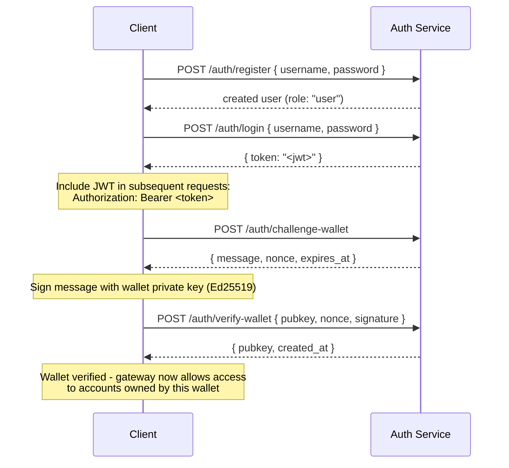

## Yleiskatsaus

Private Channels sisältää valinnaisen Auth Service -palvelun, joka suojaa yhdyskäytävän pääsyn
JWT-todennuksella ja roolipohjaisella pääsynhallinnalla (RBAC). Kun
todennus on poistettu käytöstä, yhdyskäytävä hyväksyy kaikki yhteydet. Kun se on käytössä,
asiakkaiden on esitettävä voimassa oleva JWT jokaisessa pyynnössä.

Tämä sivu kattaa molemmat kohderyhmät:

- **Kehittäjät** – rekisteröinti, kirjautuminen, lompakon varmennus ja
  todennettujen pyyntöjen tekeminen
- **Operaattorit** – auth-palvelun käyttöönotto, `JWT_SECRET`-määritys ja
  `operator`-roolin provisiointi

## Todennuksen käyttöönotto

Todennus otetaan käyttöön asettamalla `JWT_SECRET` (ei-tyhjä) sekä
yhdyskäytävässä että Auth Service -palvelussa. Auth Service vaatii myös
`AUTH_DATABASE_URL`-muuttujan.

Kun `JWT_SECRET`-muuttujaa ei ole asetettu, yhdyskäytävä toimii avoimessa tilassa; tokenia ei
tarvita.

> **Docker Compose:** Auth-palvelu on Docker Compose -profiili, eikä sitä **käynnistetä
> oletuksena**. Sisällyttääksesi sen, anna `--profile auth` komennollesi
> `docker compose`, mukaan lukien `--env-file .env`, jotta salaisuudet kuten
> `JWT_SECRET` ja `POSTGRES_PASSWORD` todella ratkeavat (Compose poistaa
> automaattisen `.env`-latauksen käytöstä, kun jokin `--env-file`-lippu on annettu):
>
> ```bash
> docker compose -f docker-compose.devnet.yml --env-file versions.env --env-file .env.devnet --env-file .env --profile auth up -d
> ```

## Auth Service -rajapinta

Kaikki päätepisteet ovat `/auth`-polun alla. Auth-palvelu kuuntelee portissa `AUTH_PORT`
(oletus `8903`).

### `POST /auth/register`

Luo uusi tili. Kaikki käyttäjät rekisteröidään `user`-roolilla.

```json
{ "username": "alice", "password": "hunter2" }
```

- Käyttäjätunnus: 5–32 merkkiä, kirjaimia ja numeroita sekä `_` ja `-`
- Salasana: 6–128 merkkiä
- Palauttaa luodun käyttäjän; salasanaa ei koskaan palauteta

### `POST /auth/login`

Todenna käyttäjä ja vastaanota allekirjoitettu JWT, joka on voimassa 24 tuntia.

```json
{ "username": "alice", "password": "hunter2" }
```

Palauttaa `{ "token": "<jwt>" }`. Sekä väärä käyttäjätunnus että väärä salasana palauttavat
`401`-virheen käyttäjätunnusten luetteloinnin estämiseksi.

### `POST /auth/challenge-wallet`

Pyydä allekirjoitushaaste Solana-lompakon omistajuuden todistamiseksi. Vaatii
voimassa olevan JWT:n.

Palauttaa viestin, noncen ja vanhentumisajan. Haaste vanhenee 10 minuutissa.

```json
{
  "message": "PrivateChannel wallet verification\nuser: <uuid>\nnonce: <uuid>\nexpires: <unix>",
  "nonce": "<uuid>",
  "expires_at": "<iso8601>"
}
```

### `POST /auth/verify-wallet`

Lähetä allekirjoitettu haaste rekisteröidäksesi lompakon varmennettuna. Vaatii voimassa olevan
JWT:n.

```json
{
  "pubkey": "<base58 pubkey>",
  "nonce": "<uuid from challenge>",
  "signature": "<base58 Ed25519 signature>"
}
```

Palvelu rekonstruoi haasteviesti, varmentaa Ed25519-allekirjoituksen
ja tallentaa lompakon. Jokainen nonce voidaan kuluttaa vain kerran; toistohyökkäykset
hylätään.

Palauttaa `{ "pubkey": "<base58>", "created_at": "<iso8601>" }`.

### `GET /auth/wallets`

Listaa kaikki todennetun käyttäjän varmennetut lompakot. Vaatii voimassa olevan JWT:n.

### `DELETE /auth/wallets/{pubkey}`

Poista varmennettu lompakko todennetun käyttäjän tililtä. Vaatii voimassa olevan
JWT:n.

### `GET /health`

Elossaolotarkistus. Palauttaa `200 ok`. Todennusta ei vaadita.

## JWT-rakenne

Tokenit käyttävät HS256-algoritmia ja vanhenevat 24 tuntia myöntämisen jälkeen.

| Väite  | Arvo                           |
| ------ | ------------------------------- |
| `sub`  | Käyttäjän UUID                       |
| `role` | `"user"` tai `"operator"`        |
| `iss`  | `"private-channel-auth"`        |
| `aud`  | `"private-channel-gateway"`     |
| `exp`  | Unix-aikaleima (24h myöntämisestä) |

> `iss` ja `aud` ovat JWT-hyötykuormassa, mutta yhdyskäytävän JWT-konfiguraatio
> validoi ne, eikä niitä deserialisoida sovelluksen väiterakenteeseen.
> Sovelluskerroksen koodi pääsee käsiksi vain `sub`-, `role`- ja `exp`-kenttiin.

Välitä token `Authorization`-otsikossa:

```
Authorization: Bearer <JWT_TOKEN>
```

## Roolit

### user

Oletusrooli rekisteröinnissä.

- Pääsy on rajattu käyttäjän omiin varmennettuihin lompakkoihin
- Estetty: `getBlock`, `getTransaction`, `simulateTransaction`
- Voi: kutsua `Deposit`-metodia Escrow Program -ohjelmassa, aloittaa nostoja
  `WithdrawFunds`-toiminnon kautta

### operator

Korotettu rooli. Se on provisioitava suoraan; ei ole itsepalvelupolkua
korottaa `user`-roolista `operator`-rooliin.

**Myönnä rooli** joko Admin CLI:n kautta (`private-channel-auth-admin`):

```bash
private-channel-auth-admin set-role --username alice --role operator
```

tai suoralla SQL:llä:

<Callout type="warning">
  Tämä on etuoikeutettu tietokantaoperaatio. Rajoita pääsy Auth Service
  -tietokantaan asianmukaisesti ja auditoi kaikki rolimuutokset.
</Callout>

```sql
UPDATE private_channel_auth.users SET role = 'operator' WHERE username = 'alice';
```

**Rekisteröi lompakko ilman itsepalveluvarmennusvirtaa (Admin CLI,
`private-channel-auth-admin`):**

```bash
private-channel-auth-admin attach-wallet --username alice --pubkey <base58-pubkey>
```

Tämä lisää varmennetun lompakon suoraan `verified_wallets`-tauluun,
ohittaen haaste/varmennus-virran. Pakottaa uniikin rajoitteen
`(user_id, pubkey)`-parille. Se **ei** myönnä `operator`-roolia itsessään; käytä
`set-role`- tai yllä olevaa SQL-päivitystä siihen. Tämä komento on tarkoitettu lompakon
liittämiseen tilille (esimerkiksi palvelutilille) ilman interaktiivista haaste/varmennus-virtaa.

**Ominaisuudet:**

- Ohittaa kaikki lompakon omistajuustarkistukset
- Täysi pääsy kaikkiin yhdyskäytävän RPC-metodeihin, mukaan lukien `getBlock`,
  `getTransaction`, `simulateTransaction`
- Vaaditaan: `ReleaseFunds`, `ResetSmtRoot`

## Täydellinen todennusvirta



## Todennettujen pyyntöjen tekeminen

```typescript
const response = await fetch("http://localhost:8899/", {
  method: "POST",
  headers: {
    "Content-Type": "application/json",
    Authorization: `Bearer ${jwtToken}`
  },
  body: JSON.stringify({
    jsonrpc: "2.0",
    id: 1,
    method: "getBalance",
    params: [walletAddress]
  })
});
const data = await response.json();
```

## Yhdyskäytävän päätepisteet

Nämä päätepisteet eivät vaadi todennusta:

| Päätepiste  | Metodi | Kuvaus                               | Onnistuminen                  | Epäonnistuminen                     |
| --------- | ------ | ----------------------------------------- | ------------------------ | --------------------------- |
| `/health` | GET    | Elossaolotarkistus                            | `200 {"status":"ok"}`    | -                           |
| `/ready`  | GET    | Syvä valmiustarkistus; testaa kirjoitus- ja lukusolmut | `200 {"status":"ready"}` | `503 {"status":"degraded"}` |

Katso `JWT_SECRET`- ja yhdyskäytävän ympäristömuuttujien viitetiedot
[Konfiguraatioviitteestä](/docs/tools/private-channels/operators/configuration).

## RPC-metodien käyttöoikeusmatriisi

Yhdyskäytävä tunnistaa seuraavat metodit. Kun `JWT_SECRET` on asetettu,
pääsy riippuu JWT-roolista:

| Metodi                        | Reitti      | Ei JWT:tä | `user`           | `operator` |
| ----------------------------- | ---------- | ------ | ---------------- | ---------- |
| `sendTransaction`             | Kirjoitussolmu | ✓      | ✓                | ✓          |
| `getLatestBlockhash`          | Lukusolmu  | ✓      | ✓                | ✓          |
| `getSlot`                     | Lukusolmu  | ✓      | ✓                | ✓          |
| `getRecentBlockhash`          | Lukusolmu  | ✓      | ✓                | ✓          |
| `getSignatureStatuses`        | Lukusolmu  | ✓      | ✓                | ✓          |
| `getTransactionCount`         | Lukusolmu  | ✓      | ✓                | ✓          |
| `getFirstAvailableBlock`      | Lukusolmu  | ✓      | ✓                | ✓          |
| `getBlocks`                   | Lukusolmu  | ✓      | ✓                | ✓          |
| `getEpochInfo`                | Lukusolmu  | ✓      | ✓                | ✓          |
| `getEpochSchedule`            | Lukusolmu  | ✓      | ✓                | ✓          |
| `getRecentPerformanceSamples` | Lukusolmu  | ✓      | ✓                | ✓          |
| `getBlockTime`                | Lukusolmu  | ✓      | ✓                | ✓          |
| `getVoteAccounts`             | Lukusolmu  | ✓      | ✓                | ✓          |
| `getSupply`                   | Lukusolmu  | ✓      | ✓                | ✓          |
| `getSlotLeaders`              | Lukusolmu  | ✓      | ✓                | ✓          |
| `isBlockhashValid`            | Lukusolmu  | ✓      | ✓                | ✓          |
| `getAccountInfo`              | Lukusolmu  | 401    | omistajuusportattu¹ | ✓          |
| `getTokenAccountBalance`      | Lukusolmu  | 401    | omistajuusportattu¹ | ✓          |
| `getSignaturesForAddress`     | Lukusolmu  | 401    | omistajuusportattu¹ | ✓          |
| `getBlock`                    | Lukusolmu  | 401    | 403              | ✓          |
| `getTransaction`              | Lukusolmu  | 401    | 403              | ✓          |
| `simulateTransaction`         | Lukusolmu  | 401    | 403              | ✓          |

¹ **Omistajuusportattu**: SPL token account -tilin kohdalla (owner-kenttä on `TokenkegQ...`
tai `TokenzQ...`, dataa vähintään 165 tavua) yhdyskäytävä tarkistaa, että
`owner`- tai `delegate`-kenttä vastaa jotakin todennetun käyttäjän varmennetuista
lompakoista. Minkä tahansa muun tilityypin kohdalla (System Program -lompakko tai tuntematon
PDA) se tarkistaa sen sijaan, onko kyselty pubkey itse yksi käyttäjän varmennetuista
lompakoista, koska tällaisilla tileillä ei ole tarkastettavaa owner/delegate-kenttää.
Kumman tahansa tarkistuksen epäonnistuminen palauttaa 403-virheen.
