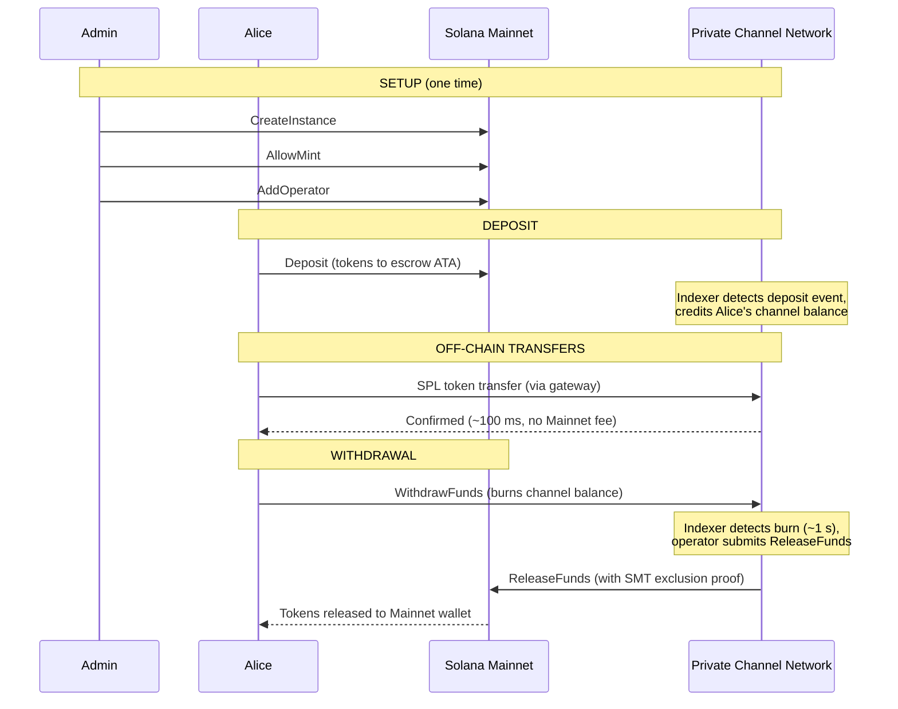
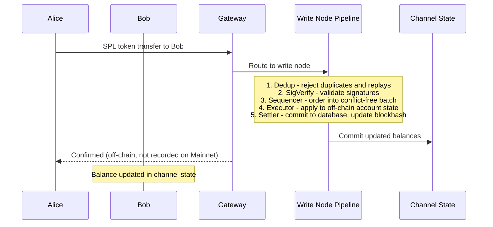
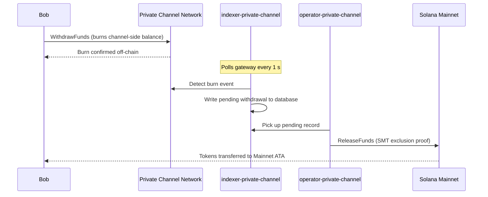

## Mikä on yksityinen kanava?

Yksityinen kanava on ketjun ulkopuolinen maksuverkosto, joka on ankkuroitu Solanaan. Käyttäjät tallettavat SPL-tokenit ketjussa olevaan escrow-ohjelmaan ja suorittavat sitten transaktioita ketjun ulkopuolella yhdyskäytävän kautta suurella nopeudella ja ilman siirtokohtaisia kuluja. Selvitys takaisin Solana Mainnetiin tapahtuu Sparse Merkle Tree -todisteen avulla, mikä varmistaa, että varat ovat aina lunastettavissa eikä kaksinkertainen kulutus ole mahdollista.

Toisin kuin Solanan natiivi maksuprosessi, kanavan sisäiset siirrot eivät näy ketjussa ennen kuin käyttäjä nostaa varansa. Kanavaverkosto käyttää omaa transaktioputkeaan (dedup -> sig verify -> sequencer -> executor -> settler), joka käsittelee transaktioita riippumattomasti Solanan lohkoajasta.

## Osallistujat

### Instanssin ylläpitäjä

Ylläpitäjä ottaa käyttöön `Instance`-PDA:n `CreateInstance`-komennon kautta ja hallinnoi, mitkä SPL-token-mintit hyväksytään (`AllowMint` / `BlockMint`). Ylläpitäjä lisää ja poistaa operaattoreita `AddOperator`- ja `RemoveOperator`-komennoilla sekä voi siirtää ylläpito-oikeudet `SetNewAdmin`-komennolla. Jokaisella instanssilla on yksi ylläpitäjä. Ylläpito-oikeuksien siirto on peruuttamaton yksivaiheinen toiminto: nykyinen ylläpitäjä ei voi ottaa roolia takaisin ilman uuden ylläpitäjän yhteistyötä.

### Operaattorit

Ylläpitäjä provisioi operaattorit. Heillä on `Operator`-PDA, ja he ovat ainoita tilejä, joilla on oikeus kutsua `ReleaseFunds`-komentoa (nostojen selvittämiseen Mainnetiin) ja `ResetSmtRoot`-komentoa (Sparse Merkle Treen kierrättämiseen). Operaattorit ohittavat kaikki omistajuustarkistukset yhdyskäytävässä ja heillä on pääsy kaikkiin JSON-RPC-metodeihin, mukaan lukien `getBlock`, `getTransaction` ja `simulateTransaction`. JWT-rooli: `"operator"`. Operaattorit on provisioitava suoraan tietokantaan; itsepalveluoikeuksien korottaminen ei ole mahdollista. Katso käyttöönotto- ja konfigurointitiedot [Operaattorien oppaasta](/docs/tools/private-channels/operators).

### Käyttäjät

Käyttäjät rekisteröityvät itse Auth Servicen kautta. JWT-rooli: `"user"`. Käyttäjät voivat kutsua `Deposit`-komentoa suoraan Escrow Programissa ja käynnistää nostoja kanavan puolen `WithdrawFunds`-ohjeella Withdraw Programissa. Yhdyskäytävän käyttö on rajattu käyttäjien omiin vahvistettuihin lompakkoihin; heillä ei ole oikeutta kutsua `getBlock`-, `getTransaction`- tai `simulateTransaction`-komentoja.

## Kanavan elinkaari

1. **Instanssin luonti** – Ylläpitäjä kutsuu `CreateInstance`-komentoa, joka luo `Instance`-PDA:n ja määrittää sallitut mintit.
2. **Talletus** – Käyttäjät tallettavat SPL-tokenit escrow'hun `Deposit`-ohjeen kautta. Tokenit siirtyvät instanssin associated token account -tilille.
3. **Ketjun ulkopuoliset siirrot** – Käyttäjät lähettävät siirtoja yhdyskäytävän kautta. Siirrot sekvensoidaan ja suoritetaan kanavaverkostossa ilman yhteyttä Mainnetiin.
4. **Noston käynnistys** – Käyttäjä kutsuu `WithdrawFunds`-komentoa Withdraw Programissa (kanavan puolella) polttaakseen saldonsa ja merkitäkseen noston vireille.
5. **Mainnet-selvitys** – Operaattori toimittaa kelvollisen SMT-poissulkemistodisteen ja kutsuu `ReleaseFunds`-komentoa Escrow Programissa (Mainnet), jolloin tokenit vapautetaan käyttäjän lompakkoon.
6. **Puun kierrätys** – Kun SMT lähestyy kapasiteettiaan (65 536 lehteä), operaattori kutsuu `ResetSmtRoot`-komentoa kierrättääkseen puun ja aloittaakseen uuden epoch-jakson.

### Siirto

### Nosto

## Milloin käyttää yksityisiä kanavia

Käytä yksityisiä kanavia, kun sovelluksesi tarvitsee:

- **Ketjun ulkopuolista suorituskykyä** – siirtomäärät ylittäisivät Solanan TPS-kapasiteetin tai tarvitset alle sekunnin vahvistusajan
- **Yksityisyyttä** – vastapuolten henkilöllisyydet ja siirtomäärät eivät saa näkyä ketjussa
- **Siirtokohtaisia nollakuluja** – suoritat siirtoja tiheästi, jolloin transaktiokohtainen SOL-kustannus olisi liian suuri

Käytä sen sijaan natiiveja SPL-siirtoja, kun:

- **Ketjun yhdisteltävyys** on välttämätöntä (DeFi, vaihdot, lainaus; muiden ohjelmien on voitava havaita siirto tai toimia sen perusteella)
- **Yksittäinen selvityssiirto** riittää eikä yksityisyys ole huolenaihe
- **Yhdyskäytäväinfrastruktuuria** ei ole saatavilla tai sen käyttö ei ole operatiivisesti toteutettavissa
