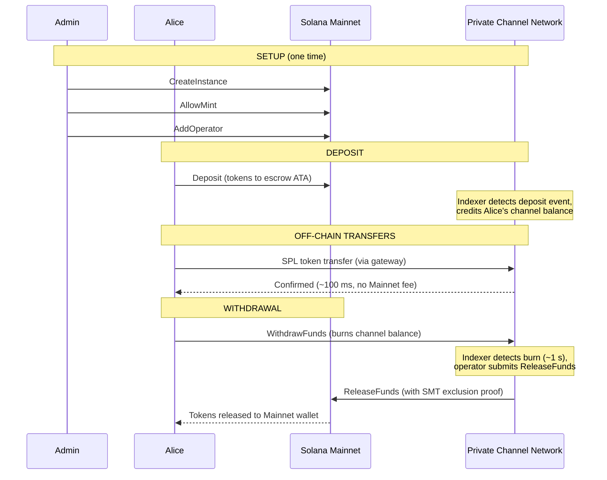
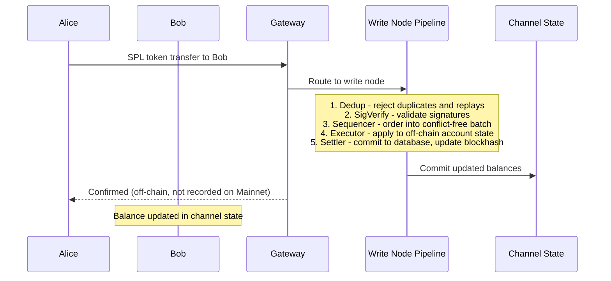
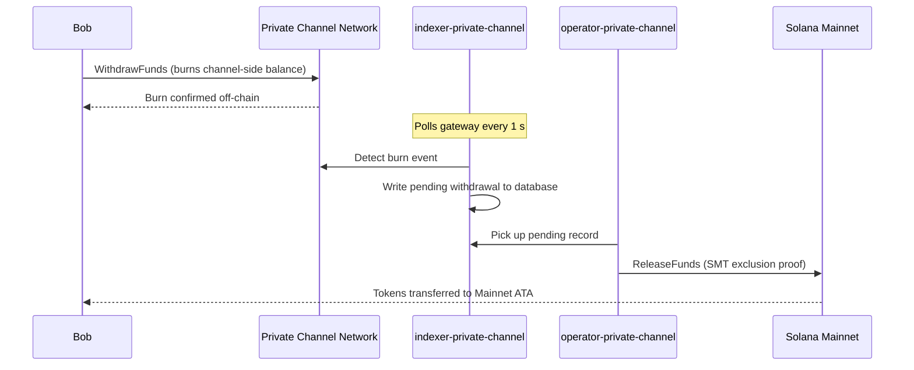

## Mikä on yksityinen kanava?

Yksityinen kanava on ketjun ulkopuolinen maksuverkko, joka on ankkuroitu Solanaan. Käyttäjät tallettavat SPL-tokeneita ketjussa olevaan escrow-ohjelmaan ja suorittavat transaktiot ketjun ulkopuolella yhdyskäytävän kautta suurella nopeudella ja ilman siirtokohtaisia kuluja. Selvitys takaisin Solana Mainnetiin tapahtuu Sparse Merkle Tree -todistuksen avulla, mikä varmistaa, että varat ovat aina lunastettavissa eikä kaksinkertainen kulutus ole mahdollista.

Toisin kuin Solanan natiivi maksuvirta, kanavan sisäiset siirrot eivät näy ketjussa ennen kuin käyttäjä nostaa varansa. Kanavaverkko ajaa omaa transaktiokäsittelyputkeaan (dedup -> sig verify -> sequencer -> executor -> settler), joka käsittelee transaktiot riippumattomasti Solanan lohkoajasta.

## Osallistujat

### Instanssin ylläpitäjä

Ylläpitäjä ottaa käyttöön `Instance`-PDA:n `CreateInstance`-kutsun kautta ja hallinnoi, mitkä SPL-tokenien mintit hyväksytään (`AllowMint` / `BlockMint`). Ylläpitäjä myöntää ja peruuttaa operaattoreiden oikeudet `AddOperator`- ja `RemoveOperator`-kutsuilla sekä voi siirtää ylläpito-oikeudet `SetNewAdmin`-kutsulla. Instanssia kohden on yksi ylläpitäjä. Ylläpito-oikeuksien siirto on peruuttamaton yksivaiheinen toimenpide: nykyinen ylläpitäjä ei voi palauttaa rooliaan ilman uuden ylläpitäjän yhteistyötä.

### Operaattorit

Ylläpitäjä myöntää operaattoreille oikeudet. Heillä on `Operator`-PDA, ja he ovat ainoita tilejä, joilla on lupa kutsua `ReleaseFunds`-funktiota (nostojen selvittämiseksi Mainnetiin) ja `ResetSmtRoot`-funktiota (Sparse Merkle Treen kiertämiseksi). Operaattorit ohittavat kaikki omistajuustarkistukset yhdyskäytävässä ja heillä on pääsy kaikkiin JSON-RPC-metodeihin, mukaan lukien `getBlock`, `getTransaction` ja `simulateTransaction`. JWT-rooli: `"operator"`. Operaattorit on rekisteröitävä suoraan tietokantaan; itsepalvelullista käyttöoikeuksien korotusta ei ole saatavilla. Katso käyttöönotto- ja konfigurointitiedot [Operaattorit-oppaasta](/docs/tools/private-channels/operators).

### Käyttäjät

Käyttäjät rekisteröityvät itse Auth Servicen kautta. JWT-rooli: `"user"`. Käyttäjät voivat kutsua `Deposit`-funktiota suoraan Escrow-ohjelmassa ja käynnistää nostot kanavan puoleisella `WithdrawFunds`-ohjeella Withdraw-ohjelmassa. Yhdyskäytävän käyttö on rajoitettu heidän omiin vahvistettuihin lompakkoihinsa; he eivät voi kutsua `getBlock`-, `getTransaction`- tai `simulateTransaction`-metodeja.

## Kanavan elinkaari

1. **Instanssin luonti** – Ylläpitäjä kutsuu `CreateInstance`-funktiota, joka luo `Instance`-PDA:n ja määrittää sallitut mintit.
2. **Talletus** – Käyttäjät tallettavat SPL-tokeneita escrow'hun `Deposit`-ohjeen kautta. Tokenit siirtyvät instanssin associated token account -tilille.
3. **Ketjun ulkopuoliset siirrot** – Käyttäjät lähettävät siirtoja yhdyskäytävän kautta. Siirrot sekvensoidaan ja suoritetaan kanavaverkossa koskematta Mainnetiin.
4. **Noston käynnistäminen** – Käyttäjä kutsuu `WithdrawFunds`-funktiota Withdraw-ohjelmassa (kanavan puolella) polttaakseen saldонsa ja merkitäkseen noston.
5. **Mainnet-selvitys** – Operaattori toimittaa kelvollisen SMT-poissulkemistodistuksen ja kutsuu `ReleaseFunds`-funktiota Escrow-ohjelmassa (Mainnet), jolloin tokenit vapautetaan käyttäjän lompakkoon.
6. **Puun kierto** – Kun SMT lähestyy kapasiteettiaan (65 536 lehteä), operaattori kutsuu `ResetSmtRoot`-funktiota kiertääkseen puun ja aloittaakseen uuden epoch:n.

### Siirto

### Nosto

## Milloin käyttää yksityisiä kanavia

Käytä yksityisiä kanavia, kun sovelluksesi tarvitsee:

- **Ketjun ulkopuolista suorituskykyä** – siirtomäärä ylittäisi Solanan TPS-rajan tai tarvitset alle sekunnin vahvistusajan
- **Yksityisyyttä** – vastapuolten henkilöllisyydet ja siirtomäärät eivät saa näkyä ketjussa
- **Nollasiirtokuluja** – teet siirtoja usein, jolloin transaktiokohtainen SOL-kulu on liian suuri

Käytä natiiveja SPL-siirtoja sen sijaan, kun:

- **Ketjussa tapahtuva yhteensopivuus** on pakollinen (DeFi, vaihdot, lainaus; muiden ohjelmien on voitava tarkkailla siirtoa tai toimia sen perusteella)
- **Yksittäisen siirron selvitys** riittää eikä yksityisyys ole ongelma
- **Yhdyskäytäväinfrastruktuuria** ei ole saatavilla tai se ei ole toiminnallisesti mahdollinen
