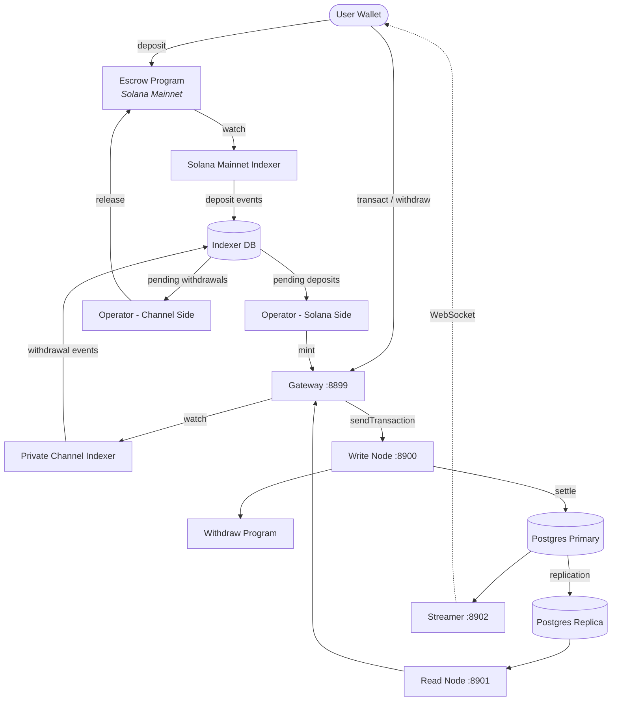

<Callout type="warning">
  Private Channelsille ei ole tehty tietoturva-auditointia, eikä sitä suositella
  tuotantokäyttöön oikeilla varoilla ilman perusteellista tietoturvakatselmointia.
</Callout>

<Callout type="info">
  **Oletko ottamassa instanssia käyttöön?** Siirry [operaattoreiden
  oppaaseen](/docs/tools/private-channels/operators). **Integroitko
  olemassa olevaan instanssiin?** Siirry
  [pika-aloitukseen](/docs/tools/private-channels/quickstart/installation). Tämä sivu
  on arkkitehtuuriviite molemmille kohderyhmille.
</Callout>

## Arkkitehtuuri

Private Channels koostuu neljästä komponentista: kahdesta ketjussa toimivasta Solana-ohjelmasta
(Escrow ja Withdraw) sekä kahdesta ketjun ulkopuolisesta palvelusta (Gateway ja Auth Service).
Yhdessä ne muodostavat tilakanavaprotokollan, jossa varat sijaitsevat Mainnetissä mutta
siirrot selvitetään ketjun ulkopuolella.

### Escrow-ohjelma

Escrow-ohjelma on ketjussa toimiva Solana-ohjelma, joka säilyttää talletettuja SPL-tokeneita.
Se on järjestelmän luottamusankkuri: kaikki varat ovat viime kädessä sulkutilillä,
kunnes operaattori toimittaa kelvollisen Sparse Merkle Tree -poissulkemistodistuksen niiden
vapauttamiseksi.

- Ohjelman tunnus: `9tgHa1DcnaSSUtmMsst8ovKTe1Gfxzezn27KnH9xXYeU`
- Tämä tunnus käännetään ohjelmabinaariin `declare_id!()`-kutsun kautta. Ketjun ulkopuoliset
  palvelut lukevat saman tunnuksen käännösaikana generoidusta asiakas-cratesta, eivät
  ympäristömuuttujasta.
- Hallinnoi `Instance`-, `AllowedMint`- ja `Operator`-PDA:ita
- Instruktiot: `CreateInstance`, `AllowMint`, `BlockMint`, `AddOperator`,
  `RemoveOperator`, `SetNewAdmin`, `Deposit`, `ReleaseFunds`, `ResetSmtRoot`

### Withdraw-ohjelma

Withdraw-ohjelma toimii yksityisessä kanavaverkossa, ei Solana Mainnetissä.
Käyttäjät kutsuvat `WithdrawFunds`-instruktiota polttaakseen kanavan puoleisen tokensaldonsa. Tämä poltto
ei vapauta varoja automaattisesti; se ilmoittaa operaattorille, että
nosto odottaa käsittelyä. Operaattori kutsuu sen jälkeen Escrow-ohjelman `ReleaseFunds`-instruktiota
kelvollisella SMT-todistuksella selvityksen viimeistelemiseksi.

- Ohjelman tunnus: `J231K9UEpS4y4KAPwGc4gsMNCjKFRMYcQBcjVW7vBhVi`
- Tämä tunnus käännetään ohjelmabinaariin. Ketjun ulkopuoliset palvelut lukevat saman
  tunnuksen käännösaikana generoidusta asiakas-cratesta, eivät
  ympäristömuuttujasta.

### Gateway

Gateway on Solanan JSON-RPC-yhteensopiva välityspalvelin, joka reitittää asiakaspyynnöt
kanavaverkon kirjoitussolmulle (transaktioiden lähettämistä varten) ja lukusolmulle (kyselyitä varten).
Se määritetään ympäristömuuttujilla: `GATEWAY_PORT`,
`GATEWAY_WRITE_URL`, `GATEWAY_READ_URL`.

Terveystarkistuksen päätepisteet (todennusta ei vaadita):

- `GET /health` - elossaolotarkistus; palauttaa `200 {"status":"ok"}`
- `GET /ready` - syvä valmiustarkistus, koestaa kirjoitus- ja lukusolmut; palauttaa
  `200 {"status":"ready"}` tai `503 {"status":"degraded"}`

#### RPC-metodien reititys ja käyttöoikeudet

Gateway reitittää `sendTransaction`-metodin kirjoitussolmulle ja kaikki muut metodit
lukusolmulle. Yli 64 kt:n pyynnöt hylätään HTTP 413 -vastauksella. Kun
todennus on käytössä, metodien käyttöä rajataan JWT-roolin perusteella. Katso
koko metodimatriisi kohdasta **[Todennus ja roolit](/docs/tools/private-channels/concepts/auth)**.

### Auth Service

Auth Service on valinnainen komponentti, joka myöntää HS256 JWT:t (24 tunnin
voimassaolo) Gatewayn pääsynhallintaa varten. Se otetaan käyttöön, kun `JWT_SECRET`-
ympäristömuuttuja on asetettu. Ilman sitä Gateway hyväksyy kaikki yhteydet.

JWT-väitteet: `sub` (käyttäjän UUID), `role` (`"user"` tai `"operator"`), `iss`
(`"private-channel-auth"`), `aud` (`"private-channel-gateway"`), `exp` (Unix-
aikaleima). Gatewayn JWT-määritys validoi `iss`- ja `aud`-arvot,
mutta niitä ei deserialisoida sovelluksen väiterakenteeseen: vain `sub`, `role` ja
`exp` ovat sovelluskerroksen koodin käytettävissä.

Roolit:

- `user` - pääsy rajataan omiin vahvistettuihin lompakoihin; ei voi kutsua metodeja `getBlock`,
  `getTransaction` tai `simulateTransaction`
- `operator` - ohittaa kaikki omistajuustarkistukset; täydet RPC-metodien käyttöoikeudet; täytyy
  provisionoida tietokantaan (ei itsepalveluna tehtävää oikeuksien korotusta)

### Streamer

Streamer on WebSocket-palvelin, joka välittää kanavan tilapäivitykset
yhdistetyille asiakkaille reaaliaikaisesti ja poistaa tarpeen kysellä RPC:tä. Se pollaa
PostgreSQL:ää tilamuutosten varalta. Se on osa Docker Compose -peruspinoa, ei
devnet-pinoa, jonka tämä opas ottaa käyttöön; katso
[määritysviite](/docs/tools/private-channels/operators/configuration#service-port-reference).

- Portti: `8902`, määritettävissä muuttujalla `STREAMER_PORT`
- Yhdistä: `ws://localhost:8902`
- Terveystarkistuksen päätepiste: `GET /health` - palauttaa `503`, jos jokin sisäinen pollausluuppi
  pysähtyy yli 30 sekunniksi

<Callout type="warning">
  WebSocket-tapahtumaskeemaa ei ole vielä dokumentoitu julkisesti. Katso
  toteutuksen yksityiskohdat tiedostosta [`core/src/bin/streamer.rs`](https://github.com/solana-foundation/solana-private-channels/blob/main/core/src/bin/streamer.rs),
  kunnes virallinen dokumentaatio on saatavilla.
</Callout>



## Transaktioputki

```text
Transaction -> [1:Dedup] -> [2:SigVerify] -> [3:Sequencer] -> [4:Executor] -> [5:Settler] -> Database
```

Gatewayhin lähetetyt transaktiot kulkevat viisivaiheisen putken läpi ennen kuin
niiden tila kommitoidaan:

1. **Dedup** - suodattaa duplikaattitransaktiot ennen kuin ne siirtyvät putkeen
2. **SigVerify** - validoi transaktioiden allekirjoitukset allekirjoittajan julkista
   avainta vasten
3. **Sequencer** - järjestää kelvolliset transaktiot deterministisesti kanonisen historian
   muodostamiseksi
4. **Executor** - suorittaa transaktiot kanavan tilikerrosta
   (BOB Cache + AccountsDB) vasten ja päivittää saldot ketjun ulkopuolella
5. **Settler** - kommitoi kertyneet transaktiotulokset PostgreSQL:ään ja
   päivittää Redis-välimuistin; generoi uudet blockhashit seuraavaa lohkosykliä varten.
   Mainnet-selvityksen (`ReleaseFunds`-kutsun) hoitaa erikseen
   `operator-private-channel`-palvelu

## Keskeiset ominaisuudet

### Yksityisyys

Kanavan osallistujien välisiä siirtoja ei tallenneta Solana Mainnetiin. Vain
talletukset (kanavaan siirtyminen) ja lopulliset nostot (kanavasta poistuminen)
näkyvät ketjussa. Vastapuolten identiteetit ja siirtosummat eivät näy
ulkopuolisille tarkkailijoille kanavan toiminnan aikana.

### Suorituskyky

Ketjun ulkopuolinen putki poistaa Solanan lohkoajan kriittiseltä polulta.
Siirrot vahvistuvat, kun sekvensseri käsittelee ne, eivät silloin kun Solana-lohko
vahvistuu. Tämä mahdollistaa alle sekunnin finaliteetin ja Solanan natiivin TPS:n ylittävän
läpimenon sovelluskerroksen siirroille.

### Selvitys

Jokainen nosto suojataan ketjussa Sparse Merkle Tree -todistuksella. SMT-
juuri tallennetaan Escrow-ohjelman kenttään `Instance.withdrawal_transactions_root`.
Kun `ReleaseFunds`-instruktiota kutsutaan, ohjelma varmistaa ensin poissulkemistodistuksen
näkemättömälle nonce-arvolle nykyistä ketjussa olevaa juurta vasten ja varmistaa sitten erillisen
sisällyttämistodistuksen kyseiselle nonce-arvolle kutsujan toimittamaa uutta juurta vasten. Vasta
molempien tarkistusten läpäisyn jälkeen se tallentaa uuden juuren, mikä tekee kaksoiskulutuksesta mahdotonta, vaikka
operaattorin avain vaarantuisi.

## Tietoturvamalli

**Ylläpitäjän avain** - hallitsee instanssien luontia (`CreateInstance`) ja operaattorien
provisionointia (`AddOperator` / `RemoveOperator`). Ylläpitäjän avaimen vaarantuminen
mahdollistaa mielivaltaisen operaattorien provisionoinnin. `SetNewAdmin` siirtää ylläpitäjän valtuudet
peruuttamattomasti yhdessä vaiheessa; suojaa ylläpitäjän avain sen mukaisesti.

**Operaattorien avaimet** - voivat kutsua instruktioita `ReleaseFunds` ja `ResetSmtRoot`. Ne eivät voi
vapauttaa varoja ilman kelvollista SMT-poissulkemistodistusta nykyistä ketjussa olevaa
juurta vasten. Ketjussa tehtävä `verify_smt_exclusion_proof`-tarkistus on viimeinen
puolustuslinja luvattomia nostoja vastaan: pelkkä vaarantunut operaattorin avain ei
riitä tyhjentämään sulkutiliä.

**SMT-juuri** - tallennetaan ketjussa kenttään `Instance.withdrawal_transactions_root`.
Päivitetään atomisesti jokaisen `ReleaseFunds`-kutsun yhteydessä. Koska jokaisen todistuksen on
viitattava näkemättömään nonce-arvoon, saman kanavasaldon kaksoiskulutus on
mahdotonta, vaikka operaattorin avain vaarantuisi.

**Puun rotaatio** - `Instance.current_tree_index` seuraa puun aikakausia. Kun
`ResetSmtRoot`-instruktiota kutsutaan, se kasvattaa puuindeksiä ja mitätöi kaikki
edellisen puuaikakauden nonce-arvot, tarjoten puhtaan alun uusille selvityssykleille.

## Operatiivisten avainten tietoturva

<Callout type="warning">
  Ketjun ulkopuoliset palvelut käyttävät omaa allekirjoittajasanastoaan, joka ei liity yllä olevassa tietoturvamallissa
  kuvattuihin ketjussa oleviin ylläpitäjä-/operaattorivaltuuksiin.
  `ADMIN_PRIVATE_KEY` vaaditaan jokaiselle operaattoripalvelulle ja se maksaa
  transaktiomaksut; erillinen, valinnainen `OPERATOR_PRIVATE_KEY` tuottaa
  ketjussa olevan Operator-allekirjoituksen `ReleaseFunds`- ja `ResetSmtRoot`-instruktioille ja käyttää
  varalla `ADMIN_PRIVATE_KEY`-arvoa, jos sitä ei ole asetettu. Älä koskaan laita protokollatason
  instanssin ylläpitäjäavainta (jota käytetään `CreateInstance` / `AddOperator` / `SetNewAdmin` -kutsuihin)
  kumpaankaan muuttujaan tai altista sitä ajonaikaisesti; pidä kyseinen avain kylmänä ja offline-tilassa.
</Callout>

`ReleaseFunds` ja `ResetSmtRoot` vaativat kaksi ketjussa olevaa allekirjoitusta: maksajan
(avaimesta `ADMIN_PRIVATE_KEY`) ja Operator-PDA:n valtuuden (avaimesta
`OPERATOR_PRIVATE_KEY`, tai `ADMIN_PRIVATE_KEY`, jos sitä ei ole asetettu). Tämän käyttöönotto-oppaan
devnet-läpikäynti asettaa generoidun operaattorin keypairin muuttujaan
`ADMIN_PRIVATE_KEY` ja jättää `OPERATOR_PRIVATE_KEY`-muuttujan asettamatta, joten sama keypair
täyttää molemmat allekirjoittajaroolit. Käsittele mitä tahansa avainta, joka lopulta päätyy muuttujaan `ADMIN_PRIVATE_KEY`,
samoilla kontrolleilla kuin hot walletin yksityistä avainta:

- Säilytä se vain gitignored `.env` -tiedostossa, älä koskaan `.env.devnet`-tiedostossa tai missään
  kommitoidussa määrityksessä
- Tuotantokäyttöönotossa harkitse salaisuuksien hallintapalvelua (AWS Secrets Manager,
  HashiCorp Vault) pelkkätekstisen ympäristömuuttujan sijaan
- Protokollatason instanssin ylläpitäjän keypair (jota käytetään kutsuihin `AddOperator` /
  `SetNewAdmin`) tulee pitää kylmänä; sitä tarvitaan vain instanssin asennuksen
  ja operaattorien provisionoinnin aikana, ei ajonaikana

`SetNewAdmin` siirtää ylläpitäjän oikeudet **peruuttamattomasti yhdessä transaktiossa**:
nykyisellä ylläpitäjällä ei ole palautuspolkua ilman uuden ylläpitäjän yhteistyötä. Älä
kutsu sitä varmistamatta kohdeosoitetta.

## Seuraavat vaiheet

<Cards>
  <Card
    title="Pika-aloitus"
    href="/docs/tools/private-channels/quickstart/installation"
  >
    Määritä ympäristösi ja generoi TypeScript-asiakkaat.
  </Card>
  <Card title="Kanavat" href="/docs/tools/private-channels/concepts/channels">
    Ymmärrä osallistujat ja kanavan elinkaari.
  </Card>
  <Card
    title="Sparse Merkle Tree"
    href="/docs/tools/private-channels/concepts/smt"
  >
    Ymmärrä, miten nostotodistukset varmistetaan ketjussa.
  </Card>
  <Card
    title="Instruktiot"
    href="/docs/tools/private-channels/instructions/deposit"
  >
    Täydellinen instruktioviite kaikille ohjelmille.
  </Card>
</Cards>
