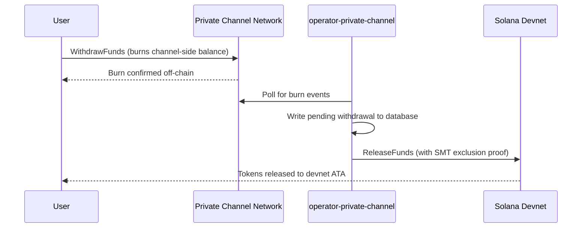

## Yleiskatsaus

Nostaminen Private Channels -palvelusta on kaksivaiheinen prosessi. Ensin käyttäjä polttaa kanavan puolen token-saldon kutsumalla `WithdrawFunds`-funktiota Withdraw-ohjelmassa. Toiseksi operaattori kutsuu `ReleaseFunds`-funktiota Escrow-ohjelmassa (devnet, tässä ohjeessa) kelvollisella Sparse Merkle Tree -poissulkemistodistuksella varojen vapauttamiseksi. SMT-todistus varmistaa, että jokaista nostononcea voidaan käyttää vain kerran, estäen kaksinkertaisen kulutuksen.



## Vaihe 1: Käynnistä nosto kanavalla

Kutsu `WithdrawFunds`-funktiota Withdraw-ohjelmassa polttaaksesi kanavan puolen saldon.
Käytä `Async`-varianttia, joka johtaa automaattisesti `tokenAccount`-PDA:n ja on
suositeltu muoto tuotantokäyttöön:

```typescript
import { getWithdrawFundsInstructionAsync } from "../private-channel-withdraw-program/clients/typescript/src/generated";
import {
  createSolanaRpc,
  address,
  pipe,
  createTransactionMessage,
  setTransactionMessageFeePayerSigner,
  setTransactionMessageLifetimeUsingBlockhash,
  appendTransactionMessageInstruction,
  signAndSendTransactionMessageWithSigners,
  assertIsTransactionMessageWithSingleSendingSigner,
  getBase58Decoder
} from "@solana/kit";

// Point to the gateway, not a public Solana RPC
const privateChannelRpc = createSolanaRpc("http://localhost:8899");

const withdrawIx = await getWithdrawFundsInstructionAsync({
  user: userSigner,
  mint: address(mintAddress),
  amount: 1_000_000n, // 1 USDC (6 decimals)
  destination: null // null = release to signer's devnet wallet
});

const { value: latestBlockhash } = await privateChannelRpc
  .getLatestBlockhash({ commitment: "confirmed" })
  .send();

// Sent to the Private Channels gateway (not Solana RPC directly), which
// expects the legacy transaction format - do not switch this to version 0.
const transactionMessage = pipe(
  createTransactionMessage({ version: "legacy" }),
  (m) => setTransactionMessageFeePayerSigner(userSigner, m),
  (m) => setTransactionMessageLifetimeUsingBlockhash(latestBlockhash, m),
  (m) => appendTransactionMessageInstruction(withdrawIx, m)
);

assertIsTransactionMessageWithSingleSendingSigner(transactionMessage);

const signatureBytes =
  await signAndSendTransactionMessageWithSigners(transactionMessage);
const signature = getBase58Decoder().decode(signatureBytes);
console.log("Withdrawal initiated:", signature);
```

- Withdraw-ohjelman tunnus: `J231K9UEpS4y4KAPwGc4gsMNCjKFRMYcQBcjVW7vBhVi`
- Lähetä tämä transaktio yhdyskäytävään (`http://localhost:8899`), ei
  julkiseen Solana RPC:hen
- Jos `destination` on annettu, vapautetut varat siirretään kyseiseen lompakkoon allekirjoittajan
  sijaan

## Mitä odottaa

Mitään lisätoimia ei tarvita `WithdrawFunds`-kutsun jälkeen. Operaattoripalvelut
käsittelevät selvityksen automaattisesti:

1. `indexer-private-channel` pollaa kanavaa joka sekunti polttotapahtumien varalta
   ja kirjoittaa odottavan nostotietueen, kun omasi havaitaan
2. `operator-private-channel` pollaa tietokantaa joka sekunti odottavien
   tietueiden varalta ja lähettää `ReleaseFunds`-funktion Escrow-ohjelmalle Solana devnetissä
   tarvittavalla SMT-poissulkemistodistuksella; se pollaa devnet-vahvistusta enintään
   5 kertaa 400 ms:n välein ennen uudelleenyritystä

Varat näkyvät tavallisesti devnet-lompakossasi muutaman sekunnin kuluessa normaaliolosuhteissa.

## Kuinka operaattori suorittaa selvityksen (viite)

Kanavan puolen polton jälkeen valmisteltu operaattori täytyy kutsua `ReleaseFunds`-funktiota
Escrow-ohjelmassa kelvollisella SMT-poissulkemistodistuksella; operaattori ei voi vapauttaa
varoja ilman todistusta siitä, että nostononcea ei ole käytetty aiemmin. Tämän vaiheen
käsittelee automaattisesti `operator-private-channel`; sinun ei tarvitse kutsua
sitä itse.

Operaattori toimittaa:

- `amount`: täytyy vastata poltettua määrää
- `user`: vastaanottajan lompakko devnetissä
- `new_withdrawal_root`: päivitetty SMT-juuri tämän noston jälkeen
- `transaction_nonce`: yksilöllinen nonce tälle lehdelle
- `sibling_proofs`: 512 tavua (16 x 32-tavun sisarustiivisteet puutodistukselle)

## Vahvista

Kun operaattorikutsu vahvistuu, tarkista devnet-token-saldosi:

```bash
spl-token balance <MINT_ADDRESS> --owner <YOUR_WALLET>
```

Tai RPC:n kautta:

```typescript
import { createSolanaRpc, address } from "@solana/kit";
import { findAssociatedTokenPda } from "@solana-program/token";

const TOKEN_PROGRAM_ADDRESS = address(
  "TokenkegQfeZyiNwAJbNbGKPFXCWuBvf9Ss623VQ5DA"
);

// Query devnet directly; ReleaseFunds settles here, not through the gateway
const rpc = createSolanaRpc("https://api.devnet.solana.com");

const [yourDevnetAta] = await findAssociatedTokenPda({
  mint: address(mintAddress),
  owner: address(userSigner.address),
  tokenProgram: TOKEN_PROGRAM_ADDRESS
});

const balance = await rpc.getTokenAccountBalance(yourDevnetAta).send();
console.log(balance.value.uiAmountString);
```

## Olet suorittanut pika-aloituksen

Olet suorittanut koko Private Channels -syklin devnetissä: tallettanut SPL-tokenit
escrow'hun, lähettänyt ketjun ulkopuolisen siirron yhdyskäytävän kautta ja nostanut varat
takaisin devnet-lompakkoosi.

<Cards>
  <Card
    title="Kanavan elinkaari"
    href="/docs/tools/private-channels/concepts/channels"
  >
    Ymmärrä osallistujat ja koko talletus-nostoon-kulku perusteellisesti.
  </Card>
  <Card
    title="Todennus ja roolit"
    href="/docs/tools/private-channels/concepts/auth"
  >
    Lisää JWT-todennus integraatioosi.
  </Card>
  <Card
    title="Varojen vapautuksen viite"
    href="/docs/tools/private-channels/instructions/release-funds"
  >
    Täydellinen ReleaseFunds-ohjeen viite operaattorityökaluille.
  </Card>
  <Card
    title="Sparse Merkle Tree"
    href="/docs/tools/private-channels/concepts/smt"
  >
    Ymmärrä, kuinka nostotodistukset estävät kaksinkertaisen kulutuksen.
  </Card>
</Cards>
