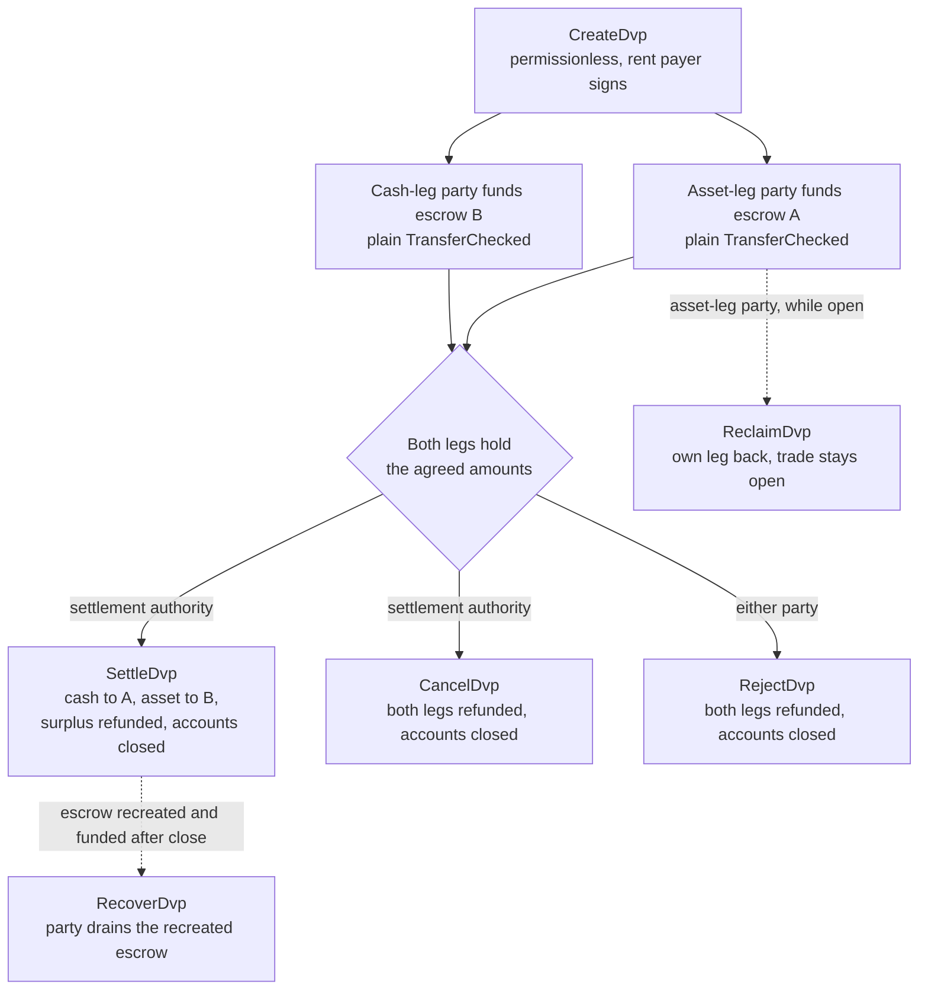
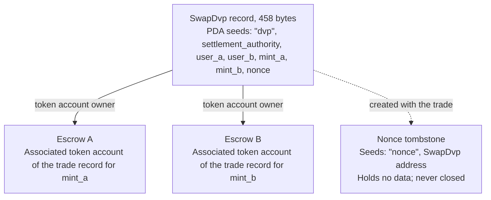

Le programme DvP est le programme standard de livraison contre paiement sur Solana,
maintenu par la Solana Foundation et audité par Cantina. Deux parties s'accordent sur
une opération, chacune envoie sa jambe vers un compte d'escrow par un transfert de token
ordinaire, et une autorité de règlement règle les deux jambes en une seule transaction :
soit les deux s'exécutent, soit aucune. L'autorité de règlement est une troisième adresse
désignée dans l'opération, comme la plateforme ou l'agent qui l'a organisée. Aucune des
parties n'écrit ni ne déploie de programme, et un portefeuille ou un dépositaire capable
d'envoyer un transfert de token standard (`TransferChecked`) peut alimenter une jambe
sans intégration spécifique à DvP. Jusqu'au règlement, chaque partie peut récupérer sa
propre jambe ou dénouer l'opération.

<Callout type="warn" title="Lisez l'enregistrement avant d'agir">

La création d'un enregistrement d'opération est sans permission : un enregistrement ne
prouve donc pas l'accord des parties. Chaque partie lit les conditions stockées avant
d'alimenter sa jambe, et l'autorité de règlement avant de régler (voir
[vérification](#verification-before-funding-and-settlement)).

</Callout>

## Fonctionnement

Chaque opération reçoit un enregistrement détenu par le programme et deux comptes
d'escrow, un par jambe. La partie de la jambe d'actif (`user_a`) et la partie de la
jambe de liquidités (`user_b`) alimentent chacune une jambe en transférant des tokens
vers le compte d'escrow correspondant. L'autorité de règlement est le seul signataire
pouvant régler. Le règlement transfère le montant convenu de chaque jambe à l'autre
partie, renvoie tout excédent à la partie propriétaire de la jambe, puis ferme
l'enregistrement et les deux escrows. L'atomicité découle des
[transactions](/docs/core/transactions) Solana : les deux transferts sont dans une seule transaction,
donc soit les deux prennent effet, soit aucun.

Chaque remboursement, récupération et retour d'excédent est versé à l'associated
token account de la partie : celui de `user_a` pour `mint_a`, celui de `user_b` pour
`mint_b`. Un dépositaire ou un système de trésorerie peut alimenter une jambe depuis
son propre compte, mais tout ce qui est renvoyé arrive sur le compte de la partie, pas
chez le dépositaire. Chaque opération laisse aussi un compte-marqueur permanent (voir
[État](#state)).

## Guides

Les pages d'étapes mènent une opération de sa création à son règlement, avec
TypeScript et Rust pour chaque instruction.

<Cards>
  <Card title="Créer une opération" href="/docs/defi/dvp-program/create-a-trade">
    Installez les clients et enregistrez les conditions de l'opération avec CreateDvp
  </Card>
  <Card title="Alimenter les jambes" href="/docs/defi/dvp-program/fund-the-legs">
    Vérifiez les conditions stockées, puis alimentez chaque jambe par un simple transfert
  </Card>
  <Card title="Régler l'opération" href="/docs/defi/dvp-program/settle-the-trade">
    Réglez les deux jambes en une seule transaction en tant qu'autorité de règlement
  </Card>
  <Card title="Dénouer une opération" href="/docs/defi/dvp-program/unwind-a-trade">
    Récupérez une jambe, annulez ou rejetez l'opération, et récupérez les dépôts tardifs
  </Card>
</Cards>

Une [démo devnet](https://solana.com/delivery-vs-payment/demo) exécute une opération de bout en
bout : elle crée l'opération, alimente les deux escrows avec des transferts de tokens
standard, et règle les deux jambes en une seule transaction.

## Choisir entre le programme et la délégation

[Livraison contre paiement (DvP) par délégation](/docs/tokenization/dvp) règle le
même échange sans programme : chaque partie délègue sa position à un agent de
règlement, qui déplace les deux jambes en une seule transaction.

- **Le programme** ne nécessite aucune délégation : la limite d'un délégué par token
  account ne s'applique donc pas, et l'autorité de règlement ne peut pas rediriger les
  produits. Chaque opération dépend d'un programme évolutif et de son autorité de mise
  à niveau.
- **Le modèle de délégation** n'a aucune dépendance à un programme et fonctionne avec
  les mints dotés de Scaled UI Amount. Le programme rejette ces mints, ce qui exclut
  tout mint créé à partir du modèle `tokenized-security` de Mosaic (voir
  [contraintes de configuration des mints](#mint-configuration-constraints)).

## Rôles

Le programme est symétrique. Dans son interface, les deux parties sont `user_a`, qui
livre `mint_a`, et `user_b`, qui livre `mint_b`. Le README et les clients générés
appellent `mint_a` la jambe d'actif et `mint_b` la jambe de liquidités, et ces pages
suivent cette convention, mais rien dans le programme n'exige que la jambe de
liquidités soit un instrument monétaire. Deux actifs, ou deux stablecoins, se règlent
de la même façon.

| Rôle                 | Qui                               | Signe                                              | Remarques                                                                                                                                                                                                     |
| -------------------- | --------------------------------- | -------------------------------------------------- | --------------------------------------------------------------------------------------------------------------------------------------------------------------------------------------------------------- |
| Partie de la jambe d'actif      | `user_a`, livre `mint_a`       | Son propre transfert d'alimentation ; Reclaim, Reject, Recover | Un portefeuille keypair, ou un portefeuille intelligent basé sur un PDA, comme un coffre multisig. Un compte multisig SPL Token ou un program account ne peut pas être une partie : Create échoue avec `PartyNotSignerCapable`                   |
| Partie de la jambe de liquidités       | `user_b`, livre `mint_b`       | Son propre transfert d'alimentation ; Reclaim, Reject, Recover | Même exigence                                                                                                                                                                                          |
| Autorité de règlement | Une troisième adresse désignée à la création | Settle, Cancel                                     | Le seul signataire pouvant régler. Elle ne peut pas rediriger les produits, qui sont fixés à la création. Elle reçoit le rent des comptes fermés lorsqu'elle règle ou annule                                         |
| Payeur du rent           | Quiconque signe `CreateDvp`         | Create                                             | Finance le rent (le dépôt de SOL qui maintient un compte ouvert) de l'enregistrement, de la pierre tombale de nonce et des deux escrows. Non enregistré comme bénéficiaire du rent : le rent des comptes fermés revient à celui qui ferme l'opération |

## ID du programme

```text
dvp34bdbcEm4f4FCUjGV4mDAkDshaQR4LkK8fdcsyZq
```

| Cluster      | Programme                                       | Autorité de mise à niveau                              | Dernier slot déployé |
| ------------ | --------------------------------------------- | ---------------------------------------------- | ------------------ |
| mainnet-beta | `dvp34bdbcEm4f4FCUjGV4mDAkDshaQR4LkK8fdcsyZq` | `DXtFpbPjcn2hxPnw79x1Pfoj35vXh5AsWBkS37YnXMVv` | 452 058 374        |
| devnet       | `dvp34bdbcEm4f4FCUjGV4mDAkDshaQR4LkK8fdcsyZq` | `5EX1zFeJWj4rGYZv432WnYw8CbaSUeTdxPx4r573UgYU` | 479 376 863        |

Le programme est évolutif sur les deux clusters. Les chiffres ci-dessus sont ceux
rapportés par `solana program show` le 2 octobre 2026 ; exécutez la même commande pour
obtenir les valeurs actuelles. Le build devnet est plus ancien que le commit sur lequel
les pages d'étapes sont rédigées (voir [Installation](/docs/defi/dvp-program/create-a-trade#install)),
avec le même jeu d'instructions et d'erreurs.

## Cycle de vie



Une opération est ouverte de `CreateDvp` jusqu'à ce que Settle, Cancel ou Reject la
ferme. L'alimentation n'a pas d'instruction propre : une jambe est alimentée lorsque
son compte d'escrow contient au moins le montant convenu. Reclaim s'applique par jambe
et laisse l'opération ouverte, de sorte qu'un problème sur une jambe n'oblige pas
l'autre partie à annuler toute l'opération.

## État

Chaque opération possède un compte `SwapDvp` de 458 octets, détenu par le programme.
Son adresse est dérivée de l'autorité de règlement, des deux parties, des deux mints
et d'un nonce (les seeds
`["dvp", settlement_authority, user_a, user_b, mint_a, mint_b, nonce]`). Les montants
et les dates sont stockés dans le compte et n'affectent pas l'adresse, c'est pourquoi
il faut les lire plutôt que les déduire. Un petit compte-marqueur, la pierre tombale
de nonce à `["nonce", swap_dvp]`, est créé avec l'opération et jamais fermé, de sorte
que chaque combinaison de parties, de mints, d'autorité et de nonce ne peut servir que
pour une seule opération.



| Champ                                  | Type          | Signification                                                                                                 |
| -------------------------------------- | ------------- | ------------------------------------------------------------------------------------------------------- |
| `bump`                                 | `u8`          | Bump du PDA                                                                                                |
| `user_a`, `user_b`                     | `Pubkey`      | Les deux parties                                                                                         |
| `mint_a`, `mint_b`                     | `Pubkey`      | Les mints de la jambe d'actif et de la jambe de liquidités                                                                        |
| `settlement_authority`                 | `Pubkey`      | Le seul signataire pouvant régler ou annuler                                                               |
| `token_program_a`, `token_program_b`   | `Pubkey`      | Le token program qui possède chaque mint ; une opération peut mêler des jambes SPL Token et Token-2022                    |
| `amount_a`, `amount_b`                 | `u64`         | Le montant convenu de chaque jambe, dans la plus petite unité du mint (unités de base)                                 |
| `expiry_timestamp`                     | `i64`         | Après cette heure réseau (l'horloge onchain), Settle est rejeté. Reclaim, Cancel et Reject fonctionnent toujours |
| `nonce`                                | `u64`         | Lève l'ambiguïté entre des opérations partageant les autres seeds. À usage unique                                             |
| `ref_string`                           | `[u8; 64]`    | Une référence client opaque, complétée par des zéros ; le programme ne la lit jamais                                     |
| `user_a_settlement_destination`        | `Pubkey`      | Reçoit la jambe de liquidités lors de Settle ; par défaut `user_a`                                                   |
| `user_b_settlement_destination`        | `Pubkey`      | Reçoit la jambe d'actif lors de Settle ; par défaut `user_b`                                                  |
| `mint_a_authority`, `mint_b_authority` | `Pubkey`      | Les autorités de mint capturées à la création ; Settle échoue si l'une d'elles a changé                           |
| `earliest_settlement_timestamp`        | `Option<i64>` | Si défini, Settle est rejeté avant cette heure réseau                                                     |

La liste des champs est tirée de l'IDL du programme au commit indiqué sous
[Créer une opération](/docs/defi/dvp-program/create-a-trade#install).

## Instructions

| Instruction  | Signataire               | Effet                                                                                                                                                              |
| ------------ | -------------------- | ------------------------------------------------------------------------------------------------------------------------------------------------------------------- |
| `CreateDvp`  | N'importe quel payeur            | Crée l'enregistrement `SwapDvp`, sa pierre tombale de nonce et les deux comptes d'escrow. Ne déplace aucun token                                                                        |
| `ReclaimDvp` | `user_a` ou `user_b` | Renvoie depuis l'escrow la propre jambe du signataire. L'opération reste ouverte et la jambe peut être de nouveau alimentée                                                                      |
| `SettleDvp`  | Autorité de règlement | Transfère `amount_a` vers la destination de `user_b` et `amount_b` vers celle de `user_a`, renvoie tout excédent à la partie de la jambe, ferme l'enregistrement et les deux escrows |
| `CancelDvp`  | Autorité de règlement | Rembourse à `user_a` tout ce que contient l'escrow A et à `user_b` tout ce que contient l'escrow B, ferme l'enregistrement et les deux escrows                                                            |
| `RejectDvp`  | `user_a` ou `user_b` | Même effet que Cancel, signé par une partie                                                                                                                            |
| `RecoverDvp` | `user_a` ou `user_b` | Une fois l'opération fermée : vide un escrow recréé vers le token account du signataire et le ferme. Couvre un dépôt arrivé après Settle, Cancel ou Reject  |

Chaque remboursement est versé à l'associated token account de la partie pour le mint
de cette jambe, quel que soit celui qui a alimenté l'escrow.

Les comptes et arguments de chaque instruction figurent sur la page de l'étape
correspondante.

## Erreurs

| Code | Erreur                            | Quand                                                                                                   |
| ---- | -------------------------------- | ------------------------------------------------------------------------------------------------------ |
| 0    | `SignerNotParty`                 | Reclaim, Reject ou Recover signé par une adresse qui n'est ni `user_a` ni `user_b`                      |
| 1    | `DvpExpired`                     | Settle après `expiry_timestamp`                                                                        |
| 2    | `SettlementAuthorityMismatch`    | Settle ou Cancel signé par une adresse autre que l'autorité de règlement                              |
| 3    | `SettlementTooEarly`             | Settle avant `earliest_settlement_timestamp`                                                          |
| 4    | `LegNotFunded`                   | Settle alors qu'un escrow contient moins que son montant convenu                                               |
| 5    | `ExpiryNotInFuture`              | Create avec une expiration égale ou antérieure à l'heure réseau actuelle                                            |
| 6    | `EarliestAfterExpiry`            | Create avec une heure de règlement au plus tôt postérieure à l'expiration                                               |
| 7    | `SelfDvp`                        | Create avec `user_a` égal à `user_b`                                                                 |
| 8    | `SameMint`                       | Create avec `mint_a` égal à `mint_b`                                                                 |
| 9    | `ZeroAmount`                     | Create avec un montant nul sur l'une des jambes                                                                |
| 10   | `BlockedMintExtension`           | Create ou Settle avec un mint portant TransferFee, InterestBearing, ScaledUiAmount ou NonTransferable |
| 11   | `SettlementAuthorityIsParty`     | Create avec l'autorité de règlement égale à une partie                                                  |
| 12   | `SettlementAuthorityExecutable`  | Create avec une autorité de règlement exécutable                                                         |
| 13   | `NonceAlreadyUsed`               | Create réutilisant un `(seeds, nonce)` qui possède déjà une pierre tombale                                         |
| 14   | `ExpiryTooFarInFuture`           | Create avec une expiration à plus d'un an                                                         |
| 15   | `RefStringTooLong`               | Create avec une référence de plus de 64 octets                                                           |
| 16   | `DvpStillOpen`                   | Recover alors que l'opération est encore ouverte ; utilisez Reclaim                                                     |
| 17   | `DvpNeverCreated`                | Recover avec des seeds sans tombstone                                                              |
| 18   | `EscrowPreloadedWithLamports`    | Create lorsqu'un séquestre non natif détient des lamports au-delà de son minimum d'exemption de rent                           |
| 19   | `SettlementDestinationIsSwapDvp` | Create avec une destination de règlement identique à l'enregistrement de l'opération                                         |
| 20   | `SwapDvpPreloadedWithLamports`   | Create lorsque l'adresse de l'enregistrement détient des lamports au-delà de sa réserve de rent                                   |
| 21   | `RecipientAtaMismatch`           | Un token account de destinataire ou de remboursement n'appartient plus au portefeuille et au mint attendus                  |
| 22   | `PartyNotSignerCapable`          | Create avec une partie qui n'est pas un compte appartenant au système et non exécutable                                 |
| 23   | `MintAuthorityChanged`           | Settle lorsque l'autorité de mint d'une jambe diffère de la valeur capturée à la création                         |

## Événements et indexation

Le programme n'émet aucun événement on-chain. Un indexeur ou un système de réconciliation lit
l'état du compte `SwapDvp` et les soldes de tokens des deux séquestres, et utilise
`ref_string` pour rapprocher une opération de son ordre off-chain. Comme l'enregistrement
est clôturé au règlement, un système qui a besoin des conditions a posteriori les stocke
lorsqu'il les lit, ou les reconstitue à partir de la transaction qui a créé
l'opération.

## Tokens pris en charge

Une opération peut associer une jambe SPL Token à une jambe Token-2022 ; chaque jambe porte
son propre Token Program. Les jambes en SOL wrappé sont prises en charge.

| Extension Token-2022 sur le mint d'une jambe                                                     | Comportement du programme                                                  |
| ---------------------------------------------------------------------------------------- | ----------------------------------------------------------------- |
| TransferFee, InterestBearing, ScaledUiAmount, NonTransferable                            | Rejeté à Create et Settle avec `BlockedMintExtension`         |
| PermanentDelegate, Pausable, DefaultAccountState, une autorité de gel, MintCloseAuthority | Accepté ; chaque autorité peut agir sur les tokens mis sous séquestre           |
| ConfidentialTransfer                                                                     | Accepté ; les montants de cette jambe sont publics                          |
| TransferHook                                                                             | Pris en charge, jusqu'à 32 comptes supplémentaires par jambe                        |
| MemoTransfer sur un compte de destination ou de remboursement                                          | Accepté ; le programme émet le mémo requis avant le transfert |

Des frais de transfert laisseraient la partie réceptrice en deçà du montant convenu.
Interest Bearing et Scaled UI Amount ne modifient pas les montants bruts, mais leur taux
ou leur multiplicateur peut changer entre la création et le règlement d'une opération, ce qui modifie
l'affichage des montants convenus. NonTransferable bloquerait définitivement les deux jambes.

Les autorités acceptées peuvent déplacer, geler ou suspendre les tokens sous séquestre pendant
toute la durée de l'opération (voir ci-dessous). Le séquestre ne peut pas être configuré pour recevoir
des transferts confidentiels ; les montants sous séquestre et réglés sur une jambe
confidentielle sont donc publics.

Pour un mint avec hook, le client résout les comptes supplémentaires du hook et les ajoute
à Settle, Cancel, Reject, Reclaim et Recover. Le plafond de 32 par jambe
comprend le programme du hook et son compte de validation. Si l'autorité du hook
agrandit la liste de comptes du hook au-delà de ce plafond, tous les transferts de cette jambe
échouent, y compris Reclaim, Cancel, Reject et Recover, jusqu'à ce que l'autorité
annule la modification. La limite de comptes par transaction peut être atteinte avant le plafond par jambe
lorsque les deux jambes comportent des hooks.

Lorsqu'un compte de destination ou de remboursement exige des mémos, le programme appelle le programme Memo
avant le transfert, c'est pourquoi toute instruction qui sort des tokens
du séquestre prend un compte `memo_program`.

### Contraintes de configuration du mint

**Scaled UI Amount.** Le modèle `tokenized-security` de
[Mosaic](https://github.com/solana-foundation/mosaic), la boîte à outils d'émission de la Solana Foundation,
ajoute toujours Scaled UI Amount ; le programme n'accepte donc pas comme jambe un
mint créé à partir de ce modèle. Un mint destiné à ce programme peut
être créé sans l'extension (voir
[Token Extensions](/docs/tokens/extensions)) ;
[le DvP par délégation](/docs/tokenization/dvp) règle via une autorité
déléguée et n'applique pas cette vérification.

**Mints gelés par défaut.** Le séquestre de chaque opération est un associated token account
détenu par une Program Derived Address propre à cette opération. Sur un mint dont
Default Account State est défini sur frozen, le séquestre est créé gelé, et un transfert
de financement vers celui-ci échoue tant qu'il n'est pas dégelé. Avec
[Token ACL](/docs/tokenization/token-acl), cela signifie que l'émetteur ou son agent de transfert
admet le séquestre de l'opération avant le financement : soit en ajoutant l'adresse de
l'enregistrement de l'opération (le propriétaire du séquestre) à la liste d'autorisation, afin que n'importe qui puisse dégeler
le séquestre lorsque la configuration Token ACL du mint active le dégel sans permission, soit en
faisant dégeler le compte directement par l'autorité de gel. Un séquestre gelé bloque aussi
Settle, Reclaim, Cancel, Reject et Recover sur cette jambe ; l'autorité
de gel, et sur un mint avec hook l'autorité du hook, est donc une partie de confiance pendant toute la
durée de l'opération. Le cas du séquestre gelé est décrit ici et n'est pas exercé
dans les extraits de code devnet.

## Limites

- Pas de mise en correspondance, de découverte de prix ni de carnet d'ordres. Les parties conviennent des conditions hors
  du registre et l'une d'elles les enregistre.
- Pas de compensation, et bilatéral uniquement : un enregistrement correspond à une opération entre deux parties.
- Pas d'exécution partielle. Settle déplace exactement le montant convenu de chaque jambe et
  renvoie tout excédent à la partie de la jambe.
- Pas de jambe hors registre. Les deux jambes sont des token accounts sur Solana ; une jambe en espèces sur
  les circuits existants est réglée séparément puis réconciliée.
- Pas de contrôle d'éligibilité, de liste d'autorisation ni de KYC. Ce sont les contrôles propres au mint qui font respecter
  l'éligibilité des détenteurs.
- Pas de règlement automatique. L'autorité de règlement doit signer.
- Pas d'événements, et pas de frais de protocole en dehors des frais de transaction et de la rent.

Le programme supprime le risque en principal entre les deux parties : aucune jambe ne bouge
si l'autre ne bouge pas. Il ne supprime ni le risque de crédit de l'émetteur ni le risque de remboursement sur l'un ou l'autre
token, ni la capacité de l'autorité de gel, de pause ou de délégué permanent d'un mint à
agir sur les tokens sous séquestre (voir [tokens pris en charge](#supported-tokens)), ni la
dépendance à la disponibilité de l'autorité de règlement pour signer.

## Vérification avant le financement et le règlement

`CreateDvp` est sans permission : seul le payeur signe, pas les parties ni
l'autorité de règlement. N'importe qui peut donc créer un enregistrement nommant n'importe quelles
parties et n'importe quelles conditions. Avant le financement, puis de nouveau avant le règlement, lisez le
compte `SwapDvp` et vérifiez que :

1. Le compte appartient au programme DvP et fait exactement 458 octets. Un compte
   qui n'appartient pas au programme peut être rempli d'octets qui se décodent comme un
   véritable enregistrement.
2. `user_a`, `user_b`, `mint_a`, `mint_b` et `settlement_authority` correspondent à
   l'opération convenue.
3. `amount_a`, `amount_b`, `expiry_timestamp` et
   `earliest_settlement_timestamp` correspondent aux conditions convenues.
4. Les deux destinations de règlement sont les adresses convenues. Un enregistrement falsifié peut
   détourner le produit.

[Financer les jambes](/docs/defi/dvp-program/fund-the-legs#verify-the-terms) répertorie les
lecteurs avec vérification des clients générés et montre la vérification en code.

Considérez une opération comme réglée lorsque la transaction Settle atteint
[`finalized`](/docs/rpc#configuring-state-commitment). Il s'agit d'un niveau
d'engagement du réseau ; qu'il marque ou non aussi le caractère définitif du règlement à des fins juridiques
dépend des accords entre les parties et des régimes applicables.

## Gestion des versions

Le compte `SwapDvp` ne comporte pas de champ de version. Sa structure est fixée à 458 octets
(`SwapDvp::LEN`), et les lecteurs avec vérification rejettent tout compte d'une autre longueur.
L'IDL porte sa propre version, `0.1.0` au 2 octobre 2026.

Le programme est évolutif (upgradeable) sur les deux clusters (voir [ID du programme](#program-id)). Un
enregistrement d'opération n'existe que jusqu'à son règlement, son annulation ou son rejet ; consultez donc
le dépôt pour savoir comment une mise à jour traite les opérations ouvertes, et régénérez les clients
à partir de l'IDL de la version déployée.

## Dépôt et audit

Le code source, l'IDL, les clients générés et les tests se trouvent dans
[`solana-foundation/dvp`](https://github.com/solana-foundation/dvp) sous licence
MIT. Le programme est un programme Pinocchio `no_std` ; les clients sont
générés à partir de l'IDL avec Codama. Les signalements de vulnérabilités passent par le lien d'avis de sécurité
du dépôt, conformément à son `SECURITY.md`.

Le programme a été audité par
[Cantina](https://cantina.xyz/portfolio/fe870bb4-d96d-4902-8aec-9dfcfa2d6a79).

## Voir aussi

- [Delivery vs Payment (DvP) par délégation](/docs/tokenization/dvp) : le
  modèle de délégation sans programme
- [Token ACL](/docs/tokenization/token-acl) : comment un mint à accès restreint interagit avec les
  comptes de séquestre
