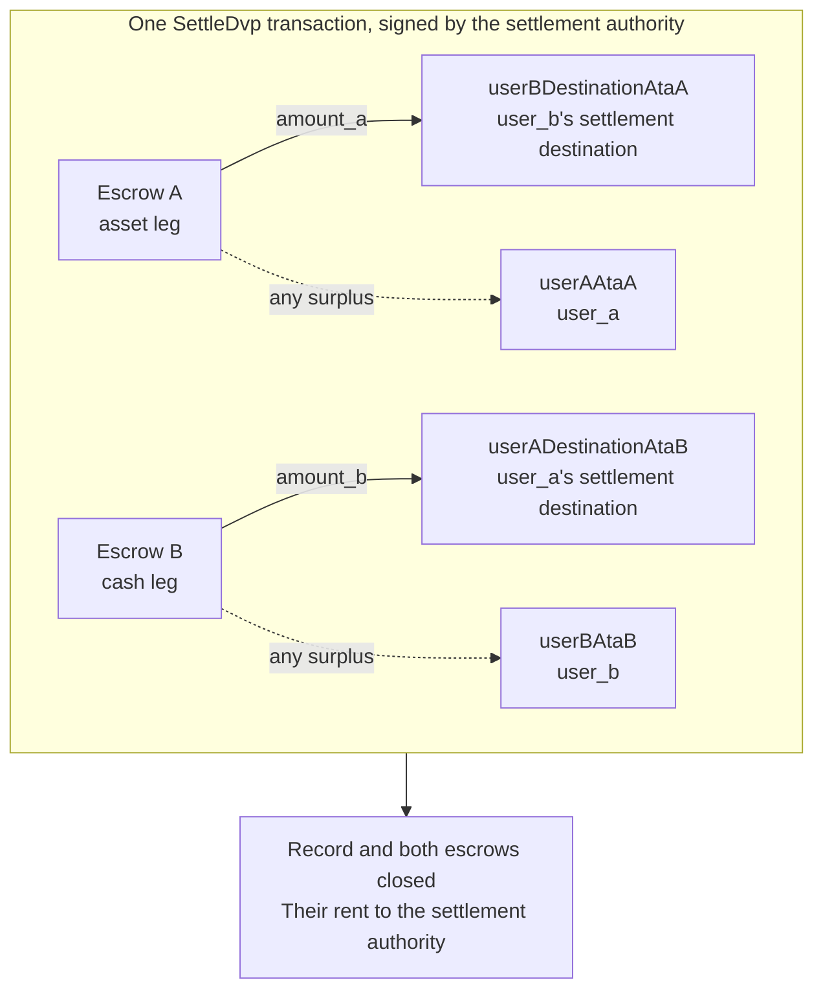

`SettleDvp` est signée par l'autorité de règlement désignée dans l'enregistrement de l'échange. En
une seule transaction, elle déplace `amount_a` du volet actif vers la destination
de la partie du volet monétaire et `amount_b` du volet monétaire vers la destination de la partie du volet actif,
restitue tout excédent présent dans l'un ou l'autre escrow à la partie du volet concerné, puis ferme l'enregistrement
ainsi que les deux escrows. Si l'un de ces transferts ne peut pas aboutir, l'instruction
échoue et rien n'est déplacé.

Cette page fait suite à [créer un échange](/docs/defi/dvp-program/create-a-trade)
et [provisionner les volets](/docs/defi/dvp-program/fund-the-legs) ; le client, les signataires,
`trade` et les token accounts des parties sont repris tels quels.

## Revalider avant de signer

L'autorité de règlement signe la transaction qui déplace les deux volets : elle
effectue donc la même lecture que chaque partie avant de signer : propriétaire, taille, parties,
mints, montants, expiration et les deux destinations (voir
[provisionner les volets](/docs/defi/dvp-program/fund-the-legs#verify-the-terms)). Le
programme revérifie lui-même, au moment du règlement, que chaque mint appartient toujours au token
program enregistré à la création, qu'il ne comporte aucune extension bloquée et qu'il a la même
autorité de mint qu'à la création de l'échange ; ainsi, un mint recréé avec une extension bloquée,
un autre token program ou une autre autorité de mint ne peut pas
être réglé.

## Créer les comptes destinataires

Settle écrit dans quatre token accounts que le programme ne crée pas :

| Compte                | Reçoit                     | Propriétaire                           |
| ---------------------- | ---------------------------- | ------------------------------- |
| `userADestinationAtaB` | Le volet monétaire (`amount_b`)    | `user_a_settlement_destination` |
| `userBDestinationAtaA` | Le volet actif (`amount_a`)   | `user_b_settlement_destination` |
| `userAAtaA`            | Tout excédent du volet actif | `user_a`                        |
| `userBAtaB`            | Tout excédent du volet monétaire  | `user_b`                        |

Les comptes d'excédent ne servent que lorsqu'un escrow contient plus que le montant
convenu, mais toute personne détenant le mint peut créer un excédent en envoyant quelques unités
de base dans l'escrow. Si le compte de remboursement n'existe pas, l'ensemble de l'instruction Settle
échoue ; créez donc les quatre comptes de manière idempotente dans la même transaction.

<Tabs items={["TypeScript", "Rust"]}>
  <Tab value="TypeScript">
    ```ts
    import {
      findAssociatedTokenPda,
      getCreateAssociatedTokenIdempotentInstruction,
    } from "@solana-program/token-2022";

    const destinationA = t.userASettlementDestination; // defaults to userA
    const destinationB = t.userBSettlementDestination; // defaults to userB

    const [userADestinationAtaB] = await findAssociatedTokenPda({
      mint: mintB,
      owner: destinationA,
      tokenProgram: tokenProgramB,
    });
    const [userBDestinationAtaA] = await findAssociatedTokenPda({
      mint: mintA,
      owner: destinationB,
      tokenProgram: tokenProgramA,
    });
    // userAAtaA and userBAtaB are from fund the legs.

    const createRecipientAccounts = [
      { ata: userADestinationAtaB, owner: destinationA, mint: mintB, tokenProgram: tokenProgramB },
      { ata: userBDestinationAtaA, owner: destinationB, mint: mintA, tokenProgram: tokenProgramA },
      { ata: userAAtaA, owner: userA, mint: mintA, tokenProgram: tokenProgramA },
      { ata: userBAtaB, owner: userB, mint: mintB, tokenProgram: tokenProgramB },
    ].map(({ ata, owner, mint, tokenProgram }) =>
      getCreateAssociatedTokenIdempotentInstruction({
        payer: authoritySigner,
        ata,
        owner,
        mint,
        tokenProgram,
      }),
    );
    ```

  </Tab>

  <Tab value="Rust">
    ```rust
    use spl_associated_token_account_client::address::get_associated_token_address_with_program_id;
    use spl_associated_token_account_client::instruction::create_associated_token_account_idempotent;

    let authority: Pubkey = pubkey!("SETTLEMENT_AUTHORITY_ADDRESS_HERE");
    let destination_a = trade.user_a_settlement_destination; // defaults to user_a
    let destination_b = trade.user_b_settlement_destination; // defaults to user_b

    let user_a_destination_ata_b =
        get_associated_token_address_with_program_id(&destination_a, &mint_b, &token_program_b);
    let user_b_destination_ata_a =
        get_associated_token_address_with_program_id(&destination_b, &mint_a, &token_program_a);
    let user_a_ata_a = get_associated_token_address_with_program_id(&user_a, &mint_a, &token_program_a);
    let user_b_ata_b = get_associated_token_address_with_program_id(&user_b, &mint_b, &token_program_b);

    let create_recipient_accounts = [
        create_associated_token_account_idempotent(&authority, &destination_a, &mint_b, &token_program_b),
        create_associated_token_account_idempotent(&authority, &destination_b, &mint_a, &token_program_a),
        create_associated_token_account_idempotent(&authority, &user_a, &mint_a, &token_program_a),
        create_associated_token_account_idempotent(&authority, &user_b, &mint_b, &token_program_b),
    ];
    ```

  </Tab>
</Tabs>

## Règlement

`legAExtrasCount` indique au programme combien des comptes ajoutés après la
liste fixe appartiennent au transfer hook du volet actif ; les autres reviennent à celui du
volet monétaire. Pour les mints sans transfer hooks, passez zéro et n'ajoutez rien. Le
program account memo est requis par l'instruction et n'est utilisé que pour les destinations
qui exigent un mémo.

<Tabs items={["TypeScript", "Rust"]}>
  <Tab value="TypeScript">
    ```ts
    import { MEMO_PROGRAM_ADDRESS } from "@solana-program/memo";
    import { getSettleDvpInstruction } from "./dvp";

    const settleInstruction = getSettleDvpInstruction({
      settlementAuthority: authoritySigner,
      swapDvp,
      mintA,
      mintB,
      dvpAtaA: escrowA,
      dvpAtaB: escrowB,
      userADestinationAtaB,
      userBDestinationAtaA,
      userAAtaA,
      userBAtaB,
      tokenProgramA,
      tokenProgramB,
      memoProgram: MEMO_PROGRAM_ADDRESS,
      legAExtrasCount: 0,
    });

    const { context: settleContext } = await client.sendTransaction([
      ...createRecipientAccounts,
      settleInstruction,
    ]);
    const settleSignature = settleContext.signature;
    console.log("Submitted:", settleSignature);

    // sendTransaction returns at the client's commitment (confirmed by default).
    // Wait for finalized before recording the trade as settled.
    let finalized = false;
    for (let attempt = 0; attempt < 30 && !finalized; attempt++) {
      const {
        value: [status],
      } = await client.rpc.getSignatureStatuses([settleSignature]).send();
      if (status?.err) {
        throw new Error("Settle transaction failed");
      }
      finalized = status?.confirmationStatus === "finalized";
      if (!finalized) {
        await new Promise((resolve) => setTimeout(resolve, 2_000));
      }
    }
    if (!finalized) {
      // A closed record means it settled; an open one is safe to settle again.
      throw new Error("Settle not finalized after 60s; read the trade record");
    }
    console.log("Settled:", settleSignature);
    ```

  </Tab>

  <Tab value="Rust">
    ```rust
    use dvp_swap_program_client::instructions::SettleDvpBuilder;

    const MEMO_PROGRAM_ID: Pubkey = pubkey!("MemoSq4gqABAXKb96qnH8TysNcWxMyWCqXgDLGmfcHr");

    let settle_ix = SettleDvpBuilder::new()
        .settlement_authority(authority)
        .swap_dvp(swap_dvp)
        .mint_a(mint_a)
        .mint_b(mint_b)
        .dvp_ata_a(escrow_a)
        .dvp_ata_b(escrow_b)
        .user_a_destination_ata_b(user_a_destination_ata_b)
        .user_b_destination_ata_a(user_b_destination_ata_a)
        .user_a_ata_a(user_a_ata_a)
        .user_b_ata_b(user_b_ata_b)
        .token_program_a(token_program_a)
        .token_program_b(token_program_b)
        .memo_program(MEMO_PROGRAM_ID)
        .leg_a_extras_count(0)
        .instruction();
    ```

  </Tab>
</Tabs>



### Transfer hooks

L'IDL généré ne répertorie que les comptes fixes ; les builders générés
ne connaissent donc pas les comptes de hook. Résolvez les account metas supplémentaires de chaque mint avec hook
de la même manière que pour un transfert direct de ce token, puis ajoutez-les à
l'instruction : d'abord les comptes du volet actif, puis ceux du volet monétaire, avec
`legAExtrasCount` défini sur le nombre du premier groupe. En TypeScript, étalez
les metas résolus dans le tableau `accounts` de l'instruction ; en Rust, utilisez
`add_remaining_accounts` sur le builder. La limite est de 32 comptes par volet,
y compris le programme de hook et le compte de validation ; la limite de comptes par transaction
peut être atteinte en premier lorsque les deux volets comportent des hooks. Le programme retire l'indicateur de signataire
de chaque compte transmis : un hook ne peut donc pas obtenir la signature de l'autorité de règlement
par ce biais.

## Enregistrer le résultat

Considérez l'échange comme réglé lorsque la transaction Settle atteint `finalized`. L'enregistrement
et les deux escrows n'existent plus après le règlement ; un système qui a besoin
des conditions par la suite doit donc les conserver à partir de sa lecture préalable au règlement ou de la transaction
de création. Le rent des comptes fermés a été reversé à l'autorité
de règlement.

## Erreurs de règlement

`LegNotFunded` signifie qu'un escrow contient moins que son montant convenu ; `DvpExpired`
et `SettlementTooEarly` signifient que la fenêtre de temps a été manquée ; `MintAuthorityChanged`
et `BlockedMintExtension` signifient qu'un mint a changé après la création ;
`RecipientAtaMismatch` signifie qu'un token account de destination ou de remboursement est manquant ou
n'appartient plus au propriétaire et au mint attendus, généralement parce que l'étape de
création de compte ci-dessus a été omise. Dans tous les cas, rien n'a été déplacé, et les
parties peuvent annuler l'échange, sous réserve des autorités du mint (voir
[annuler un échange](/docs/defi/dvp-program/unwind-a-trade)).

## Étapes suivantes

- [Annuler un échange](/docs/defi/dvp-program/unwind-a-trade) : récupérer les volets
  provisionnés lorsqu'un échange n'est pas réglé
