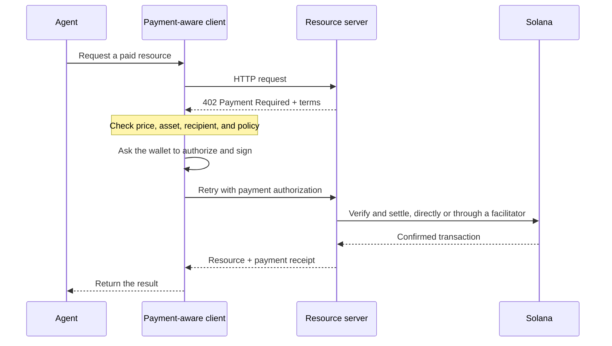

Les paiements agentiques permettent à un logiciel de découvrir un prix, d'autoriser un paiement et de recevoir
une ressource dans le même flux de travail HTTP. Un agent peut payer une requête de données, une inférence de modèle
ou un appel d'outil sans avoir à créer au préalable un compte de facturation ni à copier une
clé d'API.

<Cards>
  <Card title="MPP" href="/docs/payments/agentic-payments/mpp">
    Utilisez l'authentification HTTP pour les paiements ponctuels et les sessions de paiement à la consommation.
  </Card>
  <Card title="x402" href="/docs/payments/agentic-payments/x402">
    Ajoutez à une ressource HTTP les exigences de paiement, les signatures et le règlement x402 V2.
  </Card>
</Cards>

## Le flux de paiement commun

MPP et x402 utilisent des en-têtes et des modèles de données différents, mais leur flux HTTP de base est
similaire :

## MPP et x402

Les deux protocoles peuvent régler des paiements en stablecoins sur Solana. Choisissez en fonction du
modèle de paiement et de l'interopérabilité dont votre service a besoin, et pas uniquement en fonction du code
de statut `402` commun.

|                         | MPP                                                               | x402                                                                     |
| ----------------------- | ----------------------------------------------------------------- | ------------------------------------------------------------------------ |
| Défi               | `WWW-Authenticate: Payment`                                       | `PAYMENT-REQUIRED`                                                       |
| Autorisation du client    | `Authorization: Payment`                                          | `PAYMENT-SIGNATURE`                                                      |
| Reçu                 | `Payment-Receipt`                                                 | `PAYMENT-RESPONSE`                                                       |
| Modèles de paiement Solana   | Intentions `charge` (paiement ponctuel) et `session` (à la consommation, plafonnée)           | Schémas tels que `exact` et `upto` ; la prise en charge varie selon le réseau et le client |
| Architecture de règlement | Validation côté serveur, ou relais ou passerelle optionnel                | Serveur de ressources avec vérification locale ou facilitateur                 |
| Bon point de départ     | API nécessitant la sémantique d'authentification HTTP ou une mesure de consommation récurrente | Ressources payantes à la requête et clients x402 existants                      |

MPP est le **Machine Payments Protocol**. Ne le confondez pas avec le **Model
Context Protocol (MCP)**. MCP expose des outils et des ressources aux agents ; MPP ou x402
peuvent exiger un paiement lorsqu'un agent invoque l'un de ces outils.

<Callout type="info">
  Un service peut annoncer plusieurs protocoles. Le client sélectionne une option de paiement
  qu'il prend en charge, puis utilise les en-têtes de défi, d'autorisation et
  de reçu correspondants pendant tout l'échange.
</Callout>
