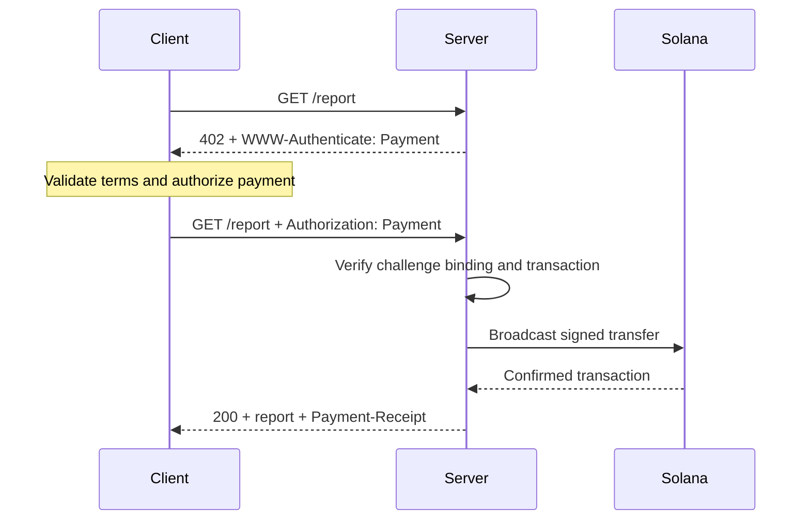
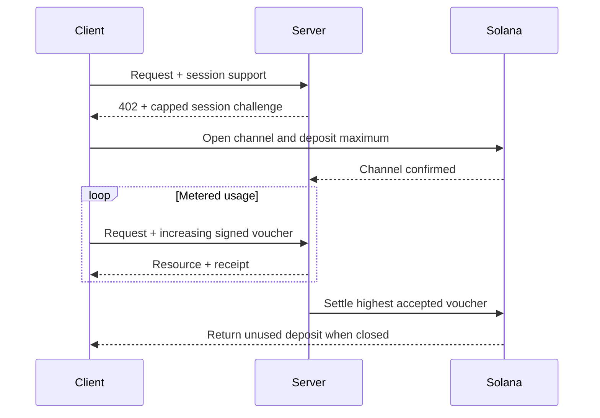

Le [Machine Payments Protocol (MPP)](https://mpp.dev/) applique la sémantique d'authentification HTTP aux paiements. Un serveur lance un challenge en réponse à une requête non payée, un client renvoie un identifiant de paiement, et le serveur retourne un reçu après avoir accepté le paiement.

MPP distingue trois notions :

- Une **intention** (*intent*) décrit l'interaction commerciale, comme un paiement ponctuel `charge` ou une `session` à la consommation.
- Une **méthode de paiement** décrit la manière dont la valeur est transférée. La méthode Solana prend en charge le SOL natif et les jetons SPL pour les paiements ponctuels.
- Un **transport** HTTP achemine les challenges, les identifiants, les reçus et les erreurs.

MPP est publié sous la forme d'un ensemble d'Internet-Drafts. Considérez les [spécifications actuelles](https://paymentauth.org/) comme la source de référence et attendez-vous à ce que les détails évoluent tant que les drafts sont en cours d'élaboration.

## Échange HTTP

MPP utilise les champs d'authentification HTTP standard plutôt que des en-têtes de paiement propres à un protocole :

| Message                 | Représentation HTTP                                         |
| ----------------------- | ----------------------------------------------------------- |
| Challenge de paiement       | `402 Payment Required` avec `WWW-Authenticate: Payment ...` |
| Identifiant de paiement      | Requête renvoyée avec `Authorization: Payment ...`           |
| Reçu de succès      | Réponse de la ressource avec `Payment-Receipt: ...`               |
| Détails de paiement invalides | Corps Problem Details utilisant `application/problem+json`       |



Un challenge comprend un ID généré par le serveur, un realm, une méthode, une intention, une demande de paiement encodée et une date d'expiration. L'identifiant reprend le challenge et y ajoute la preuve de paiement propre à la méthode. Le serveur doit vérifier ces deux éléments : un transfert valide qui appartient à un autre challenge ne doit pas déverrouiller la ressource.

## Paiements ponctuels sur Solana

L'intention `charge` de Solana prend en charge deux types d'identifiants :

- Le **mode pull** utilise une transaction signée. Le client signe le transfert et envoie la transaction au serveur. Le serveur la vérifie, ajoute éventuellement une signature de fee payer, la diffuse, la confirme, puis renvoie la signature de la transaction dans son reçu.
- Le **mode push** utilise une signature de transaction. Le client diffuse d'abord la transaction, puis envoie la signature confirmée au serveur. Le serveur récupère et vérifie la transaction avant de renvoyer la ressource.

Le mode pull permet au serveur de prendre en charge les frais de transaction et de gérer la logique de nouvelle tentative côté serveur. Le mode push est utile lorsqu'un portefeuille exige que le client soumette lui-même sa transaction, mais il ne permet pas la prise en charge des frais par le serveur.

Pour les champs normatifs et les règles de vérification, consultez la [spécification Solana charge](https://paymentauth.org/draft-solana-charge-00.html).

## Ajouter un paiement MPP à une API Express

Le Solana Pay Kit fournit une intégration TypeScript à jour pour MPP et x402. Installez-le avec Express :

```bash
pnpm add @solana/pay-kit @solana/kit@^6.9.0 express
pnpm add --save-dev @types/express tsx
```

Cet exemple minimal utilise le sandbox Surfpool hébergé et le destinataire de démonstration public du package. Il est réservé au développement local :

```ts filename=server.ts
import express from "express";
import { createPayKit, usd } from "@solana/pay-kit";

const pay = await createPayKit({
  accept: ["mpp"],
  rpcUrl: "https://402.surfnet.dev:8899"
});

const app = express();

app.get("/report", pay.express(usd("0.01")), (_req, res) => {
  res.json({ report: "Paid report" });
});

app.listen(4567, () => {
  console.log("Paid API listening on http://127.0.0.1:4567");
});
```

Exécutez-le et comparez une requête non payée avec une requête compatible avec le paiement :

```bash
pnpm tsx server.ts
curl -i http://127.0.0.1:4567/report
pay --sandbox curl http://127.0.0.1:4567/report
```

Le gestionnaire de route ne s'exécute qu'une fois que le middleware a accepté le paiement.

<Callout type="warn" title="Remplacez toutes les valeurs par défaut du sandbox en production">
  Configurez explicitement un réseau, un destinataire marchand, un RPC dédié, un secret stable de liaison des challenges, un signataire de production et un magasin anti-rejeu durable. N'acheminez jamais de paiements réels vers un signataire de démonstration d'un package.
</Callout>

## Sessions à la consommation

Utilisez une `session` MPP Solana lorsqu'un client effectue de nombreux petits paiements liés. Une session ouvre un canal de paiement onchain avec un dépôt maximal, puis utilise des vouchers signés cumulatifs à mesure que l'usage augmente. Le serveur peut vérifier les vouchers offchain et régler plus tard le montant accepté le plus élevé.

C'est utile pour l'inférence facturée au token, les téléchargements facturés à l'octet, les données en direct et les appels d'outils répétés. Ce n'est pas la même chose que d'envoyer un paiement onchain distinct pour chaque événement.



Parlez de **paiement de session**, de **canal de paiement** ou d'**autorisation répétée plafonnée**. Ne parlez de paiement en flux continu (*streamed payment*) que si le service et le contrat de paiement mesurent réellement un flux d'utilisation.

## Vérification en production

Pour chaque paiement Solana, le serveur doit au minimum vérifier que :

- Le challenge est authentique, n'a pas expiré, est lié à cette requête et est destiné à ce realm.
- La transaction utilise le réseau, l'actif ou le mint, le destinataire, le montant et le programme de jetons attendus.
- Les éventuelles instructions de fee payer ou d'associated token account sont explicitement autorisées et ne peuvent pas vider les fonds du signataire du serveur.
- La transaction a réussi au niveau de commitment requis.
- La signature de la transaction n'a pas déjà été consommée.
- La vérification anti-rejeu et l'opération de consommation sont atomiques sur toutes les instances du serveur.

Pour les sessions, conservez également l'état du canal, le montant cumulatif accepté et le watermark de règlement dans un magasin partagé. Documentez la façon dont les clients récupèrent les fonds inutilisés si le serveur devient indisponible.

## Ressources associées

- [Spécifications MPP](https://paymentauth.org/)
- [Documentation du protocole MPP](https://mpp.dev/protocol)
- [Solana Pay Kit](https://github.com/solana-foundation/pay-kit)
- [Présentation des paiements agentiques](/docs/payments/agentic-payments)
- [Préparation à la production](/docs/tools/production-readiness)
