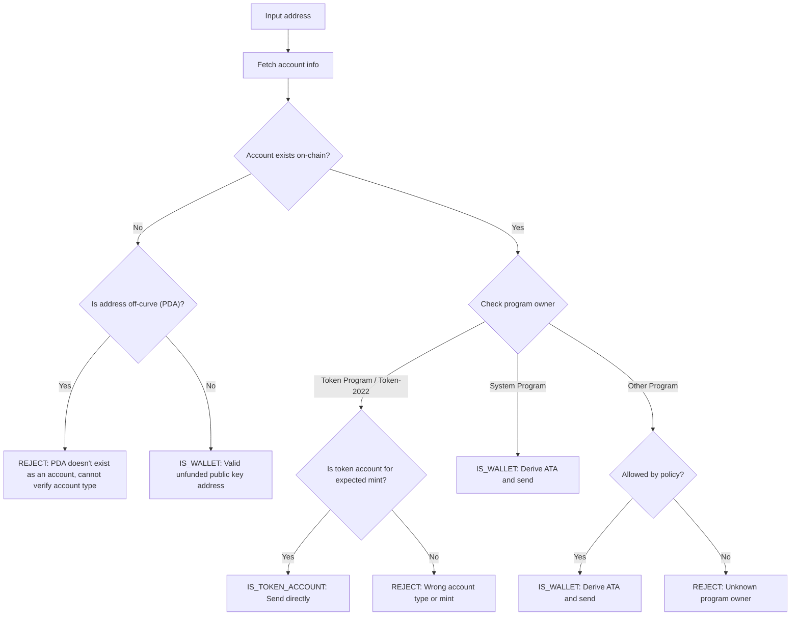

Envoyer des tokens à la mauvaise adresse peut entraîner une perte permanente de
fonds. La vérification d'adresse garantit que vous n'envoyez des tokens qu'à des
adresses qui peuvent correctement les recevoir et y accéder.

<Callout>
  Voir [Comment fonctionnent les paiements sur
  Solana](/docs/payments/how-payments-work) pour les concepts fondamentaux des
  paiements.
</Callout>

## Comprendre les adresses Solana

Les comptes Solana ont deux types d'adresses, sur courbe et hors courbe.

### Adresses sur courbe

Les adresses standard sont les clés publiques des paires de clés Ed25519. Ces
adresses :

- Ont une clé privée correspondante qui peut signer des transactions
- Sont utilisées comme adresses de portefeuille

### Adresses hors courbe (PDA)

Les [adresses dérivées de programme](/docs/core/pda) sont dérivées de manière
déterministe à partir d'un ID de programme et de seeds. Ces adresses :

- N'ont **pas** de clé privée correspondante
- Ne peuvent être signées que par le programme dont l'adresse a été dérivée

## Types de comptes dans les paiements

Utilisez l'adresse pour récupérer un [compte](/docs/core/accounts) depuis le
réseau, vérifiez son propriétaire de programme et son type de compte pour
déterminer comment traiter l'adresse.

<Callout>
  Savoir si une adresse est sur courbe ou hors courbe ne vous indique pas quel
  type de compte il s'agit, quel programme le possède, ou si un compte existe à
  cette adresse. Vous devez récupérer le compte depuis le réseau pour déterminer
  ces détails.
</Callout>

### Comptes du System Program (portefeuilles)

Les comptes détenus par le System Program sont des portefeuilles standard. Pour
envoyer des tokens SPL à un portefeuille, vous dérivez et utilisez son
[compte de tokens associé (ATA)](/docs/tokens/basics/create-token-account#whats-an-associated-token-account).

Après avoir dérivé l'adresse ATA, vérifiez si le token account existe on-chain.
Si l'ATA n'existe pas, vous pouvez inclure une instruction pour créer le token
account du destinataire dans la même transaction que le transfert. Cependant,
cela nécessite de payer le rent pour le nouveau token account. Étant donné que
le destinataire possède l' ATA, les SOL payés pour le rent ne peuvent pas être
récupérés par l'expéditeur.

<Callout type="warn">
  Sans mesures de protection, subventionner la création d'ATA peut être
  exploité. Un utilisateur malveillant pourrait demander un transfert, faire
  créer son ATA à vos frais, fermer l'ATA pour récupérer le SOL de rent, et
  recommencer.
</Callout>

### Comptes de jetons

Les [comptes de jetons](/docs/tokens/basics/create-token-account) appartiennent
au Token Program ou au Token-2022 Program et contiennent des soldes de jetons.
Si l'adresse que vous recevez appartient à un programme de jetons, vous devez
vérifier que le compte est un compte de jetons (et non un mint account) et
correspond au mint account de jeton attendu avant d'envoyer.

<Callout type="info">
  Les Token Programs valident automatiquement que les deux comptes de jetons
  dans un transfert contiennent des jetons du même mint. Si la validation
  échoue, la transaction est rejetée et aucun fonds n'est perdu.
</Callout>

### Mint accounts

Les [mint accounts](/docs/tokens/basics/create-mint) suivent l'offre de jetons
et les métadonnées d'un jeton spécifique. Les mint accounts appartiennent
également aux Token Programs mais ne sont **pas** des destinataires valides pour
les transferts de jetons. Tenter d'envoyer des jetons à une adresse de mint
entraîne l'échec de la transaction, mais aucun fonds n'est perdu.

### Autres comptes

Les comptes appartenant à d'autres programmes nécessitent une décision
politique. Certains comptes (par exemple, les portefeuilles multisig) peuvent
être des propriétaires valides de comptes de jetons, tandis que d'autres doivent
être rejetés.

## Flux de vérification

Le diagramme suivant présente un arbre de décision de référence pour valider une
adresse :



<Steps>
<Step>

### Récupérer le compte

Utilisez l'adresse pour récupérer les détails du compte depuis le réseau.

</Step>
<Step>

### Le compte n'existe pas

Si aucun compte n'existe à cette adresse, vérifiez si l'adresse est on-curve ou
off-curve :

- **Hors courbe (PDA)** : rejetez l'adresse de manière conservatrice pour éviter
  d'envoyer vers un ATA qui pourrait être inaccessible. Sans compte existant,
  vous ne pouvez pas déterminer à partir de l'adresse seule quel programme a
  dérivé ce PDA ou si l'adresse correspond à un ATA. Dériver un ATA pour cette
  adresse afin d'envoyer des tokens pourrait entraîner le blocage de fonds dans
  un token account inaccessible.

- **Sur courbe** : il s'agit d'une adresse de portefeuille valide (clé publique)
  qui n'a pas encore été financée. Dérivez l'ATA, vérifiez s'il existe et
  envoyez-y des tokens. Vous devez prendre une décision politique pour
  déterminer s'il faut financer la création de l'ATA s'il n'existe pas.

</Step>
<Step>

### Le compte existe

Si un compte existe, vérifiez quel programme en est propriétaire :

- **System Program** : il s'agit d'un portefeuille standard. Dérivez l'ATA,
  vérifiez s'il existe et envoyez-y des tokens. Vous devez prendre une décision
  politique pour déterminer s'il faut financer la création de l'ATA s'il
  n'existe pas.

- **Token Program / Token-2022** : vérifiez que le compte est un token account
  (et non un mint account) et qu'il détient le token (mint) que vous avez
  l'intention d'envoyer. S'il est valide, envoyez les tokens directement à cette
  adresse. S'il s'agit d'un mint account ou d'un token account pour un mint
  différent, rejetez l'adresse.

- **Autre programme** : cela nécessite une décision politique. Certains
  programmes comme les portefeuilles multisig peuvent être des propriétaires
  acceptables de token accounts. Si votre politique le permet, dérivez l'ATA et
  envoyez. Sinon, rejetez l'adresse.

</Step>
</Steps>

## Démo

L'exemple suivant montre uniquement la logique de validation d'adresse. Il
s'agit de code de référence à des fins d'illustration.

<Callout>
  La démo ne montre pas comment dériver un ATA ou construire une transaction
  pour envoyer des tokens. Consultez la documentation sur les [comptes de
  tokens](/docs/tokens/basics/create-token-account#how-to-create-an-associated-token-account)
  et le [transfert de tokens](/docs/tokens/basics/transfer-tokens) pour des
  exemples de code.
</Callout>

La démo ci-dessous utilise trois résultats possibles :

| Résultat           | Signification                  | Action                                             |
| ------------------ | ------------------------------ | -------------------------------------------------- |
| `IS_WALLET`        | Adresse de portefeuille valide | Dériver et envoyer vers l'associated token account |
| `IS_TOKEN_ACCOUNT` | Token account valide           | Envoyer les tokens directement à cette adresse     |
| `REJECT`           | Adresse invalide               | Ne pas envoyer                                     |

<CodeTabs flags="r">

```ts !! title="Demo"
// !collapse(1:35) collapsed

import {
  type Address,
  type Rpc,
  type GetAccountInfoApi,
  createSolanaRpc,
  fetchJsonParsedAccount,
  isOffCurveAddress,
  generateKeyPairSigner,
  getProgramDerivedAddress
} from "@solana/kit";

// =============================================================================
// Constants
// =============================================================================

const defaultRpc = createSolanaRpc("https://api.mainnet-beta.solana.com");

const SYSTEM_PROGRAM = "11111111111111111111111111111111" as Address;
const TOKEN_PROGRAM = "TokenkegQfeZyiNwAJbNbGKPFXCWuBvf9Ss623VQ5DA" as Address;
const TOKEN_2022_PROGRAM =
  "TokenzQdBNbLqP5VEhdkAS6EPFLC1PHnBqCXEpPxuEb" as Address;

// =============================================================================
// Validation Function
// =============================================================================

/**
 * Possible validation results for an input address.
 */
export type ValidationResult =
  | { type: "IS_TOKEN_ACCOUNT" }
  | { type: "IS_WALLET" }
  | { type: "REJECT"; reason: string };

/**
 * Validates an input address and classifies it as a wallet, token account, or invalid.
 *
 * @param inputAddress - The address to validate
 * @param rpc - Optional RPC client (defaults to mainnet)
 * @returns Classification result:
 *   - IS_WALLET: Valid wallet address
 *   - IS_TOKEN_ACCOUNT: Valid token account
 *   - REJECT: Invalid address for transfers
 */
export async function validateAddress(
  inputAddress: Address,
  rpc: Rpc<GetAccountInfoApi> = defaultRpc
): Promise<ValidationResult> {
  const account = await fetchJsonParsedAccount(rpc, inputAddress);
  // Log the account data for demo
  console.log("\nAccount:", account);

  // Account doesn't exist on-chain
  if (!account.exists) {
    // Off-curve = PDA that doesn't exist as an account
    // Reject conservatively to avoid sending to an address that may be inaccessible.
    if (isOffCurveAddress(inputAddress)) {
      return { type: "REJECT", reason: "PDA doesn't exist as an account" };
    }
    // On-curve = valid keypair address, treat as unfunded wallet
    return { type: "IS_WALLET" };
  }

  // Account exists, check program owner
  const owner = account.programAddress;

  // System Program = wallet
  if (owner === SYSTEM_PROGRAM) {
    return { type: "IS_WALLET" };
  }

  // Token Program or Token-2022, check if token account
  if (owner === TOKEN_PROGRAM || owner === TOKEN_2022_PROGRAM) {
    const accountType = (
      account.data as { parsedAccountMeta?: { type?: string } }
    ).parsedAccountMeta?.type;

    if (accountType === "account") {
      return { type: "IS_TOKEN_ACCOUNT" };
    }
    // Reject if not a token account (mint account)
    return {
      type: "REJECT",
      reason: "Not a token account"
    };
  }

  // Unknown program owner
  return { type: "REJECT", reason: "Unknown program owner" };
}

// =============================================================================
// Examples
// =============================================================================
// !collapse(1:1000) collapsed

// Wallets
const EXISTING_WALLET =
  "H8sMJSCQxfKiFTCfDR3DUMLPwcRbM61LGFJ8N4dK3WjS" as Address;
const NEW_WALLET = (await generateKeyPairSigner()).address;

// Token accounts
const USDC_TOKEN_ACCOUNT =
  "3emsAVdmGKERbHjmGfQ6oZ1e35dkf5iYcS6U4CPKFVaa" as Address;
const PYUSD_TOKEN_ACCOUNT =
  "47od2TPRvqJipfPVWZdyenLEngPw8hC36nDxiLyvGsEP" as Address;

// Token mints (should be rejected)
const USDC_MINT = "EPjFWdd5AufqSSqeM2qN1xzybapC8G4wEGGkZwyTDt1v" as Address;
const PYUSD_MINT = "2b1kV6DkPAnxd5ixfnxCpjxmKwqjjaYmCZfHsFu24GXo" as Address;

// PDA that doesn't exist (should be rejected)
const [NON_EXISTENT_PDA] = await getProgramDerivedAddress({
  programAddress: (await generateKeyPairSigner()).address,
  seeds: ["seed"]
});

// Program account (should be rejected)
const PROGRAM_ACCOUNT =
  "p1exdMJcjVao65QdewkaZRUnU6VPSXhus9n2GzWfh98" as Address;

async function runExample(label: string, address: Address) {
  console.log(`\n${"─".repeat(60)}`);
  console.log(`Example: ${label}`);
  console.log(`Input: ${address}`);
  console.log(`${"─".repeat(60)}`);

  const result = await validateAddress(address);
  console.log("\nResult:", result);
}

console.log("\n" + "═".repeat(60));
console.log("  IS_WALLET Examples");
console.log("═".repeat(60));

await runExample("Existing funded wallet", EXISTING_WALLET);
await runExample("New wallet (unfunded)", NEW_WALLET);

console.log("\n" + "═".repeat(60));
console.log("  IS_TOKEN_ACCOUNT Examples");
console.log("═".repeat(60));

await runExample("USDC token account (Token Program)", USDC_TOKEN_ACCOUNT);
await runExample("PYUSD token account (Token-2022)", PYUSD_TOKEN_ACCOUNT);

console.log("\n" + "═".repeat(60));
console.log("  REJECT Examples");
console.log("═".repeat(60));

await runExample("USDC mint address", USDC_MINT);
await runExample("PYUSD mint address", PYUSD_MINT);
await runExample("Non-existent PDA", NON_EXISTENT_PDA);
await runExample("Program account", PROGRAM_ACCOUNT);

console.log("\n" + "═".repeat(60));
console.log("  Done!");
console.log("═".repeat(60) + "\n");
```

</CodeTabs>
