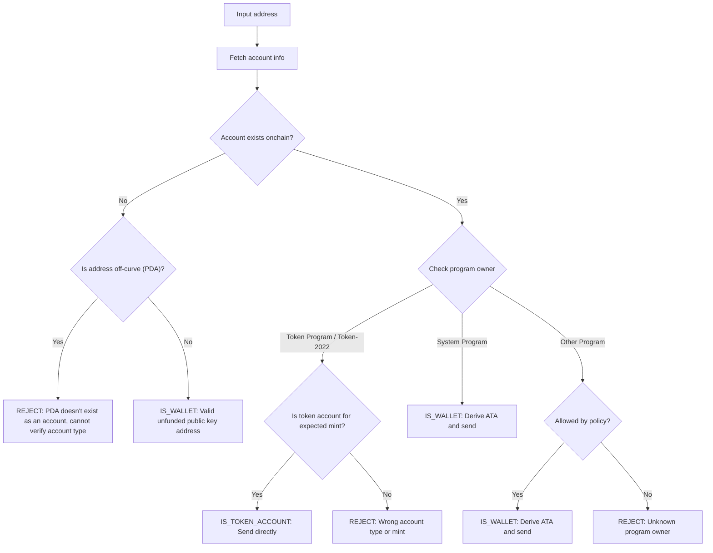

Envoyer des fonds à une adresse incorrecte peut entraîner une perte permanente.
La vérification des adresses garantit que vous n'envoyez qu'à des adresses
capables de recevoir et d'accéder correctement aux fonds.

La validation dépend de ce que vous envoyez :

- **Les tokens SPL** sont partiellement auto-protégés. Le Token Program rejette
  un transfert dont les comptes ne correspondent pas au mint attendu, de sorte
  qu'un transfert de token mal dirigé échoue sans perte de fonds. La majeure
  partie de cette page concerne les envois de tokens SPL.
- **Le SOL natif** ne dispose pas d'une telle protection. Un transfert via le
  System Program réussit vers n'importe quel compte, donc un destinataire
  incorrect verrouille définitivement le SOL. Voir
  [Envoyer du SOL natif](#sending-native-sol).

<Callout>
  Voir [Comment fonctionnent les paiements sur
  Solana](/docs/payments/how-payments-work) pour les concepts fondamentaux des
  paiements.
</Callout>

## Comprendre les adresses Solana

Les comptes Solana ont deux types d'adresses : sur la courbe et hors courbe.

### Adresses sur la courbe

Les adresses standard sont les clés publiques issues de keypairs Ed25519. Ces
adresses :

- Possèdent une clé privée correspondante capable de signer des transactions
- Sont utilisées comme adresses de portefeuille

### Adresses hors courbe (PDAs)

Les [Program Derived Addresses](/docs/core/pda) sont dérivées de manière
déterministe à partir d'un identifiant de programme et de seeds. Ces adresses :

- Ne possèdent **pas** de clé privée correspondante
- Ne peuvent être signées que par le programme dont elles sont dérivées

## Types de comptes dans les paiements

Utilisez l'adresse pour récupérer un [compte](/docs/core/accounts) depuis le
réseau, vérifiez son propriétaire de programme et le type de compte pour
déterminer comment traiter l'adresse.

<Callout>
  Savoir si une adresse est sur la courbe ou hors courbe ne vous indique pas
  quel type de compte il s'agit, quel programme en est propriétaire, ni si un
  compte existe à cette adresse. Vous devez récupérer le compte depuis le réseau
  pour déterminer ces informations.
</Callout>

### Comptes System Program (Portefeuilles)

Les comptes appartenant au System Program sont des portefeuilles standard. Pour
envoyer des tokens SPL à un portefeuille, vous dérivez et utilisez son
[Associated Token Account (ATA)](/docs/tokens/basics/create-token-account#whats-an-associated-token-account).

Après avoir dérivé l'adresse ATA, vérifiez si le token account existe sur la
blockchain. Si l'ATA n'existe pas, vous pouvez inclure une instruction pour
créer le token account du destinataire dans la même transaction que le
transfert. Cependant, cela nécessite de payer le rent pour le nouveau token
account. Étant donné que le destinataire est propriétaire de l'ATA, le SOL payé
pour le rent ne peut pas être récupéré par l'expéditeur.

<Callout type="warn">
  Sans mesures de protection, la prise en charge de la création d'ATA peut être
  exploitée. Un utilisateur malveillant pourrait demander un transfert, faire
  créer son ATA à vos frais, fermer l'ATA pour récupérer le rent SOL, et
  recommencer.
</Callout>

### Token Accounts

Les [token accounts](/docs/tokens/basics/create-token-account) appartiennent au
Token Program ou au Token-2022 Program et contiennent les soldes de tokens. Si
l'adresse que vous recevez appartient à un token program, vous devez vérifier
que le compte est bien un token account (et non un mint account) et qu'il
correspond au mint account du token attendu avant d'envoyer.

<Callout type="info">
  Les Token Programs valident automatiquement que les deux token accounts
  impliqués dans un transfert détiennent des tokens du même mint. Si la
  validation échoue, la transaction est rejetée et aucun fonds n'est perdu.
</Callout>

### Mint Accounts

Les [mint accounts](/docs/tokens/basics/create-mint) suivent l'offre en
circulation et les métadonnées d'un token spécifique. Les mint accounts
appartiennent également aux Token Programs, mais ne sont **pas** des
destinataires valides pour les transferts de tokens. Tenter d'envoyer des tokens
à une adresse de mint entraîne l'échec de la transaction, mais aucun fonds n'est
perdu.

### Autres comptes

Les comptes appartenant à d'autres programmes nécessitent une décision de
politique. Certains comptes (par exemple, les portefeuilles multisig) peuvent
être des propriétaires valides de token account, tandis que d'autres doivent
être rejetés.

## Envoi de SOL natif

La classification ci-dessus détermine où les jetons SPL peuvent être envoyés. Le
SOL natif est plus strict : le seul destinataire sûr est un **portefeuille
System Program** (ou une adresse non financée sur la courbe qui en devient un).

Un transfert System Program ajoute des lamport à n'importe quel compte, y
compris les mints, les token accounts, les programmes et les PDA. Les lamport ne
peuvent être retirés que par le programme propriétaire du compte ; envoyer du
SOL à un destinataire incorrect peut donc entraîner une perte permanente de
fonds.

Contrairement à un transfert de jeton SPL, la transaction n'échoue **pas**
lorsque le destinataire est une adresse inattendue.

Lors de l'envoi de SOL natif, seul un résultat `IS_WALLET` est acceptable.
`IS_TOKEN_ACCOUNT` ne l'est **pas** : un token account contient des jetons SPL,
et le SOL qui y est envoyé échappa au contrôle de l'expéditeur.

<Callout type="warn">
  C'est ainsi que du SOL est souvent perdu : un utilisateur colle l'adresse du
  mint d'un jeton (ou une adresse de programme) dans un retrait de SOL. Le
  transfert réussit et le SOL est irrécupérable. Classifiez toujours le
  destinataire avant de signer un transfert de SOL.
</Callout>

## Flux de vérification

Le diagramme suivant présente un arbre de décision de référence pour la
validation d'une adresse :


```mermaid title="Address Verification Flow"
flowchart TD
    A["Input address"]
    B["Fetch account info"]

    A --> B
    B --> C{"Account exists onchain?"}

    %% --- Non-existent account path ---
    C -- "No" --> D{"Is address off-curve (PDA)?"}
    D -- "Yes" --> R1["REJECT: PDA doesn't exist as an account, cannot verify account type"]
    D -- "No" --> W1["IS_WALLET: Valid unfunded public key address"]

    %% --- Existing account path ---
    C -- "Yes" --> F{"Check program owner"}

    F -- "Token Program / Token-2022" --> G{"Is token account for expected mint?"}
    G -- "Yes" --> T1["IS_TOKEN_ACCOUNT: Send directly"]
    G -- "No" --> R2["REJECT: Wrong account type or mint"]

    F -- "System Program" --> W2["IS_WALLET: Derive ATA and send"]

    F -- "Other Program" --> K{"Allowed by policy?"}
    K -- "Yes" --> W3["IS_WALLET: Derive ATA and send"]
    K -- "No" --> R3["REJECT: Unknown program owner"]
```

<Steps>
<Step>

### Récupérer le compte

Utilisez l'adresse pour récupérer les détails du compte depuis le réseau.

</Step>
<Step>

### Le compte n'existe pas

Si aucun compte n'existe à cette adresse, vérifiez si l'adresse est sur la
courbe ou hors courbe :

- **Hors courbe (PDA)** : Rejetez prudemment l'adresse pour éviter d'envoyer
  vers un ATA potentiellement inaccessible. Sans compte existant, il est
  impossible de déterminer, à partir de la seule adresse, quel programme a
  dérivé ce PDA ou si l'adresse correspond à un ATA. Dériver un ATA pour cette
  adresse afin d'y envoyer des jetons pourrait entraîner un blocage des fonds
  dans un token account inaccessible.

- **Hors courbe** : Il s'agit d'une adresse de portefeuille valide (clé
  publique) qui n'a pas encore été financée. Dérivez l'ATA, vérifiez s'il
  existe, et envoyez-lui des tokens. Vous devez prendre une décision de
  politique concernant le financement de la création de l'ATA s'il n'existe pas.

</Step>
<Step>

### Le compte existe

Si un compte existe, vérifiez quel programme en est propriétaire :

- **System Program** : Il s'agit d'un portefeuille standard. Dérivez l'ATA,
  vérifiez s'il existe, et envoyez-lui des tokens. Vous devez prendre une
  décision de politique concernant le financement de la création de l'ATA s'il
  n'existe pas.

- **Token Program / Token-2022** : Vérifiez que le compte est bien un token
  account (et non un mint account) et qu'il détient le token (mint) que vous
  souhaitez envoyer. Si valide, envoyez les tokens directement à cette adresse.
  Si c'est un mint account ou un token account associé à un mint différent,
  rejetez l'adresse.

- **Autre programme** : Cela nécessite une décision de politique. Certains
  programmes, comme les portefeuilles multisig, peuvent être des propriétaires
  acceptables de token accounts. Si votre politique le permet, dérivez l'ATA et
  envoyez. Sinon, rejetez l'adresse.

</Step>
</Steps>

## Démo

L'exemple suivant illustre uniquement la logique de validation d'adresse. Il
s'agit d'un code de référence à titre d'illustration.

<Callout>
  La démo ne montre pas comment dériver un ATA ni comment construire une
  transaction pour envoyer des tokens. Consultez la documentation sur le [token
  account](/docs/tokens/basics/create-token-account#how-to-create-an-associated-token-account)
  et le [transfert de tokens](/docs/tokens/basics/transfer-tokens) pour des
  exemples de code.
</Callout>

La démo ci-dessous utilise trois résultats possibles :

| Résultat           | Signification                  | Action                                             |
| ------------------ | ------------------------------ | -------------------------------------------------- |
| `IS_WALLET`        | Adresse de portefeuille valide | Dériver et envoyer vers l'associated token account |
| `IS_TOKEN_ACCOUNT` | Token account valide           | Envoyer les tokens directement à cette adresse     |
| `REJECT`           | Adresse invalide               | Ne pas envoyer                                     |

Il mappe ensuite chaque résultat à l'acceptabilité par actif avec
`canReceiveNativeSol` (portefeuilles uniquement) et `canReceiveSplToken`
(portefeuilles ou token accounts). Un token account retourne `IS_TOKEN_ACCOUNT`,
il peut donc recevoir des jetons SPL mais **pas** de SOL natif — la distinction
qui empêche le SOL d'être bloqué.

<CodeTabs flags="r">

```ts !! title="Demo"
// !collapse(1:35) collapsed

import {
  type Address,
  type Rpc,
  type GetAccountInfoApi,
  createSolanaRpc,
  fetchJsonParsedAccount,
  isOffCurveAddress,
  generateKeyPairSigner,
  getProgramDerivedAddress
} from "@solana/kit";

// =============================================================================
// Constants
// =============================================================================

const defaultRpc = createSolanaRpc("https://api.mainnet-beta.solana.com");

const SYSTEM_PROGRAM = "11111111111111111111111111111111" as Address;
const TOKEN_PROGRAM = "TokenkegQfeZyiNwAJbNbGKPFXCWuBvf9Ss623VQ5DA" as Address;
const TOKEN_2022_PROGRAM =
  "TokenzQdBNbLqP5VEhdkAS6EPFLC1PHnBqCXEpPxuEb" as Address;

// =============================================================================
// Validation Function
// =============================================================================

/**
 * Possible validation results for an input address.
 */
export type ValidationResult =
  | { type: "IS_TOKEN_ACCOUNT" }
  | { type: "IS_WALLET" }
  | { type: "REJECT"; reason: string };

/**
 * Validates an input address and classifies it as a wallet, token account, or invalid.
 *
 * @param inputAddress - The address to validate
 * @param rpc - Optional RPC client (defaults to mainnet)
 * @returns Classification result:
 *   - IS_WALLET: Valid wallet address
 *   - IS_TOKEN_ACCOUNT: Valid token account
 *   - REJECT: Invalid address for transfers
 */
export async function validateAddress(
  inputAddress: Address,
  rpc: Rpc<GetAccountInfoApi> = defaultRpc
): Promise<ValidationResult> {
  const account = await fetchJsonParsedAccount(rpc, inputAddress);
  // Log the account data for demo
  console.log("\nAccount:", account);

  // Account doesn't exist onchain
  if (!account.exists) {
    // Off-curve = PDA that doesn't exist as an account
    // Reject conservatively to avoid sending to an address that may be inaccessible.
    if (isOffCurveAddress(inputAddress)) {
      return { type: "REJECT", reason: "PDA doesn't exist as an account" };
    }
    // On-curve = valid keypair address, treat as unfunded wallet
    return { type: "IS_WALLET" };
  }

  // Account exists, check program owner
  const owner = account.programAddress;

  // System Program = wallet
  if (owner === SYSTEM_PROGRAM) {
    return { type: "IS_WALLET" };
  }

  // Token Program or Token-2022, check if token account
  if (owner === TOKEN_PROGRAM || owner === TOKEN_2022_PROGRAM) {
    const accountType = (
      account.data as { parsedAccountMeta?: { type?: string } }
    ).parsedAccountMeta?.type;

    if (accountType === "account") {
      return { type: "IS_TOKEN_ACCOUNT" };
    }
    // Reject if not a token account (mint account)
    return {
      type: "REJECT",
      reason: "Not a token account"
    };
  }

  // Unknown program owner
  return { type: "REJECT", reason: "Unknown program owner" };
}

/**
 * Native SOL is only safe to send to a wallet. Any other account locks it.
 */
function canReceiveNativeSol(result: ValidationResult): boolean {
  return result.type === "IS_WALLET";
}

/**
 * SPL tokens can go to a wallet (via its ATA) or directly to a token account.
 */
function canReceiveSplToken(result: ValidationResult): boolean {
  return result.type === "IS_WALLET" || result.type === "IS_TOKEN_ACCOUNT";
}

// =============================================================================
// Examples
// =============================================================================
// !collapse(1:1000) collapsed

// Wallets
const EXISTING_WALLET =
  "H8sMJSCQxfKiFTCfDR3DUMLPwcRbM61LGFJ8N4dK3WjS" as Address;
const NEW_WALLET = (await generateKeyPairSigner()).address;

// Token accounts
const USDC_TOKEN_ACCOUNT =
  "3emsAVdmGKERbHjmGfQ6oZ1e35dkf5iYcS6U4CPKFVaa" as Address;
const PYUSD_TOKEN_ACCOUNT =
  "47od2TPRvqJipfPVWZdyenLEngPw8hC36nDxiLyvGsEP" as Address;

// Token mints (should be rejected)
const USDC_MINT = "EPjFWdd5AufqSSqeM2qN1xzybapC8G4wEGGkZwyTDt1v" as Address;
const PYUSD_MINT = "2b1kV6DkPAnxd5ixfnxCpjxmKwqjjaYmCZfHsFu24GXo" as Address;

// PDA that doesn't exist (should be rejected)
const [NON_EXISTENT_PDA] = await getProgramDerivedAddress({
  programAddress: (await generateKeyPairSigner()).address,
  seeds: ["seed"]
});

// Program account (should be rejected)
const PROGRAM_ACCOUNT =
  "p1exdMJcjVao65QdewkaZRUnU6VPSXhus9n2GzWfh98" as Address;

async function runExample(label: string, address: Address) {
  console.log(`\n${"─".repeat(60)}`);
  console.log(`Example: ${label}`);
  console.log(`Input: ${address}`);
  console.log(`${"─".repeat(60)}`);

  const result = await validateAddress(address);
  console.log("\nResult:", result);
  console.log(
    `Can receive SOL?   ${canReceiveNativeSol(result) ? "YES" : "NO"}`
  );
  console.log(
    `Can receive token? ${canReceiveSplToken(result) ? "YES" : "NO"}`
  );
}

console.log("\n" + "═".repeat(60));
console.log("  IS_WALLET Examples");
console.log("═".repeat(60));

await runExample("Existing funded wallet", EXISTING_WALLET);
await runExample("New wallet (unfunded)", NEW_WALLET);

console.log("\n" + "═".repeat(60));
console.log("  IS_TOKEN_ACCOUNT Examples");
console.log("═".repeat(60));

await runExample("USDC token account (Token Program)", USDC_TOKEN_ACCOUNT);
await runExample("PYUSD token account (Token-2022)", PYUSD_TOKEN_ACCOUNT);

console.log("\n" + "═".repeat(60));
console.log("  REJECT Examples");
console.log("═".repeat(60));

await runExample("USDC mint address", USDC_MINT);
await runExample("PYUSD mint address", PYUSD_MINT);
await runExample("Non-existent PDA", NON_EXISTENT_PDA);
await runExample("Program account", PROGRAM_ACCOUNT);

console.log("\n" + "═".repeat(60));
console.log("  Done!");
console.log("═".repeat(60) + "\n");
```

</CodeTabs>
