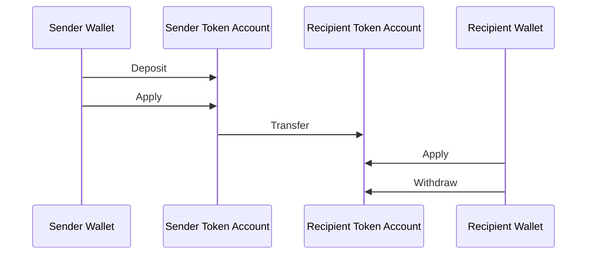
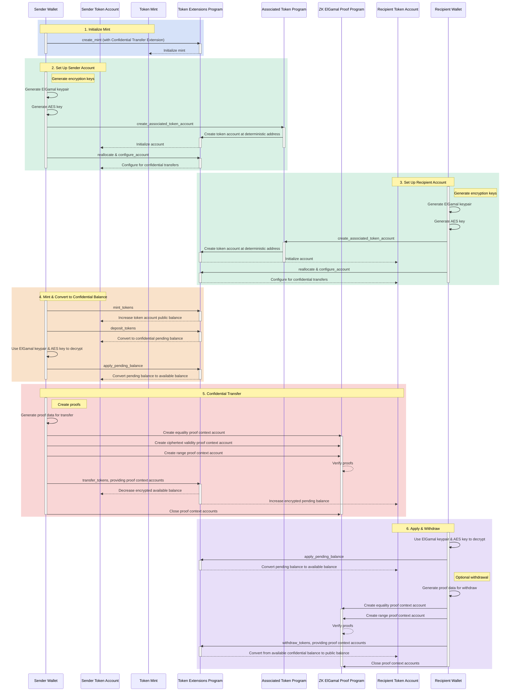

## Que sont les transferts confidentiels ?

<Embed url="https://youtu.be/Bqs95tFcRIU" />

Les transferts confidentiels vous permettent de transférer des jetons entre des
token accounts sans révéler le montant du transfert. Cela est utile pour les
transactions préservant la confidentialité. Seuls les montants des transferts et
les soldes de jetons sont privés. Les adresses des token accounts restent
publiques.

- [Présentation du protocole](https://www.solana-program.com/docs/confidential-balances/overview) -
  Détails sur le protocole cryptographique sous-jacent
- [Guide de démarrage rapide](https://www.solana-program.com/docs/confidential-balances#setup) -
  Configuration et commandes CLI de base
- [Confidential Balances Cookbook](https://github.com/solana-developers/Confidential-Balances-Sample) -
  Extraits de code sur l'utilisation de l'extension Confidential Transfer

### Comment cela fonctionne-t-il ?

L'extension Confidential Transfer ajoute des
[instructions](https://github.com/solana-program/token-2022/blob/efd0c957fefbd79882d77df5fb2dac88c001249c/program/src/extension/confidential_transfer/instruction.rs#L29)
au Token Extensions Program qui vous permet de transférer des jetons entre des
comptes sans révéler le montant du transfert.

Le flux de base des transferts de jetons confidentiels est le suivant :

1. Créer un mint account avec l'extension de transfert confidentiel.
2. Créer des token accounts avec l'extension de transfert confidentiel pour
   l'expéditeur et le destinataire.
3. Émettre des jetons vers le compte de l'expéditeur.
4. **Déposer** le solde public de l'expéditeur dans le **solde en attente
   confidentiel**.
5. **Appliquer** le solde en attente de l'expéditeur au **solde disponible
   confidentiel**.
6. **Transférer** confidentiellement des jetons du token account de l'expéditeur
   au token account du destinataire.
7. **Appliquer** le solde en attente du destinataire au **solde disponible
   confidentiel**.
8. **Retirer** le solde disponible confidentiel du destinataire vers le **solde
   public**.

Pour plus de détails sur les étapes du flux de transfert confidentiel, consultez
les pages correspondantes :

<Cards>
  <Card
    title="Créer un mint account"
    href="/docs/tokens/extensions/confidential-transfer/create-mint"
  >
    Comment créer un mint account avec l'extension Confidential Transfer
  </Card>
  <Card
    title="Créer un token account"
    href="/docs/tokens/extensions/confidential-transfer/create-token-account"
  >
    Comment configurer un token account avec l'extension Confidential Transfer
  </Card>
  <Card
    title="Déposer des jetons"
    href="/docs/tokens/extensions/confidential-transfer/deposit-tokens"
  >
    Comment déposer des jetons dans le solde en attente confidentiel
  </Card>
  <Card
    title="Appliquer le solde en attente"
    href="/docs/tokens/extensions/confidential-transfer/apply-pending-balance"
  >
    Comment appliquer le solde en attente au solde confidentiel disponible
  </Card>
  <Card
    title="Retirer des jetons"
    href="/docs/tokens/extensions/confidential-transfer/withdraw-tokens"
  >
    Comment retirer des jetons du solde confidentiel disponible
  </Card>
  <Card
    title="Transférer des jetons"
    href="/docs/tokens/extensions/confidential-transfer/transfer-tokens"
  >
    Comment transférer confidentiellement des jetons entre des token accounts
  </Card>
  <Card
    title="Guide d'intégration"
    href="/docs/tokens/extensions/confidential-transfer/integration-guide"
  >
    Comment les portefeuilles, explorateurs et exchanges peuvent prendre en
    charge les jetons à transfert confidentiel
  </Card>
  <Card
    title="Guide de l'émetteur"
    href="/docs/tokens/extensions/confidential-transfer/issuer-guide"
  >
    Comment émettre et gérer un jeton à transfert confidentiel (politique
    d'approbation, auditeurs, frais, émission et destruction)
  </Card>
</Cards>

Le diagramme ci-dessous illustre la séquence détaillée du flux de base pour les
transferts de jetons confidentiels :

## Instructions de transfert confidentiel

La liste complète des
[instructions](https://github.com/solana-program/token-2022/blob/efd0c957fefbd79882d77df5fb2dac88c001249c/program/src/extension/confidential_transfer/instruction.rs#L29)
de l'extension de transfert confidentiel est la suivante :

| Instruction                         | Description                                                                                                                                                                            |
| ----------------------------------- | -------------------------------------------------------------------------------------------------------------------------------------------------------------------------------------- |
| _rs`InitializeMint`_                | Configure le mint account pour les transferts confidentiels. Cette instruction doit être incluse dans la même transaction que l'instruction _rs`TokenInstruction::InitializeMint`_.    |
| _rs`UpdateMint`_                    | Met à jour les paramètres de transfert confidentiel pour un mint.                                                                                                                      |
| _rs`ConfigureAccount`_              | Configure un token account pour les transferts confidentiels.                                                                                                                          |
| _rs`ApproveAccount`_                | Approuve un token account pour les transferts confidentiels si le mint exige une approbation pour les nouveaux token accounts.                                                         |
| _rs`EmptyAccount`_                  | Vide les soldes confidentiels en attente et disponibles pour permettre la fermeture d'un token account.                                                                                |
| _rs`Deposit`_                       | Convertit le solde public de jetons en solde confidentiel en attente.                                                                                                                  |
| _rs`Withdraw`_                      | Convertit le solde confidentiel disponible en solde public.                                                                                                                            |
| _rs`Transfer`_                      | Transfère des jetons entre token accounts de manière confidentielle.                                                                                                                   |
| _rs`ApplyPendingBalance`_           | Convertit le solde en attente en solde disponible après des dépôts ou des transferts.                                                                                                  |
| _rs`EnableConfidentialCredits`_     | Permet à un token account de recevoir des transferts de jetons confidentiels.                                                                                                          |
| _rs`DisableConfidentialCredits`_    | Bloque les transferts confidentiels entrants tout en autorisant les transferts publics.                                                                                                |
| _rs`EnableNonConfidentialCredits`_  | Permet à un token account de recevoir des transferts de jetons publics.                                                                                                                |
| _rs`DisableNonConfidentialCredits`_ | Bloque les transferts ordinaires pour que le compte ne reçoive que des transferts confidentiels.                                                                                       |
| _rs`TransferWithFee`_               | Transfère des jetons entre token accounts de manière confidentielle avec des frais.                                                                                                    |
| _rs`ConfigureAccountWithRegistry`_  | Méthode alternative pour configurer des token accounts pour les transferts confidentiels en utilisant un compte _rs`ElGamalRegistry`_ au lieu d'une preuve _rs`VerifyPubkeyValidity`_. |
