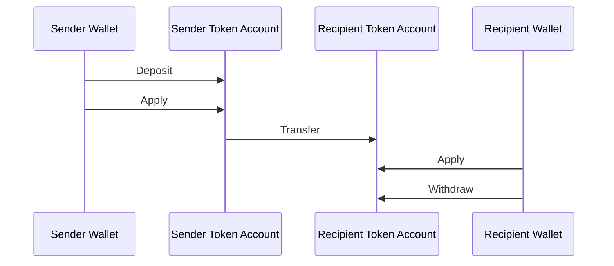
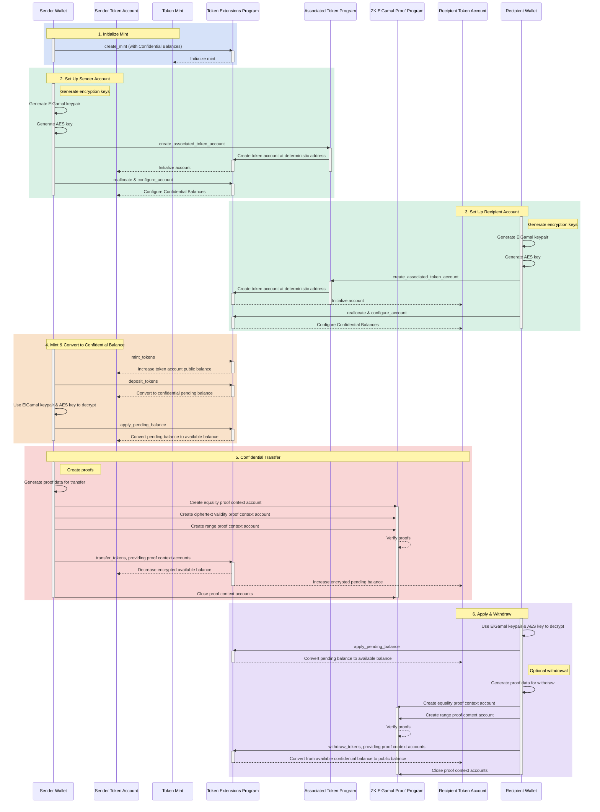

## Que sont les Soldes Confidentiels ?

<Embed url="https://youtu.be/Bqs95tFcRIU" />

Soldes Confidentiels est une extension Token-2022 qui vous permet de transférer des tokens entre token accounts sans révéler le montant du transfert. Cela est utile pour les transactions préservant la confidentialité. Seuls les montants des transferts et les soldes des token accounts sont privés. Les adresses des token accounts restent publiques.

- [Présentation du protocole](https://www.solana-program.com/docs/confidential-balances/overview) -
  Détails sur le protocole cryptographique sous-jacent
- [Guide de démarrage rapide](https://www.solana-program.com/docs/confidential-balances#setup) -
  Configuration et commandes CLI de base
- [Cookbook sur les Soldes Confidentiels](https://github.com/solana-developers/Confidential-Balances-Sample) -
  Extraits de code montrant comment utiliser les Soldes Confidentiels

### Comment cela fonctionne-t-il ?

L'extension Soldes Confidentiels ajoute des
[instructions](https://github.com/solana-program/token-2022/blob/efd0c957fefbd79882d77df5fb2dac88c001249c/program/src/extension/confidential_transfer/instruction.rs#L29)
au Token Extensions Program qui vous permettent de transférer des tokens entre
comptes sans révéler le montant du transfert.

```mermaid title="Confidential Balances Basic Overview"
    sequenceDiagram

    participant A as Sender Wallet
    participant AA as Sender Token Account
    participant BB as Recipient Token Account
    participant B as Recipient Wallet

    A->>AA: Deposit
    A->>AA: Apply

    AA->>BB: Transfer
    B->>BB: Apply

    B->>BB: Withdraw

```

Le flux de base des transferts de jetons confidentiels est le suivant :

1. Créer un mint account avec les Soldes Confidentiels activés.
2. Créer des token accounts avec les Soldes Confidentiels activés pour l'expéditeur et
   le destinataire.
3. Émettre des jetons vers le compte de l'expéditeur.
4. **Déposer** le solde public de l'expéditeur dans le **solde en attente
   confidentiel**.
5. **Appliquer** le solde en attente de l'expéditeur au **solde disponible
   confidentiel**.
6. **Transférer** confidentiellement des jetons du token account de l'expéditeur
   au token account du destinataire.
7. **Appliquer** le solde en attente du destinataire au **solde disponible
   confidentiel**.
8. **Retirer** le solde disponible confidentiel du destinataire vers le **solde
   public**.

### Clés d'auditeur

Un mint account avec Soldes Confidentiels peut stocker une clé publique ElGamal globale optionnelle pour l'auditeur. Lorsqu'elle est configurée, chaque transfert confidentiel inclut le montant chiffré pour l'expéditeur, le destinataire et l'auditeur. La preuve de transfert vérifie que les trois textes chiffrés contiennent le même montant. Le public ne peut toujours pas lire le montant, mais le détenteur de la clé secrète d'auditeur peut déchiffrer les montants des transferts pour ce mint.

L'autorité des Soldes Confidentiels définit la clé d'auditeur lors de l'initialisation de l'extension ou la modifie ultérieurement avec _rs`UpdateMint`_. L'autorité peut effectuer une rotation ou supprimer la clé. Une rotation ne s'applique qu'aux transferts futurs ; conservez donc les clés secrètes antérieures lorsqu'un accès d'audit historique est requis. Les clés d'auditeur fournissent un accès en lecture ; elles n'autorisent pas les transferts de tokens ni ne révèlent le solde confidentiel complet d'un compte.

Pour des exemples de configuration et de rotation, consultez
[Configurer un auditeur](/docs/tokens/extensions/confidential-transfer/issuer-guide#configure-an-auditor).
Les portefeuilles, explorateurs, exchanges et fournisseurs de conformité doivent également consulter les
[recommandations d'intégration pour les auditeurs](/docs/tokens/extensions/confidential-transfer/integration-guide#auditors-and-compliance).

Pour plus de détails sur les étapes du flux de transfert confidentiel, consultez
les pages correspondantes :

<Cards>
  <Card
    title="Créer un mint account"
    href="/docs/tokens/extensions/confidential-transfer/create-mint"
  >
    Comment créer un mint account avec les Soldes Confidentiels activés
  </Card>
  <Card
    title="Créer un token account"
    href="/docs/tokens/extensions/confidential-transfer/create-token-account"
  >
    Comment configurer un token account avec les Soldes Confidentiels activés
  </Card>
  <Card
    title="Déposer des jetons"
    href="/docs/tokens/extensions/confidential-transfer/deposit-tokens"
  >
    Comment déposer des jetons dans le solde en attente confidentiel
  </Card>
  <Card
    title="Appliquer le solde en attente"
    href="/docs/tokens/extensions/confidential-transfer/apply-pending-balance"
  >
    Comment appliquer le solde en attente au solde confidentiel disponible
  </Card>
  <Card
    title="Retirer des jetons"
    href="/docs/tokens/extensions/confidential-transfer/withdraw-tokens"
  >
    Comment retirer des jetons du solde confidentiel disponible
  </Card>
  <Card
    title="Transférer des jetons"
    href="/docs/tokens/extensions/confidential-transfer/transfer-tokens"
  >
    Comment transférer confidentiellement des jetons entre des token accounts
  </Card>
  <Card
    title="Guide d'intégration"
    href="/docs/tokens/extensions/confidential-transfer/integration-guide"
  >
    Comment les portefeuilles, explorateurs et exchanges peuvent prendre en charge les tokens avec Soldes Confidentiels
  </Card>
  <Card
    title="Guide de l'émetteur"
    href="/docs/tokens/extensions/confidential-transfer/issuer-guide"
  >
    Comment émettre et gérer un token avec Soldes Confidentiels (politique d'approbation, auditeurs, frais, mint et burn)
  </Card>
</Cards>

Le diagramme ci-dessous illustre la séquence détaillée du flux de base pour les
transferts de jetons confidentiels :

```mermaid title="Confidential Balances Detailed Overview"
sequenceDiagram
    participant Sender as Sender Wallet
    participant SenderAccount as Sender Token Account
    participant Mint as Token Mint
    participant Token22 as Token Extensions Program
    participant ATAProgram as Associated Token Program
    participant ElGamal as ZK ElGamal Proof Program
    participant RecipientAccount as Recipient Token Account
    participant Recipient as Recipient Wallet

    rect rgba(120, 160, 235, 0.3)
    Note over Sender,Mint: 1. Initialize Mint

    activate Sender
    Sender->>Token22: create_mint (with Confidential Balances)
    activate Token22
    Token22-->>Mint: Initialize mint
    deactivate Token22
    deactivate Sender
    end

    rect rgba(130, 210, 170, 0.3)
    Note over Sender,SenderAccount: 2. Set Up Sender Account

    activate Sender
    Note right of Sender: Generate encryption keys
    Sender->>Sender: Generate ElGamal keypair
    Sender->>Sender: Generate AES key

    Sender->>ATAProgram: create_associated_token_account
    activate ATAProgram
    ATAProgram->>Token22: Create token account at deterministic address
    activate Token22
    Token22-->>SenderAccount: Initialize account
    deactivate Token22
    deactivate ATAProgram

    Sender->>Token22: reallocate & configure_account
    activate Token22
    Token22-->>SenderAccount: Configure Confidential Balances
    deactivate Token22
    deactivate Sender
    end

    rect rgba(130, 210, 170, 0.3)
    Note over Recipient,RecipientAccount: 3. Set Up Recipient Account

    activate Recipient
    Note right of Recipient: Generate encryption keys
    Recipient->>Recipient: Generate ElGamal keypair
    Recipient->>Recipient: Generate AES key

    Recipient->>ATAProgram: create_associated_token_account
    activate ATAProgram
    ATAProgram->>Token22: Create token account at deterministic address
    activate Token22
    Token22-->>RecipientAccount: Initialize account
    deactivate Token22
    deactivate ATAProgram

    Recipient->>Token22: reallocate & configure_account
    activate Token22
    Token22-->>RecipientAccount: Configure Confidential Balances
    deactivate Token22
    deactivate Recipient
    end

    rect rgba(235, 160, 80, 0.3)
    Note over Sender,SenderAccount: 4. Mint & Convert to Confidential Balance

    activate Sender
    Sender->>Token22: mint_tokens
    activate Token22
    Token22-->>SenderAccount: Increase token account public balance
    deactivate Token22

    Sender->>Token22: deposit_tokens
    activate Token22
    Token22-->>SenderAccount: Convert to confidential pending balance
    deactivate Token22

    Sender->>Sender: Use ElGamal keypair & AES key to decrypt
    Sender->>Token22: apply_pending_balance
    activate Token22
    Token22-->>SenderAccount: Convert pending balance to available balance
    deactivate Token22
    deactivate Sender
    end

    rect rgba(235, 120, 120, 0.3)
    Note over Sender,RecipientAccount: 5. Confidential Transfer

    activate Sender
    Note right of Sender: Create proofs
    Sender->>Sender: Generate proof data for transfer

    Sender->>ElGamal: Create equality proof context account
    activate ElGamal
    Sender->>ElGamal: Create ciphertext validity proof context account
    Sender->>ElGamal: Create range proof context account
    ElGamal-->>ElGamal: Verify proofs

    Sender->>Token22: transfer_tokens, providing proof context accounts
    activate Token22
    Token22-->>SenderAccount: Decrease encrypted available balance
    Token22-->>RecipientAccount: Increase encrypted pending balance
    deactivate Token22

    Sender->>ElGamal: Close proof context accounts
    deactivate ElGamal
    deactivate Sender
    end

    rect rgba(180, 150, 235, 0.3)
    Note over Recipient,RecipientAccount: 6. Apply & Withdraw

    activate Recipient
    Recipient->>Recipient: Use ElGamal keypair & AES key to decrypt
    Recipient->>Token22: apply_pending_balance
    activate Token22
    Token22-->>RecipientAccount: Convert pending balance to available balance
    deactivate Token22

    Note right of Recipient: Optional withdrawal
    Recipient->>Recipient: Generate proof data for withdraw

    Recipient->>ElGamal: Create equality proof context account
    activate ElGamal
    Recipient->>ElGamal: Create range proof context account
    ElGamal-->>ElGamal: Verify proofs

    Recipient->>Token22: withdraw_tokens, providing proof context accounts
    activate Token22
    Token22-->>RecipientAccount: Convert from available confidential balance to public balance
    deactivate Token22

    Recipient->>ElGamal: Close proof context accounts
    deactivate ElGamal
    deactivate Recipient
    end
```

## Instructions des Soldes Confidentiels

La liste complète des
[instructions](https://github.com/solana-program/token-2022/blob/efd0c957fefbd79882d77df5fb2dac88c001249c/program/src/extension/confidential_transfer/instruction.rs#L29)
de l'extension Soldes Confidentiels est la suivante :

| Instruction                         | Description                                                                                                                                                       |
| ----------------------------------- | ----------------------------------------------------------------------------------------------------------------------------------------------------------------- |
| _rs`InitializeMint`_                | Active les Soldes Confidentiels sur un mint account. Cette instruction doit être incluse dans la même transaction que l'instruction _rs`TokenInstruction::InitializeMint`_. |
| _rs`UpdateMint`_                    | Met à jour la politique d'approbation des comptes du mint et la clé publique ElGamal globale optionnelle pour l'auditeur.                                                                        |
| _rs`ConfigureAccount`_              | Active les Soldes Confidentiels sur un token account.                                                                                                                 |
| _rs`ApproveAccount`_                | Approuve un token account pour les Soldes Confidentiels si le mint exige une approbation pour les nouveaux token accounts.                                                          |
| _rs`EmptyAccount`_                  | Vide les soldes confidentiels en attente et disponibles pour permettre la fermeture d'un token account.                                                                         |
| _rs`Deposit`_                       | Convertit le solde public de jetons en solde confidentiel en attente.                                                                                                  |
| _rs`Withdraw`_                      | Convertit le solde confidentiel disponible en solde public.                                                                                                   |
| _rs`Transfer`_                      | Transfère des jetons entre token accounts de manière confidentielle.                                                                                                           |
| _rs`ApplyPendingBalance`_           | Convertit le solde en attente en solde disponible après des dépôts ou des transferts.                                                                                      |
| _rs`EnableConfidentialCredits`_     | Permet à un token account de recevoir des transferts de jetons confidentiels.                                                                                                   |
| _rs`DisableConfidentialCredits`_    | Bloque les transferts confidentiels entrants tout en autorisant les transferts publics.                                                                                     |
| _rs`EnableNonConfidentialCredits`_  | Permet à un token account de recevoir des transferts de jetons publics.                                                                                                         |
| _rs`DisableNonConfidentialCredits`_ | Bloque les transferts ordinaires pour que le compte ne reçoive que des transferts confidentiels.                                                                                     |
| _rs`TransferWithFee`_               | Transfère des jetons entre token accounts de manière confidentielle avec des frais.                                                                                                |
| _rs`ConfigureAccountWithRegistry`_  | Méthode alternative pour configurer des token accounts pour les Soldes Confidentiels en utilisant un compte _rs`ElGamalRegistry`_ au lieu d'une preuve _rs`VerifyPubkeyValidity`_.         |
