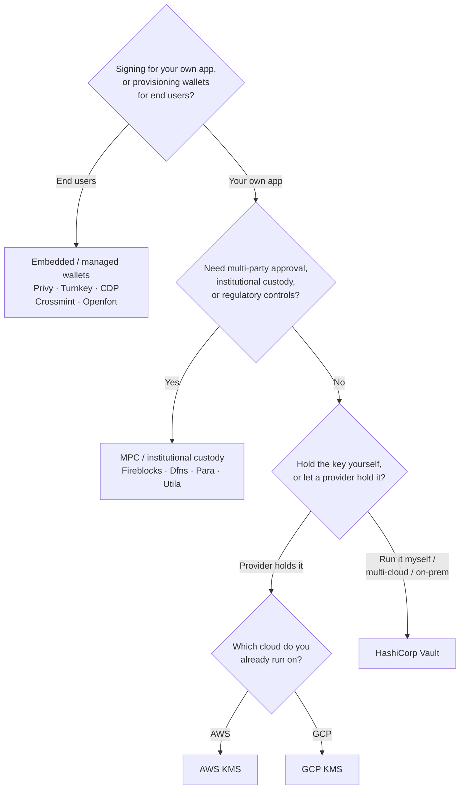

Keychain expose une interface `SolanaSigner` unique pour chaque backend, le
choix est donc opérationnel et non architectural — vous pouvez le modifier
ultérieurement via la configuration. C'est pourquoi **partez de vos besoins, pas
d'un produit.** Deux questions tranchent la plupart des cas : _où réside la clé
privée, et qui est autorisé à valider une signature avec elle ?_

Il n'existe pas de backend universellement optimal. Chacun convient mieux à un
ensemble particulier de contraintes — le cloud sur lequel vous opérez déjà, si
vous souhaitez gérer votre propre infrastructure de clés, et quels contrôles de
garde et d'approbation vous êtes tenus d'avoir. Le flux ci-dessous associe ces
contraintes à un backend.

<Callout type="info">
  Ce guide couvre la signature côté serveur (backend). Lorsque vos utilisateurs
  finaux signent leurs propres transactions dans un navigateur, utilisez plutôt
  un portefeuille via le Wallet Standard — voir [Signature en
  production](/docs/core/transactions/signing-in-production).
</Callout>

## Arbre de décision

<Callout type="info">
  Le développement local et les tests n'en ont pas besoin — utilisez le backend
  **Memory** pour le prototypage, puis basculez vers l'un des backends de
  production ci-dessus via la configuration.
</Callout>

## Parcourir les questions

<Steps>

<Step>

### Signez-vous pour votre propre application ou pour vos utilisateurs finaux ?

Si vous provisionnez des portefeuilles dont les **utilisateurs finaux** sont
propriétaires et qu'ils gèrent (applications grand public, flux d'intégration),
utilisez un backend de portefeuille **intégré / géré** — Privy, Turnkey, CDP,
Crossmint ou Openfort. Ces solutions gèrent les portefeuilles par utilisateur et
l'authentification en votre nom.

Si vous signez en tant que **votre propre application** — un payeur de frais,
une trésorerie, une automatisation backend — continuez ci-dessous.

</Step>

<Step>

### Avez-vous besoin d'une approbation multi-parties, d'une garde institutionnelle ou de contrôles réglementaires ?

Si les signatures doivent passer par une politique d'approbation, une limite de
dépenses ou un workflow de conformité avant d'être produites — ou si vous avez
besoin d'un dépositaire réglementé détenant les clés — utilisez un backend **MPC
/ garde institutionnelle** : Fireblocks, Dfns, Para ou Utila. Ces solutions
partagent ou conservent la clé et co-signent selon votre politique.

Si vous avez uniquement besoin d'une clé qui signe à la demande, continuez
ci-dessous.

</Step>

<Step>

### Souhaitez-vous conserver la clé vous-même, ou la confier à un fournisseur ?

Si un fournisseur cloud doit détenir la clé dans une infrastructure sécurisée
par matériel et que votre politique IAM contrôle qui peut signer, utilisez le
KMS de ce cloud :

- **Déployé sur AWS** → AWS KMS
- **Déployé sur GCP** → GCP KMS

Si vous souhaitez gérer vous-même l'infrastructure de clés — ou si vous êtes
multi-cloud ou sur site — utilisez **HashiCorp Vault**. Vous l'exécutez et
l'auditez vous-même ; la clé reste dans le moteur Transit et signe à la demande.

</Step>

</Steps>

## Modèles de garde

Les backends se regroupent en cinq modèles de garde. Le flux ci-dessus vous mène
à l'un d'eux.

- **Auto-garde (in-process)** — votre application détient la clé privée brute.
  Pratique pour le développement, mais inadapté à la production. Backend :
  **Memory**.
- **Gestion de clés auto-hébergée** — vous gérez l'infrastructure de clés ; la
  clé y reste et signe à la demande. Backend : **HashiCorp Vault**.
- **Cloud KMS / HSM** — un fournisseur cloud stocke la clé dans une
  infrastructure sécurisée par matériel ; la clé ne quitte jamais le service et
  votre politique IAM contrôle qui peut signer. Backends : **AWS KMS**, **GCP
  KMS**.
- **MPC & garde institutionnelle** — la clé est partagée ou conservée par un
  fournisseur, qui co-signe selon votre politique (approbations, limites).
  Backends : **Fireblocks**, **Dfns**, **Para**, **Utila**.
- **Portefeuilles embarqués & gérés** — un fournisseur gère les portefeuilles en
  votre nom, souvent pour l'intégration des utilisateurs finaux. Backends :
  **Privy**, **Turnkey**, **CDP**, **Crossmint**, **Openfort**.

## Comparaison des backends

| Backend         | Modèle de garde                | Idéal pour                                                             | Remarques                                                   |
| --------------- | ------------------------------ | ---------------------------------------------------------------------- | ----------------------------------------------------------- |
| Memory          | Auto-garde (in-process)        | Développement local, tests, CI                                         | Clé brute dans le processus — ne pas utiliser en production |
| HashiCorp Vault | Gestion de clés auto-hébergée  | Équipes gérant leur propre infrastructure de clés                      | Moteur Transit ; vous l'exploitez et l'auditez              |
| AWS KMS         | KMS cloud / HSM                | Backends s'exécutant sur AWS                                           | La clé ne quitte jamais le KMS ; IAM contrôle la signature  |
| GCP KMS         | KMS cloud / HSM                | Backends s'exécutant sur GCP                                           | La clé ne quitte jamais le KMS ; IAM contrôle la signature  |
| Fireblocks      | Garde MPC / institutionnelle   | Trésoreries, exchanges, garde réglementée                              | Moteur de politique et workflows d'approbation              |
| Dfns            | Infrastructure de wallets MPC  | Wallets programmatiques avec contrôles de politique                    | Signature Ed25519                                           |
| Para            | Wallets MPC                    | Applications souhaitant des wallets MPC                                | Clé API + ID de wallet                                      |
| Utila           | Garde MPC + co-signataire      | Wallets Solana gérés par Utila                                         | `signMessage` non pris en charge ; vous diffusez la tx      |
| Privy           | Wallets intégrés               | Applications grand public embarquant des utilisateurs vers des wallets | Wallets intégrés gérés par l'application                    |
| Turnkey         | Gestion de clés non-custodiale | Signature programmatique avec contrôle de politique                    | Gestion de clés non-custodiale                              |
| CDP             | Wallet géré (Coinbase)         | Applications sur la plateforme développeur Coinbase                    | `signMessage` accepte uniquement les charges utiles UTF-8   |
| Crossmint       | Wallets gérés                  | Marketplaces et applications à wallets gérés                           | Wallets `smart` et `mpc` ; `signMessage` non pris en charge |
| Openfort        | Wallets backend intégrés       | Wallets côté serveur                                                   | Clés stockées dans un TEE                                   |

## Scénarios d'entreprise

Une seule application a souvent besoin de plusieurs de ces éléments
simultanément. Comme l'interface est identique, vous pouvez utiliser un backend
différent par rôle sans modifier les points d'appel.

- **Opérations de trésorerie** — séparez un signataire opérationnel « chaud »
  d'un signataire de trésorerie « froid ». Protégez la trésorerie avec un
  service MPC ou un HSM cloud et exigez des politiques d'approbation avant les
  signatures de haute valeur.
- **Flux d'approbation** — les backends MPC et de conservation (ex. Fireblocks)
  imposent une approbation multi-parties avant qu'une signature soit produite.
- **Conformité et audit** — les KMS cloud (AWS/GCP) et Vault émettent des
  journaux d'audit de signature ; les dépositaires institutionnels ajoutent
  l'application des politiques et le reporting.
- **Environnements réglementés** — conservez le matériel de clé dans un HSM, un
  KMS ou un dépositaire institutionnel afin que les clés brutes ne touchent
  jamais votre application.

Consultez les
[Meilleures pratiques en production](/docs/tools/keychain/production-best-practices)
pour exploiter ces backends en toute sécurité.

<Cards>
  <Card title="Guide Rust" href="/docs/tools/keychain/getting-started/rust">
    Configurez chaque backend en Rust.
  </Card>
  <Card
    title="Guide TypeScript"
    href="/docs/tools/keychain/getting-started/typescript"
  >
    Configurez chaque backend en TypeScript.
  </Card>
</Cards>
