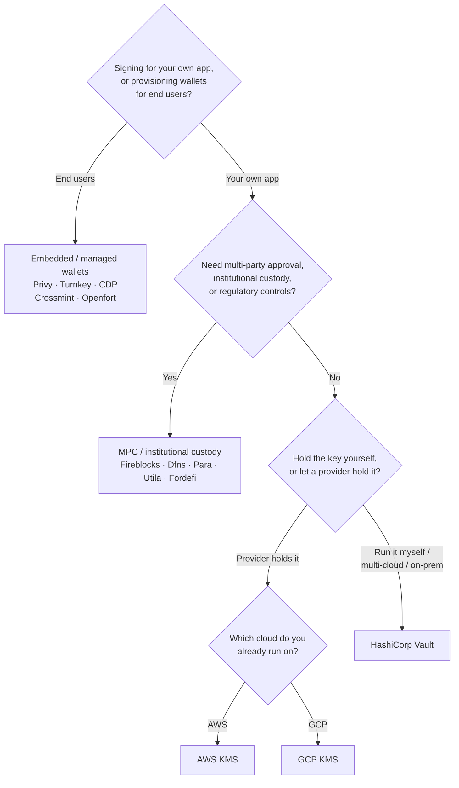

Keychain expose une interface de base `SolanaSigner` unique pour tous les backends, de sorte que, pour la plupart d'entre eux, le choix est opérationnel et non architectural : vous pouvez en changer plus tard via la configuration. L'exception concerne la forme de la transaction. Crossmint et le mode auto natif de Fordefi signent et diffusent côté serveur, et le mode manuel natif de Fordefi réécrit la transaction avant de la signer ; passer à l'un d'eux, ou le quitter, modifie donc la manière dont vous appelez le signataire. Pour cette raison, **partez de vos besoins, et non d'un produit.** Deux questions déterminent l'essentiel du choix : _où se trouve la clé privée, et qui est autorisé à valider une signature avec celle-ci ?_

Tous les backends, à l'exception de Ledger, sont disponibles dans les quatre langages (Rust, TypeScript, Python et Go). Ledger est uniquement disponible en Rust, via la fonctionnalité optionnelle `ledger`.

Il n'existe pas de meilleur backend dans l'absolu. Chacun convient mieux à un ensemble particulier de contraintes : le cloud sur lequel vous êtes déjà, votre volonté d'exploiter vous-même une infrastructure de clés, et les contrôles de custody et d'approbation qui vous sont imposés. Le schéma ci-dessous associe ces contraintes à un backend.

<Callout type="info">
  Ce guide traite de la signature côté backend (serveur). Lorsque vos utilisateurs finaux signent eux-mêmes leurs transactions dans un navigateur, utilisez plutôt un wallet via le Wallet Standard. Consultez [Signer en production](/docs/core/transactions/signing-in-production).
</Callout>

## Arbre de décision

```mermaid title="Choosing a Keychain backend"
flowchart TD
    Start{Signing for your own app,<br/>or provisioning wallets<br/>for end users?}
    Start -->|End users| Managed[Embedded / managed wallets<br/>Privy · Turnkey · CDP<br/>Crossmint · Openfort]
    Start -->|Your own app| Q2{Need multi-party approval,<br/>institutional custody,<br/>or regulatory controls?}
    Q2 -->|Yes| MPC[MPC / institutional custody<br/>Fireblocks · Dfns · Para · Utila · Fordefi]
    Q2 -->|No| Q3{Hold the key yourself,<br/>or let a provider hold it?}
    Q3 -->|Provider holds it| Q4{Which cloud do you<br/>already run on?}
    Q4 -->|AWS| AWS[AWS KMS]
    Q4 -->|GCP| GCP[GCP KMS]
    Q3 -->|Run it myself /<br/>multi-cloud / on-prem| Vault[HashiCorp Vault]
```

<Callout type="info">
  Le développement local et les tests n'ont besoin de rien de tout cela : utilisez le backend **Memory** pour le prototypage, puis passez à l'un des backends de production ci-dessus via la configuration.
</Callout>

## Parcourir les questions

<Steps>

<Step>

### Signez-vous pour votre propre application ou pour vos utilisateurs finaux ?

Si vous provisionnez des wallets que des **utilisateurs finaux** possèdent et utilisent (applications grand public, parcours d'onboarding), utilisez un backend de **wallet intégré / géré** : Privy, Turnkey, CDP, Crossmint ou Openfort. Ils gèrent pour vous les wallets par utilisateur ainsi que l'authentification.

Si vous signez en tant que **votre propre application** (fee payer, trésorerie, automatisation backend), poursuivez ci-dessous.

</Step>

<Step>

### Avez-vous besoin d'une approbation multipartite, d'une custody institutionnelle ou de contrôles réglementaires ?

Si les signatures doivent passer par une politique d'approbation, une limite de dépenses ou un workflow de conformité avant d'être produites, ou si vous avez besoin d'un dépositaire réglementé qui conserve les clés, utilisez un backend de **MPC / custody institutionnelle** : Fireblocks, Dfns, Para, Utila ou Fordefi. Ces solutions fractionnent ou conservent la clé et cosignent conformément à votre politique.

Si vous avez simplement besoin d'une clé qui signe à la demande, poursuivez ci-dessous.

</Step>

<Step>

### Souhaitez-vous détenir la clé vous-même ou la confier à un fournisseur ?

Si un fournisseur cloud doit détenir la clé dans une infrastructure adossée à du matériel et que votre politique IAM contrôle qui peut signer, utilisez le KMS de ce cloud :

- **Si vous êtes sur AWS** → AWS KMS
- **Si vous êtes sur GCP** → GCP KMS

Si vous souhaitez exploiter vous-même l'infrastructure de clés, ou si vous êtes multi-cloud ou on-prem, utilisez **HashiCorp Vault**. Vous l'exploitez et l'auditez ; la clé reste dans le moteur Transit et signe à la demande.

</Step>

</Steps>

## Modèles de garde

Les backends se répartissent en six modèles de custody. Le schéma ci-dessus vous oriente vers l'un d'eux.

- **Auto-custody (in-process)** : votre application détient la clé privée brute. Pratique pour le développement, mais inadapté à la production. Backend : **Memory**.
- **Auto-custody (hardware wallet)** : la clé ne quitte jamais l'appareil Ledger, et une personne confirme chaque signature sur son écran. Adapté à la signature interactive par un opérateur, pas aux services sans surveillance. Rust uniquement, optionnel et non couvert par l'audit. Backend : **Ledger**.
- **Gestion de clés auto-hébergée** : vous exploitez l'infrastructure de clés ; la clé y reste et signe à la demande. Backend : **HashiCorp Vault**.
- **KMS cloud / HSM** : un fournisseur cloud stocke la clé dans une infrastructure adossée à du matériel ; la clé ne quitte jamais le service et votre politique IAM contrôle qui peut signer. Backends : **AWS KMS**, **GCP KMS**.
- **MPC et custody institutionnelle** : la clé est fractionnée ou conservée par un fournisseur, qui cosigne conformément à votre politique (approbations, limites). Backends : **Fireblocks**, **Dfns**, **Para**, **Utila**, **Fordefi**.
- **Wallets intégrés et gérés** : un fournisseur gère des wallets en votre nom, souvent pour l'onboarding d'utilisateurs finaux. Backends : **Privy**, **Turnkey**, **CDP**, **Crossmint**, **Openfort**.

## Comparaison des backends

| Backend         | Modèle de garde                  | Idéal pour                                     | Remarques                                                                                                              |
| --------------- | ------------------------------ | -------------------------------------------- | ------------------------------------------------------------------------------------------------------------------ |
| Memory          | Auto-garde (in-process)      | Développement local, tests, CI                 | Clé brute dans le processus ; à ne pas utiliser en production                                                                       |
| Ledger          | Auto-custody (hardware wallet) | Signature interactive par un opérateur depuis des outils Rust | Rust uniquement, fonctionnalité optionnelle `ledger`, non audité ; chaque signature est confirmée sur l'appareil                                 |
| HashiCorp Vault | Gestion de clés auto-hébergée     | Équipes gérant leur propre infrastructure de clés   | Moteur Transit ; vous l'exploitez et l'auditez                                                                           |
| AWS KMS         | KMS cloud / HSM                | Backends fonctionnant sur AWS                      | La clé ne quitte jamais KMS ; IAM contrôle la signature                                                                         |
| GCP KMS         | KMS cloud / HSM                | Backends fonctionnant sur GCP                      | La clé ne quitte jamais KMS ; IAM contrôle la signature                                                                         |
| Fireblocks      | Garde MPC / institutionnelle    | Trésoreries, exchanges, garde réglementée     | Moteur de politiques et workflows d'approbation                                                                               |
| Dfns            | Infrastructure de wallets MPC      | Wallets programmatiques avec contrôles de politique    | Signature Ed25519                                                                                                    |
| Para            | Wallets MPC                    | Applications souhaitant des wallets adossés à MPC            | Clé API + ID de wallet                                                                                                |
| Utila           | Garde MPC + co-signataire        | Wallets Solana gérés par Utila        | `signMessage` non pris en charge ; vous diffusez la tx                                                                    |
| Fordefi         | Garde MPC / institutionnelle    | Garde institutionnelle avec contrôles de politique   | Boîte noire : vous envoyez. Auto natif : Fordefi réécrit et envoie. Manuel natif : Fordefi réécrit, vous envoyez le résultat |
| Privy           | Wallets intégrés               | Applications grand public intégrant des wallets    | Wallets intégrés gérés par l'application                                                                                       |
| Turnkey         | Gestion de clés non-custodiale   | Signature programmatique avec contrôle de politique           | Gestion de clés non-custodiale                                                                                       |
| CDP             | Wallet géré (Coinbase)      | Applications sur la plateforme développeur Coinbase      | `signMessage` accepte uniquement les charges utiles UTF-8                                                                          |
| Crossmint       | Wallets gérés                | Marketplaces et applications à wallets gérés         | Envoi uniquement : diffuse côté serveur, peut réécrire pour le parrainage du gas ; `signMessage` non pris en charge                   |
| Openfort        | Wallets backend intégrés       | Wallets côté serveur                          | Clés stockées dans un TEE                                                                                                    |

## Forme des capacités

Au-delà de la custody, chaque backend a une forme de transaction unique, qui détermine la manière dont vous appelez le signataire :

- **Signer** : le fournisseur signe les octets que vous avez construits et vous les diffusez. La plupart des backends, dont Ledger et le mode boîte noire de Fordefi.
- **Réécrire et signer** : le fournisseur réécrit la transaction, puis la signe sans la diffuser. Poursuivez à partir de la transaction renvoyée. Mode manuel natif de Fordefi.
- **Signer et diffuser** : le fournisseur signe et diffuse côté serveur ; un échec ne signifie donc pas que rien n'a été enregistré. Crossmint et mode auto natif de Fordefi.

Le tableau des capacités des signataires dans le README de chaque langage indique la forme de chaque backend ; le
[modèle de sécurité](https://github.com/solana-foundation/solana-keychain/blob/main/docs/SECURITY_MODEL.md)
explique ce que chaque forme garantit.

## Scénarios d'entreprise

Une même application a souvent besoin de plusieurs de ces options à la fois. Comme l'interface est partagée, vous pouvez exécuter un backend différent par rôle sans modifier les sites d'appel, tant que les backends partagent la même forme de capacités.

- **Opérations de trésorerie** — séparez un signataire opérationnel « chaud »
  d'un signataire de trésorerie « froid ». Protégez la trésorerie avec une
  conservation MPC ou un HSM cloud et exigez des politiques d'approbation avant
  les signatures de haute valeur.
- **Flux d'approbation** — les backends MPC et de conservation (ex. Fireblocks)
  imposent une approbation multi-parties avant qu'une signature soit produite.
- **Conformité et audit** — les KMS cloud (AWS/GCP) et Vault émettent des
  journaux d'audit de signature ; les dépositaires institutionnels ajoutent
  l'application des politiques et les rapports.
- **Environnements réglementés** — conservez le matériel de clé dans un HSM, un
  KMS ou un dépositaire institutionnel afin que les clés brutes ne touchent
  jamais votre application.

Consultez
[Bonnes pratiques de production](/docs/tools/keychain/production-best-practices)
pour exploiter ces backends en toute sécurité.

<Cards>
  <Card title="Guide Rust" href="/docs/tools/keychain/getting-started/rust">
    Configurez chaque backend en Rust.
  </Card>
  <Card
    title="Guide TypeScript"
    href="/docs/tools/keychain/getting-started/typescript"
  >
    Configurez chaque backend en TypeScript.
  </Card>
</Cards>
