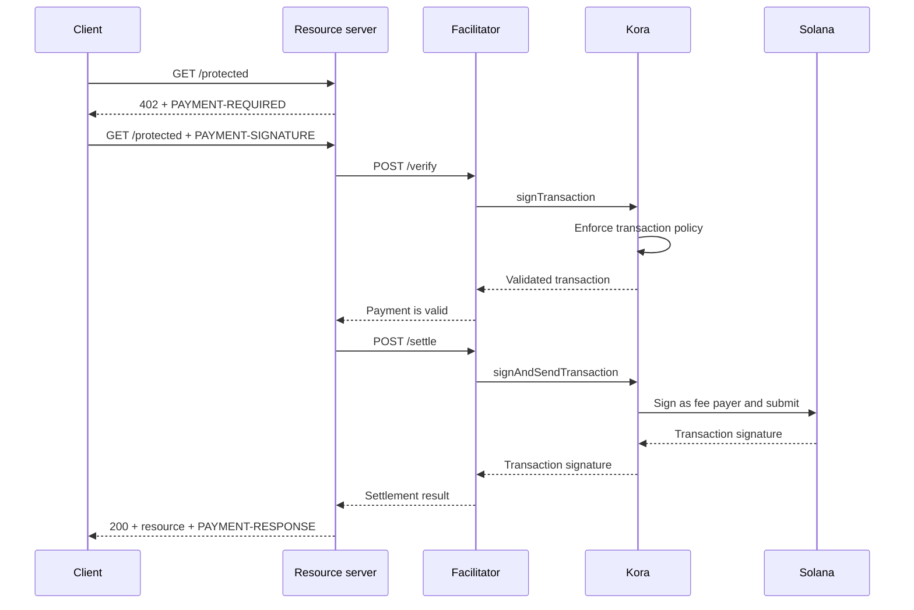

Kora peut fournir la couche de signature Solana, de politique de transaction et de parrainage des frais derrière un [facilitateur x402 V2](/docs/tools/x402-facilitator). Le facilitateur implémente l'API HTTP x402 ; Kora valide, signe et envoie les transactions de paiement qu'il accepte.

Ce guide démarre le facilitateur Kora de référence sur Solana Devnet. Il s'agit d'un environnement de développement destiné à tester l'intégration, et non d'un déploiement en production.

## Architecture



Les quatre rôles applicatifs restent distincts :

- Le **client** sélectionne une exigence de paiement et signe l'autorisation de paiement.
- Le **serveur de ressources** fixe le prix d'une route et ne l'exécute qu'après vérification et règlement réussis.
- Le **facilitateur** expose les points de terminaison `/supported`, `/verify` et `/settle` de x402.
- **Kora** ne signe que les transactions autorisées par sa politique et peut parrainer leurs frais de réseau Solana.

Kora ne remplace pas le protocole x402. Il constitue la frontière de signature et de politique utilisée par cette implémentation de facilitateur.

## Démarrer le facilitateur de référence

Vous avez besoin de Git et de [Docker avec Compose](https://docs.docker.com/compose/). Clonez la dernière version stable de Kora et accédez à la démo x402 :

```bash
git clone --branch v2.0.5 --depth 1 https://github.com/solana-foundation/kora.git
cd kora/examples/x402/demo
cp .env.example .env
```

Définissez `KORA_PRIVATE_KEY` dans `.env` avec un keypair Devnet jetable. La configuration du signataire de la démo accepte un secret en base58, un keypair sous forme de tableau d'octets, ou le chemin vers un fichier keypair JSON. Approvisionnez son adresse publique en SOL Devnet afin qu'il puisse parrainer les frais de transaction.

<Callout type="caution" title="Utilisez un signataire Devnet jetable">
  La démo Docker charge le signataire Kora depuis une variable d'environnement. Ne placez pas de clé de signature de production dans cette démo et ne commitez pas le fichier `.env`.
</Callout>

Démarrez Kora et le facilitateur :

```bash
docker compose up --build
```

La première compilation peut prendre plusieurs minutes. Lorsque les deux vérifications de santé réussissent, inspectez les capacités annoncées par le facilitateur depuis un autre terminal :

```bash
curl http://127.0.0.1:3000/supported
```

La réponse doit annoncer la version x402 `2`, le schéma `exact` et l'identifiant réseau CAIP-2 du Devnet :

```json
{
  "kinds": [
    {
      "x402Version": 2,
      "scheme": "exact",
      "network": "solana:EtWTRABZaYq6iMfeYKouRu166VU2xqa1",
      "extra": {
        "feePayer": "<KORA_SIGNER_ADDRESS>"
      }
    }
  ]
}
```

Kora écoute sur `127.0.0.1:8080` et le facilitateur écoute sur `127.0.0.1:3000` par défaut. Arrêtez la démo avec `Ctrl+C`.

## Connecter un serveur de ressources

Configurez le serveur de ressources x402 pour utiliser le facilitateur local et l'adresse publique du signataire Kora comme destinataire :

```bash
FACILITATOR_URL=http://127.0.0.1:3000
SOLANA_PAY_TO=<KORA_SIGNER_ADDRESS>
```

Suivez ensuite [x402 sur Solana](/docs/payments/agentic-payments/x402) pour ajouter le middleware x402 V2 à une route Express. Une requête non payée reçoit `PAYMENT-REQUIRED`, la nouvelle tentative transporte `PAYMENT-SIGNATURE`, et une réponse réussie transporte `PAYMENT-RESPONSE`.

Ne copiez pas les exemples qui utilisent `X-PAYMENT`, `X-PAYMENT-RESPONSE` ou le nom de réseau `solana-devnet`. Ces champs appartiennent à x402 V1.

Le dépôt Kora inclut également une API protégée et un client sensible aux paiements dans le même répertoire `examples/x402/demo`. Utilisez ces applications lorsque vous avez besoin d'exercer le flux local complet.

## Configurer la politique Kora

Le fichier `kora/kora.toml` de référence est intentionnellement restrictif. Sa politique de validation contrôle :

- les programmes Solana que le signataire autorise ;
- les mints de tokens SPL pouvant être utilisés ;
- le nombre maximum de lamports parrainés et le nombre de signatures ;
- les opérations du payeur de frais qui sont interdites ; et
- les extensions Token-2022 qui sont rejetées.

La démo n'active que les méthodes RPC Kora dont son facilitateur a besoin : `signTransaction`, `signAndSendTransaction`, `getBlockhash`, `getPayerSigner`, `getConfig` et `getVersion`.

Traitez la politique comme la frontière de sécurité pour la clé du payeur de frais. Pour un service en production :

1. N'autorisez que les programmes, mints de tokens et formes de transaction que votre schéma x402 produit.
2. Refusez les transferts, les changements d'autorité, la fermeture de comptes et toute autre instruction pouvant déplacer de la valeur depuis le signataire Kora.
3. Définissez des limites de transaction et d'utilisation qui bornent la perte en cas de compromission d'une accréditation du facilitateur.
4. Utilisez un backend de signataire géré plutôt qu'une clé privée stockée dans une variable d'environnement.

## Sécuriser la connexion facilitateur-Kora

La démo active l'authentification par clé API de Kora. Le facilitateur envoie la valeur de `KORA_API_KEY`, qui doit correspondre à `[kora.auth].api_key` dans `kora.toml`.

Pour la production, également :

- maintenez Kora sur un réseau privé et terminez le TLS à une frontière de confiance ;
- stockez les accréditations API dans un gestionnaire de secrets et effectuez une rotation régulière ;
- envisagez l'authentification des requêtes HMAC de Kora pour la protection contre les altérations et les rejeux ;
- séparez les clés du payeur de frais et du destinataire du paiement lorsque votre modèle comptable l'exige ; et
- alertez sur les rejets de politique, les échecs de règlement, la consommation de frais et le solde du signataire.

## Renforcer le règlement des paiements

Kora valide la transaction Solana, mais le facilitateur et le serveur de ressources restent responsables de la conformité au protocole x402. Avant de servir une ressource, vérifiez :

- la version x402 sélectionnée, le schéma, le réseau, l'actif, le montant et le destinataire ;
- la durée de vie de l'autorisation et la disposition exacte des instructions Solana ;
- la protection atomique contre les rejeux et le règlement idempotent ;
- la confirmation au niveau d'engagement requis par le produit ; et
- une correspondance durable entre l'achat, le résultat du règlement et l'exécution.

Ne renvoyez pas de contenu payant simplement parce que Kora a accepté une transaction pour signature. N'exécutez qu'après que le facilitateur a retourné un résultat de règlement réussi.

## Ressources associées

- [Dépôt Kora et démo x402](https://github.com/solana-foundation/kora/tree/main/examples/x402/demo)
- [Configuration de l'opérateur Kora](/docs/tools/kora/operators/configuration)
- [Backends de signataire Kora](/docs/tools/kora/operators/signers)
- [Audits de sécurité Kora](/docs/tools/kora/security-audits)
- [Spécification x402 V2](https://github.com/x402-foundation/x402/blob/main/specs/x402-specification-v2.md)
- [Présentation des paiements agentiques](/docs/payments/agentic-payments)
