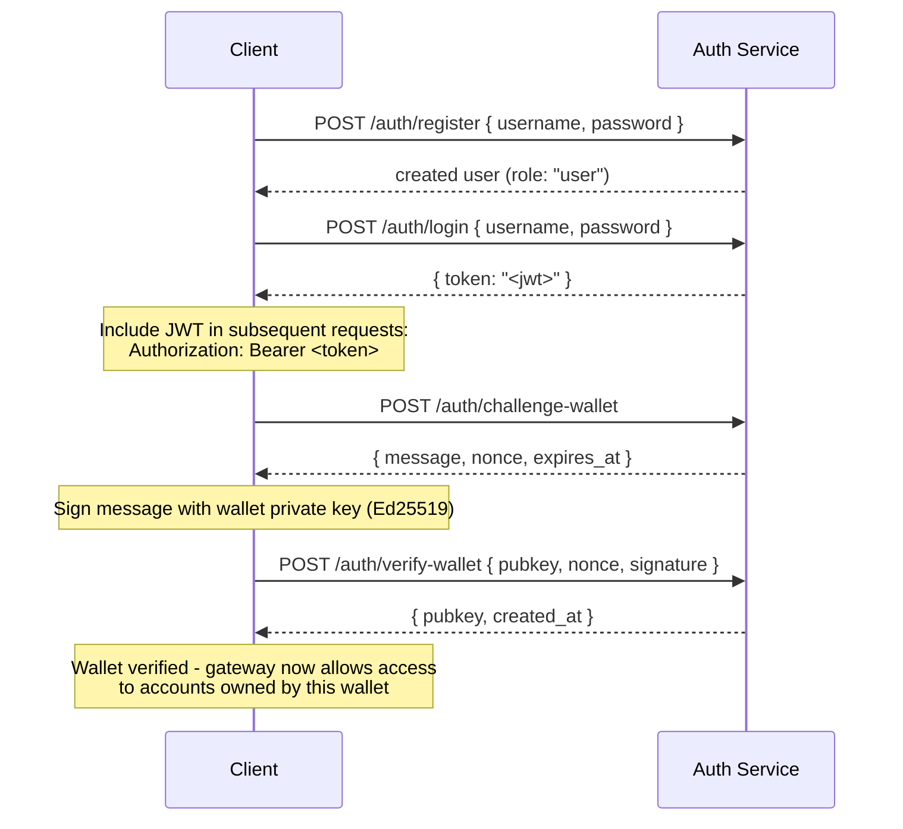

## Vue d'ensemble

Private Channels inclut un service d'authentification optionnel qui contrôle l'accès à la passerelle via l'authentification JWT et le contrôle d'accès basé sur les rôles (RBAC). Lorsque l'authentification est désactivée, la passerelle accepte toutes les connexions. Lorsqu'elle est activée, les clients doivent présenter un JWT valide dans chaque requête.

Cette page s'adresse aux deux types d'utilisateurs :

- **Développeurs** - inscription, connexion, vérification de portefeuille et envoi de requêtes authentifiées
- **Opérateurs** - activation du service d'authentification, configuration de `JWT_SECRET` et attribution du rôle `operator`

## Activation de l'authentification

L'authentification est activée en définissant `JWT_SECRET` (non vide) à la fois sur la passerelle et sur le service d'authentification. Le service d'authentification nécessite également `AUTH_DATABASE_URL`.

Lorsque `JWT_SECRET` n'est pas défini, la passerelle fonctionne en mode ouvert ; aucun token n'est requis.

> **Docker Compose :** Le service d'authentification est un profil Docker Compose et **n'est pas
> démarré par défaut**. Pour l'inclure, passez `--profile auth` à votre commande
> `docker compose`, en ajoutant `--env-file .env` afin que les secrets tels que
> `JWT_SECRET` et `POSTGRES_PASSWORD` soient correctement résolus (Compose désactive son
> chargement automatique de `.env` dès qu'un flag `--env-file` est passé) :
>
> ```bash
> docker compose -f docker-compose.devnet.yml --env-file versions.env --env-file .env.devnet --env-file .env --profile auth up -d
> ```

## API du service d'authentification

Tous les points de terminaison sont sous `/auth`. Le service d'authentification écoute sur `AUTH_PORT`
(par défaut `8903`).

### `POST /auth/register`

Créer un nouveau compte. Tous les utilisateurs sont enregistrés avec le rôle `user`.

```json
{ "username": "alice", "password": "hunter2" }
```

- Nom d'utilisateur : 5 à 32 caractères, alphanumériques plus `_` et `-`
- Mot de passe : 6 à 128 caractères
- Retourne l'utilisateur créé ; le mot de passe n'est jamais retourné

### `POST /auth/login`

Authentifiez-vous et recevez un JWT signé valide pendant 24 heures.

```json
{ "username": "alice", "password": "hunter2" }
```

Retourne `{ "token": "<jwt>" }`. Un nom d'utilisateur ou un mot de passe incorrect retourne
`401` afin d'éviter l'énumération des noms d'utilisateur.

### `POST /auth/challenge-wallet`

Demander un défi de signature pour prouver la propriété d'un portefeuille Solana. Nécessite un JWT valide.

Retourne un message, un nonce et une expiration. Le défi expire dans 10 minutes.

```json
{
  "message": "PrivateChannel wallet verification\nuser: <uuid>\nnonce: <uuid>\nexpires: <unix>",
  "nonce": "<uuid>",
  "expires_at": "<iso8601>"
}
```

### `POST /auth/verify-wallet`

Soumettre le défi signé pour enregistrer un portefeuille comme vérifié. Nécessite un JWT valide.

```json
{
  "pubkey": "<base58 pubkey>",
  "nonce": "<uuid from challenge>",
  "signature": "<base58 Ed25519 signature>"
}
```

Le service reconstruit le message du défi, vérifie la signature Ed25519 et enregistre le portefeuille. Chaque nonce ne peut être consommé qu'une seule fois ; les rejeux sont rejetés.

Retourne `{ "pubkey": "<base58>", "created_at": "<iso8601>" }`.

### `GET /auth/wallets`

Lister tous les portefeuilles vérifiés de l'utilisateur authentifié. Nécessite un JWT valide.

### `DELETE /auth/wallets/{pubkey}`

Supprimer un portefeuille vérifié du compte de l'utilisateur authentifié. Nécessite un JWT valide.

### `GET /health`

Vérification de disponibilité. Retourne `200 ok`. Aucune authentification requise.

## Structure du JWT

Les tokens utilisent l'algorithme HS256 et expirent 24 heures après leur émission.

| Claim  | Valeur                           |
| ------ | ------------------------------- |
| `sub`  | UUID de l'utilisateur                       |
| `role` | `"user"` ou `"operator"`        |
| `iss`  | `"private-channel-auth"`        |
| `aud`  | `"private-channel-gateway"`     |
| `exp`  | Horodatage Unix (24h après émission) |

> `iss` et `aud` sont présents dans le payload du JWT mais sont validés par la
> configuration JWT de la passerelle, et non désérialisés dans la structure des claims applicatifs.
> Le code applicatif n'a accès qu'à `sub`, `role` et `exp`.

Passez le token dans l'en-tête `Authorization` :

```
Authorization: Bearer <JWT_TOKEN>
```

## Rôles

### user

Rôle par défaut à l'inscription.

- L'accès est limité aux portefeuilles vérifiés appartenant à l'utilisateur
- Bloqué pour : `getBlock`, `getTransaction`, `simulateTransaction`
- Peut : appeler `Deposit` sur l'Escrow Program, initier des retraits via
  `WithdrawFunds`

### operator

Rôle élevé. Doit être attribué directement ; il n'existe pas de chemin en libre-service pour passer de `user` à `operator`.

**Attribuer le rôle**, soit via l'Admin CLI (`private-channel-auth-admin`) :

```bash
private-channel-auth-admin set-role --username alice --role operator
```

ou avec du SQL direct :

<Callout type="warning">
  Il s'agit d'une opération de base de données privilégiée. Restreignez l'accès à la base de données du service d'authentification en conséquence et auditez tout changement de rôle.
</Callout>

```sql
UPDATE private_channel_auth.users SET role = 'operator' WHERE username = 'alice';
```

**Enregistrer un portefeuille sans le flux de vérification automatique (Admin CLI,
`private-channel-auth-admin`) :**

```bash
private-channel-auth-admin attach-wallet --username alice --pubkey <base58-pubkey>
```

Cette commande insère directement un portefeuille vérifié dans la table `verified_wallets`, en contournant le flux challenge/verify. Elle applique une contrainte d'unicité sur `(user_id, pubkey)`. Elle n'accorde **pas** le rôle `operator` en elle-même ; utilisez `set-role` ou la mise à jour SQL ci-dessus pour cela. Cette commande sert à associer un portefeuille à un compte (par exemple, un compte de service) sans passer par le flux interactif challenge/verify.

**Capacités :**

- Contourne toutes les vérifications de propriété de portefeuille
- Accès complet à toutes les méthodes RPC de la passerelle, y compris `getBlock`,
  `getTransaction`, `simulateTransaction`
- Requis pour : `ReleaseFunds`, `ResetSmtRoot`

## Flux d'authentification complet



## Effectuer des requêtes authentifiées

```typescript
const response = await fetch("http://localhost:8899/", {
  method: "POST",
  headers: {
    "Content-Type": "application/json",
    Authorization: `Bearer ${jwtToken}`
  },
  body: JSON.stringify({
    jsonrpc: "2.0",
    id: 1,
    method: "getBalance",
    params: [walletAddress]
  })
});
const data = await response.json();
```

## Points de terminaison de la passerelle

Ces points de terminaison ne nécessitent pas d'authentification :

| Point de terminaison  | Méthode | Description                               | Succès                  | Échec                     |
| --------- | ------ | ----------------------------------------- | ------------------------ | --------------------------- |
| `/health` | GET    | Vérification de disponibilité                            | `200 {"status":"ok"}`    | -                           |
| `/ready`  | GET    | Disponibilité approfondie ; sonde les nœuds d'écriture et de lecture | `200 {"status":"ready"}` | `503 {"status":"degraded"}` |

Pour la référence de `JWT_SECRET` et des variables d'environnement de la passerelle, consultez la
[référence de configuration](/docs/tools/private-channels/operators/configuration).

## Matrice d'accès aux méthodes RPC

Les méthodes suivantes sont reconnues par la passerelle. Lorsque `JWT_SECRET` est défini,
l'accès dépend du rôle JWT :

| Méthode                        | Route      | Sans JWT | `user`           | `operator` |
| ----------------------------- | ---------- | ------ | ---------------- | ---------- |
| `sendTransaction`             | Nœud d'écriture | ✓      | ✓                | ✓          |
| `getLatestBlockhash`          | Nœud de lecture  | ✓      | ✓                | ✓          |
| `getSlot`                     | Nœud de lecture  | ✓      | ✓                | ✓          |
| `getRecentBlockhash`          | Nœud de lecture  | ✓      | ✓                | ✓          |
| `getSignatureStatuses`        | Nœud de lecture  | ✓      | ✓                | ✓          |
| `getTransactionCount`         | Nœud de lecture  | ✓      | ✓                | ✓          |
| `getFirstAvailableBlock`      | Nœud de lecture  | ✓      | ✓                | ✓          |
| `getBlocks`                   | Nœud de lecture  | ✓      | ✓                | ✓          |
| `getEpochInfo`                | Nœud de lecture  | ✓      | ✓                | ✓          |
| `getEpochSchedule`            | Nœud de lecture  | ✓      | ✓                | ✓          |
| `getRecentPerformanceSamples` | Nœud de lecture  | ✓      | ✓                | ✓          |
| `getBlockTime`                | Nœud de lecture  | ✓      | ✓                | ✓          |
| `getVoteAccounts`             | Nœud de lecture  | ✓      | ✓                | ✓          |
| `getSupply`                   | Nœud de lecture  | ✓      | ✓                | ✓          |
| `getSlotLeaders`              | Nœud de lecture  | ✓      | ✓                | ✓          |
| `isBlockhashValid`            | Nœud de lecture  | ✓      | ✓                | ✓          |
| `getAccountInfo`              | Nœud de lecture  | 401    | contrôle de propriété¹ | ✓          |
| `getTokenAccountBalance`      | Nœud de lecture  | 401    | contrôle de propriété¹ | ✓          |
| `getSignaturesForAddress`     | Nœud de lecture  | 401    | contrôle de propriété¹ | ✓          |
| `getBlock`                    | Nœud de lecture  | 401    | 403              | ✓          |
| `getTransaction`              | Nœud de lecture  | 401    | 403              | ✓          |
| `simulateTransaction`         | Nœud de lecture  | 401    | 403              | ✓          |

¹ **Contrôle de propriété** : pour un token account SPL (le champ owner vaut `TokenkegQ...`
ou `TokenzQ...`, données d'au moins 165 octets), la passerelle vérifie que le champ
`owner` ou `delegate` correspond à l'un des portefeuilles vérifiés de l'utilisateur authentifié. Pour tout autre type de compte (un portefeuille System Program, ou un PDA inconnu), elle vérifie à la place si le pubkey interrogé figure parmi les portefeuilles vérifiés de l'utilisateur, ces comptes ne disposant d'aucun champ owner/delegate à inspecter.
Si l'une ou l'autre vérification échoue, la réponse est 403.
