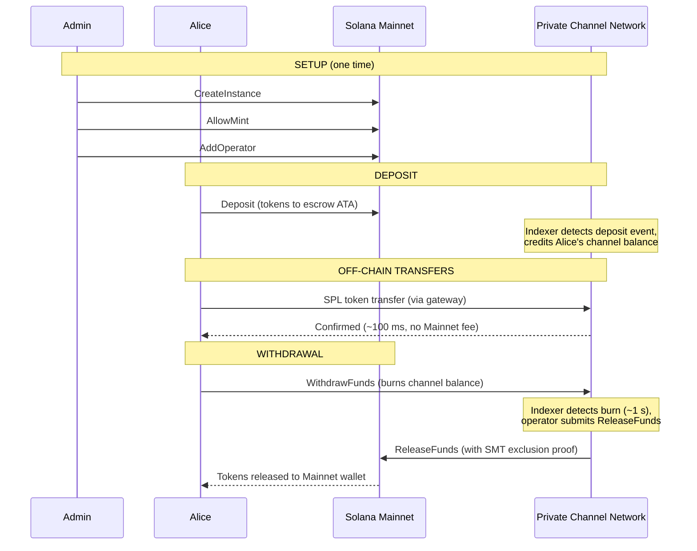
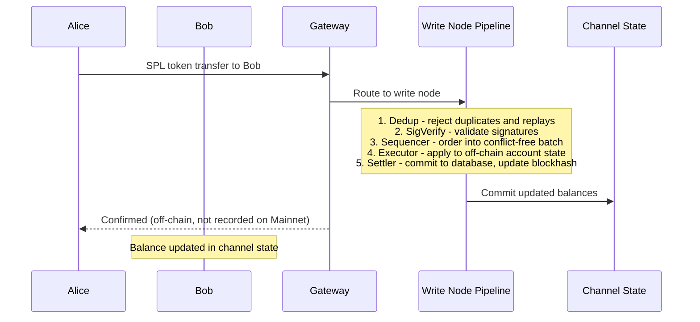
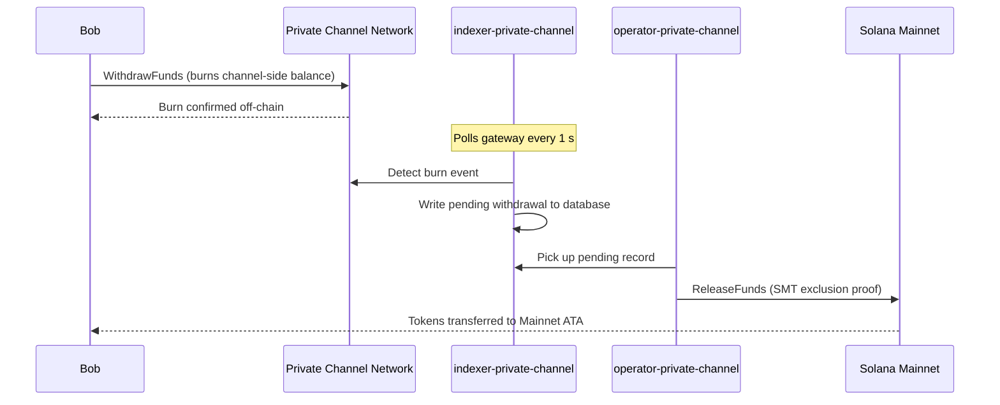

## Qu'est-ce qu'un canal privé ?

Un canal privé est un réseau de paiement hors chaîne ancré sur Solana. Les utilisateurs
déposent des tokens SPL dans un programme d'entiercement on-chain, puis effectuent des transactions hors chaîne
via une passerelle à haute vitesse et sans frais par transfert. Le règlement vers
Solana Mainnet s'effectue via une preuve Sparse Merkle Tree, garantissant que les fonds sont toujours
remboursables et que la double dépense est impossible.

Contrairement au flux de paiement natif de Solana, les transferts au sein d'un canal n'apparaissent
pas on-chain tant qu'un utilisateur n'effectue pas de retrait. Le réseau de canaux exécute son propre pipeline de transactions
(dedup -> sig verify -> sequencer -> executor -> settler) qui
traite les transactions indépendamment du temps de bloc de Solana.

## Participants

### Administrateur d'instance

L'administrateur déploie le PDA `Instance` via `CreateInstance` et contrôle quels
mints de tokens SPL sont acceptés (`AllowMint` / `BlockMint`). L'administrateur provisionne et
révoque les opérateurs via `AddOperator` / `RemoveOperator`, et peut transférer les droits d'administration
via `SetNewAdmin`. Il y a un seul administrateur par instance. Le transfert des droits d'administration
est irréversible en une seule étape : l'administrateur actuel ne peut pas récupérer le rôle
sans la coopération du nouvel administrateur.

### Opérateurs

Les opérateurs sont provisionnés par l'administrateur. Ils détiennent un PDA `Operator` et sont les
seuls comptes autorisés à appeler `ReleaseFunds` (pour régler les retraits vers
Mainnet) et `ResetSmtRoot` (pour effectuer la rotation du Sparse Merkle Tree). Les opérateurs contournent
toutes les vérifications de propriété dans la passerelle et ont accès à toutes les méthodes JSON-RPC
y compris `getBlock`, `getTransaction` et `simulateTransaction`. Rôle JWT :
`"operator"`. Les opérateurs doivent être provisionnés directement dans la base de données ; il n'existe
aucune escalade en libre-service. Consultez le
[guide des opérateurs](/docs/tools/private-channels/operators) pour les détails de déploiement et
de configuration.

### Utilisateurs

Les utilisateurs s'inscrivent eux-mêmes via le service d'authentification. Rôle JWT : `"user"`. Les utilisateurs peuvent appeler
`Deposit` directement sur le programme d'entiercement et initier des retraits via
l'instruction `WithdrawFunds` côté canal sur le programme de retrait. L'accès à la passerelle
est limité à leurs propres portefeuilles vérifiés ; ils ne peuvent pas appeler `getBlock`,
`getTransaction` ni `simulateTransaction`.

## Cycle de vie du canal

1. **Création d'instance** - L'administrateur appelle `CreateInstance`, créant le PDA `Instance`
   et configurant les mints autorisés.
2. **Dépôt** - Les utilisateurs déposent des tokens SPL dans l'entiercement via l'instruction `Deposit`.
   Les tokens sont transférés vers l'associated token account de l'instance.
3. **Transferts hors chaîne** - Les utilisateurs envoient des transferts via la passerelle. Les transferts
   sont séquencés et exécutés sur le réseau de canaux sans toucher Mainnet.
4. **Initiation du retrait** - Un utilisateur appelle `WithdrawFunds` sur le programme de retrait
   (côté canal) pour brûler son solde et signaler un retrait.
5. **Règlement sur Mainnet** - Un opérateur fournit une preuve d'exclusion SMT valide et
   appelle `ReleaseFunds` sur le programme d'entiercement (Mainnet), libérant les tokens vers le
   portefeuille de l'utilisateur.
6. **Rotation de l'arbre** - Lorsque le SMT approche de sa capacité maximale (65 536 feuilles), l'opérateur
   appelle `ResetSmtRoot` pour effectuer la rotation de l'arbre et démarrer un nouvel epoch.

### Transfert

### Retrait

## Quand utiliser les canaux privés

Utilisez les canaux privés lorsque votre application a besoin de :

- **Débit hors chaîne** - votre volume de transferts saturerait le TPS de Solana ou
  vous avez besoin d'une confirmation en moins d'une seconde
- **Confidentialité** - les identités des contreparties et les montants des transferts ne doivent pas apparaître
  on-chain
- **Zéro frais par transfert** - transferts fréquents pour lesquels le coût en SOL par transaction est prohibitif

Utilisez plutôt des transferts SPL natifs lorsque :

- **La composabilité on-chain** est requise (DeFi, swaps, prêts ; d'autres programmes
  doivent pouvoir observer ou agir sur le transfert)
- **Un règlement en transfert unique** convient et la confidentialité n'est pas une préoccupation
- **Aucune infrastructure de passerelle** n'est disponible ou opérationnellement réalisable
