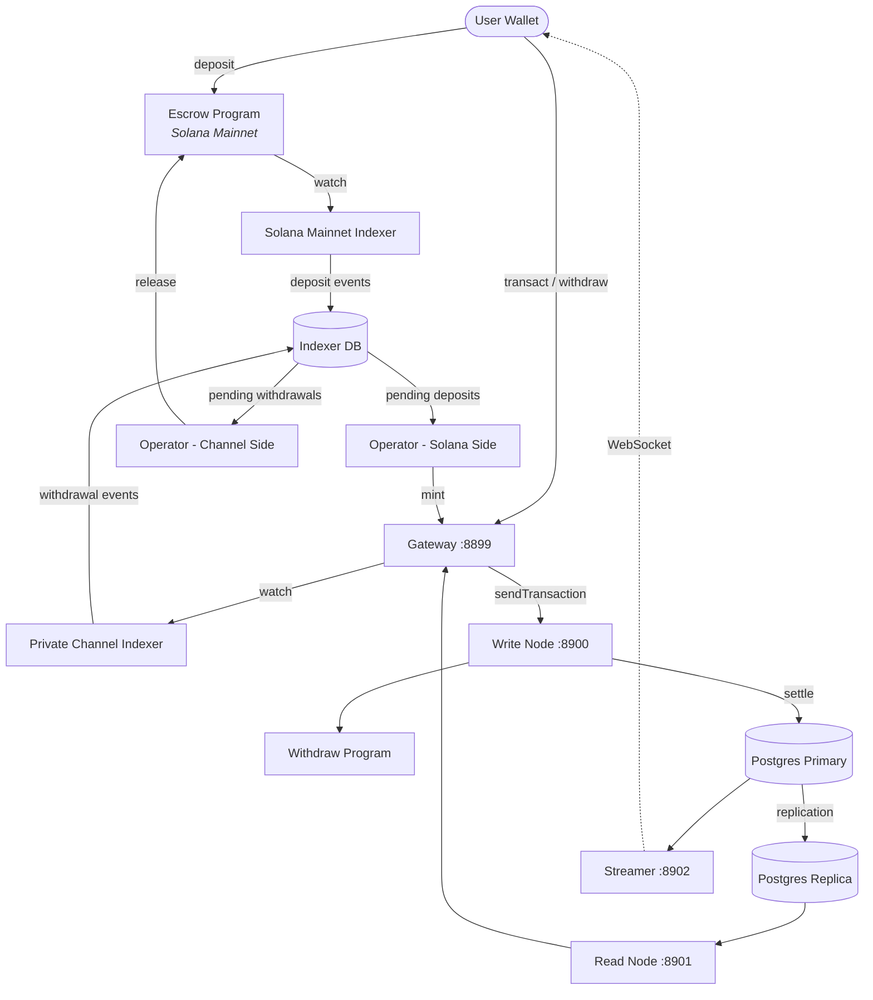

<Callout type="warning">
  Private Channels n'a pas fait l'objet d'un audit de sécurité et n'est pas recommandé pour
  une utilisation en production avec de vrais fonds sans une révision de sécurité approfondie.
</Callout>

<Callout type="info">
  **Vous déployez une instance ?** Consultez le [guide des
  opérateurs](/docs/tools/private-channels/operators). **Vous intégrez une
  instance existante ?** Consultez le
  [Démarrage rapide](/docs/tools/private-channels/quickstart/installation). Cette page
  est la référence d'architecture pour les deux publics.
</Callout>

## Architecture

Private Channels est composé de quatre composants : deux programmes Solana on-chain
(Escrow et Withdraw) et deux services off-chain (Gateway et Auth Service).
Ensemble, ils forment un protocole de canal d'état où les fonds résident sur le Mainnet mais
les transferts se règlent off-chain.

### Programme Escrow

Le programme Escrow est un programme Solana on-chain qui détient les tokens SPL
déposés. Il constitue l'ancre de confiance du système : tous les fonds résident en
dépôt jusqu'à ce qu'un opérateur fournisse une preuve d'exclusion de Sparse Merkle Tree valide pour
les libérer.

- ID du programme : `9tgHa1DcnaSSUtmMsst8ovKTe1Gfxzezn27KnH9xXYeU`
- Cet ID est compilé dans le binaire du programme via `declare_id!()`. Les services
  off-chain lisent le même ID au moment de la compilation depuis le crate client généré, et non
  depuis une variable d'environnement.
- Gère les PDAs `Instance`, `AllowedMint` et `Operator`
- Instructions : `CreateInstance`, `AllowMint`, `BlockMint`, `AddOperator`,
  `RemoveOperator`, `SetNewAdmin`, `Deposit`, `ReleaseFunds`, `ResetSmtRoot`

### Programme Withdraw

Le programme Withdraw s'exécute sur le réseau de canaux privés, et non sur le Mainnet Solana.
Les utilisateurs appellent `WithdrawFunds` pour brûler leur solde de tokens côté canal. Ce
brûlage ne libère pas automatiquement les fonds ; il signale à l'opérateur qu'un
retrait est en attente. L'opérateur appelle ensuite `ReleaseFunds` sur le programme
Escrow avec une preuve SMT valide pour finaliser le règlement.

- ID du programme : `J231K9UEpS4y4KAPwGc4gsMNCjKFRMYcQBcjVW7vBhVi`
- Cet ID est compilé dans le binaire du programme. Les services off-chain lisent le même
  ID au moment de la compilation depuis le crate client généré, et non depuis une variable
  d'environnement.

### Gateway

La Gateway est un proxy compatible Solana JSON-RPC qui achemine les requêtes des clients vers
le nœud d'écriture du réseau de canaux (pour la soumission des transactions) et le nœud de lecture (pour
les requêtes). Elle est configurée via des variables d'environnement : `GATEWAY_PORT`,
`GATEWAY_WRITE_URL`, `GATEWAY_READ_URL`.

Points de terminaison de santé (aucune authentification requise) :

- `GET /health` - vérification de vivacité ; renvoie `200 {"status":"ok"}`
- `GET /ready` - disponibilité approfondie, sonde les nœuds d'écriture et de lecture ; renvoie
  `200 {"status":"ready"}` ou `503 {"status":"degraded"}`

#### Routage des méthodes RPC et accès

La gateway achemine `sendTransaction` vers le nœud d'écriture et toutes les autres méthodes vers
le nœud de lecture. Les requêtes de plus de 64 Ko sont rejetées avec HTTP 413. Lorsque
l'authentification est activée, l'accès aux méthodes est contrôlé par le rôle JWT. Consultez
**[Authentification & Rôles](/docs/tools/private-channels/concepts/auth)** pour la
matrice complète des méthodes.

### Auth Service

L'Auth Service est un composant optionnel qui émet des JWT HS256 (expiration de 24 heures)
pour le contrôle d'accès à la gateway. Il est activé lorsque la variable d'environnement `JWT_SECRET`
est définie. Sans elle, la gateway accepte toutes les connexions.

Claims JWT : `sub` (UUID utilisateur), `role` (`"user"` ou `"operator"`), `iss`
(`"private-channel-auth"`), `aud` (`"private-channel-gateway"`), `exp` (horodatage
Unix). `iss` et `aud` sont validés par la configuration JWT de la gateway,
et non désérialisés dans la structure des claims applicatifs : seuls `sub`, `role` et
`exp` sont disponibles pour le code de la couche applicative.

Rôles :

- `user` - accès limité aux portefeuilles vérifiés propres à l'utilisateur ; ne peut pas appeler `getBlock`,
  `getTransaction` ni `simulateTransaction`
- `operator` - contourne toutes les vérifications de propriété ; accès complet aux méthodes RPC ; doit être
  provisionné dans la base de données (aucune escalade en libre-service)

### Streamer

Le Streamer est un serveur WebSocket qui pousse les mises à jour de l'état du canal vers
les clients connectés en temps réel, éliminant ainsi le besoin d'interroger le RPC. Il interroge
PostgreSQL pour les changements d'état. Il fait partie de la stack Docker Compose de base, et non
de la stack devnet déployée par ce guide ; consultez la
[référence de configuration](/docs/tools/private-channels/operators/configuration#service-port-reference).

- Port : `8902`, configurable via `STREAMER_PORT`
- Connexion : `ws://localhost:8902`
- Point de terminaison de santé : `GET /health` - renvoie `503` si une boucle de sondage interne
  se bloque au-delà de 30 secondes

<Callout type="warning">
  Le schéma des événements WebSocket n'est pas encore documenté publiquement. Consultez
  [`core/src/bin/streamer.rs`](https://github.com/solana-foundation/solana-private-channels/blob/main/core/src/bin/streamer.rs)
  pour les détails d'implémentation jusqu'à ce qu'une documentation formelle soit disponible.
</Callout>



## Pipeline de transactions

```text
Transaction -> [1:Dedup] -> [2:SigVerify] -> [3:Sequencer] -> [4:Executor] -> [5:Settler] -> Database
```

Les transactions soumises à la Gateway traversent un pipeline en cinq étapes avant
que leur état ne soit validé :

1. **Dedup** - filtre les transactions en double avant qu'elles n'entrent dans le pipeline
2. **SigVerify** - valide les signatures des transactions par rapport à la clé publique
   du signataire
3. **Sequencer** - ordonne les transactions valides de manière déterministe pour établir un
   historique canonique
4. **Executor** - exécute les transactions sur la couche de comptes du canal
   (BOB Cache + AccountsDB), mettant à jour les soldes off-chain
5. **Settler** - valide les résultats de transactions accumulés dans PostgreSQL et
   met à jour le cache Redis ; génère de nouveaux blockhashes pour le prochain cycle de bloc.
   Le règlement sur le Mainnet (appel à `ReleaseFunds`) est géré séparément par le
   service `operator-private-channel`

## Fonctionnalités clés

### Confidentialité

Les transferts entre participants du canal ne sont pas enregistrés sur le Mainnet Solana. Seuls
les dépôts (entrée dans le canal) et les retraits finaux (sortie du canal)
apparaissent on-chain. Les identités des contreparties et les montants des transferts ne sont pas visibles pour
les observateurs extérieurs pendant le fonctionnement du canal.

### Performance

Le pipeline off-chain retire le temps de bloc de Solana du chemin critique.
Les transferts sont confirmés lorsque le séquenceur les traite, et non lorsqu'un bloc Solana
est confirmé. Cela permet une finalité en moins d'une seconde et un débit dépassant le TPS
natif de Solana pour les transferts au niveau applicatif.

### Règlement

Chaque retrait est protégé par une preuve de Sparse Merkle Tree on-chain. La racine SMT
est stockée dans `Instance.withdrawal_transactions_root` sur le programme Escrow.
Lorsque `ReleaseFunds` est appelé, le programme vérifie d'abord une preuve d'exclusion pour
un nonce inédit par rapport à la racine on-chain actuelle, puis vérifie une preuve
d'inclusion distincte pour ce nonce par rapport à la nouvelle racine fournie par l'appelant. Ce n'est qu'après
que les deux vérifications sont passées qu'il stocke la nouvelle racine, rendant la double dépense impossible même
si une clé d'opérateur est compromise.

## Modèle de sécurité

**Clé admin** - contrôle la création d'instances (`CreateInstance`) et le
provisionnement des opérateurs (`AddOperator` / `RemoveOperator`). La compromission de la clé admin
permet un provisionnement arbitraire des opérateurs. `SetNewAdmin` transfère l'autorité admin
de façon irréversible en une seule étape ; protégez la clé admin en conséquence.

**Clés d'opérateur** - peuvent appeler `ReleaseFunds` et `ResetSmtRoot`. Elles ne peuvent pas
libérer des fonds sans une preuve d'exclusion SMT valide par rapport à la racine on-chain
actuelle. La vérification on-chain `verify_smt_exclusion_proof` est la dernière ligne de
défense contre les retraits non autorisés : une clé d'opérateur compromise seule ne
suffit pas à vider l'escrow.

**Racine SMT** - stockée on-chain dans `Instance.withdrawal_transactions_root`.
Mise à jour de manière atomique à chaque appel à `ReleaseFunds`. Comme chaque preuve doit
référencer un nonce inédit, la double dépense du même solde de canal est
impossible même si une clé d'opérateur est compromise.

**Rotation d'arbre** - `Instance.current_tree_index` suit les epochs des arbres. Lorsque
`ResetSmtRoot` est appelé, il incrémente l'index de l'arbre et invalide tous
les nonces de l'epoch d'arbre précédente, offrant une table rase pour les nouveaux cycles
de règlement.

## Sécurité opérationnelle des clés

<Callout type="warning">
  Les services off-chain utilisent leur propre vocabulaire de signataires, sans lien avec
  les autorités admin/opérateur on-chain décrites dans le modèle de sécurité ci-dessus.
  `ADMIN_PRIVATE_KEY` est requis pour chaque service opérateur et règle
  les frais de transaction ; un `OPERATOR_PRIVATE_KEY` distinct et optionnel fournit la
  signature d'opérateur on-chain pour `ReleaseFunds` et `ResetSmtRoot`, et utilise
  par défaut la valeur de `ADMIN_PRIVATE_KEY` s'il n'est pas défini. Ne mettez jamais la clé admin
  d'instance au niveau du protocole (utilisée pour `CreateInstance` / `AddOperator` / `SetNewAdmin`)
  dans l'une ou l'autre variable, ni ne l'exposez au moment de l'exécution ; conservez cette clé froide et hors ligne.
</Callout>

`ReleaseFunds` et `ResetSmtRoot` nécessitent deux signatures on-chain : le payeur des frais
(depuis `ADMIN_PRIVATE_KEY`) et l'autorité du PDA Opérateur (depuis
`OPERATOR_PRIVATE_KEY`, ou `ADMIN_PRIVATE_KEY` si celui-ci n'est pas défini). Le parcours devnet
de ce guide de déploiement place le keypair d'opérateur généré dans
`ADMIN_PRIVATE_KEY` et laisse `OPERATOR_PRIVATE_KEY` non défini, de sorte que le même keypair
remplit les deux rôles de signataire. Traitez la clé qui se retrouve dans `ADMIN_PRIVATE_KEY` avec
les mêmes contrôles que la clé privée d'un portefeuille chaud :

- Stockez-la uniquement dans le fichier `.env` ignoré par git, jamais dans `.env.devnet` ni dans
  aucune configuration versionnée
- Pour les déploiements en production, envisagez un gestionnaire de secrets (AWS Secrets Manager,
  HashiCorp Vault) plutôt qu'une variable d'environnement en texte clair
- Le keypair admin d'instance au niveau du protocole (utilisé pour appeler `AddOperator` /
  `SetNewAdmin`) doit être conservé froid ; il n'est nécessaire que lors de la configuration de l'instance
  et du provisionnement des opérateurs, et non pendant l'exécution

`SetNewAdmin` transfère les droits admin **de façon irréversible en une seule transaction** :
l'admin actuel n'a aucun recours sans la coopération du nouvel admin. Ne
l'appelez pas sans avoir vérifié l'adresse cible.

## Étapes suivantes

<Cards>
  <Card
    title="Démarrage rapide"
    href="/docs/tools/private-channels/quickstart/installation"
  >
    Configurez votre environnement et générez des clients TypeScript.
  </Card>
  <Card title="Canaux" href="/docs/tools/private-channels/concepts/channels">
    Comprendre les participants et le cycle de vie du canal.
  </Card>
  <Card
    title="Sparse Merkle Tree"
    href="/docs/tools/private-channels/concepts/smt"
  >
    Comprendre comment les preuves de retrait sont vérifiées on-chain.
  </Card>
  <Card
    title="Instructions"
    href="/docs/tools/private-channels/instructions/deposit"
  >
    Référence complète des instructions pour tous les programmes.
  </Card>
</Cards>
