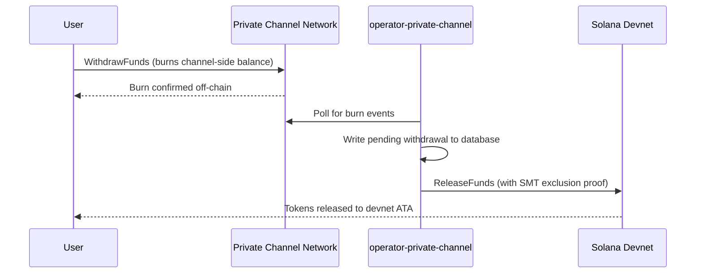

## Aperçu

Le retrait depuis Private Channels est un processus en deux étapes. Premièrement, l'utilisateur brûle
son solde de tokens côté canal en appelant `WithdrawFunds` sur le Withdraw
Program. Deuxièmement, un opérateur appelle `ReleaseFunds` sur l'Escrow Program (devnet,
dans cette procédure) avec une preuve d'exclusion Sparse Merkle Tree valide pour libérer
les fonds. La preuve SMT garantit que chaque nonce de retrait ne peut être utilisé qu'une seule fois,
empêchant ainsi la double dépense.



## Étape 1 : Initier le retrait sur le canal

Appelez `WithdrawFunds` sur le Withdraw Program pour brûler votre solde côté canal.
Utilisez la variante `Async`, qui dérive automatiquement le PDA `tokenAccount` et constitue la
forme recommandée pour une utilisation en production :

```typescript
import { getWithdrawFundsInstructionAsync } from "../private-channel-withdraw-program/clients/typescript/src/generated";
import {
  createSolanaRpc,
  address,
  pipe,
  createTransactionMessage,
  setTransactionMessageFeePayerSigner,
  setTransactionMessageLifetimeUsingBlockhash,
  appendTransactionMessageInstruction,
  signAndSendTransactionMessageWithSigners,
  assertIsTransactionMessageWithSingleSendingSigner,
  getBase58Decoder
} from "@solana/kit";

// Point to the gateway, not a public Solana RPC
const privateChannelRpc = createSolanaRpc("http://localhost:8899");

const withdrawIx = await getWithdrawFundsInstructionAsync({
  user: userSigner,
  mint: address(mintAddress),
  amount: 1_000_000n, // 1 USDC (6 decimals)
  destination: null // null = release to signer's devnet wallet
});

const { value: latestBlockhash } = await privateChannelRpc
  .getLatestBlockhash({ commitment: "confirmed" })
  .send();

// Sent to the Private Channels gateway (not Solana RPC directly), which
// expects the legacy transaction format - do not switch this to version 0.
const transactionMessage = pipe(
  createTransactionMessage({ version: "legacy" }),
  (m) => setTransactionMessageFeePayerSigner(userSigner, m),
  (m) => setTransactionMessageLifetimeUsingBlockhash(latestBlockhash, m),
  (m) => appendTransactionMessageInstruction(withdrawIx, m)
);

assertIsTransactionMessageWithSingleSendingSigner(transactionMessage);

const signatureBytes =
  await signAndSendTransactionMessageWithSigners(transactionMessage);
const signature = getBase58Decoder().decode(signatureBytes);
console.log("Withdrawal initiated:", signature);
```

- ID du Withdraw Program : `J231K9UEpS4y4KAPwGc4gsMNCjKFRMYcQBcjVW7vBhVi`
- Soumettez cette transaction à la passerelle (`http://localhost:8899`), et non à un
  RPC Solana public
- Si `destination` est fourni, les fonds libérés sont envoyés à ce portefeuille plutôt qu'à celui du
  signataire

## À quoi s'attendre

Aucune action supplémentaire n'est requise après l'appel de `WithdrawFunds`. Les services
opérateurs gèrent le règlement automatiquement :

1. `indexer-private-channel` interroge le canal toutes les 1 seconde pour détecter les événements de brûlage
   et enregistre un retrait en attente lorsque le vôtre est détecté
2. `operator-private-channel` interroge la base de données toutes les 1 seconde pour les
   enregistrements en attente et soumet `ReleaseFunds` à l'Escrow Program sur Solana devnet
   avec la preuve d'exclusion SMT requise ; il interroge la confirmation devnet jusqu'à
   5 fois à des intervalles de 400 ms avant de réessayer

Les fonds apparaissent généralement dans votre portefeuille devnet en quelques secondes dans des
conditions normales.

## Comment l'opérateur effectue le règlement (référence)

Après le brûlage côté canal, un opérateur provisionné doit appeler `ReleaseFunds` sur
l'Escrow Program avec une preuve d'exclusion SMT valide ; l'opérateur ne peut pas libérer
les fonds sans prouver que le nonce de retrait n'a pas encore été utilisé. Cette étape
est gérée automatiquement par `operator-private-channel` ; vous n'avez pas besoin de l'appeler
vous-même.

L'opérateur fournit :

- `amount` : doit correspondre au montant brûlé
- `user` : portefeuille destinataire sur devnet
- `new_withdrawal_root` : racine SMT mise à jour après ce retrait
- `transaction_nonce` : nonce unique pour cette feuille
- `sibling_proofs` : 512 octets (16 hachages frères de 32 octets pour la preuve de l'arbre)

## Vérifier

Une fois l'appel de l'opérateur confirmé, vérifiez votre solde de tokens sur devnet :

```bash
spl-token balance <MINT_ADDRESS> --owner <YOUR_WALLET>
```

Ou via RPC :

```typescript
import { createSolanaRpc, address } from "@solana/kit";
import { findAssociatedTokenPda } from "@solana-program/token";

const TOKEN_PROGRAM_ADDRESS = address(
  "TokenkegQfeZyiNwAJbNbGKPFXCWuBvf9Ss623VQ5DA"
);

// Query devnet directly; ReleaseFunds settles here, not through the gateway
const rpc = createSolanaRpc("https://api.devnet.solana.com");

const [yourDevnetAta] = await findAssociatedTokenPda({
  mint: address(mintAddress),
  owner: address(userSigner.address),
  tokenProgram: TOKEN_PROGRAM_ADDRESS
});

const balance = await rpc.getTokenAccountBalance(yourDevnetAta).send();
console.log(balance.value.uiAmountString);
```

## Vous avez terminé le Quickstart

Vous avez exécuté le cycle complet de Private Channels sur devnet : déposé des tokens SPL dans
l'escrow, envoyé un transfert hors chaîne via la passerelle, et retiré des fonds
vers votre portefeuille devnet.

<Cards>
  <Card
    title="Cycle de vie du canal"
    href="/docs/tools/private-channels/concepts/channels"
  >
    Comprenez les participants et le flux complet de dépôt jusqu'au retrait en profondeur.
  </Card>
  <Card
    title="Authentification & Rôles"
    href="/docs/tools/private-channels/concepts/auth"
  >
    Ajoutez l'authentification JWT à votre intégration.
  </Card>
  <Card
    title="Référence Release Funds"
    href="/docs/tools/private-channels/instructions/release-funds"
  >
    Référence complète de l'instruction ReleaseFunds pour les outils opérateurs.
  </Card>
  <Card
    title="Sparse Merkle Tree"
    href="/docs/tools/private-channels/concepts/smt"
  >
    Comprenez comment les preuves de retrait empêchent la double dépense.
  </Card>
</Cards>
