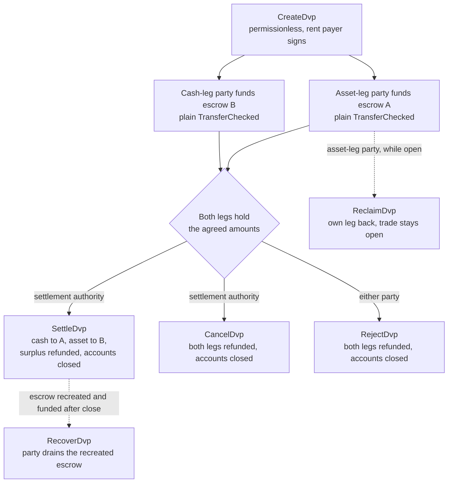
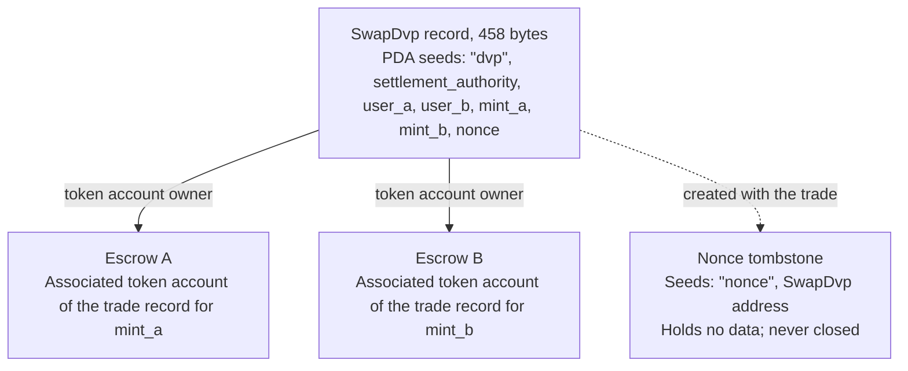

Program DvP adalah program standar untuk delivery versus payment di Solana,
dikelola oleh Solana Foundation dan diaudit oleh Cantina. Dua pihak menyepakati
sebuah trade, masing-masing mengirim leg-nya ke akun escrow dengan transfer
token biasa, lalu otoritas penyelesaian menyelesaikan kedua leg dalam satu
transaksi, sehingga keduanya berpindah atau tidak sama sekali. Otoritas
penyelesaian adalah alamat ketiga yang disebutkan dalam trade, seperti venue
atau agen yang mengaturnya. Tidak ada pihak yang perlu menulis atau men-deploy
program, dan wallet atau kustodian yang dapat mengirim transfer token standar
(`TransferChecked`) dapat mendanai sebuah leg tanpa integrasi khusus DvP.
Sebelum penyelesaian, kedua pihak dapat menarik kembali leg miliknya atau
membatalkan trade.

<Callout type="warn" title="Baca catatan sebelum bertindak berdasarkan catatan tersebut">

Pembuatan catatan trade bersifat permissionless, sehingga sebuah catatan bukan
bukti kesepakatan. Setiap pihak membaca ketentuan yang tersimpan sebelum
mendanai, dan otoritas penyelesaian membacanya sebelum menyelesaikan (lihat
[verifikasi](#verification-before-funding-and-settlement)).

</Callout>

## Cara kerja

Setiap trade mendapatkan satu catatan milik program dan dua akun escrow, satu
untuk setiap leg. Pihak leg aset (`user_a`) dan pihak leg kas (`user_b`)
masing-masing mendanai satu leg dengan mentransfer token ke akun escrow untuk
leg tersebut. Otoritas penyelesaian adalah satu-satunya penanda tangan yang
dapat menyelesaikan trade. Penyelesaian mentransfer jumlah yang disepakati dari
setiap leg ke pihak lawan, mengembalikan kelebihan apa pun kepada pihak yang
memiliki leg tersebut, dan menutup catatan beserta kedua escrow. Sifat atomik
berasal dari [transaksi](/docs/core/transactions) Solana: kedua transfer berada dalam satu
transaksi, sehingga keduanya berlaku atau tidak sama sekali.

Setiap pengembalian dana, penarikan kembali, dan pengembalian kelebihan masuk
ke associated token account milik pihak itu sendiri: akun `user_a` untuk
`mint_a`, akun `user_b` untuk `mint_b`. Sistem kustodian atau treasury dapat
mendanai sebuah leg dari akunnya sendiri, tetapi semua yang dikembalikan masuk
ke akun pihak tersebut, bukan kembali ke kustodian. Setiap trade juga
meninggalkan akun penanda permanen (lihat [State](#state)).

## Panduan

Halaman-halaman langkah ini membawa satu trade dari pembuatan hingga
penyelesaian, dengan TypeScript dan Rust untuk setiap instruksi.

<Cards>
  <Card title="Buat trade" href="/docs/defi/dvp-program/create-a-trade">
    Instal klien dan catat ketentuan trade dengan CreateDvp
  </Card>
  <Card title="Danai leg" href="/docs/defi/dvp-program/fund-the-legs">
    Verifikasi ketentuan yang tersimpan, lalu danai setiap leg dengan transfer biasa
  </Card>
  <Card title="Selesaikan trade" href="/docs/defi/dvp-program/settle-the-trade">
    Selesaikan kedua leg dalam satu transaksi sebagai otoritas penyelesaian
  </Card>
  <Card title="Batalkan trade" href="/docs/defi/dvp-program/unwind-a-trade">
    Tarik kembali sebuah leg, batalkan atau tolak trade, dan pulihkan deposit yang terlambat
  </Card>
</Cards>

[Demo devnet](https://solana.com/delivery-vs-payment/demo) menjalankan sebuah trade dari awal
hingga akhir: membuat trade, mendanai kedua escrow dengan transfer token
standar, dan menyelesaikan kedua leg dalam satu transaksi.

## Memilih antara program dan delegasi

[Delivery vs Payment (DvP) menggunakan delegasi](/docs/tokenization/dvp) menyelesaikan
pertukaran yang sama tanpa program: setiap pihak mendelegasikan posisinya ke
agen penyelesaian, yang memindahkan kedua leg dalam satu transaksi.

- **Program** tidak memerlukan delegasi, sehingga batas satu delegate per token
  account tidak berlaku, dan otoritas penyelesaian tidak dapat mengalihkan hasil.
  Setiap trade bergantung pada program yang dapat di-upgrade dan upgrade authority-nya.
- **Pola delegasi** tidak memiliki ketergantungan pada program dan berfungsi
  dengan mint yang memiliki Scaled UI Amount. Program menolak mint tersebut,
  yang berarti mint apa pun yang dibuat dari template `tokenized-security`
  milik Mosaic tidak dapat digunakan (lihat
  [batasan konfigurasi mint](#mint-configuration-constraints)).

## Peran

Program ini simetris. Dalam antarmukanya, kedua pihak adalah `user_a`, yang
menyerahkan `mint_a`, dan `user_b`, yang menyerahkan `mint_b`. README dan klien
hasil generate menyebut `mint_a` sebagai leg aset dan `mint_b` sebagai leg kas,
dan halaman-halaman ini mengikuti konvensi tersebut, tetapi tidak ada yang
mewajibkan leg kas berupa instrumen kas. Dua aset, atau dua stablecoin,
diselesaikan dengan cara yang sama.

| Peran                 | Siapa                               | Menandatangani                                              | Catatan                                                                                                                                                                                                     |
| -------------------- | --------------------------------- | -------------------------------------------------- | --------------------------------------------------------------------------------------------------------------------------------------------------------------------------------------------------------- |
| Pihak leg aset      | `user_a`, menyerahkan `mint_a`       | Transfer pendanaannya sendiri; Reclaim, Reject, Recover | Wallet keypair, atau smart wallet berbasis PDA seperti vault multisig. Akun multisig SPL Token atau program account tidak dapat menjadi pihak: Create gagal dengan `PartyNotSignerCapable`                   |
| Pihak leg kas       | `user_b`, menyerahkan `mint_b`       | Transfer pendanaannya sendiri; Reclaim, Reject, Recover | Persyaratan yang sama                                                                                                                                                                                          |
| Otoritas penyelesaian | Alamat ketiga yang ditentukan saat pembuatan | Settle, Cancel                                     | Satu-satunya penanda tangan yang dapat menyelesaikan trade. Tidak dapat mengalihkan hasil, yang ditetapkan saat pembuatan. Menerima rent dari akun yang ditutup saat menyelesaikan atau membatalkan                                         |
| Pembayar rent           | Siapa pun yang menandatangani `CreateDvp`         | Create                                             | Mendanai rent (deposit SOL yang menjaga akun tetap terbuka) untuk catatan, nonce tombstone, dan kedua escrow. Tidak dicatat sebagai penerima rent: rent dari akun yang ditutup diberikan kepada siapa pun yang menutup trade |

## ID program

```text
dvp34bdbcEm4f4FCUjGV4mDAkDshaQR4LkK8fdcsyZq
```

| Cluster      | Program                                       | Upgrade authority                              | Slot deploy terakhir |
| ------------ | --------------------------------------------- | ---------------------------------------------- | ------------------ |
| mainnet-beta | `dvp34bdbcEm4f4FCUjGV4mDAkDshaQR4LkK8fdcsyZq` | `DXtFpbPjcn2hxPnw79x1Pfoj35vXh5AsWBkS37YnXMVv` | 452.058.374        |
| devnet       | `dvp34bdbcEm4f4FCUjGV4mDAkDshaQR4LkK8fdcsyZq` | `5EX1zFeJWj4rGYZv432WnYw8CbaSUeTdxPx4r573UgYU` | 479.376.863        |

Program ini dapat di-upgrade di kedua cluster. Angka di atas adalah yang
dilaporkan oleh `solana program show` pada 2 Oktober 2026; jalankan perintah
yang sama untuk melihat nilai terkini. Build devnet lebih lama daripada commit
yang menjadi acuan halaman-halaman langkah (lihat [Instal](/docs/defi/dvp-program/create-a-trade#install)),
dengan set instruksi dan error yang sama.

## Siklus hidup



Sebuah trade terbuka sejak `CreateDvp` hingga salah satu dari Settle, Cancel,
atau Reject menutupnya. Pendanaan tidak memiliki instruksi tersendiri: sebuah
leg dianggap terdanai ketika akun escrow-nya menyimpan setidaknya jumlah yang
disepakati. Reclaim berlaku per leg dan membiarkan trade tetap terbuka, sehingga
masalah pada satu leg tidak memaksa pihak lain membatalkan seluruh trade.

## State

Setiap trade memiliki satu akun `SwapDvp` berukuran 458 byte, yang dimiliki oleh
program. Alamatnya diturunkan dari otoritas penyelesaian, kedua pihak, kedua
mint, dan sebuah nonce (seed
`["dvp", settlement_authority, user_a, user_b, mint_a, mint_b, nonce]`). Jumlah
dan waktu disimpan di dalam akun dan tidak memengaruhi alamat, itulah sebabnya
nilai tersebut harus dibaca, bukan disimpulkan. Sebuah akun penanda kecil, yaitu
nonce tombstone di `["nonce", swap_dvp]`, dibuat bersama trade dan tidak pernah
ditutup, sehingga setiap kombinasi pihak, mint, otoritas, dan nonce hanya dapat
digunakan untuk satu trade.



| Field                                  | Tipe          | Arti                                                                                                 |
| -------------------------------------- | ------------- | ------------------------------------------------------------------------------------------------------- |
| `bump`                                 | `u8`          | Bump PDA                                                                                                |
| `user_a`, `user_b`                     | `Pubkey`      | Kedua pihak                                                                                         |
| `mint_a`, `mint_b`                     | `Pubkey`      | Mint leg aset dan leg kas                                                                        |
| `settlement_authority`                 | `Pubkey`      | Satu-satunya penanda tangan yang dapat menyelesaikan atau membatalkan                                                               |
| `token_program_a`, `token_program_b`   | `Pubkey`      | token program yang memiliki setiap mint; sebuah trade dapat mencampur leg SPL Token dan Token-2022                    |
| `amount_a`, `amount_b`                 | `u64`         | Jumlah yang disepakati untuk setiap leg, dalam satuan terkecil mint (base unit)                                 |
| `expiry_timestamp`                     | `i64`         | Setelah waktu jaringan ini (jam onchain), Settle ditolak. Reclaim, Cancel, dan Reject tetap berfungsi |
| `nonce`                                | `u64`         | Membedakan trade yang memiliki seed lain yang sama. Sekali pakai                                             |
| `ref_string`                           | `[u8; 64]`    | Referensi klien yang buram (opaque), diisi nol sebagai padding; program tidak pernah membacanya                                     |
| `user_a_settlement_destination`        | `Pubkey`      | Menerima leg kas saat Settle; defaultnya `user_a`                                                   |
| `user_b_settlement_destination`        | `Pubkey`      | Menerima leg aset saat Settle; defaultnya `user_b`                                                  |
| `mint_a_authority`, `mint_b_authority` | `Pubkey`      | Otoritas mint yang dicatat saat pembuatan; Settle gagal jika salah satunya berubah                           |
| `earliest_settlement_timestamp`        | `Option<i64>` | Jika diatur, Settle ditolak sebelum waktu jaringan ini                                                     |

Daftar field diambil dari IDL program pada commit yang disebutkan di bawah
[Buat trade](/docs/defi/dvp-program/create-a-trade#install).

## Instruksi

| Instruksi  | Penanda tangan               | Efek                                                                                                                                                              |
| ------------ | -------------------- | ------------------------------------------------------------------------------------------------------------------------------------------------------------------- |
| `CreateDvp`  | Payer mana pun            | Membuat catatan `SwapDvp`, nonce tombstone-nya, dan kedua akun escrow. Tidak memindahkan token                                                                        |
| `ReclaimDvp` | `user_a` atau `user_b` | Mengembalikan leg milik penanda tangan dari escrow. Trade tetap terbuka dan leg dapat didanai kembali                                                                      |
| `SettleDvp`  | Otoritas penyelesaian | Mentransfer `amount_a` ke tujuan `user_b` dan `amount_b` ke tujuan `user_a`, mengembalikan kelebihan apa pun kepada pihak pemilik leg, menutup catatan dan kedua escrow |
| `CancelDvp`  | Otoritas penyelesaian | Mengembalikan seluruh isi escrow A kepada `user_a` dan escrow B kepada `user_b`, menutup catatan dan kedua escrow                                                            |
| `RejectDvp`  | `user_a` atau `user_b` | Efek yang sama dengan Cancel, ditandatangani oleh salah satu pihak                                                                                                                            |
| `RecoverDvp` | `user_a` atau `user_b` | Setelah trade ditutup: mengosongkan escrow yang dibuat ulang ke token account milik penanda tangan dan menutupnya. Mencakup deposit yang masuk setelah Settle, Cancel, atau Reject  |

Setiap pengembalian dana masuk ke associated token account milik pihak itu
sendiri untuk mint leg tersebut, siapa pun yang mendanai escrow.

Akun dan argumen setiap instruksi tersedia di halaman untuk langkah tersebut.

## Error

| Kode | Error                            | Kapan                                                                                                   |
| ---- | -------------------------------- | ------------------------------------------------------------------------------------------------------ |
| 0    | `SignerNotParty`                 | Reclaim, Reject, atau Recover ditandatangani oleh alamat yang bukan `user_a` atau `user_b`                      |
| 1    | `DvpExpired`                     | Settle setelah `expiry_timestamp`                                                                        |
| 2    | `SettlementAuthorityMismatch`    | Settle atau Cancel ditandatangani oleh alamat selain otoritas penyelesaian                              |
| 3    | `SettlementTooEarly`             | Settle sebelum `earliest_settlement_timestamp`                                                          |
| 4    | `LegNotFunded`                   | Settle saat sebuah escrow menyimpan kurang dari jumlah yang disepakati                                               |
| 5    | `ExpiryNotInFuture`              | Create dengan kedaluwarsa pada atau sebelum waktu jaringan saat ini                                            |
| 6    | `EarliestAfterExpiry`            | Create dengan waktu penyelesaian paling awal setelah kedaluwarsa                                               |
| 7    | `SelfDvp`                        | Create dengan `user_a` sama dengan `user_b`                                                                 |
| 8    | `SameMint`                       | Create dengan `mint_a` sama dengan `mint_b`                                                                 |
| 9    | `ZeroAmount`                     | Create dengan jumlah nol pada salah satu leg                                                                |
| 10   | `BlockedMintExtension`           | Create atau Settle dengan mint yang memiliki TransferFee, InterestBearing, ScaledUiAmount, atau NonTransferable |
| 11   | `SettlementAuthorityIsParty`     | Create dengan otoritas penyelesaian yang sama dengan salah satu pihak                                                  |
| 12   | `SettlementAuthorityExecutable`  | Create dengan otoritas penyelesaian yang executable                                                         |
| 13   | `NonceAlreadyUsed`               | Create yang memakai ulang `(seeds, nonce)` yang sudah memiliki tombstone                                         |
| 14   | `ExpiryTooFarInFuture`           | Create dengan kedaluwarsa lebih dari satu tahun ke depan                                                         |
| 15   | `RefStringTooLong`               | Create dengan referensi lebih panjang dari 64 byte                                                           |
| 16   | `DvpStillOpen`                   | Recover saat trade masih terbuka; gunakan Reclaim                                                     |
| 17   | `DvpNeverCreated`                | Pulihkan dengan seed yang tidak memiliki tombstone                                                              |
| 18   | `EscrowPreloadedWithLamports`    | Create saat escrow non-native menyimpan lamport di atas minimum bebas rent-nya                           |
| 19   | `SettlementDestinationIsSwapDvp` | Create dengan tujuan penyelesaian yang sama dengan catatan perdagangan                                         |
| 20   | `SwapDvpPreloadedWithLamports`   | Create saat alamat catatan menyimpan lamport di atas cadangan rent-nya                                   |
| 21   | `RecipientAtaMismatch`           | Sebuah token account penerima atau pengembalian dana tidak lagi dimiliki oleh wallet dan mint yang diharapkan                  |
| 22   | `PartyNotSignerCapable`          | Create dengan pihak yang bukan akun milik sistem dan non-executable                                 |
| 23   | `MintAuthorityChanged`           | Settle saat mint authority sebuah leg berbeda dari nilai yang dicatat saat pembuatan                         |

## Event dan pengindeksan

Program ini tidak mengeluarkan event onchain. Indexer atau sistem rekonsiliasi membaca
status akun `SwapDvp` dan saldo token dari kedua escrow, serta menggunakan
`ref_string` untuk mengorelasikan sebuah perdagangan dengan order off-chain-nya. Karena catatan
diakhiri saat penyelesaian, sistem yang membutuhkan ketentuannya di kemudian hari harus menyimpannya
saat membacanya, atau merekonstruksinya dari transaksi yang membuat
perdagangan tersebut.

## Token yang didukung

Sebuah perdagangan dapat memasangkan leg SPL Token dengan leg Token-2022; setiap leg membawa
token program-nya sendiri. Leg Wrapped SOL didukung.

| Ekstensi Token-2022 pada mint sebuah leg                                                     | Perilaku program                                                  |
| ---------------------------------------------------------------------------------------- | ----------------------------------------------------------------- |
| TransferFee, InterestBearing, ScaledUiAmount, NonTransferable                            | Ditolak pada Create dan Settle dengan `BlockedMintExtension`         |
| PermanentDelegate, Pausable, DefaultAccountState, freeze authority, MintCloseAuthority | Diterima; setiap authority dapat bertindak atas token yang di-escrow           |
| ConfidentialTransfer                                                                     | Diterima; jumlah pada leg tersebut bersifat publik                          |
| TransferHook                                                                             | Didukung, hingga 32 akun tambahan per leg                        |
| MemoTransfer pada akun tujuan atau akun pengembalian dana                                          | Diterima; program mengirimkan memo yang diperlukan sebelum transfer |

Biaya transfer akan membuat pihak penerima menerima kurang dari jumlah yang disepakati.
Interest Bearing dan Scaled UI Amount tidak mengubah jumlah mentah, tetapi tingkat bunga
atau pengalinya dapat berubah antara saat perdagangan dibuat dan diselesaikan, yang mengubah
cara jumlah yang disepakati ditampilkan. NonTransferable akan membuat kedua leg terkunci.

Authority yang diterima dapat memindahkan, membekukan, atau menghentikan token yang di-escrow selama
perdagangan berlangsung (lihat di bawah). Escrow tidak dapat dikonfigurasi untuk menerima
transfer rahasia, sehingga jumlah yang di-escrow dan diselesaikan pada leg
rahasia bersifat publik.

Untuk mint dengan hook, klien menyelesaikan akun tambahan milik hook dan menambahkannya
ke Settle, Cancel, Reject, Reclaim, dan Recover. Batas 32 per leg
mencakup program hook dan akun validasinya. Jika hook authority
memperbesar daftar akun hook melebihi batas tersebut, setiap transfer pada leg itu
gagal, termasuk Reclaim, Cancel, Reject, dan Recover, hingga authority
membatalkannya. Batas akun transaksi dapat tercapai lebih dulu sebelum batas per leg ketika
kedua leg memiliki hook.

Ketika akun tujuan atau akun pengembalian dana mensyaratkan memo, program memanggil program Memo
sebelum transfer, itulah sebabnya setiap instruksi yang memindahkan token
keluar dari escrow membutuhkan akun `memo_program`.

### Batasan konfigurasi mint

**Scaled UI Amount.** Template `tokenized-security` di
[Mosaic](https://github.com/solana-foundation/mosaic), toolkit penerbitan milik Solana Foundation,
selalu menambahkan Scaled UI Amount, sehingga program tidak menerima
mint yang dibuat dari template tersebut sebagai leg. Mint yang ditujukan untuk program ini dapat
dibuat tanpa ekstensi tersebut (lihat
[Token Extensions](/docs/tokens/extensions));
[DvP menggunakan delegasi](/docs/tokenization/dvp) diselesaikan melalui
otoritas yang didelegasikan dan tidak menerapkan pemeriksaan ini.

**Mint yang dibekukan secara default.** Escrow setiap perdagangan adalah associated token account
yang dimiliki oleh program-derived address yang baru untuk perdagangan tersebut. Pada mint dengan
Default Account State yang diatur ke frozen, escrow dibuat dalam keadaan beku, dan transfer
pendanaan ke dalamnya gagal hingga escrow dicairkan (thaw). Di bawah
[Token ACL](/docs/tokenization/token-acl), itu berarti penerbit atau transfer
agent-nya menyetujui escrow perdagangan sebelum pendanaan: baik dengan menambahkan alamat
catatan perdagangan (pemilik escrow) ke allowlist, sehingga siapa pun dapat men-thaw
escrow tersebut jika konfigurasi Token ACL pada mint mengaktifkan permissionless thaw, atau dengan
meminta freeze authority men-thaw-nya secara langsung. Escrow yang beku juga memblokir
Settle, Reclaim, Cancel, Reject, dan Recover pada leg tersebut, sehingga freeze
authority, dan pada mint dengan hook, hook authority, menjadi pihak tepercaya selama
perdagangan berlangsung. Jalur escrow beku dijelaskan di sini dan tidak diuji
dalam cuplikan devnet.

## Batasan

- Tidak ada pencocokan, penemuan harga, atau order book. Para pihak menyepakati ketentuan di luar
  ledger dan salah satu dari mereka mencatatnya.
- Tidak ada netting, dan hanya bilateral: satu catatan adalah satu perdagangan antara dua pihak.
- Tidak ada partial fill. Settle memindahkan tepat jumlah yang disepakati dari setiap leg dan
  mengembalikan kelebihannya kepada pihak pemilik leg.
- Tidak ada leg off-ledger. Kedua leg adalah token account di Solana; leg tunai pada
  jalur yang sudah ada diselesaikan secara terpisah lalu direkonsiliasi.
- Tidak ada pemeriksaan kelayakan, allowlist, atau KYC. Kontrol bawaan mint
  yang menegakkan kelayakan pemegang.
- Tidak ada penyelesaian otomatis. Settlement authority harus menandatangani.
- Tidak ada event, dan tidak ada biaya protokol di luar biaya transaksi dan rent.

Program ini menghilangkan risiko pokok antara kedua pihak: tidak ada leg yang berpindah
kecuali keduanya berpindah. Program ini tidak menghilangkan risiko kredit penerbit atau risiko penebusan pada kedua
token, kemampuan freeze, pause, atau permanent delegate authority milik mint untuk
bertindak atas token yang di-escrow (lihat [token yang didukung](#supported-tokens)), maupun
ketergantungan pada ketersediaan settlement authority untuk menandatangani.

## Verifikasi sebelum pendanaan dan penyelesaian

`CreateDvp` bersifat permissionless: hanya payer yang menandatangani, sedangkan para pihak dan
settlement authority tidak. Karena itu, siapa pun dapat membuat catatan yang menyebutkan pihak
mana pun dan ketentuan apa pun. Sebelum pendanaan, dan sekali lagi sebelum penyelesaian, baca
akun `SwapDvp` dan pastikan:

1. Akun dimiliki oleh program DvP dan berukuran tepat 458 byte. Akun
   yang tidak dimiliki oleh program dapat diisi dengan byte yang terdekode seperti
   catatan asli.
2. `user_a`, `user_b`, `mint_a`, `mint_b`, dan `settlement_authority` sesuai dengan
   perdagangan yang disepakati.
3. `amount_a`, `amount_b`, `expiry_timestamp`, dan
   `earliest_settlement_timestamp` sesuai dengan ketentuan yang disepakati.
4. Kedua tujuan penyelesaian adalah alamat yang disepakati. Catatan palsu dapat
   mengalihkan dana hasil penyelesaian.

[Danai kedua leg](/docs/defi/dvp-program/fund-the-legs#verify-the-terms) mencantumkan
reader terperiksa dari klien yang dihasilkan dan menunjukkan pemeriksaannya dalam kode.

Anggap perdagangan telah selesai ketika transaksi Settle mencapai
[`finalized`](/docs/rpc#configuring-state-commitment). Itu adalah tingkat komitmen
jaringan; apakah itu juga menandai finalitas penyelesaian untuk tujuan hukum
bergantung pada perjanjian para pihak dan rezim hukum yang berlaku.

## Pengelolaan versi

Akun `SwapDvp` tidak memiliki field versi. Tata letaknya tetap pada 458 byte
(`SwapDvp::LEN`), dan checked reader menolak akun dengan panjang lain.
IDL memiliki versinya sendiri, yaitu `0.1.0` per 2 Oktober 2026.

Program ini dapat di-upgrade di kedua cluster (lihat [Program ID](#program-id)). Catatan
perdagangan hanya ada sampai diselesaikan, dibatalkan, atau ditolak, jadi periksa
repositori untuk mengetahui bagaimana upgrade memperlakukan perdagangan yang masih terbuka, dan buat ulang klien
dari IDL build yang sedang di-deploy.

## Repositori dan audit

Source, IDL, klien yang dihasilkan, dan pengujian tersedia di
[`solana-foundation/dvp`](https://github.com/solana-foundation/dvp) dengan lisensi
MIT. Program ini adalah program Pinocchio `no_std`; klien
dihasilkan dari IDL menggunakan Codama. Laporan kerentanan disampaikan melalui
tautan security advisory repositori, sesuai `SECURITY.md`-nya.

Program ini telah diaudit oleh
[Cantina](https://cantina.xyz/portfolio/fe870bb4-d96d-4902-8aec-9dfcfa2d6a79).

## Terkait

- [Delivery vs Payment (DvP) menggunakan delegasi](/docs/tokenization/dvp): pola
  delegasi tanpa program
- [Token ACL](/docs/tokenization/token-acl): bagaimana mint dengan akses terbatas berinteraksi dengan
  akun escrow
