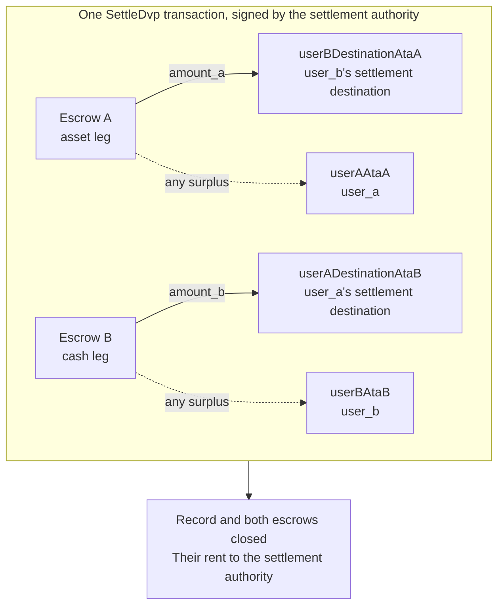

`SettleDvp` ditandatangani oleh otoritas penyelesaian yang tercantum dalam catatan perdagangan. Dalam
satu transaksi, instruksi ini memindahkan `amount_a` dari sisi aset ke tujuan
pihak sisi kas dan `amount_b` dari sisi kas ke tujuan pihak sisi aset,
mengembalikan kelebihan dana di escrow mana pun kepada pihak pemilik sisi tersebut, lalu menutup catatan
dan kedua escrow. Jika salah satu transfer tersebut tidak dapat diselesaikan, instruksi
gagal dan tidak ada dana yang berpindah.

Halaman ini melanjutkan dari [membuat perdagangan](/docs/defi/dvp-program/create-a-trade)
dan [mendanai kedua sisi](/docs/defi/dvp-program/fund-the-legs); client, penandatangan,
`trade`, serta token account para pihak tetap digunakan.

## Validasi ulang sebelum menandatangani

Otoritas penyelesaian menandatangani transaksi yang memindahkan kedua sisi, sehingga ia
melakukan pembacaan yang sama seperti setiap pihak sebelum menandatangani: pemilik, ukuran, para pihak,
mint, jumlah, masa berlaku, dan kedua tujuan (lihat
[mendanai kedua sisi](/docs/defi/dvp-program/fund-the-legs#verify-the-terms)). Program
itu sendiri memeriksa ulang saat penyelesaian bahwa setiap mint masih milik token
program yang tercatat saat pembuatan, tidak memiliki ekstensi yang diblokir, dan memiliki
otoritas mint yang sama seperti saat perdagangan dibuat, sehingga mint yang dibuat ulang dengan ekstensi
yang diblokir, token program yang berbeda, atau otoritas mint yang berbeda tidak dapat
diselesaikan.

## Membuat akun penerima

Settle menulis ke empat token account yang tidak dibuat oleh program:

| Akun                | Menerima                     | Pemilik                           |
| ---------------------- | ---------------------------- | ------------------------------- |
| `userADestinationAtaB` | Sisi kas (`amount_b`)    | `user_a_settlement_destination` |
| `userBDestinationAtaA` | Sisi aset (`amount_a`)   | `user_b_settlement_destination` |
| `userAAtaA`            | Kelebihan dana pada sisi aset | `user_a`                        |
| `userBAtaB`            | Kelebihan dana pada sisi kas  | `user_b`                        |

Akun kelebihan dana hanya digunakan ketika escrow menyimpan lebih dari jumlah
yang disepakati, tetapi siapa pun yang memegang mint dapat menciptakan kelebihan dengan mengirim beberapa base
unit ke escrow. Jika akun pengembalian tidak ada, seluruh Settle
gagal, jadi buat keempatnya secara idempoten dalam transaksi yang sama.

<Tabs items={["TypeScript", "Rust"]}>
  <Tab value="TypeScript">
    ```ts
    import {
      findAssociatedTokenPda,
      getCreateAssociatedTokenIdempotentInstruction,
    } from "@solana-program/token-2022";

    const destinationA = t.userASettlementDestination; // defaults to userA
    const destinationB = t.userBSettlementDestination; // defaults to userB

    const [userADestinationAtaB] = await findAssociatedTokenPda({
      mint: mintB,
      owner: destinationA,
      tokenProgram: tokenProgramB,
    });
    const [userBDestinationAtaA] = await findAssociatedTokenPda({
      mint: mintA,
      owner: destinationB,
      tokenProgram: tokenProgramA,
    });
    // userAAtaA and userBAtaB are from fund the legs.

    const createRecipientAccounts = [
      { ata: userADestinationAtaB, owner: destinationA, mint: mintB, tokenProgram: tokenProgramB },
      { ata: userBDestinationAtaA, owner: destinationB, mint: mintA, tokenProgram: tokenProgramA },
      { ata: userAAtaA, owner: userA, mint: mintA, tokenProgram: tokenProgramA },
      { ata: userBAtaB, owner: userB, mint: mintB, tokenProgram: tokenProgramB },
    ].map(({ ata, owner, mint, tokenProgram }) =>
      getCreateAssociatedTokenIdempotentInstruction({
        payer: authoritySigner,
        ata,
        owner,
        mint,
        tokenProgram,
      }),
    );
    ```

  </Tab>

  <Tab value="Rust">
    ```rust
    use spl_associated_token_account_client::address::get_associated_token_address_with_program_id;
    use spl_associated_token_account_client::instruction::create_associated_token_account_idempotent;

    let authority: Pubkey = pubkey!("SETTLEMENT_AUTHORITY_ADDRESS_HERE");
    let destination_a = trade.user_a_settlement_destination; // defaults to user_a
    let destination_b = trade.user_b_settlement_destination; // defaults to user_b

    let user_a_destination_ata_b =
        get_associated_token_address_with_program_id(&destination_a, &mint_b, &token_program_b);
    let user_b_destination_ata_a =
        get_associated_token_address_with_program_id(&destination_b, &mint_a, &token_program_a);
    let user_a_ata_a = get_associated_token_address_with_program_id(&user_a, &mint_a, &token_program_a);
    let user_b_ata_b = get_associated_token_address_with_program_id(&user_b, &mint_b, &token_program_b);

    let create_recipient_accounts = [
        create_associated_token_account_idempotent(&authority, &destination_a, &mint_b, &token_program_b),
        create_associated_token_account_idempotent(&authority, &destination_b, &mint_a, &token_program_a),
        create_associated_token_account_idempotent(&authority, &user_a, &mint_a, &token_program_a),
        create_associated_token_account_idempotent(&authority, &user_b, &mint_b, &token_program_b),
    ];
    ```

  </Tab>
</Tabs>

## Settle

`legAExtrasCount` memberi tahu program berapa banyak akun yang ditambahkan setelah
daftar tetap yang termasuk dalam transfer hook sisi aset; sisanya menjadi milik
sisi kas. Untuk mint tanpa transfer hook, berikan nol dan jangan tambahkan apa pun. Memo
program account diwajibkan oleh instruksi dan hanya digunakan untuk tujuan
yang memerlukan memo.

<Tabs items={["TypeScript", "Rust"]}>
  <Tab value="TypeScript">
    ```ts
    import { MEMO_PROGRAM_ADDRESS } from "@solana-program/memo";
    import { getSettleDvpInstruction } from "./dvp";

    const settleInstruction = getSettleDvpInstruction({
      settlementAuthority: authoritySigner,
      swapDvp,
      mintA,
      mintB,
      dvpAtaA: escrowA,
      dvpAtaB: escrowB,
      userADestinationAtaB,
      userBDestinationAtaA,
      userAAtaA,
      userBAtaB,
      tokenProgramA,
      tokenProgramB,
      memoProgram: MEMO_PROGRAM_ADDRESS,
      legAExtrasCount: 0,
    });

    const { context: settleContext } = await client.sendTransaction([
      ...createRecipientAccounts,
      settleInstruction,
    ]);
    const settleSignature = settleContext.signature;
    console.log("Submitted:", settleSignature);

    // sendTransaction returns at the client's commitment (confirmed by default).
    // Wait for finalized before recording the trade as settled.
    let finalized = false;
    for (let attempt = 0; attempt < 30 && !finalized; attempt++) {
      const {
        value: [status],
      } = await client.rpc.getSignatureStatuses([settleSignature]).send();
      if (status?.err) {
        throw new Error("Settle transaction failed");
      }
      finalized = status?.confirmationStatus === "finalized";
      if (!finalized) {
        await new Promise((resolve) => setTimeout(resolve, 2_000));
      }
    }
    if (!finalized) {
      // A closed record means it settled; an open one is safe to settle again.
      throw new Error("Settle not finalized after 60s; read the trade record");
    }
    console.log("Settled:", settleSignature);
    ```

  </Tab>

  <Tab value="Rust">
    ```rust
    use dvp_swap_program_client::instructions::SettleDvpBuilder;

    const MEMO_PROGRAM_ID: Pubkey = pubkey!("MemoSq4gqABAXKb96qnH8TysNcWxMyWCqXgDLGmfcHr");

    let settle_ix = SettleDvpBuilder::new()
        .settlement_authority(authority)
        .swap_dvp(swap_dvp)
        .mint_a(mint_a)
        .mint_b(mint_b)
        .dvp_ata_a(escrow_a)
        .dvp_ata_b(escrow_b)
        .user_a_destination_ata_b(user_a_destination_ata_b)
        .user_b_destination_ata_a(user_b_destination_ata_a)
        .user_a_ata_a(user_a_ata_a)
        .user_b_ata_b(user_b_ata_b)
        .token_program_a(token_program_a)
        .token_program_b(token_program_b)
        .memo_program(MEMO_PROGRAM_ID)
        .leg_a_extras_count(0)
        .instruction();
    ```

  </Tab>
</Tabs>



### Transfer hook

IDL yang dihasilkan hanya mencantumkan akun tetap, sehingga builder yang dihasilkan tidak
mengetahui akun hook. Resolusikan extra account meta setiap mint hook dengan
cara yang sama seperti untuk transfer langsung token tersebut, lalu tambahkan ke
instruksi: akun sisi aset terlebih dahulu, kemudian akun sisi kas, dengan
`legAExtrasCount` diatur ke jumlah pada kelompok pertama. Di TypeScript, sebarkan
meta yang sudah diresolusikan ke array `accounts` instruksi; di Rust, gunakan
`add_remaining_accounts` pada builder. Batasnya adalah 32 akun per sisi,
termasuk program hook dan akun validasi; batas akun transaksi
dapat tercapai lebih dulu ketika kedua sisi memiliki hook. Program menghapus flag signer
dari setiap akun yang diteruskan, sehingga hook tidak dapat memperoleh tanda tangan
otoritas penyelesaian melalui jalur ini.

## Mencatat hasil

Anggap perdagangan telah diselesaikan ketika transaksi Settle mencapai `finalized`. Catatan
dan kedua escrow tidak lagi ada setelah penyelesaian, sehingga sistem yang membutuhkan
ketentuan tersebut di kemudian hari harus menyimpannya dari pembacaan sebelum penyelesaian atau dari
transaksi pembuatan. rent dari akun yang ditutup telah diberikan kepada otoritas
penyelesaian.

## Error Settle

`LegNotFunded` berarti escrow menyimpan kurang dari jumlah yang disepakati; `DvpExpired`
dan `SettlementTooEarly` berarti jendela waktu terlewat; `MintAuthorityChanged`
dan `BlockedMintExtension` berarti mint berubah setelah pembuatan;
`RecipientAtaMismatch` berarti token account tujuan atau pengembalian tidak ada atau
tidak lagi dimiliki oleh pemilik dan mint yang diharapkan, biasanya karena langkah
pembuatan akun di atas dilewati. Dalam setiap kasus, tidak ada dana yang berpindah, dan
para pihak dapat membatalkan, sesuai dengan otoritas mint (lihat
[membatalkan perdagangan](/docs/defi/dvp-program/unwind-a-trade)).

## Langkah berikutnya

- [Membatalkan perdagangan](/docs/defi/dvp-program/unwind-a-trade): memulihkan sisi
  yang sudah didanai ketika perdagangan tidak diselesaikan
