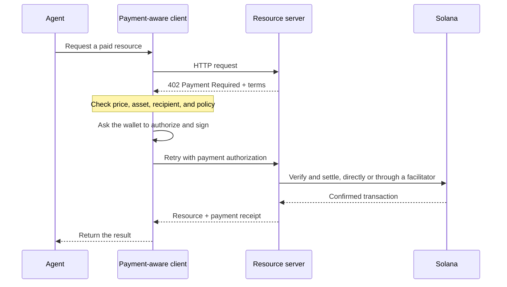

Pembayaran agentik memungkinkan perangkat lunak menemukan harga, mengotorisasi pembayaran, dan menerima
sumber daya dalam alur kerja HTTP yang sama. Agen dapat membayar kueri data, inferensi
model, atau pemanggilan tool tanpa harus membuat akun penagihan atau menyalin
kunci API terlebih dahulu.

<Cards>
  <Card title="MPP" href="/docs/payments/agentic-payments/mpp">
    Gunakan autentikasi HTTP untuk biaya sekali bayar dan sesi pembayaran berbasis pemakaian.
  </Card>
  <Card title="x402" href="/docs/payments/agentic-payments/x402">
    Tambahkan persyaratan pembayaran, tanda tangan, dan penyelesaian x402 V2 ke sumber daya
    HTTP.
  </Card>
</Cards>

## Alur pembayaran umum

MPP dan x402 menggunakan header dan model data yang berbeda, tetapi alur HTTP dasarnya
mirip:

## MPP dan x402

Kedua protokol dapat menyelesaikan pembayaran stablecoin di Solana. Pilih berdasarkan
model pembayaran dan interoperabilitas yang dibutuhkan layanan Anda, bukan hanya karena kode status
`402` yang sama.

|                         | MPP                                                               | x402                                                                     |
| ----------------------- | ----------------------------------------------------------------- | ------------------------------------------------------------------------ |
| Tantangan (challenge)               | `WWW-Authenticate: Payment`                                       | `PAYMENT-REQUIRED`                                                       |
| Otorisasi klien    | `Authorization: Payment`                                          | `PAYMENT-SIGNATURE`                                                      |
| Tanda terima                 | `Payment-Receipt`                                                 | `PAYMENT-RESPONSE`                                                       |
| Model pembayaran Solana   | Intent `charge` sekali bayar dan `session` berbasis pemakaian dengan batas maksimum           | Skema seperti `exact` dan `upto`; dukungan bervariasi menurut jaringan dan klien |
| Arsitektur penyelesaian | Validasi server, atau relay atau gateway opsional                | Server sumber daya dengan verifikasi lokal atau facilitator                 |
| Titik awal yang baik     | API yang membutuhkan semantik autentikasi HTTP atau pengukuran pemakaian berulang | Sumber daya bayar per permintaan dan klien x402 yang sudah ada                      |

MPP adalah **Machine Payments Protocol**. Jangan bingung dengan **Model
Context Protocol (MCP)**. MCP menyediakan tool dan sumber daya bagi agen; MPP atau x402
dapat mewajibkan pembayaran saat agen memanggil salah satu tool tersebut.

<Callout type="info">
  Sebuah layanan dapat menawarkan lebih dari satu protokol. Klien memilih opsi
  pembayaran yang didukungnya, lalu menggunakan header challenge, otorisasi, dan
  tanda terima yang sesuai selama seluruh pertukaran.
</Callout>
