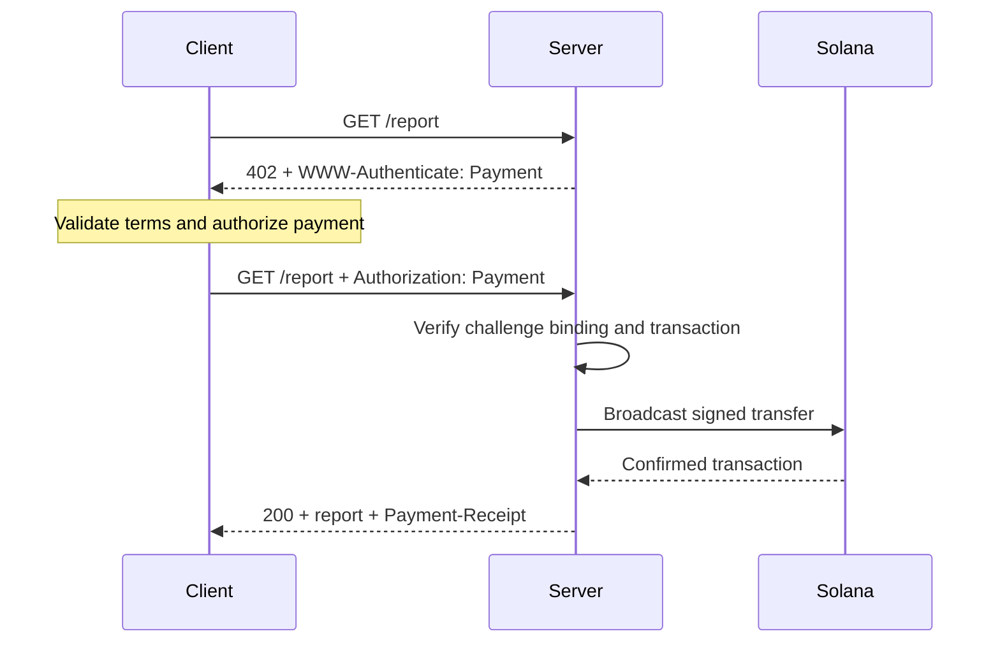
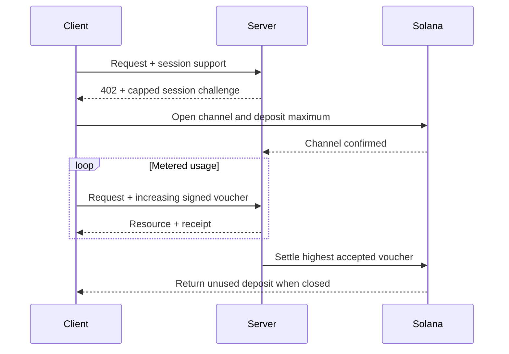

[Machine Payments Protocol (MPP)](https://mpp.dev/) menerapkan semantik autentikasi HTTP
pada pembayaran. Server menantang (challenge) permintaan yang belum dibayar, klien
mengembalikan kredensial pembayaran, dan server mengirimkan tanda terima setelah
menerima pembayaran tersebut.

MPP memisahkan tiga aspek:

- Sebuah **intent** menjelaskan interaksi komersial, seperti `charge` satu kali
  atau `session` berbasis penggunaan.
- Sebuah **metode pembayaran** menjelaskan bagaimana nilai berpindah. Metode Solana mendukung
  SOL native dan token SPL untuk charge.
- Sebuah **transport** HTTP membawa challenge, kredensial, tanda terima, dan error.

MPP dipublikasikan sebagai kumpulan Internet-Draft. Anggaplah
[spesifikasi terbaru](https://paymentauth.org/) sebagai sumber acuan utama dan
perkirakan detailnya akan berubah selama draf masih dalam pengerjaan.

## Pertukaran HTTP

MPP menggunakan field autentikasi HTTP standar, bukan header pembayaran
khusus protokol:

| Pesan                 | Representasi HTTP                                         |
| ----------------------- | ----------------------------------------------------------- |
| Challenge pembayaran       | `402 Payment Required` dengan `WWW-Authenticate: Payment ...` |
| Kredensial pembayaran      | Permintaan yang dikirim ulang dengan `Authorization: Payment ...`           |
| Tanda terima berhasil      | Respons resource dengan `Payment-Receipt: ...`               |
| Detail pembayaran tidak valid | Body Problem Details menggunakan `application/problem+json`       |



Sebuah challenge mencakup ID yang dibuat server, realm, metode, intent, permintaan
pembayaran yang dienkode, dan masa berlaku. Kredensial mengulang challenge tersebut dan menambahkan
bukti pembayaran khusus metode. Server harus memverifikasi keduanya; transfer
valid yang merujuk ke challenge lain tidak boleh membuka akses ke resource.

## Charge Solana satu kali

Intent `charge` Solana mendukung dua jenis kredensial:

- **Mode pull** menggunakan transaksi yang ditandatangani. Klien menandatangani transfer dan
  mengirim transaksi ke server. Server memverifikasi, secara opsional menambahkan
  tanda tangan fee-payer, menyiarkan (broadcast), mengonfirmasi, lalu mengembalikan tanda tangan
  transaksi dalam tanda terimanya.
- **Mode push** menggunakan tanda tangan transaksi. Klien menyiarkan transaksi terlebih dahulu, lalu
  mengirim tanda tangan yang telah dikonfirmasi ke server. Server mengambil dan memverifikasi
  transaksi sebelum mengembalikan resource.

Mode pull memungkinkan biaya transaksi disponsori server dan logika retry di sisi server.
Mode push berguna ketika dompet mengharuskan klien mengirimkan transaksinya
sendiri, tetapi mode ini tidak dapat memanfaatkan sponsor biaya dari server.

Untuk field normatif dan aturan verifikasi, lihat
[spesifikasi charge Solana](https://paymentauth.org/draft-solana-charge-00.html).

## Menambahkan charge MPP ke API Express

Solana Pay Kit menyediakan integrasi TypeScript terbaru untuk MPP dan x402.
Instal bersama Express:

```bash
pnpm add @solana/pay-kit @solana/kit@^6.9.0 express
pnpm add --save-dev @types/express tsx
```

Contoh paling sederhana ini menggunakan sandbox Surfpool yang di-hosting dan penerima demo publik
dari paket. Contoh ini hanya untuk pengembangan lokal:

```ts filename=server.ts
import express from "express";
import { createPayKit, usd } from "@solana/pay-kit";

const pay = await createPayKit({
  accept: ["mpp"],
  rpcUrl: "https://402.surfnet.dev:8899"
});

const app = express();

app.get("/report", pay.express(usd("0.01")), (_req, res) => {
  res.json({ report: "Paid report" });
});

app.listen(4567, () => {
  console.log("Paid API listening on http://127.0.0.1:4567");
});
```

Jalankan, lalu bandingkan permintaan yang belum dibayar dengan permintaan yang mendukung pembayaran:

```bash
pnpm tsx server.ts
curl -i http://127.0.0.1:4567/report
pay --sandbox curl http://127.0.0.1:4567/report
```

Route handler hanya berjalan setelah middleware menerima pembayaran.

<Callout type="warn" title="Ganti setiap default sandbox di lingkungan produksi">
  Konfigurasikan jaringan yang eksplisit, penerima merchant, RPC khusus, secret
  pengikat challenge yang stabil, signer produksi, dan penyimpanan replay yang tahan lama. Jangan
  pernah mengarahkan pembayaran sungguhan ke signer demo dari paket.
</Callout>

## Sesi berbasis penggunaan

Gunakan `session` MPP Solana ketika klien akan melakukan banyak pembayaran kecil yang saling terkait.
Sebuah sesi membuka payment channel onchain dengan deposit maksimum, lalu menggunakan
voucher bertanda tangan kumulatif seiring bertambahnya penggunaan. Server dapat memverifikasi voucher
secara offchain dan menyelesaikan (settle) jumlah tertinggi yang diterima di kemudian waktu.

Ini berguna untuk inferensi yang diukur per token, unduhan yang diukur per byte, data langsung,
dan pemanggilan tool berulang. Ini tidak sama dengan mengirim pembayaran onchain
terpisah untuk setiap kejadian.



Sebut sesi sebagai **pembayaran sesi**, **payment channel**, atau **otorisasi berulang
berbatas**. Sebut sebagai pembayaran streaming hanya jika layanan dan kontrak pembayaran
benar-benar mengukur aliran penggunaan.

## Verifikasi produksi

Untuk setiap charge Solana, server setidaknya harus memverifikasi:

- Challenge autentik, belum kedaluwarsa, terikat ke permintaan ini, dan ditujukan untuk
  realm ini.
- Transaksi menggunakan jaringan, aset atau mint, penerima, jumlah,
  dan Token Program yang diharapkan.
- Setiap instruksi fee-payer atau associated token account diizinkan secara eksplisit
  dan tidak dapat menguras signer server.
- Transaksi berhasil pada tingkat commitment yang diwajibkan.
- Tanda tangan transaksi belum pernah digunakan.
- Pemeriksaan replay dan operasi konsumsi bersifat atomik di semua instans server.

Untuk sesi, simpan juga status channel, jumlah kumulatif yang diterima, dan
watermark penyelesaian di penyimpanan bersama. Dokumentasikan bagaimana klien memulihkan dana
yang tidak terpakai jika server menjadi tidak tersedia.

## Sumber daya terkait

- [Spesifikasi MPP](https://paymentauth.org/)
- [Dokumentasi protokol MPP](https://mpp.dev/protocol)
- [Solana Pay Kit](https://github.com/solana-foundation/pay-kit)
- [Ikhtisar pembayaran agentik](/docs/payments/agentic-payments)
- [Kesiapan produksi](/docs/tools/production-readiness)
