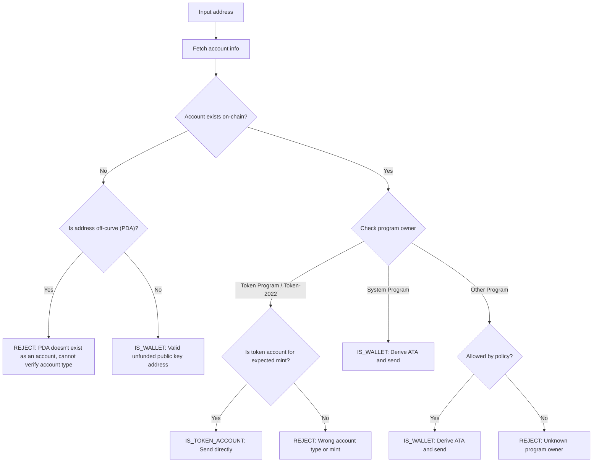

Mengirim token ke alamat yang salah dapat mengakibatkan kehilangan dana secara
permanen. Verifikasi alamat memastikan Anda hanya mengirim token ke alamat yang
dapat menerima dan mengaksesnya dengan benar.

<Callout>
  Lihat [Cara Kerja Pembayaran di Solana](/docs/payments/how-payments-work)
  untuk konsep pembayaran inti.
</Callout>

## Memahami alamat Solana

Akun Solana memiliki dua jenis alamat, on-curve dan off-curve.

### Alamat on-curve

Alamat standar adalah kunci publik dari keypair Ed25519. Alamat ini:

- Memiliki kunci privat yang sesuai yang dapat menandatangani transaksi
- Digunakan sebagai alamat wallet

### Alamat off-curve (PDA)

[Program Derived Address](/docs/core/pda) diturunkan secara deterministik dari
ID program dan seed. Alamat ini:

- **Tidak** memiliki kunci privat yang sesuai
- Hanya dapat ditandatangani oleh program tempat alamat tersebut diturunkan

## Jenis akun dalam pembayaran

Gunakan alamat untuk mengambil [akun](/docs/core/accounts) dari jaringan,
periksa pemilik program dan jenis akunnya untuk menentukan cara menangani alamat
tersebut.

<Callout>
  Mengetahui apakah suatu alamat on-curve atau off-curve tidak memberi tahu Anda
  jenis akun apa itu, program apa yang memilikinya, atau apakah akun ada di
  alamat tersebut. Anda harus mengambil akun dari jaringan untuk menentukan
  detail ini.
</Callout>

### Akun System Program (wallet)

Akun yang dimiliki oleh System Program adalah wallet standar. Untuk mengirim
token SPL ke wallet, Anda menurunkan dan menggunakan
[associated token account (ATA)](/docs/tokens/basics/create-token-account#whats-an-associated-token-account)-nya.

Setelah menurunkan alamat ATA, periksa apakah token account ada di on-chain.
Jika ATA tidak ada, Anda dapat menyertakan instruksi untuk membuat token account
penerima dalam transaksi yang sama dengan transfer. Namun, ini memerlukan
pembayaran rent untuk token account baru. Karena penerima memiliki ATA, SOL yang
dibayarkan untuk rent tidak dapat dikembalikan oleh pengirim.

<Callout type="warn">
  Tanpa perlindungan, mensubsidi pembuatan ATA dapat dieksploitasi. Pengguna
  jahat dapat meminta transfer, membuat ATA mereka dengan biaya Anda, menutup
  ATA untuk mengklaim kembali SOL rent, dan mengulanginya.
</Callout>

### Token account

[Token account](/docs/tokens/basics/create-token-account) dimiliki oleh Token
Program atau Token-2022 Program dan menyimpan saldo token. Jika alamat yang Anda
terima dimiliki oleh token program, Anda harus memverifikasi bahwa akun tersebut
adalah token account (bukan mint account) dan sesuai dengan mint account token
yang diharapkan sebelum mengirim.

<Callout type="info">
  Token Program secara otomatis memvalidasi bahwa kedua token account dalam
  transfer menyimpan token dari mint yang sama. Jika validasi gagal, transaksi
  ditolak dan tidak ada dana yang hilang.
</Callout>

### Mint account

[Mint account](/docs/tokens/basics/create-mint) melacak pasokan token dan
metadata dari token tertentu. Mint account juga dimiliki oleh Token Program
tetapi **bukan** penerima yang valid untuk transfer token. Mencoba mengirim
token ke alamat mint akan menghasilkan transaksi yang gagal, tetapi tidak ada
dana yang hilang.

### Akun lainnya

Akun yang dimiliki oleh program lain memerlukan keputusan kebijakan. Beberapa
akun (misalnya dompet multisig) mungkin merupakan pemilik token account yang
valid, sementara yang lain harus ditolak.

## Alur verifikasi

Diagram berikut menunjukkan pohon keputusan referensi untuk memvalidasi alamat:



<Steps>
<Step>

### Ambil akun

Gunakan alamat untuk mengambil detail akun dari jaringan.

</Step>
<Step>

### Akun tidak ada

Jika tidak ada akun di alamat ini, periksa apakah alamat tersebut on-curve atau
off-curve:

- **Off-curve (PDA)**: Tolak alamat secara konservatif untuk menghindari
  pengiriman ke ATA yang mungkin tidak dapat diakses. Tanpa akun yang ada, Anda
  tidak dapat menentukan dari alamat saja program mana yang menurunkan PDA ini
  atau apakah alamat tersebut untuk ATA. Menurunkan ATA untuk alamat ini untuk
  mengirim token dapat mengakibatkan dana terkunci dalam token account yang
  tidak dapat diakses.

- **On-curve**: Ini adalah alamat wallet yang valid (public key) yang belum
  didanai. Turunkan ATA, periksa apakah ada, dan kirim token ke sana. Anda harus
  membuat keputusan kebijakan apakah akan mendanai pembuatan ATA jika belum ada.

</Step>
<Step>

### Akun ada

Jika akun ada, periksa program mana yang memilikinya:

- **System Program**: Ini adalah wallet standar. Turunkan ATA, periksa apakah
  ada, dan kirim token ke sana. Anda harus membuat keputusan kebijakan apakah
  akan mendanai pembuatan ATA jika belum ada.

- **Token Program / Token-2022**: Verifikasi bahwa akun tersebut adalah token
  account (bukan mint account) dan bahwa akun tersebut menyimpan token (mint)
  yang ingin Anda kirim. Jika valid, kirim token langsung ke alamat ini. Jika
  itu adalah mint account atau token account untuk mint yang berbeda, tolak
  alamatnya.

- **Program Lain**: Ini memerlukan keputusan kebijakan. Beberapa program seperti
  multisig wallet mungkin merupakan pemilik token account yang dapat diterima.
  Jika kebijakan Anda mengizinkannya, turunkan ATA dan kirim. Jika tidak, tolak
  alamatnya.

</Step>
</Steps>

## Demo

Contoh berikut hanya menunjukkan logika validasi alamat. Ini adalah kode
referensi untuk tujuan ilustrasi.

<Callout>
  Demo ini tidak menunjukkan cara menurunkan ATA atau membangun transaksi untuk
  mengirim token. Lihat dokumentasi [token
  account](/docs/tokens/basics/create-token-account#how-to-create-an-associated-token-account)
  dan [transfer token](/docs/tokens/basics/transfer-tokens) untuk contoh kode.
</Callout>

Demo di bawah ini menggunakan tiga kemungkinan hasil:

| Hasil              | Arti                     | Tindakan                                       |
| ------------------ | ------------------------ | ---------------------------------------------- |
| `IS_WALLET`        | Alamat wallet yang valid | Turunkan dan kirim ke associated token account |
| `IS_TOKEN_ACCOUNT` | Token account yang valid | Kirim token langsung ke alamat ini             |
| `REJECT`           | Alamat tidak valid       | Jangan kirim                                   |

<CodeTabs flags="r">

```ts !! title="Demo"
// !collapse(1:35) collapsed

import {
  type Address,
  type Rpc,
  type GetAccountInfoApi,
  createSolanaRpc,
  fetchJsonParsedAccount,
  isOffCurveAddress,
  generateKeyPairSigner,
  getProgramDerivedAddress
} from "@solana/kit";

// =============================================================================
// Constants
// =============================================================================

const defaultRpc = createSolanaRpc("https://api.mainnet-beta.solana.com");

const SYSTEM_PROGRAM = "11111111111111111111111111111111" as Address;
const TOKEN_PROGRAM = "TokenkegQfeZyiNwAJbNbGKPFXCWuBvf9Ss623VQ5DA" as Address;
const TOKEN_2022_PROGRAM =
  "TokenzQdBNbLqP5VEhdkAS6EPFLC1PHnBqCXEpPxuEb" as Address;

// =============================================================================
// Validation Function
// =============================================================================

/**
 * Possible validation results for an input address.
 */
export type ValidationResult =
  | { type: "IS_TOKEN_ACCOUNT" }
  | { type: "IS_WALLET" }
  | { type: "REJECT"; reason: string };

/**
 * Validates an input address and classifies it as a wallet, token account, or invalid.
 *
 * @param inputAddress - The address to validate
 * @param rpc - Optional RPC client (defaults to mainnet)
 * @returns Classification result:
 *   - IS_WALLET: Valid wallet address
 *   - IS_TOKEN_ACCOUNT: Valid token account
 *   - REJECT: Invalid address for transfers
 */
export async function validateAddress(
  inputAddress: Address,
  rpc: Rpc<GetAccountInfoApi> = defaultRpc
): Promise<ValidationResult> {
  const account = await fetchJsonParsedAccount(rpc, inputAddress);
  // Log the account data for demo
  console.log("\nAccount:", account);

  // Account doesn't exist on-chain
  if (!account.exists) {
    // Off-curve = PDA that doesn't exist as an account
    // Reject conservatively to avoid sending to an address that may be inaccessible.
    if (isOffCurveAddress(inputAddress)) {
      return { type: "REJECT", reason: "PDA doesn't exist as an account" };
    }
    // On-curve = valid keypair address, treat as unfunded wallet
    return { type: "IS_WALLET" };
  }

  // Account exists, check program owner
  const owner = account.programAddress;

  // System Program = wallet
  if (owner === SYSTEM_PROGRAM) {
    return { type: "IS_WALLET" };
  }

  // Token Program or Token-2022, check if token account
  if (owner === TOKEN_PROGRAM || owner === TOKEN_2022_PROGRAM) {
    const accountType = (
      account.data as { parsedAccountMeta?: { type?: string } }
    ).parsedAccountMeta?.type;

    if (accountType === "account") {
      return { type: "IS_TOKEN_ACCOUNT" };
    }
    // Reject if not a token account (mint account)
    return {
      type: "REJECT",
      reason: "Not a token account"
    };
  }

  // Unknown program owner
  return { type: "REJECT", reason: "Unknown program owner" };
}

// =============================================================================
// Examples
// =============================================================================
// !collapse(1:1000) collapsed

// Wallets
const EXISTING_WALLET =
  "H8sMJSCQxfKiFTCfDR3DUMLPwcRbM61LGFJ8N4dK3WjS" as Address;
const NEW_WALLET = (await generateKeyPairSigner()).address;

// Token accounts
const USDC_TOKEN_ACCOUNT =
  "3emsAVdmGKERbHjmGfQ6oZ1e35dkf5iYcS6U4CPKFVaa" as Address;
const PYUSD_TOKEN_ACCOUNT =
  "47od2TPRvqJipfPVWZdyenLEngPw8hC36nDxiLyvGsEP" as Address;

// Token mints (should be rejected)
const USDC_MINT = "EPjFWdd5AufqSSqeM2qN1xzybapC8G4wEGGkZwyTDt1v" as Address;
const PYUSD_MINT = "2b1kV6DkPAnxd5ixfnxCpjxmKwqjjaYmCZfHsFu24GXo" as Address;

// PDA that doesn't exist (should be rejected)
const [NON_EXISTENT_PDA] = await getProgramDerivedAddress({
  programAddress: (await generateKeyPairSigner()).address,
  seeds: ["seed"]
});

// Program account (should be rejected)
const PROGRAM_ACCOUNT =
  "p1exdMJcjVao65QdewkaZRUnU6VPSXhus9n2GzWfh98" as Address;

async function runExample(label: string, address: Address) {
  console.log(`\n${"─".repeat(60)}`);
  console.log(`Example: ${label}`);
  console.log(`Input: ${address}`);
  console.log(`${"─".repeat(60)}`);

  const result = await validateAddress(address);
  console.log("\nResult:", result);
}

console.log("\n" + "═".repeat(60));
console.log("  IS_WALLET Examples");
console.log("═".repeat(60));

await runExample("Existing funded wallet", EXISTING_WALLET);
await runExample("New wallet (unfunded)", NEW_WALLET);

console.log("\n" + "═".repeat(60));
console.log("  IS_TOKEN_ACCOUNT Examples");
console.log("═".repeat(60));

await runExample("USDC token account (Token Program)", USDC_TOKEN_ACCOUNT);
await runExample("PYUSD token account (Token-2022)", PYUSD_TOKEN_ACCOUNT);

console.log("\n" + "═".repeat(60));
console.log("  REJECT Examples");
console.log("═".repeat(60));

await runExample("USDC mint address", USDC_MINT);
await runExample("PYUSD mint address", PYUSD_MINT);
await runExample("Non-existent PDA", NON_EXISTENT_PDA);
await runExample("Program account", PROGRAM_ACCOUNT);

console.log("\n" + "═".repeat(60));
console.log("  Done!");
console.log("═".repeat(60) + "\n");
```

</CodeTabs>
