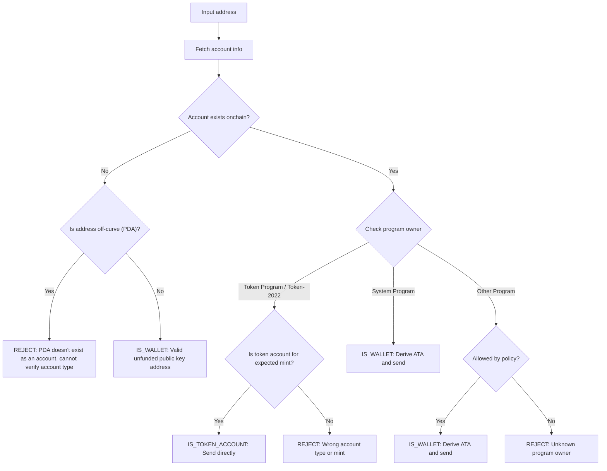

Mengirim dana ke alamat yang salah dapat mengakibatkan kehilangan permanen.
Verifikasi alamat memastikan Anda hanya mengirim ke alamat yang dapat menerima
dan mengakses dana dengan benar.

Validasi bergantung pada apa yang Anda kirim:

- **Token SPL** sebagian bersifat melindungi diri sendiri. Token Program menolak
  transfer yang akunnya tidak sesuai dengan mint yang diharapkan, sehingga
  transfer token yang salah arah gagal tanpa kehilangan dana. Sebagian besar
  halaman ini membahas pengiriman token SPL.
- **SOL native** tidak memiliki perlindungan seperti itu. Transfer System
  Program berhasil masuk ke akun mana pun, sehingga penerima yang salah akan
  mengunci SOL secara permanen. Lihat
  [Mengirim SOL native](#sending-native-sol).

<Callout>
  Lihat [Cara Pembayaran Bekerja di Solana](/docs/payments/how-payments-work)
  untuk konsep pembayaran inti.
</Callout>

## Memahami Alamat Solana

Akun Solana memiliki dua jenis alamat, yaitu on-curve dan off-curve.

### Alamat On-Curve

Alamat standar adalah kunci publik dari keypair Ed25519. Alamat-alamat ini:

- Memiliki kunci privat yang dapat menandatangani transaksi
- Digunakan sebagai alamat dompet

### Alamat Off-Curve (PDA)

[Program Derived Address](/docs/core/pda) diturunkan secara deterministik dari
ID program dan seed. Alamat-alamat ini:

- **Tidak** memiliki kunci privat yang sesuai
- Hanya dapat ditandatangani oleh program tempat alamat tersebut diturunkan

## Jenis Akun dalam Pembayaran

Gunakan alamat untuk mengambil [akun](/docs/core/accounts) dari jaringan,
periksa pemilik program dan jenis akunnya untuk menentukan cara menangani alamat
tersebut.

<Callout>
  Mengetahui apakah suatu alamat berada on-curve atau off-curve tidak memberi
  tahu Anda jenis akun apa itu, program apa yang memilikinya, atau apakah akun
  ada di alamat tersebut. Anda harus mengambil akun dari jaringan untuk
  menentukan detail ini.
</Callout>

### Akun System Program (Dompet)

Akun yang dimiliki oleh System Program adalah dompet standar. Untuk mengirim
token SPL ke sebuah dompet, Anda perlu menurunkan dan menggunakan
[Associated Token Account (ATA)](/docs/tokens/basics/create-token-account#whats-an-associated-token-account)-nya.

Setelah menurunkan alamat ATA, periksa apakah token account tersebut sudah ada
di onchain. Jika ATA belum ada, Anda dapat menyertakan instruksi untuk membuat
token account penerima dalam transaksi yang sama dengan transfer. Namun, hal ini
mengharuskan pembayaran rent untuk token account baru tersebut. Karena penerima
yang memiliki ATA, SOL yang dibayarkan untuk rent tidak dapat dikembalikan
kepada pengirim.

<Callout type="warn">
  Tanpa pengamanan yang memadai, subsidi pembuatan ATA dapat dieksploitasi.
  Pengguna yang berniat jahat dapat meminta transfer, membuat ATA mereka atas
  biaya Anda, menutup ATA untuk mengklaim kembali SOL dari rent, lalu
  mengulanginya.
</Callout>

### Token Accounts

[Token accounts](/docs/tokens/basics/create-token-account) dimiliki oleh Token
Program atau Token-2022 Program dan menyimpan saldo token. Jika alamat yang Anda
terima dimiliki oleh token program, Anda harus memverifikasi bahwa akun tersebut
adalah token account (bukan mint account) dan sesuai dengan mint account token
yang diharapkan sebelum mengirim.

<Callout type="info">
  Token Programs secara otomatis memvalidasi bahwa kedua token account dalam
  sebuah transfer menyimpan token dari mint yang sama. Jika validasi gagal,
  transaksi akan ditolak dan tidak ada dana yang hilang.
</Callout>

### Mint Accounts

[Mint accounts](/docs/tokens/basics/create-mint) melacak pasokan token dan
metadata dari token tertentu. Mint accounts juga dimiliki oleh Token Programs,
tetapi **tidak** dapat menjadi penerima yang valid untuk transfer token. Mencoba
mengirim token ke alamat mint akan menghasilkan transaksi yang gagal, namun
tidak ada dana yang hilang.

### Akun Lainnya

Akun yang dimiliki oleh program lain memerlukan keputusan kebijakan. Beberapa
akun (misalnya dompet multisig) mungkin merupakan pemilik token account yang
valid, sementara yang lain sebaiknya ditolak.

## Mengirim SOL Native

Klasifikasi di atas menentukan ke mana token SPL dapat dikirim. SOL native lebih
ketat: satu-satunya penerima yang aman adalah **dompet System Program** (atau
alamat on-curve yang belum didanai yang nantinya menjadi satu).

Transfer System Program menambahkan lamport ke akun mana pun, termasuk mint,
token account, program, dan PDA. Lamport hanya dapat dipindahkan keluar oleh
program pemilik akun, sehingga mengirim SOL ke penerima yang salah dapat
mengakibatkan dana hilang secara permanen.

Tidak seperti transfer token SPL, transaksi **tidak** gagal ketika penerima
adalah alamat yang tidak terduga.

Saat mengirim SOL native, hanya hasil `IS_WALLET` yang dapat diterima.
`IS_TOKEN_ACCOUNT` **tidak**: sebuah token account menyimpan token SPL, dan SOL
yang dikirim ke sana berada di luar kendali pengirim.

<Callout type="warn">
  Ini adalah cara umum SOL hilang: pengguna menempel alamat mint token (atau
  alamat program) ke dalam penarikan SOL. Transfer berhasil dan SOL tidak dapat
  dipulihkan. Selalu klasifikasikan penerima sebelum menandatangani transfer
  SOL.
</Callout>

## Alur Verifikasi

Diagram berikut menunjukkan pohon keputusan referensi untuk memvalidasi sebuah
alamat:


```mermaid title="Address Verification Flow"
flowchart TD
    A["Input address"]
    B["Fetch account info"]

    A --> B
    B --> C{"Account exists onchain?"}

    %% --- Non-existent account path ---
    C -- "No" --> D{"Is address off-curve (PDA)?"}
    D -- "Yes" --> R1["REJECT: PDA doesn't exist as an account, cannot verify account type"]
    D -- "No" --> W1["IS_WALLET: Valid unfunded public key address"]

    %% --- Existing account path ---
    C -- "Yes" --> F{"Check program owner"}

    F -- "Token Program / Token-2022" --> G{"Is token account for expected mint?"}
    G -- "Yes" --> T1["IS_TOKEN_ACCOUNT: Send directly"]
    G -- "No" --> R2["REJECT: Wrong account type or mint"]

    F -- "System Program" --> W2["IS_WALLET: Derive ATA and send"]

    F -- "Other Program" --> K{"Allowed by policy?"}
    K -- "Yes" --> W3["IS_WALLET: Derive ATA and send"]
    K -- "No" --> R3["REJECT: Unknown program owner"]
```

<Steps>
<Step>

### Ambil Akun

Gunakan alamat untuk mengambil detail akun dari jaringan.

</Step>
<Step>

### Akun Tidak Ada

Jika tidak ada akun di alamat ini, periksa apakah alamat tersebut berada
on-curve atau off-curve:

- **Off-curve (PDA)**: Tolak alamat secara konservatif untuk menghindari
  pengiriman ke ATA yang mungkin tidak dapat diakses. Tanpa akun yang sudah ada,
  Anda tidak dapat menentukan hanya dari alamat tersebut program mana yang
  menurunkan PDA ini atau apakah alamat tersebut untuk sebuah ATA. Menurunkan
  ATA untuk alamat ini guna mengirim token dapat mengakibatkan dana terkunci di
  dalam token account yang tidak dapat diakses.

- **On-curve**: Ini adalah alamat dompet valid (kunci publik) yang belum
  didanai. Turunkan ATA, periksa apakah ada, dan kirim token ke sana. Anda harus
  membuat keputusan kebijakan apakah akan mendanai pembuatan ATA jika belum ada.

</Step>
<Step>

### Akun ada

Jika akun ada, periksa program mana yang memilikinya:

- **System Program**: Ini adalah dompet standar. Turunkan ATA, periksa apakah
  ada, dan kirim token ke sana. Anda harus membuat keputusan kebijakan apakah
  akan mendanai pembuatan ATA jika belum ada.

- **Token Program / Token-2022**: Verifikasi bahwa akun tersebut adalah token
  account (bukan mint account) dan bahwa akun tersebut menyimpan token (mint)
  yang ingin Anda kirim. Jika valid, kirim token langsung ke alamat ini. Jika
  itu adalah mint account atau token account untuk mint yang berbeda, tolak
  alamat tersebut.

- **Program Lain**: Ini memerlukan keputusan kebijakan. Beberapa program seperti
  dompet multisig mungkin merupakan pemilik token account yang dapat diterima.
  Jika kebijakan Anda mengizinkannya, turunkan ATA dan kirim. Jika tidak, tolak
  alamat tersebut.

</Step>
</Steps>

## Demo

Contoh berikut hanya menampilkan logika validasi alamat. Ini adalah kode
referensi untuk tujuan ilustrasi.

<Callout>
  Demo tidak menampilkan cara menurunkan ATA atau membangun transaksi untuk
  mengirim token. Lihat dokumentasi [token
  account](/docs/tokens/basics/create-token-account#how-to-create-an-associated-token-account)
  dan [transfer token](/docs/tokens/basics/transfer-tokens) untuk contoh kode.
</Callout>

Demo di bawah ini menggunakan tiga kemungkinan hasil:

| Result             | Meaning             | Action                                         |
| ------------------ | ------------------- | ---------------------------------------------- |
| `IS_WALLET`        | Alamat dompet valid | Turunkan dan kirim ke associated token account |
| `IS_TOKEN_ACCOUNT` | Token account valid | Kirim token langsung ke alamat ini             |
| `REJECT`           | Alamat tidak valid  | Jangan kirim                                   |

Kemudian memetakan setiap hasil ke akseptabilitas per aset dengan
`canReceiveNativeSol` (khusus dompet) dan `canReceiveSplToken` (dompet atau
token account). Sebuah associated token account mengembalikan
`IS_TOKEN_ACCOUNT`, sehingga dapat menerima token SPL tetapi **tidak** SOL
native — perbedaan yang mencegah SOL terkunci.

<CodeTabs flags="r">

```ts !! title="Demo"
// !collapse(1:35) collapsed

import {
  type Address,
  type Rpc,
  type GetAccountInfoApi,
  createSolanaRpc,
  fetchJsonParsedAccount,
  isOffCurveAddress,
  generateKeyPairSigner,
  getProgramDerivedAddress
} from "@solana/kit";

// =============================================================================
// Constants
// =============================================================================

const defaultRpc = createSolanaRpc("https://api.mainnet-beta.solana.com");

const SYSTEM_PROGRAM = "11111111111111111111111111111111" as Address;
const TOKEN_PROGRAM = "TokenkegQfeZyiNwAJbNbGKPFXCWuBvf9Ss623VQ5DA" as Address;
const TOKEN_2022_PROGRAM =
  "TokenzQdBNbLqP5VEhdkAS6EPFLC1PHnBqCXEpPxuEb" as Address;

// =============================================================================
// Validation Function
// =============================================================================

/**
 * Possible validation results for an input address.
 */
export type ValidationResult =
  | { type: "IS_TOKEN_ACCOUNT" }
  | { type: "IS_WALLET" }
  | { type: "REJECT"; reason: string };

/**
 * Validates an input address and classifies it as a wallet, token account, or invalid.
 *
 * @param inputAddress - The address to validate
 * @param rpc - Optional RPC client (defaults to mainnet)
 * @returns Classification result:
 *   - IS_WALLET: Valid wallet address
 *   - IS_TOKEN_ACCOUNT: Valid token account
 *   - REJECT: Invalid address for transfers
 */
export async function validateAddress(
  inputAddress: Address,
  rpc: Rpc<GetAccountInfoApi> = defaultRpc
): Promise<ValidationResult> {
  const account = await fetchJsonParsedAccount(rpc, inputAddress);
  // Log the account data for demo
  console.log("\nAccount:", account);

  // Account doesn't exist onchain
  if (!account.exists) {
    // Off-curve = PDA that doesn't exist as an account
    // Reject conservatively to avoid sending to an address that may be inaccessible.
    if (isOffCurveAddress(inputAddress)) {
      return { type: "REJECT", reason: "PDA doesn't exist as an account" };
    }
    // On-curve = valid keypair address, treat as unfunded wallet
    return { type: "IS_WALLET" };
  }

  // Account exists, check program owner
  const owner = account.programAddress;

  // System Program = wallet
  if (owner === SYSTEM_PROGRAM) {
    return { type: "IS_WALLET" };
  }

  // Token Program or Token-2022, check if token account
  if (owner === TOKEN_PROGRAM || owner === TOKEN_2022_PROGRAM) {
    const accountType = (
      account.data as { parsedAccountMeta?: { type?: string } }
    ).parsedAccountMeta?.type;

    if (accountType === "account") {
      return { type: "IS_TOKEN_ACCOUNT" };
    }
    // Reject if not a token account (mint account)
    return {
      type: "REJECT",
      reason: "Not a token account"
    };
  }

  // Unknown program owner
  return { type: "REJECT", reason: "Unknown program owner" };
}

/**
 * Native SOL is only safe to send to a wallet. Any other account locks it.
 */
function canReceiveNativeSol(result: ValidationResult): boolean {
  return result.type === "IS_WALLET";
}

/**
 * SPL tokens can go to a wallet (via its ATA) or directly to a token account.
 */
function canReceiveSplToken(result: ValidationResult): boolean {
  return result.type === "IS_WALLET" || result.type === "IS_TOKEN_ACCOUNT";
}

// =============================================================================
// Examples
// =============================================================================
// !collapse(1:1000) collapsed

// Wallets
const EXISTING_WALLET =
  "H8sMJSCQxfKiFTCfDR3DUMLPwcRbM61LGFJ8N4dK3WjS" as Address;
const NEW_WALLET = (await generateKeyPairSigner()).address;

// Token accounts
const USDC_TOKEN_ACCOUNT =
  "3emsAVdmGKERbHjmGfQ6oZ1e35dkf5iYcS6U4CPKFVaa" as Address;
const PYUSD_TOKEN_ACCOUNT =
  "47od2TPRvqJipfPVWZdyenLEngPw8hC36nDxiLyvGsEP" as Address;

// Token mints (should be rejected)
const USDC_MINT = "EPjFWdd5AufqSSqeM2qN1xzybapC8G4wEGGkZwyTDt1v" as Address;
const PYUSD_MINT = "2b1kV6DkPAnxd5ixfnxCpjxmKwqjjaYmCZfHsFu24GXo" as Address;

// PDA that doesn't exist (should be rejected)
const [NON_EXISTENT_PDA] = await getProgramDerivedAddress({
  programAddress: (await generateKeyPairSigner()).address,
  seeds: ["seed"]
});

// Program account (should be rejected)
const PROGRAM_ACCOUNT =
  "p1exdMJcjVao65QdewkaZRUnU6VPSXhus9n2GzWfh98" as Address;

async function runExample(label: string, address: Address) {
  console.log(`\n${"─".repeat(60)}`);
  console.log(`Example: ${label}`);
  console.log(`Input: ${address}`);
  console.log(`${"─".repeat(60)}`);

  const result = await validateAddress(address);
  console.log("\nResult:", result);
  console.log(
    `Can receive SOL?   ${canReceiveNativeSol(result) ? "YES" : "NO"}`
  );
  console.log(
    `Can receive token? ${canReceiveSplToken(result) ? "YES" : "NO"}`
  );
}

console.log("\n" + "═".repeat(60));
console.log("  IS_WALLET Examples");
console.log("═".repeat(60));

await runExample("Existing funded wallet", EXISTING_WALLET);
await runExample("New wallet (unfunded)", NEW_WALLET);

console.log("\n" + "═".repeat(60));
console.log("  IS_TOKEN_ACCOUNT Examples");
console.log("═".repeat(60));

await runExample("USDC token account (Token Program)", USDC_TOKEN_ACCOUNT);
await runExample("PYUSD token account (Token-2022)", PYUSD_TOKEN_ACCOUNT);

console.log("\n" + "═".repeat(60));
console.log("  REJECT Examples");
console.log("═".repeat(60));

await runExample("USDC mint address", USDC_MINT);
await runExample("PYUSD mint address", PYUSD_MINT);
await runExample("Non-existent PDA", NON_EXISTENT_PDA);
await runExample("Program account", PROGRAM_ACCOUNT);

console.log("\n" + "═".repeat(60));
console.log("  Done!");
console.log("═".repeat(60) + "\n");
```

</CodeTabs>
