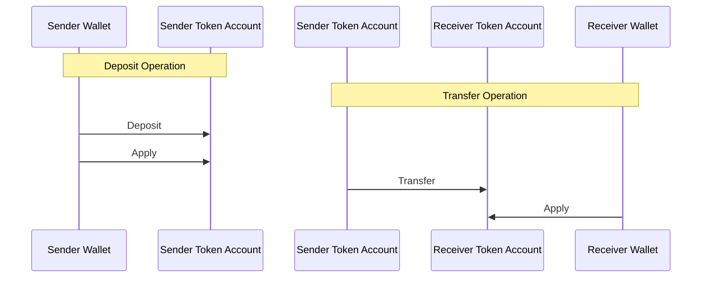
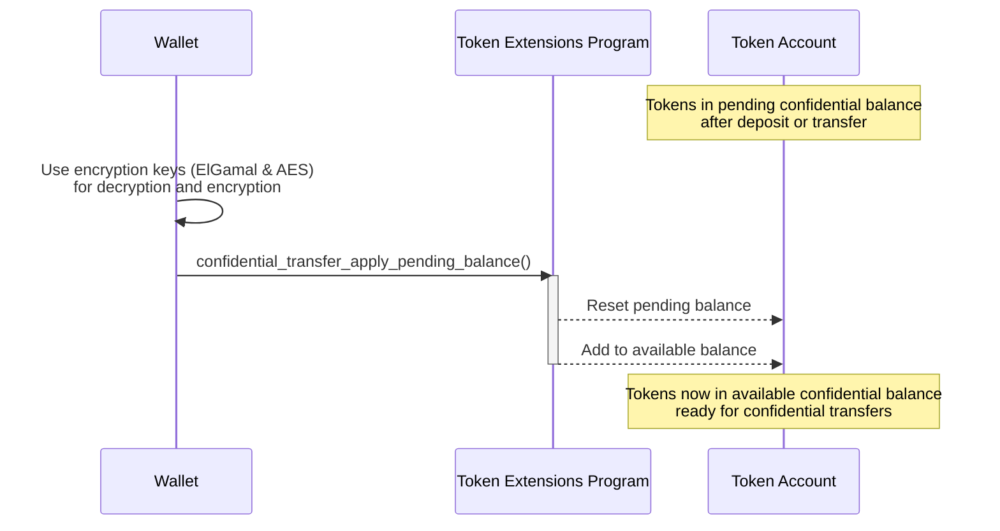

<Callout type="warn">
  Program ZK ElGamal sementara dinonaktifkan di mainnet dan devnet karena sedang
  menjalani audit keamanan. Ini berarti ekstensi transfer konfidensial saat ini
  tidak tersedia. Meskipun konsepnya masih valid, contoh kode tidak akan
  berjalan.
</Callout>

## Cara menerapkan saldo tertunda ke saldo yang tersedia

Sebelum token dapat ditransfer secara konfidensial, saldo token publik harus
dikonversi menjadi saldo konfidensial. Konversi ini terjadi dalam dua tahap:

1. **Saldo Tertunda Konfidensial**: Awalnya, token "disetor" dari saldo publik
   ke saldo konfidensial "tertunda".
2. **Saldo Tersedia Konfidensial**: Saldo tertunda kemudian "diterapkan" ke
   saldo yang tersedia, membuat token tersedia untuk transfer konfidensial.

Bagian ini menjelaskan tahap kedua: menerapkan saldo tertunda ke saldo yang
tersedia.

Ketika token "disetor" dari saldo publik atau ketika token ditransfer secara
konfidensial dari satu token account ke token account lain, token tersebut pada
awalnya ditambahkan ke saldo tertunda konfidensial. Sebelum token dapat
digunakan untuk transfer konfidensial, saldo tertunda harus "diterapkan" ke
saldo yang tersedia.



Diagram berikut menunjukkan langkah-langkah yang terlibat dalam menerapkan saldo
tertunda ke saldo yang tersedia:



### Instruksi yang Diperlukan

Untuk mengkonversi saldo tertunda menjadi saldo yang tersedia, panggil
[ConfidentialTransferInstruction::ApplyPendingBalance](https://github.com/solana-program/token-2022/blob/efd0c957fefbd79882d77df5fb2dac88c001249c/program/src/extension/confidential_transfer/processor.rs#L1152)
instruksi.

Crate `spl_token_client` menyediakan metode
`confidential_transfer_apply_pending_balance` yang membangun dan mengirim
transaksi dengan instruksi `ApplyPendingBalance`, seperti yang ditunjukkan dalam
contoh di bawah ini.

### Contoh Kode

Contoh berikut menunjukkan cara menerapkan saldo tertunda konfidensial ke saldo
tersedia konfidensial.

Untuk menjalankan contoh, mulai validator lokal dengan Token Extensions Program
yang dikloning dari mainnet menggunakan perintah berikut. Anda harus memiliki
Solana CLI terinstal untuk memulai validator lokal.

```terminal
$ solana-test-validator --clone-upgradeable-program TokenzQdBNbLqP5VEhdkAS6EPFLC1PHnBqCXEpPxuEb --url https://api.mainnet.solana.com -r
```

<Callout type="info">
  Pada saat penulisan, Confidential Transfers belum diaktifkan pada validator
  lokal default. Anda harus mengkloning Token Extension Program dari mainnet
  untuk menjalankan kode contoh.
</Callout>

<CodeTabs>

```rust !! title="main.rs"
use anyhow::{Context, Result};
use solana_client::nonblocking::rpc_client::RpcClient;
use solana_sdk::{
    commitment_config::CommitmentConfig,
    signature::{Keypair, Signer},
    transaction::Transaction,
};
use spl_associated_token_account::{
    get_associated_token_address_with_program_id, instruction::create_associated_token_account,
};
use spl_token_client::{
    client::{ProgramRpcClient, ProgramRpcClientSendTransaction},
    spl_token_2022::{
        extension::{
            confidential_transfer::instruction::{configure_account, PubkeyValidityProofData},
            ExtensionType,
        },
        id as token_2022_program_id,
        instruction::reallocate,
        solana_zk_sdk::encryption::{auth_encryption::*, elgamal::*},
    },
    token::{ExtensionInitializationParams, Token},
};
use spl_token_confidential_transfer_proof_extraction::instruction::{ProofData, ProofLocation};
use std::sync::Arc;

#[tokio::main]
async fn main() -> Result<()> {
    // Create connection to local test validator
    let rpc_client = Arc::new(RpcClient::new_with_commitment(
        String::from("http://localhost:8899"),
        CommitmentConfig::confirmed(),
    ));

    // Load the default Solana CLI keypair to use as the fee payer
    // This will be the wallet paying for the transaction fees
    // Use Arc to prevent multiple clones of the keypair
    let payer = Arc::new(load_keypair()?);
    println!("Using payer: {}", payer.pubkey());

    // Generate a new keypair to use as the address of the token mint
    let mint = Keypair::new();
    println!("Mint keypair generated: {}", mint.pubkey());

    // Set up program client for Token client
    let program_client = ProgramRpcClient::new(rpc_client.clone(), ProgramRpcClientSendTransaction);

    // Number of decimals for the mint
    let decimals = 9;

    // Create a token client for the Token-2022 program
    // This provides high-level methods for token operations
    let token = Token::new(
        Arc::new(program_client),
        &token_2022_program_id(), // Use the Token-2022 program (newer version with extensions)
        &mint.pubkey(),           // Address of the new token mint
        Some(decimals),           // Number of decimal places
        payer.clone(),            // Fee payer for transactions
    );

    // Create extension initialization parameters for the mint
    // The ConfidentialTransferMint extension enables confidential (private) transfers of tokens
    let extension_initialization_params =
        vec![ExtensionInitializationParams::ConfidentialTransferMint {
            authority: Some(payer.pubkey()), // Authority that can modify confidential transfer settings
            auto_approve_new_accounts: true, // Automatically approve new confidential accounts
            auditor_elgamal_pubkey: None,    // Optional auditor ElGamal public key
        }];

    // Create and initialize the mint with the ConfidentialTransferMint extension
    // This sends a transaction to create the new token mint
    let transaction_signature = token
        .create_mint(
            &payer.pubkey(),                 // Mint authority - can mint new tokens
            Some(&payer.pubkey()),           // Freeze authority - can freeze token accounts
            extension_initialization_params, // Add the ConfidentialTransferMint extension
            &[&mint],                        // Mint keypair needed as signer
        )
        .await?;

    // Print results for user verification
    println!("Mint Address: {}", mint.pubkey());
    println!(
        "Mint Creation Transaction Signature: {}",
        transaction_signature
    );

    // ===== Create and configure token account for confidential transfers =====
    println!("\nCreate and configure token account for confidential transfers");

    // Get the associated token account address for the owner
    let token_account_pubkey = get_associated_token_address_with_program_id(
        &payer.pubkey(),          // Token account owner
        &mint.pubkey(),           // Mint
        &token_2022_program_id(), // Token program ID
    );
    println!("Token Account Address: {}", token_account_pubkey);

    // Step 1: Create the associated token account
    let create_associated_token_account_instruction = create_associated_token_account(
        &payer.pubkey(),          // Funding account
        &payer.pubkey(),          // Token account owner
        &mint.pubkey(),           // Mint
        &token_2022_program_id(), // Token program ID
    );

    // Step 2: Reallocate the token account to include space for the ConfidentialTransferAccount extension
    let reallocate_instruction = reallocate(
        &token_2022_program_id(),                      // Token program ID
        &token_account_pubkey,                         // Token account
        &payer.pubkey(),                               // Payer
        &payer.pubkey(),                               // Token account owner
        &[&payer.pubkey()],                            // Signers
        &[ExtensionType::ConfidentialTransferAccount], // Extension to reallocate space for
    )?;

    // Step 3: Generate the ElGamal keypair and AES key for token account
    let elgamal_keypair = ElGamalKeypair::new_from_signer(&payer, &token_account_pubkey.to_bytes())
        .expect("Failed to create ElGamal keypair");
    let aes_key = AeKey::new_from_signer(&payer, &token_account_pubkey.to_bytes())
        .expect("Failed to create AES key");

    // The maximum number of Deposit and Transfer instructions that can
    // credit pending_balance before the ApplyPendingBalance instruction is executed
    let maximum_pending_balance_credit_counter = 65536;

    // Initial token balance is 0
    let decryptable_balance = aes_key.encrypt(0);

    // Generate the proof data client-side
    let proof_data = PubkeyValidityProofData::new(&elgamal_keypair)
        .map_err(|_| anyhow::anyhow!("Failed to generate proof data"))?;

    // Indicate that proof is included in the same transaction
    let proof_location =
        ProofLocation::InstructionOffset(1.try_into()?, ProofData::InstructionData(&proof_data));

    // Step 4: Create instructions to configure the account for confidential transfers
    let configure_account_instructions = configure_account(
        &token_2022_program_id(),               // Program ID
        &token_account_pubkey,                  // Token account
        &mint.pubkey(),                         // Mint
        &decryptable_balance.into(),            // Initial balance
        maximum_pending_balance_credit_counter, // Maximum pending balance credit counter
        &payer.pubkey(),                        // Token Account Owner
        &[],                                    // Additional signers
        proof_location,                         // Proof location
    )?;

    // Combine all instructions
    let mut instructions = vec![
        create_associated_token_account_instruction,
        reallocate_instruction,
    ];
    instructions.extend(configure_account_instructions);

    // Create and send the transaction
    let recent_blockhash = rpc_client.get_latest_blockhash().await?;
    let transaction = Transaction::new_signed_with_payer(
        &instructions,
        Some(&payer.pubkey()),
        &[&payer],
        recent_blockhash,
    );

    let transaction_signature = rpc_client
        .send_and_confirm_transaction(&transaction)
        .await?;
    println!(
        "Create Token Account Transaction Signature: {}",
        transaction_signature
    );

    // Mint some tokens to the newly created token account
    // This gives the account some tokens to work with
    let mint_signature = token
        .mint_to(
            &token_account_pubkey,            // Destination account
            &payer.pubkey(),                  // Mint authority
            100 * 10u64.pow(decimals as u32), // Amount (100 tokens with decimal precision)
            &[&payer],                        // Signers
        )
        .await?;

    println!("Mint Tokens Transaction Signature: {}", mint_signature);

    // Deposit the tokens to confidential state
    // This converts regular tokens to confidential tokens
    println!("Deposit tokens to confidential state pending balance");
    let deposit_signature = token
        .confidential_transfer_deposit(
            &token_account_pubkey,            // The token account
            &payer.pubkey(),                  // Authority (owner) of the account
            100 * 10u64.pow(decimals as u32), // Amount to deposit (100 tokens)
            decimals,                         // Decimals of the token
            &[&payer],                        // Signers (owner must sign)
        )
        .await?;

    println!(
        "Confidential Transfer Deposit Signature: {}",
        deposit_signature
    );

    // Apply the pending balance to make funds available
    println!("Apply pending balance to available balance");
    let apply_signature = token
        .confidential_transfer_apply_pending_balance(
            &token_account_pubkey,    // The token account
            &payer.pubkey(),          // Authority (owner) of the account
            None,                     // Optional new decryptable available balance
            elgamal_keypair.secret(), // ElGamal keypair for public-key cryptography (decryption and ZK proofs)
            &aes_key,                 // AES key for encryption of balance and transfer amounts
            &[&payer],                // Signers (owner must sign)
        )
        .await?;

    println!("Apply Pending Balance Signature: {}", apply_signature);

    println!("Confidential transfer setup complete. Tokens are now in available balance.");
    println!(
        "Associated Token Account with confidential transfers: {}",
        token_account_pubkey
    );

    Ok(())
}

// Load the keypair from the default Solana CLI keypair path (~/.config/solana/id.json)
// This enables using the same wallet as the Solana CLI tools
fn load_keypair() -> Result<Keypair> {
    // Get the default keypair path
    let keypair_path = dirs::home_dir()
        .context("Could not find home directory")?
        .join(".config/solana/id.json");

    // Read the keypair file directly into bytes using serde_json
    // The keypair file is a JSON array of bytes
    let file = std::fs::File::open(&keypair_path)?;
    let keypair_bytes: Vec<u8> = serde_json::from_reader(file)?;

    // Create keypair from the loaded bytes
    // This converts the byte array into a keypair
    let keypair = Keypair::from_bytes(&keypair_bytes)?;

    Ok(keypair)
}
```

```toml !! title="Cargo.toml"
[package]
name = "confidential-transfer"
version = "0.1.0"
edition = "2021"

[dependencies]
solana-client = "2.2.2"
solana-sdk = "2.2.2"
spl-associated-token-account = "6.0.0"
spl-token-client = "0.14.0"
spl-token-confidential-transfer-proof-extraction = "0.2.1"
spl-token-confidential-transfer-proof-generation = "0.3.0"

anyhow = "1.0.95"
dirs = "6.0.0"
serde_json = "1.0.135"
tokio = { version = "1.44.2", features = ["full"] }
```

</CodeTabs>
