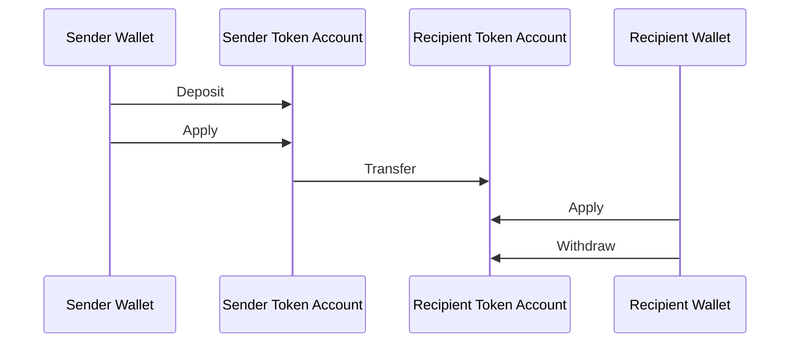
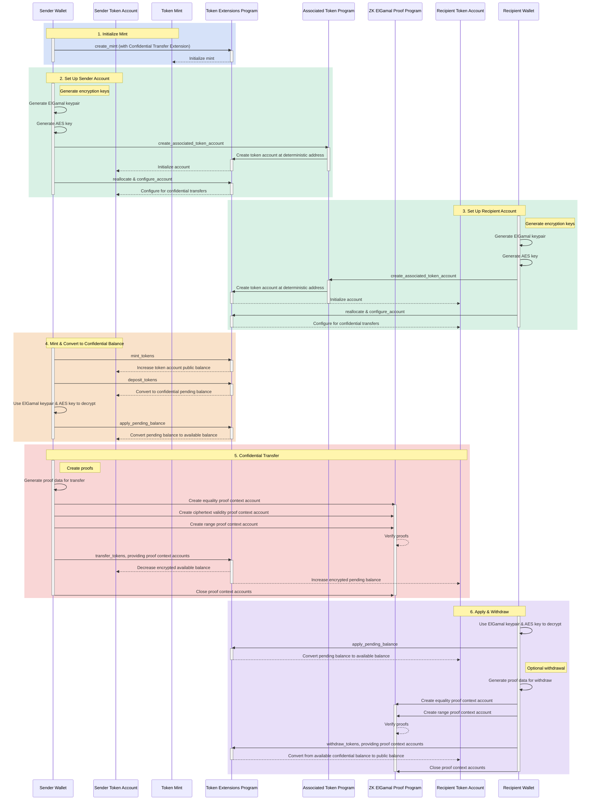

## Apa itu Confidential Transfers?

<Embed url="https://youtu.be/Bqs95tFcRIU" />

Transfer rahasia memungkinkan Anda mentransfer token antara token account tanpa
mengungkapkan jumlah transfer. Ini berguna untuk transaksi yang menjaga privasi.
Hanya jumlah transfer dan saldo token yang bersifat privat. Alamat token account
tetap bersifat publik.

- [Ikhtisar Protokol](https://www.solana-program.com/docs/confidential-balances/overview) -
  Detail tentang protokol kriptografi yang mendasarinya
- [Panduan Mulai Cepat](https://www.solana-program.com/docs/confidential-balances#setup) -
  Pengaturan dan perintah CLI dasar
- [Buku Resep Saldo Rahasia](https://github.com/solana-developers/Confidential-Balances-Sample) -
  Cuplikan kode tentang cara menggunakan ekstensi Transfer Rahasia

### Bagaimana cara kerjanya?

Ekstensi Transfer Rahasia menambahkan
[instruksi](https://github.com/solana-program/token-2022/blob/efd0c957fefbd79882d77df5fb2dac88c001249c/program/src/extension/confidential_transfer/instruction.rs#L29)
pada Token Extensions Program yang memungkinkan Anda mentransfer token antara
akun tanpa mengungkapkan jumlah transfer.

Alur dasar transfer token rahasia adalah sebagai berikut:

1. Buat mint account dengan ekstensi transfer rahasia.
2. Buat token account dengan ekstensi transfer rahasia untuk pengirim dan
   penerima.
3. Mint token ke akun pengirim.
4. **Setor** saldo publik pengirim ke **saldo tertunda rahasia**.
5. **Terapkan** saldo tertunda pengirim ke **saldo tersedia rahasia**.
6. **Transfer** token secara rahasia dari token account pengirim ke token
   account penerima.
7. **Terapkan** saldo tertunda penerima ke **saldo tersedia rahasia**.
8. **Tarik** saldo tersedia rahasia penerima ke **saldo publik**.

Untuk detail lebih lanjut tentang langkah-langkah dalam alur transfer rahasia,
lihat halaman yang sesuai:

<Cards>
  <Card
    title="Buat Mint Account"
    href="/docs/tokens/extensions/confidential-transfer/create-mint"
  >
    Cara membuat mint account dengan ekstensi Transfer Rahasia
  </Card>
  <Card
    title="Buat Token Account"
    href="/docs/tokens/extensions/confidential-transfer/create-token-account"
  >
    Cara mengonfigurasi token account dengan ekstensi Transfer Rahasia
  </Card>
  <Card
    title="Setor Token"
    href="/docs/tokens/extensions/confidential-transfer/deposit-tokens"
  >
    Cara menyetor token ke saldo tertunda rahasia
  </Card>
  <Card
    title="Terapkan Saldo Tertunda"
    href="/docs/tokens/extensions/confidential-transfer/apply-pending-balance"
  >
    Cara menerapkan saldo tertunda ke saldo rahasia yang tersedia
  </Card>
  <Card
    title="Tarik Token"
    href="/docs/tokens/extensions/confidential-transfer/withdraw-tokens"
  >
    Cara menarik token dari saldo rahasia yang tersedia
  </Card>
  <Card
    title="Transfer Token"
    href="/docs/tokens/extensions/confidential-transfer/transfer-tokens"
  >
    Cara mentransfer token secara rahasia antara token account
  </Card>
  <Card
    title="Panduan Integrasi"
    href="/docs/tokens/extensions/confidential-transfer/integration-guide"
  >
    Cara dompet, penjelajah, dan bursa dapat mendukung token transfer rahasia
  </Card>
  <Card
    title="Panduan Penerbit"
    href="/docs/tokens/extensions/confidential-transfer/issuer-guide"
  >
    Cara menerbitkan dan mengoperasikan token transfer rahasia (kebijakan
    persetujuan, auditor, biaya, mint dan burn)
  </Card>
</Cards>

Diagram di bawah ini menunjukkan urutan detail alur dasar untuk transfer token
rahasia:

## Instruksi Transfer Rahasia

Daftar lengkap instruksi ekstensi Confidential Transfer
[instructions](https://github.com/solana-program/token-2022/blob/efd0c957fefbd79882d77df5fb2dac88c001249c/program/src/extension/confidential_transfer/instruction.rs#L29)
adalah sebagai berikut:

| Instruction                         | Description                                                                                                                                                          |
| ----------------------------------- | -------------------------------------------------------------------------------------------------------------------------------------------------------------------- |
| _rs`InitializeMint`_                | Menyiapkan mint account untuk transfer rahasia. Instruksi ini harus disertakan dalam transaksi yang sama dengan instruksi _rs`TokenInstruction::InitializeMint`_.    |
| _rs`UpdateMint`_                    | Memperbarui pengaturan transfer rahasia untuk sebuah mint.                                                                                                           |
| _rs`ConfigureAccount`_              | Menyiapkan token account untuk transfer rahasia.                                                                                                                     |
| _rs`ApproveAccount`_                | Menyetujui token account untuk transfer rahasia jika mint memerlukan persetujuan untuk token account baru.                                                           |
| _rs`EmptyAccount`_                  | Mengosongkan saldo rahasia yang tertunda dan tersedia untuk memungkinkan penutupan token account.                                                                    |
| _rs`Deposit`_                       | Mengonversi saldo token publik menjadi saldo rahasia yang tertunda.                                                                                                  |
| _rs`Withdraw`_                      | Mengonversi saldo rahasia yang tersedia kembali menjadi saldo publik.                                                                                                |
| _rs`Transfer`_                      | Mentransfer token antar token account secara rahasia.                                                                                                                |
| _rs`ApplyPendingBalance`_           | Mengonversi saldo yang tertunda menjadi saldo yang tersedia setelah deposit atau transfer.                                                                           |
| _rs`EnableConfidentialCredits`_     | Memungkinkan token account menerima transfer token rahasia.                                                                                                          |
| _rs`DisableConfidentialCredits`_    | Memblokir transfer rahasia yang masuk sambil tetap mengizinkan transfer publik.                                                                                      |
| _rs`EnableNonConfidentialCredits`_  | Memungkinkan token account menerima transfer token publik.                                                                                                           |
| _rs`DisableNonConfidentialCredits`_ | Memblokir transfer biasa agar akun hanya menerima transfer rahasia.                                                                                                  |
| _rs`TransferWithFee`_               | Mentransfer token antar token account secara rahasia dengan biaya.                                                                                                   |
| _rs`ConfigureAccountWithRegistry`_  | Cara alternatif untuk mengonfigurasi token account untuk transfer rahasia menggunakan akun _rs`ElGamalRegistry`_ sebagai pengganti bukti _rs`VerifyPubkeyValidity`_. |
