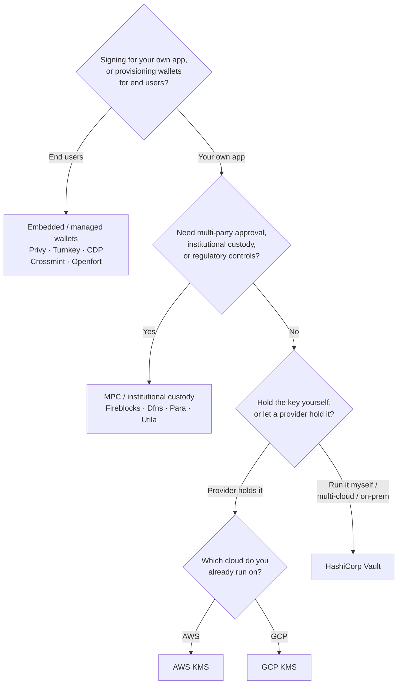

Keychain mengekspos satu antarmuka `SolanaSigner` di setiap backend, sehingga
pilihannya bersifat operasional, bukan arsitektur — Anda dapat mengubahnya nanti
melalui konfigurasi. Karena itu, **mulailah dari kebutuhan Anda, bukan dari
produk.** Dua pertanyaan menentukan sebagian besarnya: _di mana kunci privat
disimpan, dan siapa yang diizinkan untuk mengotorisasi tanda tangan dengannya?_

Tidak ada satu backend terbaik. Masing-masing lebih cocok untuk serangkaian
batasan tertentu — cloud yang sudah Anda gunakan, apakah Anda ingin
mengoperasikan infrastruktur kunci, dan kontrol kustodi serta persetujuan apa
yang diwajibkan. Alur di bawah ini memetakan batasan tersebut ke sebuah backend.

<Callout type="info">
  Panduan ini mencakup penandatanganan di sisi backend (server). Ketika pengguna
  akhir Anda menandatangani transaksi mereka sendiri di browser, gunakan dompet
  melalui Wallet Standard sebagai gantinya — lihat [Penandatanganan dalam
  Produksi](/docs/core/transactions/signing-in-production).
</Callout>

## Alur keputusan

<Callout type="info">
  Pengembangan lokal dan pengujian tidak memerlukan semua ini — gunakan backend
  **Memory** untuk pembuatan prototipe, lalu beralih ke salah satu backend
  produksi di atas melalui konfigurasi.
</Callout>

## Telusuri pertanyaan

<Steps>

<Step>

### Apakah Anda menandatangani untuk aplikasi Anda sendiri, atau untuk pengguna akhir Anda?

Jika Anda menyediakan dompet yang **dimiliki dan dioperasikan oleh pengguna
akhir** (aplikasi konsumen, alur orientasi), gunakan backend **dompet tertanam /
terkelola** — Privy, Turnkey, CDP, Crossmint, atau Openfort. Layanan ini
mengelola dompet per pengguna dan autentikasi atas nama Anda.

Jika Anda menandatangani sebagai **aplikasi Anda sendiri** — pembayar biaya,
treasury, otomasi backend — lanjutkan di bawah ini.

</Step>

<Step>

### Apakah Anda memerlukan persetujuan multi-pihak, kustodi institusional, atau kontrol regulasi?

Jika tanda tangan harus melewati kebijakan persetujuan, batas pengeluaran, atau
alur kerja kepatuhan sebelum dihasilkan — atau Anda memerlukan kustodian
teregulasi yang memegang kunci — gunakan backend **MPC / kustodi
institusional**: Fireblocks, Dfns, Para, atau Utila. Layanan ini membagi atau
mengkustodi kunci dan menandatangani bersama sesuai kebijakan Anda.

Jika Anda hanya memerlukan kunci yang menandatangani berdasarkan permintaan,
lanjutkan di bawah ini.

</Step>

<Step>

### Apakah Anda ingin menyimpan kunci sendiri, atau membiarkan penyedia menyimpannya?

Jika penyedia cloud harus menyimpan kunci dalam infrastruktur berbasis hardware
dan kebijakan IAM Anda mengontrol siapa yang dapat menandatangani, gunakan KMS
dari cloud tersebut:

- **Berjalan di AWS** → AWS KMS
- **Berjalan di GCP** → GCP KMS

Jika Anda ingin mengoperasikan infrastruktur kunci sendiri — atau Anda
menggunakan multi-cloud atau on-prem — gunakan **HashiCorp Vault**. Anda
menjalankan dan mengauditnya; kunci tetap berada di dalam mesin Transit dan
menandatangani berdasarkan permintaan.

</Step>

</Steps>

## Model kustodi

Backend dikelompokkan ke dalam lima model kustodi. Alur di atas akan membawa
Anda ke salah satunya.

- **Kustodi mandiri (dalam proses)** — aplikasi Anda menyimpan kunci privat
  mentah. Praktis untuk pengembangan, tetapi tidak cocok untuk produksi.
  Backend: **Memory**.
- **Manajemen kunci yang dihosting sendiri** — Anda mengoperasikan infrastruktur
  kunci; kunci tetap berada di dalamnya dan menandatangani berdasarkan
  permintaan. Backend: **HashiCorp Vault**.
- **Cloud KMS / HSM** — penyedia cloud menyimpan kunci dalam infrastruktur
  berbasis hardware; kunci tidak pernah meninggalkan layanan dan kebijakan IAM
  Anda mengontrol siapa yang dapat menandatangani. Backend: **AWS KMS**, **GCP
  KMS**.
- **MPC & kustodi institusional** — kunci dibagi atau dikustodi oleh penyedia,
  yang menandatangani bersama sesuai kebijakan Anda (persetujuan, batas).
  Backend: **Fireblocks**, **Dfns**, **Para**, **Utila**.
- **Dompet tertanam & terkelola** — penyedia mengelola dompet atas nama Anda,
  sering kali untuk orientasi pengguna akhir. Backend: **Privy**, **Turnkey**,
  **CDP**, **Crossmint**, **Openfort**.

## Perbandingan Backend

| Backend         | Model kustodian                | Terbaik untuk                                         | Catatan                                                             |
| --------------- | ------------------------------ | ----------------------------------------------------- | ------------------------------------------------------------------- |
| Memory          | Kustodian mandiri (in-process) | Pengembangan lokal, pengujian, CI                     | Kunci mentah dalam proses — jangan gunakan di produksi              |
| HashiCorp Vault | Manajemen kunci self-hosted    | Tim yang menjalankan infrastruktur kunci sendiri      | Mesin Transit; Anda yang mengoperasikan dan mengauditnya            |
| AWS KMS         | Cloud KMS / HSM                | Backend yang berjalan di AWS                          | Kunci tidak pernah meninggalkan KMS; IAM mengontrol penandatanganan |
| GCP KMS         | Cloud KMS / HSM                | Backend yang berjalan di GCP                          | Kunci tidak pernah meninggalkan KMS; IAM mengontrol penandatanganan |
| Fireblocks      | Kustodian MPC / institusional  | Treasuri, bursa, kustodian terregulasi                | Mesin kebijakan dan alur kerja persetujuan                          |
| Dfns            | Infrastruktur wallet MPC       | Wallet terprogram dengan kontrol kebijakan            | Penandatanganan Ed25519                                             |
| Para            | Wallet MPC                     | Aplikasi yang menginginkan wallet berbasis MPC        | API key + wallet ID                                                 |
| Utila           | Kustodian MPC + co-signer      | Wallet Solana yang dikelola Utila                     | `signMessage` tidak didukung; Anda menyiarkan tx                    |
| Privy           | Wallet tertanam                | Aplikasi konsumer yang mengarahkan pengguna ke wallet | Wallet tertanam yang dikelola aplikasi                              |
| Turnkey         | Manajemen kunci non-kustodian  | Penandatanganan terprogram dengan gerbang kebijakan   | Manajemen kunci non-kustodian                                       |
| CDP             | Wallet terkelola (Coinbase)    | Aplikasi di Coinbase Developer Platform               | `signMessage` hanya menerima payload UTF-8                          |
| Crossmint       | Wallet terkelola               | Marketplace dan aplikasi wallet terkelola             | Wallet `smart` dan `mpc`; `signMessage` tidak didukung              |
| Openfort        | Wallet backend tertanam        | Wallet sisi server                                    | Kunci tersimpan di TEE                                              |

## Skenario enterprise

Satu aplikasi sering kali membutuhkan lebih dari satu di antaranya secara
bersamaan. Karena antarmukanya identik, Anda dapat menjalankan backend yang
berbeda per peran tanpa mengubah titik pemanggilan.

- **Operasi treasury** — pisahkan penanda tangan "hot" operasional dari penanda
  tangan treasury "cold". Dukung treasury dengan kustodi MPC atau cloud HSM dan
  wajibkan kebijakan persetujuan sebelum tanda tangan bernilai tinggi.
- **Alur kerja persetujuan** — backend MPC dan kustodi (mis. Fireblocks)
  menerapkan persetujuan multi-pihak sebelum tanda tangan dihasilkan.
- **Kepatuhan dan audit** — cloud KMS (AWS/GCP) dan Vault menghasilkan log audit
  penandatanganan; kustodian institusional menambahkan penerapan kebijakan dan
  pelaporan.
- **Lingkungan teregulasi** — simpan materi kunci di HSM, KMS, atau kustodian
  institusional agar kunci mentah tidak pernah menyentuh aplikasi Anda.

Lihat [Praktik terbaik produksi](/docs/tools/keychain/production-best-practices)
untuk mengoperasikan backend ini dengan aman.

<Cards>
  <Card title="Panduan Rust" href="/docs/tools/keychain/getting-started/rust">
    Konfigurasikan setiap backend di Rust.
  </Card>
  <Card
    title="Panduan TypeScript"
    href="/docs/tools/keychain/getting-started/typescript"
  >
    Konfigurasikan setiap backend di TypeScript.
  </Card>
</Cards>
