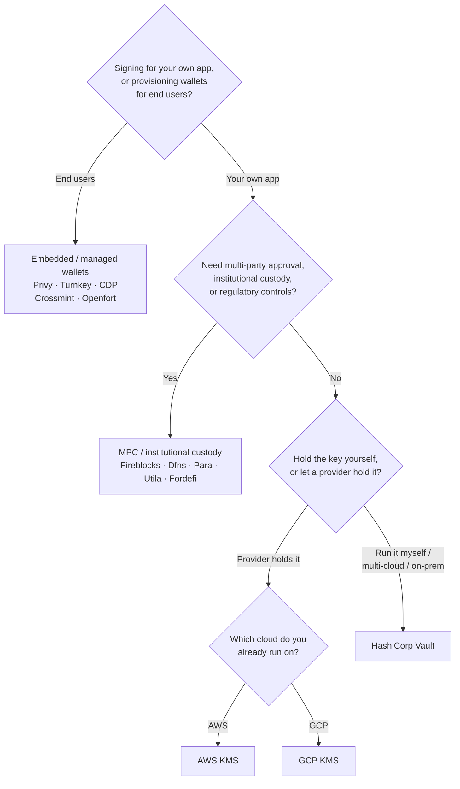

Keychain menyediakan satu antarmuka dasar `SolanaSigner` untuk setiap backend, sehingga untuk
sebagian besar backend pilihannya bersifat operasional, bukan arsitektural: Anda dapat mengubahnya
nanti melalui konfigurasi. Pengecualiannya adalah bentuk transaksi. Crossmint
dan mode auto native Fordefi menandatangani dan menyiarkan (broadcast) di sisi server, dan mode manual native
Fordefi menulis ulang transaksi sebelum menandatanganinya, sehingga berpindah ke atau dari salah satunya
mengubah cara Anda memanggil signer. Karena itu, **mulailah dari kebutuhan Anda, bukan dari produk.** Dua pertanyaan menentukan sebagian besar keputusannya: _di mana
private key disimpan, dan siapa yang berhak mengotorisasi tanda tangan dengannya?_

Setiap backend kecuali Ledger tersedia dalam keempat bahasa (Rust, TypeScript,
Python, dan Go). Ledger hanya tersedia untuk Rust, melalui fitur opt-in `ledger`.

Tidak ada satu backend yang terbaik. Masing-masing lebih cocok untuk serangkaian
kendala tertentu: cloud yang sudah Anda gunakan, apakah Anda ingin mengoperasikan infrastruktur
kunci sendiri, dan kontrol kustodi serta persetujuan apa yang wajib Anda miliki.
Alur di bawah ini memetakan kendala-kendala tersebut ke sebuah backend.

<Callout type="info">
  Panduan ini membahas penandatanganan backend (sisi server). Jika pengguna akhir Anda menandatangani
  transaksi mereka sendiri di browser, gunakan wallet melalui Wallet Standard
  sebagai gantinya. Lihat [Signing in
  Production](/docs/core/transactions/signing-in-production).
</Callout>

## Alur keputusan

```mermaid title="Choosing a Keychain backend"
flowchart TD
    Start{Signing for your own app,<br/>or provisioning wallets<br/>for end users?}
    Start -->|End users| Managed[Embedded / managed wallets<br/>Privy · Turnkey · CDP<br/>Crossmint · Openfort]
    Start -->|Your own app| Q2{Need multi-party approval,<br/>institutional custody,<br/>or regulatory controls?}
    Q2 -->|Yes| MPC[MPC / institutional custody<br/>Fireblocks · Dfns · Para · Utila · Fordefi]
    Q2 -->|No| Q3{Hold the key yourself,<br/>or let a provider hold it?}
    Q3 -->|Provider holds it| Q4{Which cloud do you<br/>already run on?}
    Q4 -->|AWS| AWS[AWS KMS]
    Q4 -->|GCP| GCP[GCP KMS]
    Q3 -->|Run it myself /<br/>multi-cloud / on-prem| Vault[HashiCorp Vault]
```

<Callout type="info">
  Pengembangan lokal dan pengujian tidak memerlukan semua ini: gunakan backend **Memory**
  untuk prototipe, lalu beralih ke salah satu backend produksi di atas melalui
  konfigurasi.
</Callout>

## Telusuri pertanyaan-pertanyaan

<Steps>

<Step>

### Apakah Anda menandatangani untuk aplikasi Anda sendiri, atau untuk pengguna akhir Anda?

Jika Anda menyediakan wallet yang dimiliki dan dioperasikan oleh **pengguna akhir** (aplikasi konsumen,
alur onboarding), gunakan backend **wallet embedded / terkelola**: Privy, Turnkey,
CDP, Crossmint, atau Openfort. Backend ini mengelola wallet per pengguna beserta autentikasinya atas
nama Anda.

Jika Anda menandatangani sebagai **aplikasi Anda sendiri** (fee payer, treasury, otomatisasi backend),
lanjutkan ke bawah.

</Step>

<Step>

### Apakah Anda memerlukan persetujuan multipihak, kustodi institusional, atau kontrol regulasi?

Jika tanda tangan harus melewati kebijakan persetujuan, batas pengeluaran, atau alur kerja
kepatuhan sebelum dibuat, atau Anda memerlukan kustodian teregulasi yang menyimpan
kunci, gunakan backend **MPC / kustodi institusional**: Fireblocks, Dfns, Para,
Utila, atau Fordefi. Backend ini membagi atau menyimpan kunci dan ikut menandatangani sesuai
kebijakan Anda.

Jika Anda hanya memerlukan kunci yang menandatangani sesuai permintaan, lanjutkan ke bawah.

</Step>

<Step>

### Apakah Anda ingin menyimpan kunci sendiri, atau menyerahkannya kepada penyedia?

Jika penyedia cloud harus menyimpan kunci di infrastruktur berbasis perangkat keras dan
kebijakan IAM Anda mengontrol siapa yang dapat menandatangani, gunakan KMS dari cloud tersebut:

- **Berjalan di AWS** → AWS KMS
- **Berjalan di GCP** → GCP KMS

Jika Anda ingin mengoperasikan sendiri infrastruktur kunci, atau Anda menggunakan multi-cloud atau
on-prem, gunakan **HashiCorp Vault**. Anda yang menjalankan dan mengauditnya; kunci tetap berada di dalam
mesin Transit dan menandatangani sesuai permintaan.

</Step>

</Steps>

## Model kustodi

Backend dikelompokkan ke dalam enam model kustodi. Alur di atas akan mengarahkan Anda ke salah satunya.

- **Self-custody (in-process)**: aplikasi Anda menyimpan private key mentah.
  Praktis untuk pengembangan, tetapi tidak cocok untuk produksi. Backend:
  **Memory**.
- **Self-custody (hardware wallet)**: kunci tidak pernah meninggalkan perangkat Ledger, dan
  seseorang mengonfirmasi setiap tanda tangan pada layarnya. Cocok untuk penandatanganan
  operator interaktif, bukan layanan tanpa pengawasan. Hanya Rust, opt-in, dan tidak tercakup
  dalam audit. Backend: **Ledger**.
- **Manajemen kunci self-hosted**: Anda mengoperasikan infrastruktur kunci; kunci
  tetap berada di dalamnya dan menandatangani sesuai permintaan. Backend: **HashiCorp Vault**.
- **Cloud KMS / HSM**: penyedia cloud menyimpan kunci di infrastruktur
  berbasis perangkat keras; kunci tidak pernah meninggalkan layanan dan kebijakan IAM Anda mengontrol
  siapa yang dapat menandatangani. Backend: **AWS KMS**, **GCP KMS**.
- **MPC & kustodi institusional**: kunci dibagi atau disimpan oleh
  penyedia, yang ikut menandatangani sesuai kebijakan Anda (persetujuan, batas).
  Backend: **Fireblocks**, **Dfns**, **Para**, **Utila**, **Fordefi**.
- **Wallet embedded & terkelola**: penyedia mengelola wallet atas nama Anda,
  biasanya untuk melakukan onboarding pengguna akhir. Backend: **Privy**, **Turnkey**, **CDP**,
  **Crossmint**, **Openfort**.

## Perbandingan Backend

| Backend         | Model kustodi                  | Terbaik untuk                                     | Catatan                                                                                                              |
| --------------- | ------------------------------ | -------------------------------------------- | ------------------------------------------------------------------------------------------------------------------ |
| Memory          | Kustodi mandiri (in-process)      | Pengembangan lokal, pengujian, CI                 | Kunci mentah di dalam proses; jangan gunakan di produksi                                                                       |
| Ledger          | Self-custody (hardware wallet) | Penandatanganan operator interaktif dari tool Rust | Hanya Rust, fitur opt-in `ledger`, belum diaudit; setiap tanda tangan dikonfirmasi di perangkat                                 |
| HashiCorp Vault | Manajemen kunci self-hosted     | Tim yang menjalankan infrastruktur kunci sendiri   | Mesin Transit; Anda mengoperasikan dan mengauditnya                                                                           |
| AWS KMS         | Cloud KMS / HSM                | Backend yang berjalan di AWS                      | Kunci tidak pernah meninggalkan KMS; IAM mengontrol penandatanganan                                                                         |
| GCP KMS         | Cloud KMS / HSM                | Backend yang berjalan di GCP                      | Kunci tidak pernah meninggalkan KMS; IAM mengontrol penandatanganan                                                                         |
| Fireblocks      | Kustodi MPC / institusional    | Treasury, bursa, kustodi teregulasi     | Mesin kebijakan dan alur kerja persetujuan                                                                               |
| Dfns            | Infrastruktur wallet MPC      | Wallet terprogram dengan kontrol kebijakan    | Penandatanganan Ed25519                                                                                                    |
| Para            | Wallet MPC                    | Aplikasi yang menginginkan wallet berbasis MPC            | Kunci API + ID wallet                                                                                                |
| Utila           | Kustodi MPC + co-signer        | Wallet Solana yang dikelola Utila        | `signMessage` tidak didukung; Anda menyiarkan tx                                                                    |
| Fordefi         | Kustodi MPC / institusional    | Penyimpanan institusional dengan kontrol kebijakan   | Black box: Anda yang mengirim. Native auto: Fordefi menulis ulang dan mengirim. Native manual: Fordefi menulis ulang, Anda mengirim hasilnya |
| Privy           | Wallet tertanam               | Aplikasi konsumen yang onboarding pengguna ke wallet    | Wallet tertanam yang dikelola aplikasi                                                                                       |
| Turnkey         | Manajemen kunci non-kustodial   | Penandatanganan terprogram dengan gerbang kebijakan           | Manajemen kunci non-kustodial                                                                                       |
| CDP             | Wallet terkelola (Coinbase)      | Aplikasi di Coinbase Developer Platform      | `signMessage` hanya menerima payload UTF-8                                                                          |
| Crossmint       | Wallet terkelola                | Marketplace dan aplikasi wallet terkelola         | Hanya mengirim: menyiarkan di sisi server, dapat menulis ulang untuk sponsor gas; `signMessage` tidak didukung                   |
| Openfort        | Wallet backend tertanam       | Wallet sisi server                          | Kunci tersimpan di TEE                                                                                                    |

## Bentuk kapabilitas

Selain kustodi, setiap backend memiliki satu bentuk transaksi, dan itulah yang menentukan cara Anda
memanggil signer:

- **Sign**: penyedia menandatangani byte yang Anda susun dan Anda yang menyiarkannya. Sebagian besar
  backend, termasuk Ledger dan mode black box Fordefi.
- **Rewrite and sign**: penyedia menulis ulang transaksi, lalu menandatanganinya
  tanpa menyiarkan. Lanjutkan dari transaksi yang dikembalikan. Mode native
  manual Fordefi.
- **Sign and broadcast**: penyedia menandatangani dan menyiarkan di sisi server, sehingga kegagalan
  tidak berarti tidak ada yang masuk ke jaringan. Crossmint dan mode native auto Fordefi.

Tabel kapabilitas signer di README setiap bahasa mencantumkan bentuk dari setiap
backend;
[model keamanan](https://github.com/solana-foundation/solana-keychain/blob/main/docs/SECURITY_MODEL.md)
menjelaskan apa yang dijamin oleh setiap bentuk.

## Skenario enterprise

Satu aplikasi sering kali membutuhkan lebih dari satu backend sekaligus. Karena
antarmukanya sama, Anda dapat menjalankan backend berbeda untuk setiap peran tanpa mengubah
lokasi pemanggilan, selama backend tersebut memiliki bentuk kapabilitas yang sama.

- **Operasi treasury** — pisahkan penanda tangan "hot" operasional dari penanda
  tangan treasury "cold". Dukung treasury dengan MPC custody atau cloud HSM dan
  wajibkan kebijakan persetujuan sebelum tanda tangan bernilai tinggi.
- **Alur kerja persetujuan** — backend MPC dan custody (mis. Fireblocks)
  menerapkan persetujuan multi-pihak sebelum tanda tangan dihasilkan.
- **Kepatuhan dan audit** — cloud KMS (AWS/GCP) dan Vault menghasilkan log audit
  penandatanganan; kustodian institusional menambahkan penegakan kebijakan dan
  pelaporan.
- **Lingkungan yang diatur** — simpan materi kunci dalam HSM, KMS, atau
  kustodian institusional agar kunci mentah tidak pernah menyentuh aplikasi
  Anda.

Lihat [Praktik terbaik produksi](/docs/tools/keychain/production-best-practices)
untuk mengoperasikan backend ini dengan aman.

<Cards>
  <Card title="Panduan Rust" href="/docs/tools/keychain/getting-started/rust">
    Konfigurasikan setiap backend di Rust.
  </Card>
  <Card
    title="Panduan TypeScript"
    href="/docs/tools/keychain/getting-started/typescript"
  >
    Konfigurasikan setiap backend di TypeScript.
  </Card>
</Cards>
