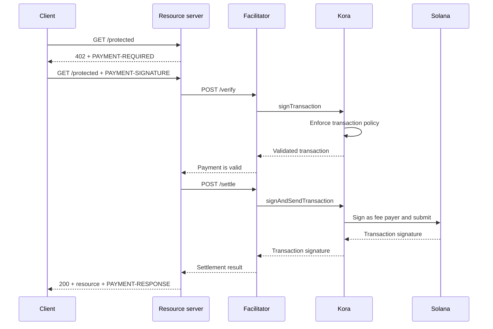

Kora dapat menyediakan lapisan penandatanganan Solana, kebijakan transaksi, dan sponsor biaya
di balik [fasilitator x402 V2](/docs/tools/x402-facilitator). Fasilitator
mengimplementasikan HTTP API x402; Kora memvalidasi, menandatangani, dan mengirimkan
transaksi pembayaran yang diterimanya.

Panduan ini menjalankan fasilitator referensi Kora di Solana Devnet. Ini adalah
lingkungan pengembangan untuk menguji integrasi, bukan deployment produksi.

## Arsitektur



Empat peran aplikasi tetap terpisah:

- **Client** memilih persyaratan pembayaran dan menandatangani otorisasi
  pembayaran.
- **Resource server** menetapkan harga untuk suatu rute dan memenuhinya hanya setelah
  verifikasi dan penyelesaian berhasil.
- **Fasilitator** mengekspos endpoint `/supported`, `/verify`, dan `/settle` milik x402.
- **Kora** hanya menandatangani transaksi yang diizinkan oleh kebijakannya dan dapat mensponsori
  biaya jaringan Solana-nya.

Kora tidak menggantikan protokol x402. Kora adalah batas penandatanganan dan kebijakan
yang digunakan oleh implementasi fasilitator ini.

## Mulai fasilitator referensi

Anda memerlukan Git dan [Docker dengan Compose](https://docs.docker.com/compose/). Clone
rilis stabil terbaru Kora dan masuk ke demo x402:

```bash
git clone --branch v2.0.5 --depth 1 https://github.com/solana-foundation/kora.git
cd kora/examples/x402/demo
cp .env.example .env
```

Atur `KORA_PRIVATE_KEY` di `.env` ke keypair Devnet sekali pakai. Konfigurasi
penanda tangan demo menerima rahasia base58, keypair berupa array byte, atau jalur
ke file keypair JSON. Danai alamat publik tersebut dengan SOL Devnet agar dapat
mensponsori biaya transaksi.

<Callout type="caution" title="Gunakan penanda tangan Devnet sekali pakai">
  Demo Docker memuat penanda tangan Kora dari variabel lingkungan. Jangan memasukkan
  kunci penandatanganan produksi ke dalam demo ini atau melakukan commit pada file `.env`.
</Callout>

Mulai Kora dan fasilitator:

```bash
docker compose up --build
```

Build pertama dapat memakan waktu beberapa menit. Setelah kedua pemeriksaan kesehatan berhasil, periksa
kemampuan yang diiklankan fasilitator dari terminal lain:

```bash
curl http://127.0.0.1:3000/supported
```

Respons harus mengiklankan x402 versi `2`, skema `exact`, dan
identifier jaringan CAIP-2 Devnet:

```json
{
  "kinds": [
    {
      "x402Version": 2,
      "scheme": "exact",
      "network": "solana:EtWTRABZaYq6iMfeYKouRu166VU2xqa1",
      "extra": {
        "feePayer": "<KORA_SIGNER_ADDRESS>"
      }
    }
  ]
}
```

Kora mendengarkan di `127.0.0.1:8080` dan fasilitator mendengarkan di `127.0.0.1:3000`
secara default. Hentikan demo dengan `Ctrl+C`.

## Hubungkan resource server

Konfigurasikan resource server x402 untuk menggunakan fasilitator lokal dan alamat publik
penanda tangan Kora sebagai penerimanya:

```bash
FACILITATOR_URL=http://127.0.0.1:3000
SOLANA_PAY_TO=<KORA_SIGNER_ADDRESS>
```

Kemudian ikuti [x402 di Solana](/docs/payments/agentic-payments/x402) untuk menambahkan middleware x402
V2 ke rute Express. Permintaan yang belum dibayar menerima
`PAYMENT-REQUIRED`, percobaan ulang membawa `PAYMENT-SIGNATURE`, dan respons
yang berhasil membawa `PAYMENT-RESPONSE`.

Jangan menyalin contoh yang menggunakan `X-PAYMENT`, `X-PAYMENT-RESPONSE`, atau nama
jaringan `solana-devnet`. Kolom-kolom tersebut milik x402 V1.

Repositori Kora juga menyertakan API yang dilindungi dan client yang sadar pembayaran di
direktori `examples/x402/demo` yang sama. Gunakan aplikasi tersebut saat Anda perlu
mencoba alur lokal secara lengkap.

## Konfigurasikan kebijakan Kora

Referensi `kora/kora.toml` sengaja dibuat sempit. Kebijakan validasinya
mengontrol:

- program Solana mana yang diizinkan oleh penanda tangan;
- mint token SPL mana yang dapat digunakan;
- jumlah lamport yang disponsori dan jumlah tanda tangan maksimum;
- operasi fee-payer mana yang dilarang; dan
- ekstensi Token-2022 mana yang ditolak.

Demo hanya mengaktifkan metode RPC Kora yang dibutuhkan fasilitatornya:
`signTransaction`, `signAndSendTransaction`, `getBlockhash`, `getPayerSigner`,
`getConfig`, dan `getVersion`.

Perlakukan kebijakan sebagai batas keamanan untuk kunci fee-payer. Untuk
layanan produksi:

1. Daftarkan hanya program, mint token, dan bentuk transaksi yang dihasilkan
   skema x402 Anda.
2. Tolak transfer, perubahan otoritas, penutupan akun, dan instruksi lain
   yang dapat memindahkan nilai dari penanda tangan Kora.
3. Tetapkan batas transaksi dan penggunaan yang membatasi kerugian akibat
   kredensial fasilitator yang disusupi.
4. Gunakan backend penanda tangan yang dikelola, bukan kunci privat yang disimpan di variabel lingkungan.

## Amankan koneksi fasilitator-ke-Kora

Demo mengaktifkan autentikasi API-key Kora. Fasilitator mengirimkan nilai
`KORA_API_KEY`, yang harus cocok dengan `[kora.auth].api_key` di `kora.toml`.

Untuk produksi, juga:

- simpan Kora di jaringan privat dan terminasi TLS di batas yang tepercaya;
- simpan kredensial API di secret manager dan rotasi secara berkala;
- pertimbangkan autentikasi permintaan HMAC Kora untuk perlindungan terhadap gangguan dan pemutaran ulang;
- pisahkan kunci fee-payer dan kunci penerima pembayaran jika model akuntansi
  Anda mengharuskannya; dan
- buat peringatan untuk penolakan kebijakan, kegagalan penyelesaian, konsumsi biaya, dan
  saldo penanda tangan.

## Perkuat penyelesaian pembayaran

Kora memvalidasi transaksi Solana, tetapi fasilitator dan resource server
tetap bertanggung jawab atas kebenaran protokol x402. Sebelum menyajikan resource, terapkan:

- versi x402, skema, jaringan, aset, jumlah, dan penerima yang dipilih;
- masa berlaku otorisasi dan tata letak instruksi Solana yang tepat;
- perlindungan pemutaran ulang atomik dan penyelesaian idempoten;
- konfirmasi pada tingkat komitmen yang dipersyaratkan produk; dan
- pemetaan yang tahan lama antara pembelian, hasil penyelesaian, dan pemenuhan.

Jangan kembalikan konten berbayar hanya karena Kora menerima transaksi untuk
ditandatangani. Penuhi hanya setelah fasilitator mengembalikan hasil penyelesaian yang berhasil.

## Sumber daya terkait

- [Repositori Kora dan demo x402](https://github.com/solana-foundation/kora/tree/main/examples/x402/demo)
- [Konfigurasi operator Kora](/docs/tools/kora/operators/configuration)
- [Backend penanda tangan Kora](/docs/tools/kora/operators/signers)
- [Audit keamanan Kora](/docs/tools/kora/security-audits)
- [Spesifikasi x402 V2](https://github.com/x402-foundation/x402/blob/main/specs/x402-specification-v2.md)
- [Ikhtisar pembayaran agentik](/docs/payments/agentic-payments)
