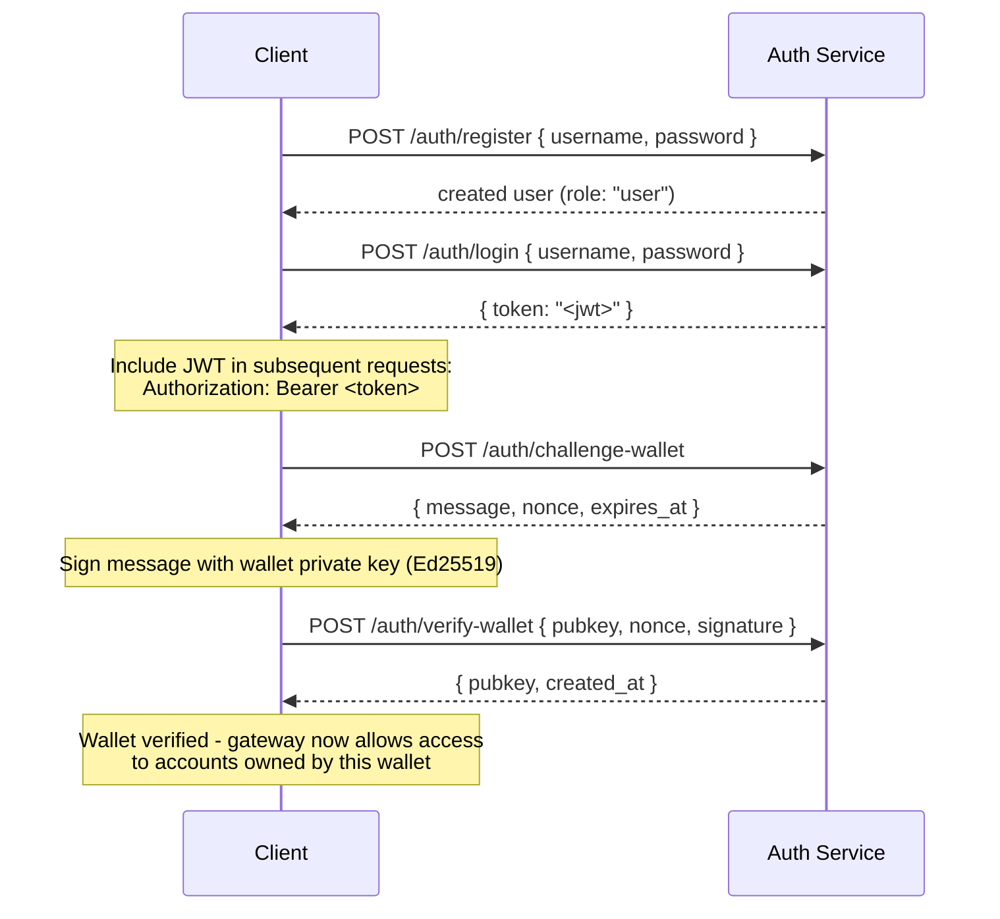

## Ikhtisar

Private Channels menyertakan Auth Service opsional yang membatasi akses gateway
dengan autentikasi JWT dan kontrol akses berbasis peran (RBAC). Ketika
autentikasi dinonaktifkan, gateway menerima semua koneksi. Ketika diaktifkan,
klien harus menyertakan JWT yang valid di setiap permintaan.

Halaman ini mencakup dua audiens:

- **Developer** - registrasi, login, verifikasi wallet, dan membuat
  permintaan terautentikasi
- **Operator** - mengaktifkan auth service, mengonfigurasi `JWT_SECRET`, dan
  menyediakan peran `operator`

## Mengaktifkan Auth

Autentikasi diaktifkan dengan menetapkan `JWT_SECRET` (tidak kosong) pada gateway
maupun Auth Service. Auth Service juga memerlukan
`AUTH_DATABASE_URL`.

Ketika `JWT_SECRET` tidak ditetapkan, gateway beroperasi dalam mode terbuka; tidak ada token yang
diperlukan.

> **Docker Compose:** Auth service adalah profil Docker Compose dan **tidak
> dimulai secara default**. Untuk menyertakannya, tambahkan `--profile auth` pada
> perintah `docker compose` Anda, termasuk `--env-file .env` agar rahasia seperti
> `JWT_SECRET` dan `POSTGRES_PASSWORD` benar-benar terselesaikan (Compose menonaktifkan
> pemuatan otomatis `.env` setelah ada flag `--env-file` yang diberikan):
>
> ```bash
> docker compose -f docker-compose.devnet.yml --env-file versions.env --env-file .env.devnet --env-file .env --profile auth up -d
> ```

## API Auth Service

Semua endpoint berada di bawah `/auth`. Auth service mendengarkan pada `AUTH_PORT`
(default `8903`).

### `POST /auth/register`

Membuat akun baru. Semua pengguna didaftarkan dengan peran `user`.

```json
{ "username": "alice", "password": "hunter2" }
```

- Username: 5-32 karakter, alfanumerik ditambah `_` dan `-`
- Password: 6-128 karakter
- Mengembalikan pengguna yang dibuat; password tidak pernah dikembalikan

### `POST /auth/login`

Melakukan autentikasi dan menerima JWT bertanda tangan yang berlaku selama 24 jam.

```json
{ "username": "alice", "password": "hunter2" }
```

Mengembalikan `{ "token": "<jwt>" }`. Baik username maupun password yang salah mengembalikan
`401` untuk mencegah enumerasi username.

### `POST /auth/challenge-wallet`

Meminta tantangan penandatanganan untuk membuktikan kepemilikan wallet Solana. Memerlukan
JWT yang valid.

Mengembalikan pesan, nonce, dan waktu kedaluwarsa. Tantangan kedaluwarsa dalam 10 menit.

```json
{
  "message": "PrivateChannel wallet verification\nuser: <uuid>\nnonce: <uuid>\nexpires: <unix>",
  "nonce": "<uuid>",
  "expires_at": "<iso8601>"
}
```

### `POST /auth/verify-wallet`

Mengirimkan tantangan yang telah ditandatangani untuk mendaftarkan wallet sebagai terverifikasi. Memerlukan
JWT yang valid.

```json
{
  "pubkey": "<base58 pubkey>",
  "nonce": "<uuid from challenge>",
  "signature": "<base58 Ed25519 signature>"
}
```

Layanan merekonstruksi pesan tantangan, memverifikasi tanda tangan Ed25519,
dan menyimpan wallet. Setiap nonce hanya dapat digunakan sekali; replay akan
ditolak.

Mengembalikan `{ "pubkey": "<base58>", "created_at": "<iso8601>" }`.

### `GET /auth/wallets`

Mencantumkan semua wallet terverifikasi untuk pengguna yang terautentikasi. Memerlukan JWT yang valid.

### `DELETE /auth/wallets/{pubkey}`

Menghapus wallet terverifikasi dari akun pengguna yang terautentikasi. Memerlukan
JWT yang valid.

### `GET /health`

Pemeriksaan keaktifan. Mengembalikan `200 ok`. Tidak memerlukan autentikasi.

## Struktur JWT

Token menggunakan algoritma HS256 dan kedaluwarsa 24 jam setelah diterbitkan.

| Klaim  | Nilai                           |
| ------ | ------------------------------- |
| `sub`  | UUID Pengguna                       |
| `role` | `"user"` atau `"operator"`        |
| `iss`  | `"private-channel-auth"`        |
| `aud`  | `"private-channel-gateway"`     |
| `exp`  | Timestamp Unix (24j dari penerbitan) |

> `iss` dan `aud` ada dalam payload JWT tetapi divalidasi oleh
> konfigurasi JWT gateway, bukan dideserialisasi ke dalam struct klaim aplikasi.
> Kode lapisan aplikasi hanya memiliki akses ke `sub`, `role`, dan `exp`.

Sertakan token di header `Authorization`:

```
Authorization: Bearer <JWT_TOKEN>
```

## Peran

### user

Peran default saat registrasi.

- Akses dibatasi hanya pada wallet terverifikasi milik pengguna
- Diblokir dari: `getBlock`, `getTransaction`, `simulateTransaction`
- Dapat: memanggil `Deposit` pada Escrow Program, memulai penarikan melalui
  `WithdrawFunds`

### operator

Peran dengan hak istimewa lebih tinggi. Harus disediakan secara langsung; tidak ada jalur layanan mandiri untuk
meningkatkan dari `user` ke `operator`.

**Berikan peran**, baik melalui Admin CLI (`private-channel-auth-admin`):

```bash
private-channel-auth-admin set-role --username alice --role operator
```

atau dengan SQL langsung:

<Callout type="warning">
  Ini adalah operasi database dengan hak istimewa. Batasi akses ke database Auth Service
  dengan sesuai dan audit setiap perubahan peran.
</Callout>

```sql
UPDATE private_channel_auth.users SET role = 'operator' WHERE username = 'alice';
```

**Daftarkan wallet tanpa alur verifikasi mandiri (Admin CLI,
`private-channel-auth-admin`):**

```bash
private-channel-auth-admin attach-wallet --username alice --pubkey <base58-pubkey>
```

Perintah ini menyisipkan wallet terverifikasi langsung ke tabel `verified_wallets`,
melewati alur challenge/verify. Memberlakukan batasan unik pada
`(user_id, pubkey)`. Perintah ini **tidak** memberikan peran `operator` dengan sendirinya; gunakan
`set-role` atau pembaruan SQL di atas untuk itu. Perintah ini digunakan untuk melampirkan
wallet ke sebuah akun (misalnya, akun layanan) tanpa memerlukan
alur challenge/verify interaktif.

**Kemampuan:**

- Melewati semua pemeriksaan kepemilikan wallet
- Akses penuh ke semua metode RPC gateway, termasuk `getBlock`,
  `getTransaction`, `simulateTransaction`
- Diperlukan untuk: `ReleaseFunds`, `ResetSmtRoot`

## Alur Autentikasi Lengkap



## Membuat Permintaan Terautentikasi

```typescript
const response = await fetch("http://localhost:8899/", {
  method: "POST",
  headers: {
    "Content-Type": "application/json",
    Authorization: `Bearer ${jwtToken}`
  },
  body: JSON.stringify({
    jsonrpc: "2.0",
    id: 1,
    method: "getBalance",
    params: [walletAddress]
  })
});
const data = await response.json();
```

## Endpoint Gateway

Endpoint berikut tidak memerlukan autentikasi:

| Endpoint  | Metode | Deskripsi                               | Berhasil                  | Gagal                     |
| --------- | ------ | ----------------------------------------- | ------------------------ | --------------------------- |
| `/health` | GET    | Pemeriksaan keaktifan                            | `200 {"status":"ok"}`    | -                           |
| `/ready`  | GET    | Kesiapan mendalam; memeriksa node write + read | `200 {"status":"ready"}` | `503 {"status":"degraded"}` |

Untuk referensi variabel lingkungan `JWT_SECRET` dan gateway, lihat
[Referensi konfigurasi](/docs/tools/private-channels/operators/configuration).

## Matriks Akses Metode RPC

Metode-metode berikut dikenali oleh gateway. Ketika `JWT_SECRET` ditetapkan,
akses bergantung pada peran JWT:

| Metode                        | Rute      | Tanpa JWT | `user`           | `operator` |
| ----------------------------- | ---------- | ------ | ---------------- | ---------- |
| `sendTransaction`             | Node write | ✓      | ✓                | ✓          |
| `getLatestBlockhash`          | Node read  | ✓      | ✓                | ✓          |
| `getSlot`                     | Node read  | ✓      | ✓                | ✓          |
| `getRecentBlockhash`          | Node read  | ✓      | ✓                | ✓          |
| `getSignatureStatuses`        | Node read  | ✓      | ✓                | ✓          |
| `getTransactionCount`         | Node read  | ✓      | ✓                | ✓          |
| `getFirstAvailableBlock`      | Node read  | ✓      | ✓                | ✓          |
| `getBlocks`                   | Node read  | ✓      | ✓                | ✓          |
| `getEpochInfo`                | Node read  | ✓      | ✓                | ✓          |
| `getEpochSchedule`            | Node read  | ✓      | ✓                | ✓          |
| `getRecentPerformanceSamples` | Node read  | ✓      | ✓                | ✓          |
| `getBlockTime`                | Node read  | ✓      | ✓                | ✓          |
| `getVoteAccounts`             | Node read  | ✓      | ✓                | ✓          |
| `getSupply`                   | Node read  | ✓      | ✓                | ✓          |
| `getSlotLeaders`              | Node read  | ✓      | ✓                | ✓          |
| `isBlockhashValid`            | Node read  | ✓      | ✓                | ✓          |
| `getAccountInfo`              | Node read  | 401    | ownership-gated¹ | ✓          |
| `getTokenAccountBalance`      | Node read  | 401    | ownership-gated¹ | ✓          |
| `getSignaturesForAddress`     | Node read  | 401    | ownership-gated¹ | ✓          |
| `getBlock`                    | Node read  | 401    | 403              | ✓          |
| `getTransaction`              | Node read  | 401    | 403              | ✓          |
| `simulateTransaction`         | Node read  | 401    | 403              | ✓          |

¹ **Ownership-gated**: untuk SPL token account (field owner adalah `TokenkegQ...`
atau `TokenzQ...`, data minimal 165 byte), gateway memeriksa bahwa field
`owner` atau `delegate` cocok dengan salah satu wallet terverifikasi milik pengguna yang terautentikasi. Untuk jenis akun lainnya (wallet System Program, atau PDA yang tidak dikenal),
gateway memeriksa apakah pubkey yang ditanyakan itu sendiri merupakan salah satu wallet terverifikasi pengguna,
karena akun tersebut tidak memiliki field owner/delegate untuk diperiksa.
Jika salah satu pemeriksaan gagal, mengembalikan 403.
