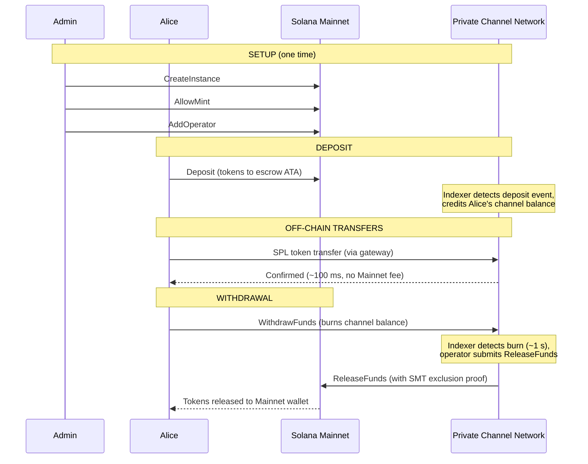
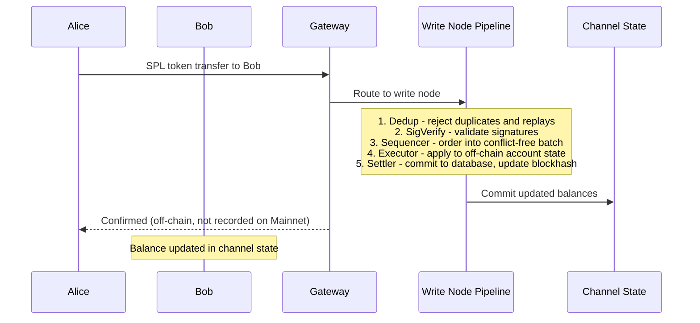
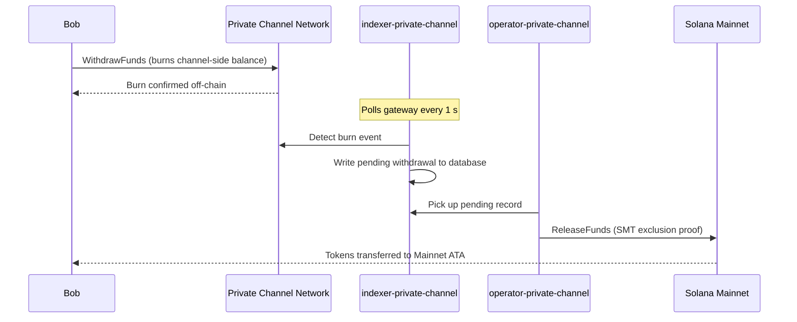

## Apa itu Private Channel?

Private channel adalah jaringan pembayaran off-chain yang terhubung ke Solana. Pengguna
menyetorkan token SPL ke dalam program escrow on-chain, lalu bertransaksi off-chain
melalui gateway dengan kecepatan tinggi dan tanpa biaya per transfer. Penyelesaian kembali ke
Solana Mainnet dilakukan melalui bukti Sparse Merkle Tree, memastikan dana selalu
dapat dicairkan dan double-spend tidak mungkin terjadi.

Berbeda dengan alur pembayaran native Solana, transfer di dalam channel tidak muncul
on-chain hingga pengguna melakukan penarikan. Jaringan channel menjalankan pipeline transaksinya
sendiri (dedup -> sig verify -> sequencer -> executor -> settler) yang
memproses transaksi secara independen dari waktu blok Solana.

## Peserta

### Admin Instance

Admin men-deploy PDA `Instance` melalui `CreateInstance` dan mengontrol mint token SPL
mana yang diterima (`AllowMint` / `BlockMint`). Admin menyediakan dan
mencabut operator melalui `AddOperator` / `RemoveOperator`, serta dapat mengalihkan hak admin
melalui `SetNewAdmin`. Setiap instance hanya memiliki satu admin. Pengalihan hak admin
bersifat ireversibel dalam satu langkah: admin saat ini tidak dapat mengklaim kembali peran tersebut
tanpa kerja sama admin baru.

### Operator

Operator disediakan oleh admin. Mereka memegang PDA `Operator` dan merupakan
satu-satunya akun yang diizinkan untuk memanggil `ReleaseFunds` (untuk menyelesaikan penarikan ke
Mainnet) dan `ResetSmtRoot` (untuk merotasi Sparse Merkle Tree). Operator melewati
semua pemeriksaan kepemilikan di gateway dan memiliki akses ke semua metode JSON-RPC
termasuk `getBlock`, `getTransaction`, dan `simulateTransaction`. Peran JWT:
`"operator"`. Operator harus disediakan langsung di database; tidak ada
eskalasi mandiri. Lihat
[panduan Operator](/docs/tools/private-channels/operators) untuk detail penerapan dan
konfigurasi.

### Pengguna

Pengguna mendaftar sendiri melalui Auth Service. Peran JWT: `"user"`. Pengguna dapat memanggil
`Deposit` langsung pada Escrow Program dan memulai penarikan melalui
instruksi `WithdrawFunds` di sisi channel pada Withdraw Program. Akses gateway
dibatasi hanya untuk dompet terverifikasi milik mereka sendiri; mereka tidak dapat memanggil `getBlock`,
`getTransaction`, atau `simulateTransaction`.

## Siklus Hidup Channel

1. **Pembuatan instance** - Admin memanggil `CreateInstance`, membuat PDA `Instance`
   dan mengonfigurasi mint yang diizinkan.
2. **Deposit** - Pengguna menyetorkan token SPL ke dalam escrow melalui instruksi `Deposit`.
   Token berpindah ke associated token account milik instance.
3. **Transfer off-chain** - Pengguna mengirim transfer melalui gateway. Transfer
   diurutkan dan dieksekusi di jaringan channel tanpa menyentuh Mainnet.
4. **Inisiasi penarikan** - Pengguna memanggil `WithdrawFunds` pada Withdraw
   Program (sisi channel) untuk membakar saldo mereka dan memberi sinyal penarikan.
5. **Penyelesaian Mainnet** - Operator menyediakan bukti eksklusi SMT yang valid dan
   memanggil `ReleaseFunds` pada Escrow Program (Mainnet), melepaskan token ke
   dompet pengguna.
6. **Rotasi tree** - Ketika SMT mendekati kapasitas (65.536 daun), operator
   memanggil `ResetSmtRoot` untuk merotasi tree dan memulai epoch baru.

### Transfer

### Penarikan

## Kapan Menggunakan Private Channel

Gunakan private channel ketika aplikasi Anda membutuhkan:

- **Throughput off-chain** - volume transfer Anda akan memenuhi TPS Solana atau
  Anda membutuhkan konfirmasi di bawah satu detik
- **Privasi** - identitas pihak lawan dan jumlah transfer tidak boleh muncul
  on-chain
- **Nol biaya per transfer** - melakukan transfer secara sering di mana biaya SOL
  per transaksi terlalu mahal

Gunakan transfer SPL native sebagai gantinya ketika:

- **Komposabilitas on-chain** diperlukan (DeFi, swap, pinjaman; program lain
  harus dapat mengamati atau bertindak berdasarkan transfer)
- **Penyelesaian transfer tunggal** tidak menjadi masalah dan privasi bukan merupakan kekhawatiran
- **Tidak ada infrastruktur gateway** yang tersedia atau layak secara operasional
