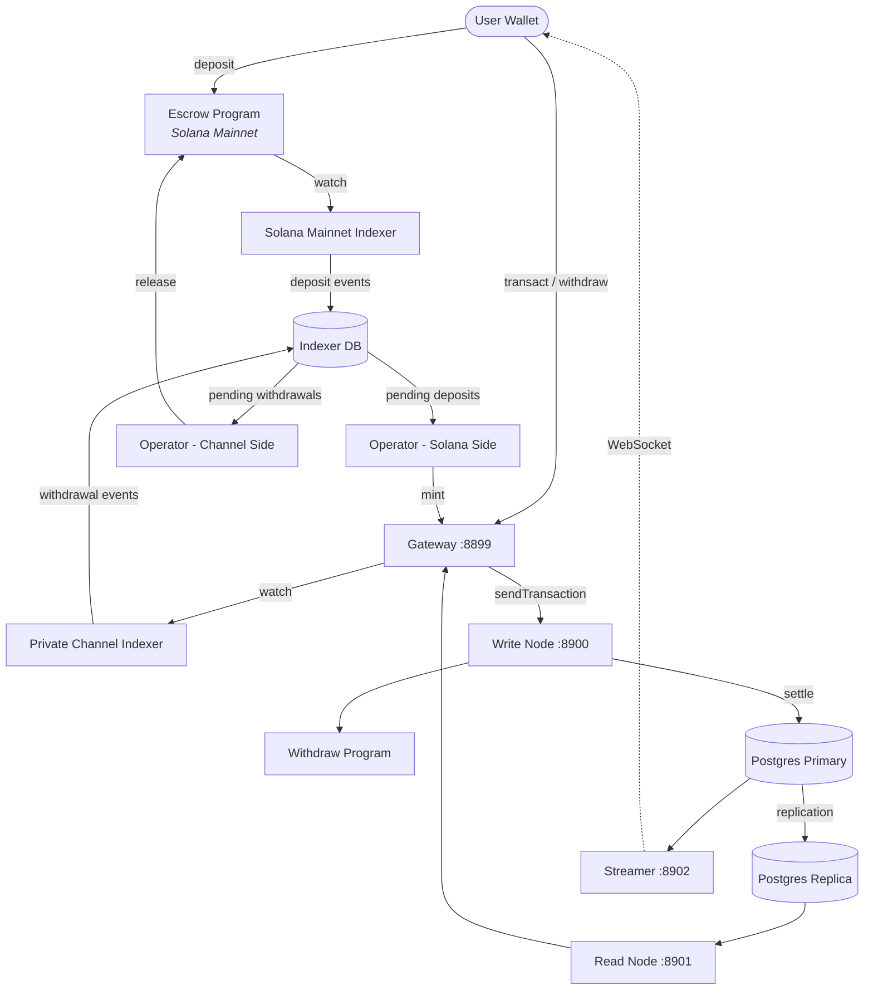

<Callout type="warning">
  Private Channels belum diaudit keamanannya dan tidak direkomendasikan untuk
  penggunaan produksi dengan dana nyata tanpa tinjauan keamanan yang menyeluruh.
</Callout>

<Callout type="info">
  **Ingin men-deploy instans?** Kunjungi [panduan
  Operator](/docs/tools/private-channels/operators). **Ingin mengintegrasikan dengan
  instans yang sudah ada?** Kunjungi
  [Quickstart](/docs/tools/private-channels/quickstart/installation). Halaman ini
  adalah referensi arsitektur untuk kedua audiens.
</Callout>

## Arsitektur

Private Channels terdiri dari empat komponen: dua program Solana on-chain
(Escrow dan Withdraw) dan dua layanan off-chain (Gateway dan Auth Service).
Bersama-sama, keduanya membentuk protokol state channel di mana dana berada di Mainnet tetapi
transfer diselesaikan secara off-chain.

### Program Escrow

Program Escrow adalah program Solana on-chain yang menyimpan token SPL yang
didepositkan. Program ini merupakan jangkar kepercayaan sistem: semua dana pada akhirnya berada dalam
escrow hingga operator menyediakan bukti eksklusi Sparse Merkle Tree yang valid untuk
melepaskannya.

- Program ID: `9tgHa1DcnaSSUtmMsst8ovKTe1Gfxzezn27KnH9xXYeU`
- ID ini dikompilasi ke dalam biner program melalui `declare_id!()`. Layanan off-chain
  membaca ID yang sama pada waktu kompilasi dari crate klien yang dihasilkan, bukan
  dari variabel lingkungan.
- Mengelola PDA `Instance`, `AllowedMint`, dan `Operator`
- Instruksi: `CreateInstance`, `AllowMint`, `BlockMint`, `AddOperator`,
  `RemoveOperator`, `SetNewAdmin`, `Deposit`, `ReleaseFunds`, `ResetSmtRoot`

### Program Withdraw

Program Withdraw berjalan di jaringan private channel, bukan di Solana Mainnet.
Pengguna memanggil `WithdrawFunds` untuk membakar saldo token sisi channel mereka. Pembakaran ini
tidak secara otomatis melepaskan dana; ini memberi sinyal kepada operator bahwa
penarikan sedang tertunda. Operator kemudian memanggil `ReleaseFunds` pada Program Escrow
dengan bukti SMT yang valid untuk menyelesaikan penyelesaian.

- Program ID: `J231K9UEpS4y4KAPwGc4gsMNCjKFRMYcQBcjVW7vBhVi`
- ID ini dikompilasi ke dalam biner program. Layanan off-chain membaca ID yang sama
  pada waktu kompilasi dari crate klien yang dihasilkan, bukan dari variabel
  lingkungan.

### Gateway

Gateway adalah proxy yang kompatibel dengan JSON-RPC Solana yang merutekan permintaan klien ke
write node jaringan channel (untuk pengiriman transaksi) dan read node (untuk
kueri). Gateway dikonfigurasi melalui variabel lingkungan: `GATEWAY_PORT`,
`GATEWAY_WRITE_URL`, `GATEWAY_READ_URL`.

Endpoint kesehatan (tidak memerlukan autentikasi):

- `GET /health` - pemeriksaan liveness; mengembalikan `200 {"status":"ok"}`
- `GET /ready` - kesiapan mendalam, memeriksa write node + read node; mengembalikan
  `200 {"status":"ready"}` atau `503 {"status":"degraded"}`

#### Perutean Metode RPC dan Akses

Gateway merutekan `sendTransaction` ke write node dan semua metode lainnya ke
read node. Permintaan yang lebih besar dari 64 KB ditolak dengan HTTP 413. Ketika
autentikasi diaktifkan, akses metode dijaga oleh peran JWT. Lihat
**[Autentikasi & Peran](/docs/tools/private-channels/concepts/auth)** untuk
matriks metode lengkap.

### Auth Service

Auth Service adalah komponen opsional yang menerbitkan JWT HS256 (kedaluwarsa 24 jam)
untuk kontrol akses gateway. Komponen ini diaktifkan ketika variabel lingkungan `JWT_SECRET`
ditetapkan. Tanpanya, gateway menerima semua koneksi.

Klaim JWT: `sub` (UUID pengguna), `role` (`"user"` atau `"operator"`), `iss`
(`"private-channel-auth"`), `aud` (`"private-channel-gateway"`), `exp` (stempel waktu
Unix). `iss` dan `aud` divalidasi oleh konfigurasi JWT gateway,
bukan dideserialisasi ke dalam struct klaim aplikasi: hanya `sub`, `role`, dan
`exp` yang tersedia untuk kode lapisan aplikasi.

Peran:

- `user` - akses dibatasi pada dompet terverifikasi milik sendiri; tidak dapat memanggil `getBlock`,
  `getTransaction`, atau `simulateTransaction`
- `operator` - melewati semua pemeriksaan kepemilikan; akses penuh ke metode RPC; harus
  disediakan dalam database (tidak ada eskalasi mandiri)

### Streamer

Streamer adalah server WebSocket yang mendorong pembaruan status channel ke
klien yang terhubung secara real time, menghilangkan kebutuhan untuk melakukan polling ke RPC. Streamer melakukan polling
PostgreSQL untuk perubahan status. Ini adalah bagian dari stack Docker Compose dasar, bukan
stack devnet yang di-deploy oleh panduan ini; lihat
[referensi Konfigurasi](/docs/tools/private-channels/operators/configuration#service-port-reference).

- Port: `8902`, dapat dikonfigurasi melalui `STREAMER_PORT`
- Hubungkan: `ws://localhost:8902`
- Endpoint kesehatan: `GET /health` - mengembalikan `503` jika loop polling internal mana pun
  terhenti lebih dari 30 detik

<Callout type="warning">
  Skema event WebSocket belum terdokumentasi secara publik. Lihat
  [`core/src/bin/streamer.rs`](https://github.com/solana-foundation/solana-private-channels/blob/main/core/src/bin/streamer.rs)
  untuk detail implementasi hingga dokumentasi resmi tersedia.
</Callout>



## Pipeline Transaksi

```text
Transaction -> [1:Dedup] -> [2:SigVerify] -> [3:Sequencer] -> [4:Executor] -> [5:Settler] -> Database
```

Transaksi yang dikirimkan ke Gateway melewati pipeline lima tahap sebelum
statusnya dikonfirmasi:

1. **Dedup** - menyaring transaksi duplikat sebelum masuk ke pipeline
2. **SigVerify** - memvalidasi tanda tangan transaksi terhadap kunci publik penandatangan
3. **Sequencer** - mengurutkan transaksi yang valid secara deterministik untuk membentuk
   riwayat kanonik
4. **Executor** - mengeksekusi transaksi terhadap lapisan akun channel
   (BOB Cache + AccountsDB), memperbarui saldo secara off-chain
5. **Settler** - mengonfirmasi hasil transaksi yang terakumulasi ke PostgreSQL dan
   memperbarui cache Redis; menghasilkan blockhash baru untuk siklus blok berikutnya.
   Penyelesaian Mainnet (memanggil `ReleaseFunds`) ditangani secara terpisah oleh layanan
   `operator-private-channel`

## Fitur Utama

### Privasi

Transfer antar peserta channel tidak dicatat di Solana Mainnet. Hanya
deposit (memasuki channel) dan penarikan akhir (meninggalkan channel)
yang muncul on-chain. Identitas pihak lawan dan jumlah transfer tidak terlihat oleh
pengamat luar selama operasi channel.

### Performa

Pipeline off-chain menghapus waktu blok Solana dari jalur kritis.
Transfer dikonfirmasi ketika sequencer memprosesnya, bukan ketika blok Solana
dikonfirmasi. Hal ini memungkinkan finalitas sub-detik dan throughput melebihi TPS native
Solana untuk transfer lapisan aplikasi.

### Penyelesaian

Setiap penarikan dilindungi oleh bukti Sparse Merkle Tree on-chain. Root SMT
disimpan di `Instance.withdrawal_transactions_root` pada Program Escrow.
Ketika `ReleaseFunds` dipanggil, program pertama-tama memverifikasi bukti eksklusi untuk
nonce yang belum pernah dilihat terhadap root on-chain saat ini, lalu memverifikasi bukti
inklusi terpisah untuk nonce tersebut terhadap root baru yang diberikan oleh pemanggil. Hanya setelah
kedua pemeriksaan lolos, root baru disimpan, sehingga double-spend tidak mungkin terjadi bahkan
jika kunci operator disusupi.

## Model Keamanan

**Kunci admin** - mengontrol pembuatan instans (`CreateInstance`) dan penyediaan
operator (`AddOperator` / `RemoveOperator`). Penyusupan kunci admin
memungkinkan penyediaan operator secara sewenang-wenang. `SetNewAdmin` mentransfer otoritas admin
secara permanen dalam satu langkah; lindungi kunci admin dengan sebaik-baiknya.

**Kunci operator** - dapat memanggil `ReleaseFunds` dan `ResetSmtRoot`. Kunci ini tidak dapat
melepaskan dana tanpa bukti eksklusi SMT yang valid terhadap root on-chain
saat ini. Pemeriksaan `verify_smt_exclusion_proof` on-chain adalah pertahanan terakhir
terhadap penarikan yang tidak sah: kunci operator yang disusupi saja tidak
cukup untuk menguras escrow.

**Root SMT** - disimpan on-chain di `Instance.withdrawal_transactions_root`.
Diperbarui secara atomik dengan setiap panggilan `ReleaseFunds`. Karena setiap bukti harus
mereferensikan nonce yang belum pernah dilihat, double-spending saldo channel yang sama tidak
mungkin terjadi bahkan jika kunci operator disusupi.

**Rotasi pohon** - `Instance.current_tree_index` melacak epoch pohon. Ketika
`ResetSmtRoot` dipanggil, indeks pohon bertambah dan semua
nonce dari epoch pohon sebelumnya menjadi tidak valid, memberikan awal yang bersih untuk siklus penyelesaian
baru.

## Keamanan Kunci Operasional

<Callout type="warning">
  Layanan off-chain menggunakan kosakata penanda tangan mereka sendiri, yang tidak terkait dengan
  otoritas admin/operator on-chain yang dijelaskan dalam Model Keamanan di atas.
  `ADMIN_PRIVATE_KEY` diperlukan untuk setiap layanan operator dan membayar
  biaya transaksi; `OPERATOR_PRIVATE_KEY` opsional yang terpisah menyediakan tanda tangan
  Operator on-chain untuk `ReleaseFunds` dan `ResetSmtRoot`, dan kembali ke nilai
  `ADMIN_PRIVATE_KEY` ketika tidak ditetapkan. Jangan pernah memasukkan kunci admin instans
  tingkat protokol (yang digunakan untuk `CreateInstance` / `AddOperator` / `SetNewAdmin`)
  ke dalam salah satu variabel atau mengeksposnya saat runtime; simpan kunci tersebut secara dingin dan offline.
</Callout>

`ReleaseFunds` dan `ResetSmtRoot` memerlukan dua tanda tangan on-chain: pembayar biaya
(dari `ADMIN_PRIVATE_KEY`) dan otoritas PDA Operator (dari
`OPERATOR_PRIVATE_KEY`, atau `ADMIN_PRIVATE_KEY` jika itu tidak ditetapkan). Panduan deployment ini
dalam panduan devnet menempatkan keypair operator yang dihasilkan ke dalam
`ADMIN_PRIVATE_KEY` dan membiarkan `OPERATOR_PRIVATE_KEY` tidak ditetapkan, sehingga keypair yang sama
mengisi kedua peran penanda tangan. Perlakukan kunci mana pun yang berakhir di `ADMIN_PRIVATE_KEY` dengan
kontrol yang sama seperti kunci privat hot wallet:

- Simpan hanya di file `.env` yang di-gitignore, jangan pernah di `.env.devnet` atau konfigurasi
  yang di-commit
- Untuk deployment produksi, pertimbangkan secrets manager (AWS Secrets Manager,
  HashiCorp Vault) daripada variabel lingkungan berupa teks biasa
- keypair admin instans tingkat protokol (yang digunakan untuk memanggil `AddOperator` /
  `SetNewAdmin`) harus disimpan secara dingin; hanya diperlukan selama pengaturan instans
  dan penyediaan operator, bukan selama runtime

`SetNewAdmin` mentransfer hak admin **secara permanen dalam satu transaksi**:
admin saat ini tidak memiliki jalur pemulihan tanpa kerja sama admin baru. Jangan
memanggil instruksi ini tanpa memverifikasi alamat target.

## Langkah Selanjutnya

<Cards>
  <Card
    title="Quickstart"
    href="/docs/tools/private-channels/quickstart/installation"
  >
    Siapkan lingkungan Anda dan hasilkan klien TypeScript.
  </Card>
  <Card title="Channels" href="/docs/tools/private-channels/concepts/channels">
    Pahami peserta dan siklus hidup channel.
  </Card>
  <Card
    title="Sparse Merkle Tree"
    href="/docs/tools/private-channels/concepts/smt"
  >
    Pahami cara bukti penarikan diverifikasi secara on-chain.
  </Card>
  <Card
    title="Instruksi"
    href="/docs/tools/private-channels/instructions/deposit"
  >
    Referensi instruksi lengkap untuk semua program.
  </Card>
</Cards>
