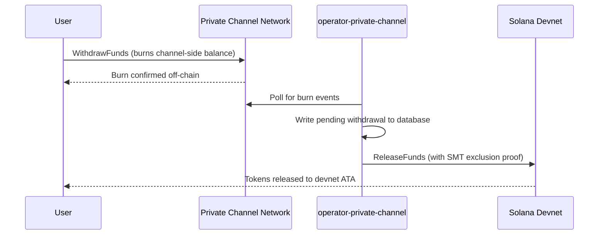

## Ikhtisar

Penarikan dari Private Channels adalah proses dua langkah. Pertama, pengguna membakar
saldo token sisi channel dengan memanggil `WithdrawFunds` pada Withdraw
Program. Kedua, operator memanggil `ReleaseFunds` pada Escrow Program (devnet,
dalam panduan ini) dengan bukti eksklusi Sparse Merkle Tree yang valid untuk melepaskan
dana. Bukti SMT memastikan setiap nonce penarikan hanya dapat digunakan satu kali,
mencegah double-spend.



## Langkah 1: Inisiasi Penarikan di Channel

Panggil `WithdrawFunds` pada Withdraw Program untuk membakar saldo sisi channel Anda.
Gunakan varian `Async`, yang secara otomatis menurunkan PDA `tokenAccount` dan merupakan
bentuk yang direkomendasikan untuk penggunaan produksi:

```typescript
import { getWithdrawFundsInstructionAsync } from "../private-channel-withdraw-program/clients/typescript/src/generated";
import {
  createSolanaRpc,
  address,
  pipe,
  createTransactionMessage,
  setTransactionMessageFeePayerSigner,
  setTransactionMessageLifetimeUsingBlockhash,
  appendTransactionMessageInstruction,
  signAndSendTransactionMessageWithSigners,
  assertIsTransactionMessageWithSingleSendingSigner,
  getBase58Decoder
} from "@solana/kit";

// Point to the gateway, not a public Solana RPC
const privateChannelRpc = createSolanaRpc("http://localhost:8899");

const withdrawIx = await getWithdrawFundsInstructionAsync({
  user: userSigner,
  mint: address(mintAddress),
  amount: 1_000_000n, // 1 USDC (6 decimals)
  destination: null // null = release to signer's devnet wallet
});

const { value: latestBlockhash } = await privateChannelRpc
  .getLatestBlockhash({ commitment: "confirmed" })
  .send();

// Sent to the Private Channels gateway (not Solana RPC directly), which
// expects the legacy transaction format - do not switch this to version 0.
const transactionMessage = pipe(
  createTransactionMessage({ version: "legacy" }),
  (m) => setTransactionMessageFeePayerSigner(userSigner, m),
  (m) => setTransactionMessageLifetimeUsingBlockhash(latestBlockhash, m),
  (m) => appendTransactionMessageInstruction(withdrawIx, m)
);

assertIsTransactionMessageWithSingleSendingSigner(transactionMessage);

const signatureBytes =
  await signAndSendTransactionMessageWithSigners(transactionMessage);
const signature = getBase58Decoder().decode(signatureBytes);
console.log("Withdrawal initiated:", signature);
```

- ID Withdraw Program: `J231K9UEpS4y4KAPwGc4gsMNCjKFRMYcQBcjVW7vBhVi`
- Kirimkan transaksi ini ke gateway (`http://localhost:8899`), bukan ke
  RPC Solana publik
- Jika `destination` disediakan, dana yang dilepaskan akan dikirim ke dompet tersebut, bukan ke
  dompet penanda tangan

## Yang Perlu Diharapkan

Tidak diperlukan tindakan lebih lanjut setelah memanggil `WithdrawFunds`. Layanan operator
menangani penyelesaian secara otomatis:

1. `indexer-private-channel` memantau channel setiap 1 detik untuk event pembakaran
   dan menulis catatan penarikan tertunda ketika penarikan Anda terdeteksi
2. `operator-private-channel` memantau database setiap 1 detik untuk catatan
   tertunda dan mengirimkan `ReleaseFunds` ke Escrow Program di Solana devnet
   dengan bukti eksklusi SMT yang diperlukan; layanan ini memantau konfirmasi devnet hingga
   5 kali pada interval 400 md sebelum mencoba ulang

Dana biasanya muncul di dompet devnet Anda dalam beberapa detik dalam kondisi normal.

## Cara Operator Menyelesaikan (Referensi)

Setelah pembakaran sisi channel, operator yang telah disediakan harus memanggil `ReleaseFunds` pada
Escrow Program dengan bukti eksklusi SMT yang valid; operator tidak dapat melepaskan
dana tanpa membuktikan bahwa nonce penarikan belum pernah digunakan sebelumnya. Langkah ini
ditangani secara otomatis oleh `operator-private-channel`; Anda tidak perlu memanggilnya
sendiri.

Operator menyediakan:

- `amount`: harus sesuai dengan jumlah yang dibakar
- `user`: dompet penerima di devnet
- `new_withdrawal_root`: root SMT yang diperbarui setelah penarikan ini
- `transaction_nonce`: nonce unik untuk leaf ini
- `sibling_proofs`: 512 byte (16 x hash sibling 32-byte untuk bukti pohon)

## Verifikasi

Setelah panggilan operator dikonfirmasi, periksa saldo token devnet Anda:

```bash
spl-token balance <MINT_ADDRESS> --owner <YOUR_WALLET>
```

Atau melalui RPC:

```typescript
import { createSolanaRpc, address } from "@solana/kit";
import { findAssociatedTokenPda } from "@solana-program/token";

const TOKEN_PROGRAM_ADDRESS = address(
  "TokenkegQfeZyiNwAJbNbGKPFXCWuBvf9Ss623VQ5DA"
);

// Query devnet directly; ReleaseFunds settles here, not through the gateway
const rpc = createSolanaRpc("https://api.devnet.solana.com");

const [yourDevnetAta] = await findAssociatedTokenPda({
  mint: address(mintAddress),
  owner: address(userSigner.address),
  tokenProgram: TOKEN_PROGRAM_ADDRESS
});

const balance = await rpc.getTokenAccountBalance(yourDevnetAta).send();
console.log(balance.value.uiAmountString);
```

## Anda Telah Menyelesaikan Quickstart

Anda telah menjalankan siklus Private Channels penuh di devnet: menyetorkan token SPL ke
dalam escrow, mengirimkan transfer off-chain melalui gateway, dan menarik dana
kembali ke dompet devnet Anda.

<Cards>
  <Card
    title="Siklus Hidup Channel"
    href="/docs/tools/private-channels/concepts/channels"
  >
    Pahami peserta dan alur deposit-hingga-penarikan secara mendalam.
  </Card>
  <Card
    title="Autentikasi & Peran"
    href="/docs/tools/private-channels/concepts/auth"
  >
    Tambahkan autentikasi JWT ke integrasi Anda.
  </Card>
  <Card
    title="Referensi Release Funds"
    href="/docs/tools/private-channels/instructions/release-funds"
  >
    Referensi instruksi ReleaseFunds lengkap untuk tooling operator.
  </Card>
  <Card
    title="Sparse Merkle Tree"
    href="/docs/tools/private-channels/concepts/smt"
  >
    Pahami bagaimana bukti penarikan mencegah double-spend.
  </Card>
</Cards>
