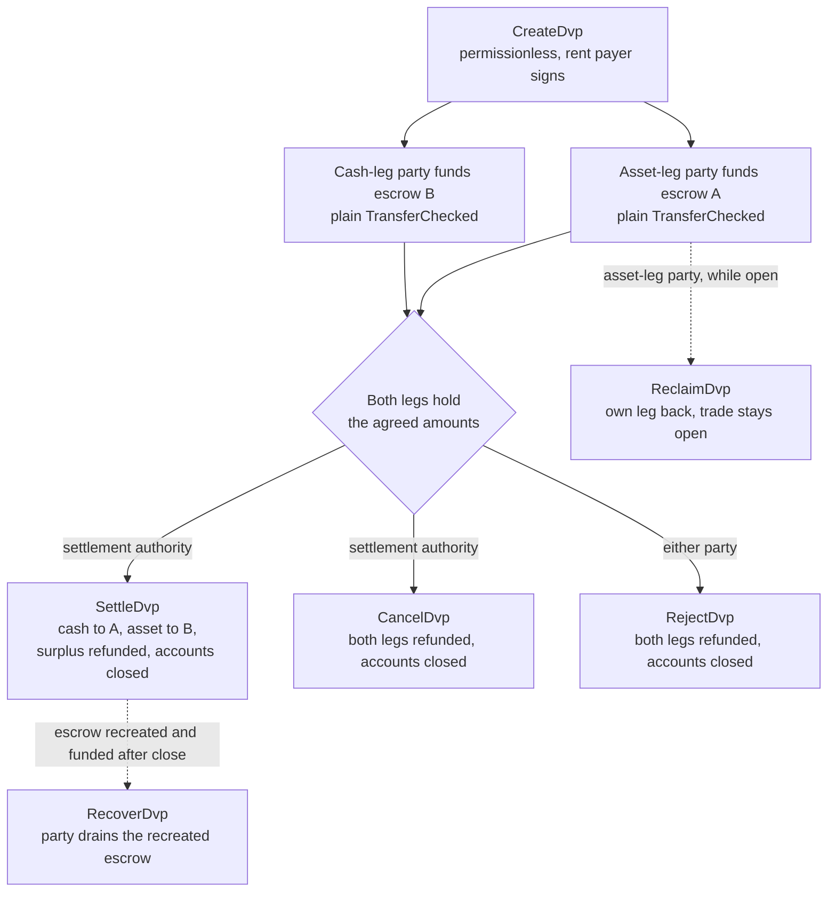
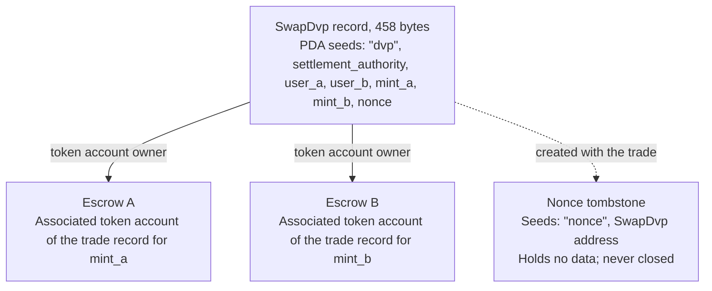

Il programma DvP è il programma standard per la consegna contro pagamento su Solana,
mantenuto dalla Solana Foundation e sottoposto ad audit da Cantina. Due parti concordano
un'operazione, ciascuna invia la propria gamba a un account di escrow con un normale
trasferimento di token, e un'autorità di regolamento regola entrambe le gambe in un'unica transazione, così
o si muovono entrambe o non si muove nessuna. L'autorità di regolamento è un terzo indirizzo
indicato nell'operazione, come la sede di negoziazione o l'agente che l'ha organizzata. Nessuna delle due parti
scrive o distribuisce un programma, e un wallet o un custodian in grado di inviare un trasferimento
di token standard (`TransferChecked`) può finanziare una gamba senza alcuna integrazione specifica per DvP.
Fino al regolamento, ciascuna parte può riprendersi la propria gamba o disfare
l'operazione.

<Callout type="warn" title="Leggi il record prima di fidarti">

La creazione di un record di operazione non richiede permessi, quindi un record non è
prova di accordo. Ogni parte legge i termini memorizzati prima di finanziare, e l'autorità
di regolamento prima di regolare (vedi
[verifica](#verification-before-funding-and-settlement)).

</Callout>

## Come funziona

Ogni operazione ottiene un record di proprietà del programma e due account di escrow, uno per gamba. La
parte della gamba asset (`user_a`) e la parte della gamba cash (`user_b`) finanziano ciascuna una gamba
trasferendo token nell'account di escrow di quella gamba. L'autorità di
regolamento è l'unico firmatario che può regolare. Il regolamento trasferisce l'importo
concordato di ciascuna gamba all'altra parte, restituisce l'eventuale eccedenza alla parte proprietaria
della gamba e chiude il record e i due escrow. L'atomicità deriva dalle
[transazioni](/docs/core/transactions) di Solana: entrambi i trasferimenti sono in un'unica transazione,
quindi o hanno effetto entrambi o nessuno.

Ogni rimborso, recupero e restituzione di eccedenza va all'associated
token account della parte stessa: l'account di `user_a` per `mint_a`, quello di `user_b` per `mint_b`. Un
custodian o un sistema di tesoreria può finanziare una gamba dal proprio account, ma tutto ciò che
viene restituito finisce nell'account della parte, non torna al custodian. Ogni operazione
lascia inoltre un account marcatore permanente (vedi [Stato](#state)).

## Guide

Le pagine dei passaggi seguono un'operazione dalla creazione al regolamento, con TypeScript e
Rust per ogni istruzione.

<Cards>
  <Card title="Creare un'operazione" href="/docs/defi/dvp-program/create-a-trade">
    Installa i client e registra i termini dell'operazione con CreateDvp
  </Card>
  <Card title="Finanziare le gambe" href="/docs/defi/dvp-program/fund-the-legs">
    Verifica i termini memorizzati, poi finanzia ogni gamba con un semplice trasferimento
  </Card>
  <Card title="Regolare l'operazione" href="/docs/defi/dvp-program/settle-the-trade">
    Regola entrambe le gambe in un'unica transazione come autorità di regolamento
  </Card>
  <Card title="Disfare un'operazione" href="/docs/defi/dvp-program/unwind-a-trade">
    Recupera una gamba, annulla o rifiuta l'operazione e recupera i depositi tardivi
  </Card>
</Cards>

Una [demo su devnet](https://solana.com/delivery-vs-payment/demo) esegue un'operazione
dall'inizio alla fine: crea l'operazione, finanzia entrambi gli escrow con trasferimenti di token standard e
regola entrambe le gambe in un'unica transazione.

## Scegliere tra il programma e la delega

[Delivery vs Payment (DvP) con delega](/docs/tokenization/dvp) regola lo
stesso scambio senza un programma: ciascuna parte delega la propria posizione a un
agente di regolamento, che muove entrambe le gambe in un'unica transazione.

- **Il programma** non richiede delega, quindi il limite di un delegato per
  token account non si applica, e l'autorità di regolamento non può reindirizzare i proventi.
  Ogni operazione dipende da un programma aggiornabile e dalla sua autorità di aggiornamento.
- **Il pattern di delega** non ha dipendenze da programmi e funziona con i mint che
  utilizzano Scaled UI Amount. Il programma rifiuta quei mint, il che esclude qualsiasi
  mint creato dal template `tokenized-security` di Mosaic (vedi
  [vincoli di configurazione del mint](#mint-configuration-constraints)).

## Ruoli

Il programma è simmetrico. Nella sua interfaccia le due parti sono `user_a`, che
consegna `mint_a`, e `user_b`, che consegna `mint_b`. Il README e i client
generati chiamano `mint_a` la gamba asset e `mint_b` la gamba cash, e
queste pagine seguono tale convenzione, ma nulla nel programma richiede che la gamba cash
sia uno strumento di cassa. Due asset, o due stablecoin, si regolano allo stesso
modo.

| Ruolo                 | Chi                               | Firma                                              | Note                                                                                                                                                                                                     |
| -------------------- | --------------------------------- | -------------------------------------------------- | --------------------------------------------------------------------------------------------------------------------------------------------------------------------------------------------------------- |
| Parte della gamba asset      | `user_a`, consegna `mint_a`       | Il proprio trasferimento di finanziamento; Reclaim, Reject, Recover | Un wallet keypair, o uno smart wallet basato su PDA come un vault multisig. Un account multisig di SPL Token o un program account non può essere una parte: Create fallisce con `PartyNotSignerCapable`                   |
| Parte della gamba cash       | `user_b`, consegna `mint_b`       | Il proprio trasferimento di finanziamento; Reclaim, Reject, Recover | Stesso requisito                                                                                                                                                                                          |
| Autorità di regolamento | Un terzo indirizzo indicato alla creazione | Settle, Cancel                                     | L'unico firmatario che può regolare. Non può reindirizzare i proventi, che sono fissati alla creazione. Riceve la rent degli account chiusi quando regola o annulla                                         |
| Pagatore della rent           | Chiunque firmi `CreateDvp`         | Create                                             | Finanzia la rent (il deposito in SOL che mantiene aperto un account) per il record, il nonce tombstone e i due escrow. Non è registrato come destinatario della rent: la rent degli account chiusi va a chi chiude l'operazione |

## ID del programma

```text
dvp34bdbcEm4f4FCUjGV4mDAkDshaQR4LkK8fdcsyZq
```

| Cluster      | Programma                                       | Autorità di aggiornamento                              | Ultimo slot di deploy |
| ------------ | --------------------------------------------- | ---------------------------------------------- | ------------------ |
| mainnet-beta | `dvp34bdbcEm4f4FCUjGV4mDAkDshaQR4LkK8fdcsyZq` | `DXtFpbPjcn2hxPnw79x1Pfoj35vXh5AsWBkS37YnXMVv` | 452.058.374        |
| devnet       | `dvp34bdbcEm4f4FCUjGV4mDAkDshaQR4LkK8fdcsyZq` | `5EX1zFeJWj4rGYZv432WnYw8CbaSUeTdxPx4r573UgYU` | 479.376.863        |

Il programma è aggiornabile su entrambi i cluster. I valori sopra riportati sono quelli restituiti da
`solana program show` il 2 ottobre 2026; esegui lo stesso comando per i
valori attuali. La build devnet è più vecchia del commit su cui sono scritte le pagine dei passaggi
(vedi [Installazione](/docs/defi/dvp-program/create-a-trade#install)),
con lo stesso set di istruzioni ed errori.

## Ciclo di vita



Un'operazione è aperta da `CreateDvp` finché una tra Settle, Cancel o Reject non la chiude.
Il finanziamento non ha un'istruzione propria: una gamba è finanziata quando il suo account
di escrow contiene almeno l'importo concordato. Reclaim è per singola gamba e lascia
l'operazione aperta, così un problema con una gamba non costringe l'altra parte ad annullare
l'intera operazione.

## Stato

Ogni operazione ha un account `SwapDvp` di 458 byte, di proprietà del programma. Il suo
indirizzo è derivato dall'autorità di regolamento, dalle due parti, dai due
mint e da un nonce (i seed
`["dvp", settlement_authority, user_a, user_b, mint_a, mint_b, nonce]`). Gli
importi e le scadenze sono memorizzati all'interno dell'account e non influiscono sull'indirizzo,
motivo per cui devono essere letti anziché dedotti. Un piccolo account marcatore,
il nonce tombstone in `["nonce", swap_dvp]`, viene creato con l'operazione e
non viene mai chiuso, quindi ogni combinazione di parti, mint, autorità e nonce può essere
usata per una sola operazione.



| Campo                                  | Tipo          | Significato                                                                                                 |
| -------------------------------------- | ------------- | ------------------------------------------------------------------------------------------------------- |
| `bump`                                 | `u8`          | Bump del PDA                                                                                                |
| `user_a`, `user_b`                     | `Pubkey`      | Le due parti                                                                                         |
| `mint_a`, `mint_b`                     | `Pubkey`      | I mint della gamba asset e della gamba cash                                                                        |
| `settlement_authority`                 | `Pubkey`      | L'unico firmatario che può regolare o annullare                                                               |
| `token_program_a`, `token_program_b`   | `Pubkey`      | Il token program proprietario di ciascun mint; un'operazione può combinare gambe SPL Token e Token-2022                    |
| `amount_a`, `amount_b`                 | `u64`         | L'importo concordato di ciascuna gamba, nell'unità più piccola del mint (unità base)                                 |
| `expiry_timestamp`                     | `i64`         | Dopo questo orario di rete (il clock onchain), Settle viene rifiutato. Reclaim, Cancel e Reject continuano a funzionare |
| `nonce`                                | `u64`         | Distingue le operazioni che condividono gli altri seed. Monouso                                             |
| `ref_string`                           | `[u8; 64]`    | Un riferimento opaco del client, completato con zeri; il programma non lo legge mai                                     |
| `user_a_settlement_destination`        | `Pubkey`      | Riceve la gamba cash al momento di Settle; per impostazione predefinita è `user_a`                                                   |
| `user_b_settlement_destination`        | `Pubkey`      | Riceve la gamba asset al momento di Settle; per impostazione predefinita è `user_b`                                                  |
| `mint_a_authority`, `mint_b_authority` | `Pubkey`      | Le autorità dei mint acquisite alla creazione; Settle fallisce se una delle due è cambiata                           |
| `earliest_settlement_timestamp`        | `Option<i64>` | Se impostato, Settle viene rifiutato prima di questo orario di rete                                                     |

L'elenco dei campi è ricavato dall'IDL del programma al commit indicato in
[Creare un'operazione](/docs/defi/dvp-program/create-a-trade#install).

## Istruzioni

| Istruzione  | Firmatario               | Effetto                                                                                                                                                              |
| ------------ | -------------------- | ------------------------------------------------------------------------------------------------------------------------------------------------------------------- |
| `CreateDvp`  | Qualsiasi pagatore            | Crea il record `SwapDvp`, il suo nonce tombstone e i due account di escrow. Non sposta alcun token                                                                        |
| `ReclaimDvp` | `user_a` o `user_b` | Restituisce dall'escrow la gamba del firmatario. L'operazione resta aperta e la gamba può essere finanziata di nuovo                                                                      |
| `SettleDvp`  | Autorità di regolamento | Trasferisce `amount_a` alla destinazione di `user_b` e `amount_b` alla destinazione di `user_a`, restituisce l'eventuale eccedenza alla parte della gamba, chiude il record e i due escrow |
| `CancelDvp`  | Autorità di regolamento | Rimborsa a `user_a` quanto detenuto dall'escrow A e a `user_b` quanto detenuto dall'escrow B, chiude il record e i due escrow                                                            |
| `RejectDvp`  | `user_a` o `user_b` | Stesso effetto di Cancel, firmato da una parte                                                                                                                            |
| `RecoverDvp` | `user_a` o `user_b` | Dopo la chiusura dell'operazione: svuota un escrow ricreato verso il token account del firmatario e lo chiude. Copre un deposito arrivato dopo Settle, Cancel o Reject  |

Ogni rimborso va all'associated token account della parte per il mint di quella
gamba, indipendentemente da chi abbia finanziato l'escrow.

Gli account e gli argomenti di ciascuna istruzione sono nella pagina del relativo passaggio.

## Errori

| Codice | Errore                            | Quando                                                                                                   |
| ---- | -------------------------------- | ------------------------------------------------------------------------------------------------------ |
| 0    | `SignerNotParty`                 | Reclaim, Reject o Recover firmato da un indirizzo che non è `user_a` o `user_b`                      |
| 1    | `DvpExpired`                     | Settle dopo `expiry_timestamp`                                                                        |
| 2    | `SettlementAuthorityMismatch`    | Settle o Cancel firmato da un indirizzo diverso dall'autorità di regolamento                              |
| 3    | `SettlementTooEarly`             | Settle prima di `earliest_settlement_timestamp`                                                          |
| 4    | `LegNotFunded`                   | Settle mentre un escrow contiene meno dell'importo concordato                                               |
| 5    | `ExpiryNotInFuture`              | Create con una scadenza uguale o precedente all'orario di rete corrente                                            |
| 6    | `EarliestAfterExpiry`            | Create con un orario minimo di regolamento successivo alla scadenza                                               |
| 7    | `SelfDvp`                        | Create con `user_a` uguale a `user_b`                                                                 |
| 8    | `SameMint`                       | Create con `mint_a` uguale a `mint_b`                                                                 |
| 9    | `ZeroAmount`                     | Create con un importo pari a zero su una delle due gambe                                                                |
| 10   | `BlockedMintExtension`           | Create o Settle con un mint che utilizza TransferFee, InterestBearing, ScaledUiAmount o NonTransferable |
| 11   | `SettlementAuthorityIsParty`     | Create con l'autorità di regolamento uguale a una delle parti                                                  |
| 12   | `SettlementAuthorityExecutable`  | Create con un'autorità di regolamento eseguibile                                                         |
| 13   | `NonceAlreadyUsed`               | Create che riutilizza un `(seeds, nonce)` che ha già un tombstone                                         |
| 14   | `ExpiryTooFarInFuture`           | Create con una scadenza oltre un anno nel futuro                                                         |
| 15   | `RefStringTooLong`               | Create con un riferimento più lungo di 64 byte                                                           |
| 16   | `DvpStillOpen`                   | Recover mentre l'operazione è ancora aperta; usa Reclaim                                                     |
| 17   | `DvpNeverCreated`                | Recover con seed senza tombstone                                                              |
| 18   | `EscrowPreloadedWithLamports`    | Create quando un escrow non nativo detiene lamport oltre il minimo rent-exempt                           |
| 19   | `SettlementDestinationIsSwapDvp` | Create con una destinazione di regolamento uguale al record dell'operazione                                         |
| 20   | `SwapDvpPreloadedWithLamports`   | Create quando l'indirizzo del record detiene lamport oltre la sua riserva di rent                                   |
| 21   | `RecipientAtaMismatch`           | Un token account del destinatario o di rimborso non appartiene più al wallet e al mint previsti                  |
| 22   | `PartyNotSignerCapable`          | Create con una parte che non è un account di proprietà del sistema e non eseguibile                                 |
| 23   | `MintAuthorityChanged`           | Settle quando la mint authority di un leg differisce dal valore acquisito alla creazione                         |

## Eventi e indicizzazione

Il programma non emette eventi onchain. Un indexer o un sistema di riconciliazione legge
lo stato dell'account `SwapDvp` e i saldi di token dei due escrow, e usa
`ref_string` per correlare un'operazione al relativo ordine off-chain. Poiché il record
viene chiuso al regolamento, un sistema che ha bisogno dei termini a posteriori li
memorizza quando li legge, oppure li ricostruisce dalla transazione che ha creato
l'operazione.

## Token supportati

Un'operazione può abbinare un leg SPL Token a un leg Token-2022; ciascun leg porta
il proprio token program. I leg con SOL wrapped sono supportati.

| Estensione Token-2022 sul mint di un leg                                                     | Comportamento del programma                                                  |
| ---------------------------------------------------------------------------------------- | ----------------------------------------------------------------- |
| TransferFee, InterestBearing, ScaledUiAmount, NonTransferable                            | Rifiutato in Create e Settle con `BlockedMintExtension`         |
| PermanentDelegate, Pausable, DefaultAccountState, una freeze authority, MintCloseAuthority | Accettato; ogni authority può agire sui token in escrow           |
| ConfidentialTransfer                                                                     | Accettato; gli importi su quel leg sono pubblici                          |
| TransferHook                                                                             | Supportato, fino a 32 account aggiuntivi per leg                        |
| MemoTransfer su un account di destinazione o di rimborso                                          | Accettato; il programma emette il memo richiesto prima del trasferimento |

Una commissione di trasferimento lascerebbe il lato ricevente al di sotto dell'importo concordato.
Interest Bearing e Scaled UI Amount non modificano gli importi raw, ma il loro tasso
o moltiplicatore può cambiare tra la creazione e il regolamento di un'operazione, il che cambia
il modo in cui vengono visualizzati gli importi concordati. NonTransferable bloccherebbe entrambi i leg.

Le authority accettate possono spostare, congelare o bloccare i token in escrow per tutta
la durata dell'operazione (vedi sotto). L'escrow non può essere configurato per ricevere
trasferimenti confidenziali, quindi gli importi in escrow e regolati su un leg
confidential sono pubblici.

Per un mint con hook, il client risolve gli account aggiuntivi dell'hook e li aggiunge
a Settle, Cancel, Reject, Reclaim e Recover. Il limite di 32 per leg
comprende il programma hook e il relativo account di validazione. Se la hook authority
amplia l'elenco di account dell'hook oltre tale limite, ogni trasferimento su quel leg
fallisce, inclusi Reclaim, Cancel, Reject e Recover, finché l'authority non annulla
la modifica. Il limite di account della transazione può diventare vincolante prima del limite per leg quando
entrambi i leg hanno hook.

Quando un account di destinazione o di rimborso richiede memo, il programma chiama il programma
Memo prima del trasferimento, motivo per cui ogni istruzione che sposta token
fuori dall'escrow richiede un account `memo_program`.

### Vincoli di configurazione del mint

**Scaled UI Amount.** Il template `tokenized-security` in
[Mosaic](https://github.com/solana-foundation/mosaic), il toolkit di emissione della Solana Foundation, aggiunge sempre Scaled UI Amount, quindi il programma non accetta come leg un
mint creato da quel template. Un mint destinato a questo programma può
essere creato senza l'estensione (vedi
[Token Extensions](/docs/tokens/extensions));
[DvP con delega](/docs/tokenization/dvp) regola tramite authority delegata e non applica questo controllo.

**Mint congelati per impostazione predefinita.** L'escrow di ogni operazione è un associated token account
di proprietà di un program-derived address nuovo per quell'operazione. Su un mint con
Default Account State impostato su frozen, l'escrow viene creato congelato e un
trasferimento di finanziamento verso di esso fallisce finché non viene scongelato. Con
[Token ACL](/docs/tokenization/token-acl) ciò significa che l'emittente o il suo transfer
agent ammette l'escrow dell'operazione prima del finanziamento: aggiungendo l'indirizzo del record
dell'operazione (il proprietario dell'escrow) alla allowlist, in modo che chiunque possa scongelare
l'escrow dove la configurazione Token ACL del mint abilita il thaw permissionless, oppure facendo
scongelare direttamente alla freeze authority. Un escrow congelato blocca anche
Settle, Reclaim, Cancel, Reject e Recover su quel leg, quindi la freeze
authority, e su un mint con hook la hook authority, è una parte fidata per
la durata dell'operazione. Il percorso con escrow congelato è descritto qui e non è esercitato
negli snippet devnet.

## Limiti

- Nessun matching, price discovery o order book. Le parti concordano i termini fuori
  dal ledger e una di esse li registra.
- Nessun netting, e solo bilaterale: un record è un'operazione tra due parti.
- Nessun riempimento parziale. Settle sposta esattamente l'importo concordato di ciascun leg e
  restituisce l'eventuale eccedenza alla parte del leg.
- Nessun leg off-ledger. Entrambi i leg sono token account su Solana; un leg in contanti su
  circuiti esistenti viene regolato separatamente e riconciliato.
- Nessun controllo di idoneità, allowlist o KYC. I controlli propri del mint impongono
  l'idoneità dei detentori.
- Nessun regolamento automatico. La settlement authority deve firmare.
- Nessun evento e nessuna commissione di protocollo oltre alle commissioni di transazione e alla rent.

Il programma elimina il rischio di capitale tra le due parti: nessun leg si muove
a meno che non si muovano entrambi. Non elimina il rischio di credito dell'emittente o di rimborso su nessuno dei due
token, la possibilità per la freeze, pause o permanent delegate authority di un mint di
agire sui token in escrow (vedi [token supportati](#supported-tokens)), né la
dipendenza dalla disponibilità della settlement authority a firmare.

## Verifica prima del finanziamento e del regolamento

`CreateDvp` è permissionless: firma solo il payer, mentre le parti e la
settlement authority no. Chiunque può quindi creare un record che indica parti e termini qualsiasi.
Prima del finanziamento, e di nuovo prima del regolamento, leggi l'account
`SwapDvp` e conferma:

1. L'account è di proprietà del programma DvP e ha esattamente 458 byte. Un account
   che non è di proprietà del programma può essere riempito con byte che si decodificano come un
   record reale.
2. `user_a`, `user_b`, `mint_a`, `mint_b` e `settlement_authority` corrispondono
   all'operazione concordata.
3. `amount_a`, `amount_b`, `expiry_timestamp` e
   `earliest_settlement_timestamp` corrispondono ai termini concordati.
4. Entrambe le destinazioni di regolamento sono gli indirizzi concordati. Un record falsificato può
   reindirizzare i proventi.

[Finanziare i leg](/docs/defi/dvp-program/fund-the-legs#verify-the-terms) elenca i
checked reader dei client generati e mostra il controllo nel codice.

Considera un'operazione regolata quando la transazione Settle raggiunge
[`finalized`](/docs/rpc#configuring-state-commitment). Si tratta di un livello di commitment
di rete; se segni anche la definitività del regolamento a fini legali
dipende dagli accordi delle parti e dai regimi applicabili.

## Versionamento

L'account `SwapDvp` non ha un campo di versione. Il suo layout è fisso a 458 byte
(`SwapDvp::LEN`) e i checked reader rifiutano un account di qualsiasi altra lunghezza.
L'IDL ha una propria versione, `0.1.0` al 2 ottobre 2026.

Il programma è aggiornabile su entrambi i cluster (vedi [Program ID](#program-id)). Un
record di operazione esiste solo finché non viene regolato, annullato o rifiutato, quindi consulta
il repository per sapere come un aggiornamento tratta le operazioni aperte e rigenera i client
dall'IDL della build distribuita.

## Repository e audit

Sorgente, IDL, client generati e test si trovano in
[`solana-foundation/dvp`](https://github.com/solana-foundation/dvp) con licenza
MIT. Il programma è un programma Pinocchio `no_std`; i client sono
generati dall'IDL con Codama. Le segnalazioni di vulnerabilità passano dal link di security advisory
del repository, come indicato in `SECURITY.md`.

Il programma è stato sottoposto ad audit da
[Cantina](https://cantina.xyz/portfolio/fe870bb4-d96d-4902-8aec-9dfcfa2d6a79).

## Correlati

- [Delivery vs Payment (DvP) con delega](/docs/tokenization/dvp): il
  pattern di delega senza un programma
- [Token ACL](/docs/tokenization/token-acl): come un mint con accesso controllato interagisce con gli
  account escrow
