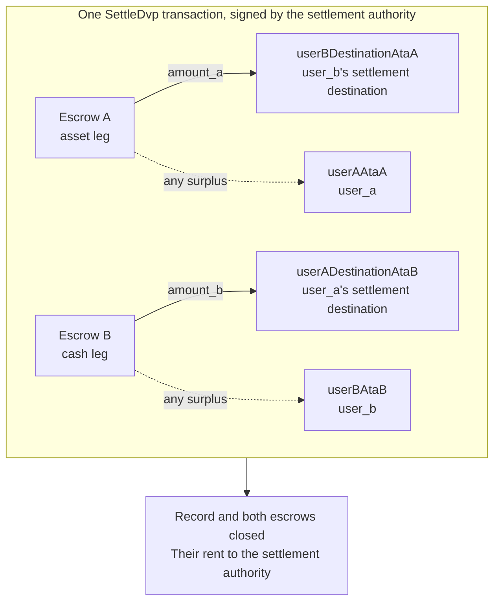

`SettleDvp` è firmata dall'autorità di regolamento indicata nel record dell'operazione. In
una sola transazione sposta `amount_a` della gamba asset verso la destinazione
della parte della gamba cash e `amount_b` della gamba cash verso la destinazione della parte della gamba asset,
restituisce l'eventuale eccedenza di ciascun escrow alla parte della rispettiva gamba e chiude il record
e entrambi gli escrow. Se uno qualsiasi di questi trasferimenti non può essere completato, l'istruzione
fallisce e nulla viene spostato.

Questa pagina prosegue da [creare un'operazione](/docs/defi/dvp-program/create-a-trade)
e [finanziare le gambe](/docs/defi/dvp-program/fund-the-legs); il client, i firmatari,
`trade` e i token account delle parti restano quelli già usati.

## Riconvalidare prima di firmare

L'autorità di regolamento firma la transazione che sposta entrambe le gambe, quindi
effettua prima di firmare la stessa lettura di ciascuna parte: proprietario, dimensione, parti,
mint, importi, scadenza ed entrambe le destinazioni (vedi
[finanziare le gambe](/docs/defi/dvp-program/fund-the-legs#verify-the-terms)). Il
programma stesso ricontrolla al momento del regolamento che ogni mint appartenga ancora al
token program registrato alla creazione, non abbia estensioni bloccate e abbia la stessa
mint authority di quando l'operazione è stata creata, quindi un mint ricreato con un'estensione
bloccata, un token program diverso o una mint authority diversa non può
essere regolato.

## Creare gli account destinatari

Settle scrive su quattro token account che il programma non crea:

| Account                | Riceve                     | Proprietario                           |
| ---------------------- | ---------------------------- | ------------------------------- |
| `userADestinationAtaB` | La gamba cash (`amount_b`)    | `user_a_settlement_destination` |
| `userBDestinationAtaA` | La gamba asset (`amount_a`)   | `user_b_settlement_destination` |
| `userAAtaA`            | Eventuale eccedenza sulla gamba asset | `user_a`                        |
| `userBAtaB`            | Eventuale eccedenza sulla gamba cash  | `user_b`                        |

Gli account per l'eccedenza vengono usati solo quando un escrow contiene più dell'importo
concordato, ma chiunque possieda il mint può creare un'eccedenza inviando poche unità
di base all'escrow. Se l'account di rimborso non esiste, l'intera istruzione Settle
fallisce, quindi crea tutti e quattro in modo idempotente nella stessa transazione.

<Tabs items={["TypeScript", "Rust"]}>
  <Tab value="TypeScript">
    ```ts
    import {
      findAssociatedTokenPda,
      getCreateAssociatedTokenIdempotentInstruction,
    } from "@solana-program/token-2022";

    const destinationA = t.userASettlementDestination; // defaults to userA
    const destinationB = t.userBSettlementDestination; // defaults to userB

    const [userADestinationAtaB] = await findAssociatedTokenPda({
      mint: mintB,
      owner: destinationA,
      tokenProgram: tokenProgramB,
    });
    const [userBDestinationAtaA] = await findAssociatedTokenPda({
      mint: mintA,
      owner: destinationB,
      tokenProgram: tokenProgramA,
    });
    // userAAtaA and userBAtaB are from fund the legs.

    const createRecipientAccounts = [
      { ata: userADestinationAtaB, owner: destinationA, mint: mintB, tokenProgram: tokenProgramB },
      { ata: userBDestinationAtaA, owner: destinationB, mint: mintA, tokenProgram: tokenProgramA },
      { ata: userAAtaA, owner: userA, mint: mintA, tokenProgram: tokenProgramA },
      { ata: userBAtaB, owner: userB, mint: mintB, tokenProgram: tokenProgramB },
    ].map(({ ata, owner, mint, tokenProgram }) =>
      getCreateAssociatedTokenIdempotentInstruction({
        payer: authoritySigner,
        ata,
        owner,
        mint,
        tokenProgram,
      }),
    );
    ```

  </Tab>

  <Tab value="Rust">
    ```rust
    use spl_associated_token_account_client::address::get_associated_token_address_with_program_id;
    use spl_associated_token_account_client::instruction::create_associated_token_account_idempotent;

    let authority: Pubkey = pubkey!("SETTLEMENT_AUTHORITY_ADDRESS_HERE");
    let destination_a = trade.user_a_settlement_destination; // defaults to user_a
    let destination_b = trade.user_b_settlement_destination; // defaults to user_b

    let user_a_destination_ata_b =
        get_associated_token_address_with_program_id(&destination_a, &mint_b, &token_program_b);
    let user_b_destination_ata_a =
        get_associated_token_address_with_program_id(&destination_b, &mint_a, &token_program_a);
    let user_a_ata_a = get_associated_token_address_with_program_id(&user_a, &mint_a, &token_program_a);
    let user_b_ata_b = get_associated_token_address_with_program_id(&user_b, &mint_b, &token_program_b);

    let create_recipient_accounts = [
        create_associated_token_account_idempotent(&authority, &destination_a, &mint_b, &token_program_b),
        create_associated_token_account_idempotent(&authority, &destination_b, &mint_a, &token_program_a),
        create_associated_token_account_idempotent(&authority, &user_a, &mint_a, &token_program_a),
        create_associated_token_account_idempotent(&authority, &user_b, &mint_b, &token_program_b),
    ];
    ```

  </Tab>
</Tabs>

## Regolare

`legAExtrasCount` indica al programma quanti degli account aggiunti dopo l'elenco
fisso appartengono al transfer hook della gamba asset; i restanti appartengono a quello della gamba
cash. Per i mint senza transfer hook, passa zero e non aggiungere nulla. Il program account
di Memo è richiesto dall'istruzione e viene usato solo per le destinazioni
che richiedono un memo.

<Tabs items={["TypeScript", "Rust"]}>
  <Tab value="TypeScript">
    ```ts
    import { MEMO_PROGRAM_ADDRESS } from "@solana-program/memo";
    import { getSettleDvpInstruction } from "./dvp";

    const settleInstruction = getSettleDvpInstruction({
      settlementAuthority: authoritySigner,
      swapDvp,
      mintA,
      mintB,
      dvpAtaA: escrowA,
      dvpAtaB: escrowB,
      userADestinationAtaB,
      userBDestinationAtaA,
      userAAtaA,
      userBAtaB,
      tokenProgramA,
      tokenProgramB,
      memoProgram: MEMO_PROGRAM_ADDRESS,
      legAExtrasCount: 0,
    });

    const { context: settleContext } = await client.sendTransaction([
      ...createRecipientAccounts,
      settleInstruction,
    ]);
    const settleSignature = settleContext.signature;
    console.log("Submitted:", settleSignature);

    // sendTransaction returns at the client's commitment (confirmed by default).
    // Wait for finalized before recording the trade as settled.
    let finalized = false;
    for (let attempt = 0; attempt < 30 && !finalized; attempt++) {
      const {
        value: [status],
      } = await client.rpc.getSignatureStatuses([settleSignature]).send();
      if (status?.err) {
        throw new Error("Settle transaction failed");
      }
      finalized = status?.confirmationStatus === "finalized";
      if (!finalized) {
        await new Promise((resolve) => setTimeout(resolve, 2_000));
      }
    }
    if (!finalized) {
      // A closed record means it settled; an open one is safe to settle again.
      throw new Error("Settle not finalized after 60s; read the trade record");
    }
    console.log("Settled:", settleSignature);
    ```

  </Tab>

  <Tab value="Rust">
    ```rust
    use dvp_swap_program_client::instructions::SettleDvpBuilder;

    const MEMO_PROGRAM_ID: Pubkey = pubkey!("MemoSq4gqABAXKb96qnH8TysNcWxMyWCqXgDLGmfcHr");

    let settle_ix = SettleDvpBuilder::new()
        .settlement_authority(authority)
        .swap_dvp(swap_dvp)
        .mint_a(mint_a)
        .mint_b(mint_b)
        .dvp_ata_a(escrow_a)
        .dvp_ata_b(escrow_b)
        .user_a_destination_ata_b(user_a_destination_ata_b)
        .user_b_destination_ata_a(user_b_destination_ata_a)
        .user_a_ata_a(user_a_ata_a)
        .user_b_ata_b(user_b_ata_b)
        .token_program_a(token_program_a)
        .token_program_b(token_program_b)
        .memo_program(MEMO_PROGRAM_ID)
        .leg_a_extras_count(0)
        .instruction();
    ```

  </Tab>
</Tabs>



### Transfer hook

L'IDL generato elenca solo gli account fissi, quindi i builder generati
non conoscono gli account dei hook. Risolvi gli account meta aggiuntivi di ciascun mint con hook
nello stesso modo in cui lo faresti per un trasferimento diretto di quel token, poi aggiungili
all'istruzione: prima gli account della gamba asset, poi quelli della gamba cash, con
`legAExtrasCount` impostato sul numero del primo gruppo. In TypeScript, espandi
i meta risolti nell'array `accounts` dell'istruzione; in Rust, usa
`add_remaining_accounts` sul builder. Il limite è di 32 account per gamba,
compresi il programma hook e l'account di convalida; il limite di account della transazione
può essere raggiunto per primo quando entrambe le gambe hanno hook. Il programma rimuove il flag di firmatario
da ogni account inoltrato, quindi un hook non può ottenere la firma
dell'autorità di regolamento attraverso questo percorso.

## Registrare il risultato

Considera l'operazione regolata quando la transazione Settle raggiunge `finalized`. Il
record ed entrambi gli escrow non esistono più dopo il regolamento, quindi un sistema che abbia bisogno
dei termini in seguito li memorizza dalla lettura precedente al regolamento o dalla transazione
di creazione. Il rent degli account chiusi è andato all'autorità di
regolamento.

## Errori di Settle

`LegNotFunded` significa che un escrow contiene meno dell'importo concordato; `DvpExpired`
e `SettlementTooEarly` indicano che la finestra temporale è stata mancata; `MintAuthorityChanged`
e `BlockedMintExtension` indicano che un mint è cambiato dopo la creazione;
`RecipientAtaMismatch` significa che un token account di destinazione o di rimborso manca oppure
non appartiene più al proprietario e al mint previsti, di solito perché il passaggio di
creazione degli account descritto sopra è stato saltato. In ogni caso nulla è stato spostato e le
parti possono annullare l'operazione, nel rispetto delle autorità del mint (vedi
[annullare un'operazione](/docs/defi/dvp-program/unwind-a-trade)).

## Passaggi successivi

- [Annullare un'operazione](/docs/defi/dvp-program/unwind-a-trade): recuperare le gambe
  finanziate quando un'operazione non viene regolata
