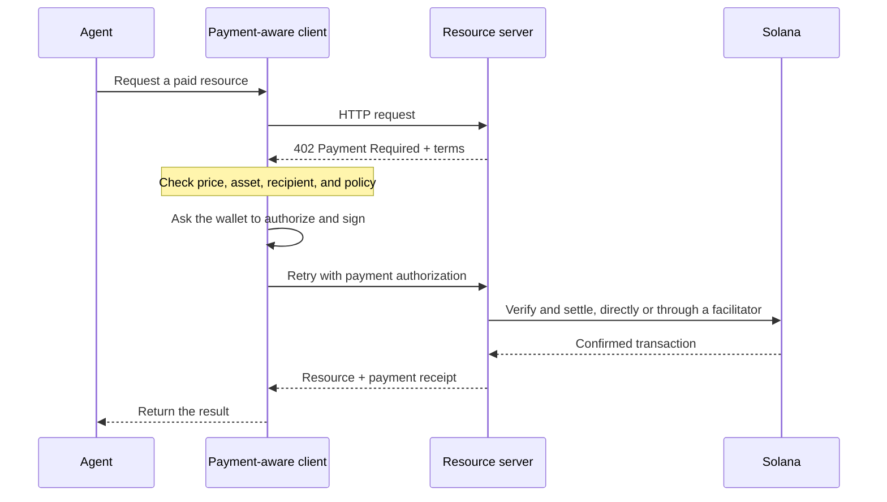

I pagamenti agentici consentono al software di individuare un prezzo, autorizzare un pagamento e ricevere
una risorsa all'interno dello stesso flusso HTTP. Un agente può pagare una query sui dati, un'inferenza
di un modello o una chiamata a uno strumento senza dover prima creare un account di fatturazione o copiare una
chiave API.

<Cards>
  <Card title="MPP" href="/docs/payments/agentic-payments/mpp">
    Usa l'autenticazione HTTP per addebiti singoli e sessioni di pagamento a consumo.
  </Card>
  <Card title="x402" href="/docs/payments/agentic-payments/x402">
    Aggiungi a una risorsa HTTP i requisiti di pagamento, le firme e il regolamento di x402 V2.
  </Card>
</Cards>

## Il flusso di pagamento comune

MPP e x402 usano intestazioni e modelli di dati diversi, ma il loro flusso HTTP di base è
simile:

## MPP e x402

Entrambi i protocolli possono regolare pagamenti in stablecoin su Solana. Scegli in base al
modello di pagamento e all'interoperabilità richiesti dal tuo servizio, non solo in base al codice di stato
`402` condiviso.

|                         | MPP                                                               | x402                                                                     |
| ----------------------- | ----------------------------------------------------------------- | ------------------------------------------------------------------------ |
| Challenge               | `WWW-Authenticate: Payment`                                       | `PAYMENT-REQUIRED`                                                       |
| Autorizzazione del client    | `Authorization: Payment`                                          | `PAYMENT-SIGNATURE`                                                      |
| Ricevuta                 | `Payment-Receipt`                                                 | `PAYMENT-RESPONSE`                                                       |
| Modelli di pagamento su Solana   | Intent `charge` singolo e `session` a consumo con limite massimo           | Schemi come `exact` e `upto`; il supporto varia in base alla rete e al client |
| Architettura di regolamento | Validazione lato server, oppure relay o gateway opzionale                | Resource server con verifica locale o facilitator                 |
| Buon punto di partenza     | API che richiedono la semantica di autenticazione HTTP o un conteggio dei consumi ripetuto | Risorse con pagamento per richiesta e client x402 esistenti                      |

MPP è il **Machine Payments Protocol**. Non confonderlo con il **Model
Context Protocol (MCP)**. MCP espone strumenti e risorse agli agenti; MPP o x402
possono richiedere un pagamento quando un agente invoca uno di tali strumenti.

<Callout type="info">
  Un servizio può pubblicizzare più di un protocollo. Il client seleziona un'opzione di pagamento
  che supporta, quindi utilizza le intestazioni di challenge, autorizzazione e
  ricevuta corrispondenti per l'intero scambio.
</Callout>
