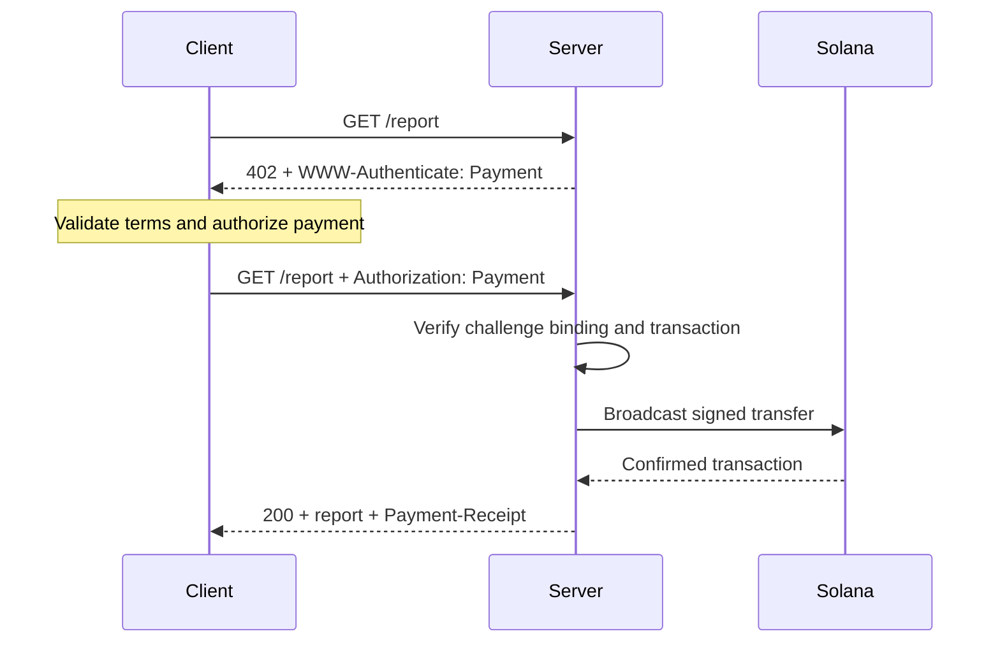
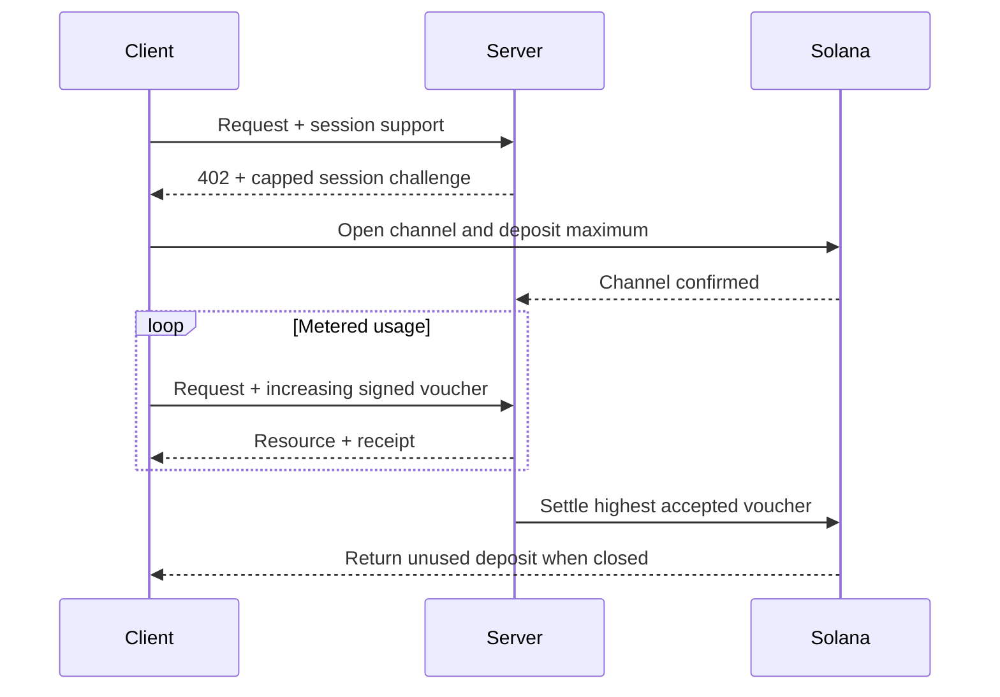

Il [Machine Payments Protocol (MPP)](https://mpp.dev/) applica ai pagamenti la semantica di autenticazione HTTP. Un server lancia una challenge a una richiesta non pagata, un client restituisce una credenziale di pagamento e il server restituisce una ricevuta dopo aver accettato il pagamento.

MPP separa tre aspetti:

- Un **intent** descrive l'interazione commerciale, ad esempio un singolo
  `charge` o una `session` a consumo.
- Un **metodo di pagamento** descrive come si muove il valore. Il metodo Solana supporta
  SOL nativo e token SPL per i charge.
- Un **transport** HTTP trasporta challenge, credenziali, ricevute ed errori.

MPP è pubblicato come insieme di Internet-Draft. Considera le
[specifiche attuali](https://paymentauth.org/) come fonte di riferimento e
aspettati che i dettagli evolvano finché le bozze sono in lavorazione.

## Scambio HTTP

MPP usa i campi standard di autenticazione HTTP invece di header di pagamento
specifici del protocollo:

| Messaggio                 | Rappresentazione HTTP                                         |
| ----------------------- | ----------------------------------------------------------- |
| Challenge di pagamento       | `402 Payment Required` con `WWW-Authenticate: Payment ...` |
| Credenziale di pagamento      | Richiesta ripetuta con `Authorization: Payment ...`           |
| Ricevuta di successo      | Risposta della risorsa con `Payment-Receipt: ...`               |
| Dettagli di pagamento non validi | Corpo Problem Details che usa `application/problem+json`       |



Una challenge include un ID generato dal server, realm, metodo, intent, richiesta
di pagamento codificata e scadenza. La credenziale riprende la challenge e aggiunge
la prova di pagamento specifica del metodo. Il server deve verificare entrambi gli elementi: un
trasferimento valido che appartiene a una challenge diversa non deve sbloccare la risorsa.

## Addebiti singoli su Solana

L'intent `charge` di Solana supporta due tipi di credenziale:

- La **modalità pull** usa una transazione firmata. Il client firma il trasferimento e
  invia la transazione al server. Il server la verifica, aggiunge facoltativamente una
  firma del fee payer, la trasmette, ne attende la conferma e restituisce la firma
  della transazione nella sua ricevuta.
- La **modalità push** usa la firma di una transazione. Il client trasmette per primo, poi
  invia al server la firma confermata. Il server recupera e verifica
  la transazione prima di restituire la risorsa.

La modalità pull consente al server di sponsorizzare le commissioni di transazione e di gestire la logica di retry lato server.
La modalità push è utile quando un wallet richiede che il client invii la propria
transazione, ma non può usare la sponsorizzazione delle commissioni da parte del server.

Per i campi normativi e le regole di verifica, consulta la
[specifica del charge Solana](https://paymentauth.org/draft-solana-charge-00.html).

## Aggiungere un charge MPP a un'API Express

Solana Pay Kit offre un'integrazione TypeScript aggiornata per MPP e x402.
Installalo con Express:

```bash
pnpm add @solana/pay-kit @solana/kit@^6.9.0 express
pnpm add --save-dev @types/express tsx
```

Questo esempio minimo usa la sandbox Surfpool ospitata e il destinatario demo
pubblico del pacchetto. È destinato solo allo sviluppo in locale:

```ts filename=server.ts
import express from "express";
import { createPayKit, usd } from "@solana/pay-kit";

const pay = await createPayKit({
  accept: ["mpp"],
  rpcUrl: "https://402.surfnet.dev:8899"
});

const app = express();

app.get("/report", pay.express(usd("0.01")), (_req, res) => {
  res.json({ report: "Paid report" });
});

app.listen(4567, () => {
  console.log("Paid API listening on http://127.0.0.1:4567");
});
```

Eseguilo e confronta una richiesta non pagata con una richiesta che include il pagamento:

```bash
pnpm tsx server.ts
curl -i http://127.0.0.1:4567/report
pay --sandbox curl http://127.0.0.1:4567/report
```

Il route handler viene eseguito solo dopo che il middleware ha accettato il pagamento.

<Callout type="warn" title="Sostituisci ogni impostazione predefinita della sandbox in produzione">
  Configura una rete esplicita, il destinatario del merchant, un RPC dedicato, un segreto stabile
  per il binding delle challenge, un signer di produzione e un replay store durevole. Non
  instradare mai pagamenti reali verso un signer demo del pacchetto.
</Callout>

## Sessioni a consumo

Usa una `session` MPP di Solana quando un client effettuerà molti piccoli pagamenti correlati.
Una sessione apre un canale di pagamento onchain con un deposito massimo, poi usa
voucher firmati cumulativi man mano che l'utilizzo cresce. Il server può verificare i voucher
offchain e regolare in un secondo momento l'importo massimo accettato.

È utile per l'inferenza misurata in token, i download misurati in byte, i dati live
e le chiamate ripetute a strumenti. Non equivale a inviare un pagamento
onchain separato per ogni evento.



Definisci una sessione come **pagamento di sessione**, **canale di pagamento** o **autorizzazione ripetuta con limite massimo**. Parla di pagamento in streaming solo quando il servizio e il contratto di pagamento
misurano effettivamente un flusso di utilizzo.

## Verifica in produzione

Per ogni charge Solana, il server deve verificare almeno che:

- La challenge sia autentica, non scaduta, associata a questa richiesta e destinata a
  questo realm.
- La transazione usi la rete, l'asset o il mint, il destinatario, l'importo
  e il token program previsti.
- Eventuali istruzioni del fee payer o dell'associated token account siano esplicitamente
  consentite e non possano svuotare il signer del server.
- La transazione sia andata a buon fine al livello di commitment richiesto.
- La firma della transazione non sia già stata consumata.
- Il controllo di replay e l'operazione di consumo siano atomici su tutte le istanze del server.

Per le sessioni, rendi persistenti in un archivio condiviso anche lo stato del canale, l'importo cumulativo accettato e
il watermark di regolamento. Documenta come i client recuperano i fondi non utilizzati
se il server diventa non disponibile.

## Risorse correlate

- [Specifiche MPP](https://paymentauth.org/)
- [Documentazione del protocollo MPP](https://mpp.dev/protocol)
- [Solana Pay Kit](https://github.com/solana-foundation/pay-kit)
- [Panoramica dei pagamenti agentici](/docs/payments/agentic-payments)
- [Prontezza per la produzione](/docs/tools/production-readiness)
