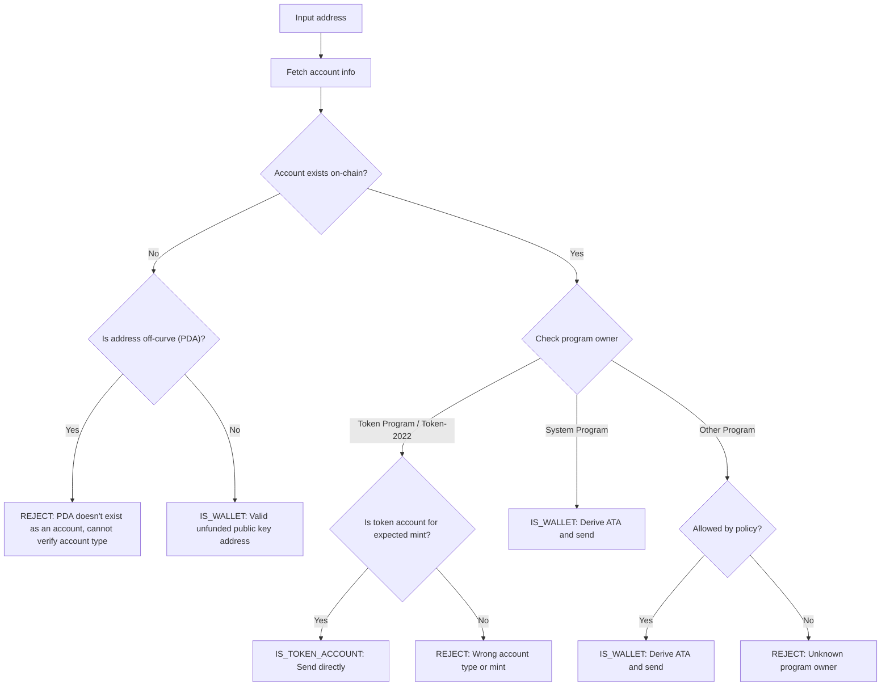

Inviare token all'indirizzo sbagliato può comportare la perdita permanente dei
fondi. La verifica dell'indirizzo garantisce che tu invii token solo a indirizzi
che possono riceverli e accedervi correttamente.

<Callout>
  Consulta [Come funzionano i pagamenti su
  Solana](/docs/payments/how-payments-work) per i concetti fondamentali sui
  pagamenti.
</Callout>

## Comprendere gli indirizzi Solana

Gli account Solana hanno due tipi di indirizzi: on-curve e off-curve.

### Indirizzi on-curve

Gli indirizzi standard sono le chiavi pubbliche delle coppie di chiavi Ed25519.
Questi indirizzi:

- Hanno una chiave privata corrispondente che può firmare transazioni
- Vengono utilizzati come indirizzi di wallet

### Indirizzi off-curve (PDA)

I [Program Derived Address](/docs/core/pda) sono derivati deterministicamente da
un ID programma e seed. Questi indirizzi:

- **Non** hanno una chiave privata corrispondente
- Possono essere firmati solo dal programma da cui l'indirizzo è stato derivato

## Tipi di account nei pagamenti

Utilizza l'indirizzo per recuperare un [account](/docs/core/accounts) dalla
rete, verifica il proprietario del programma e il tipo di account per
determinare come gestire l'indirizzo.

<Callout>
  Sapere se un indirizzo è on-curve o off-curve non ti dice che tipo di account
  è, quale programma lo possiede o se esiste un account a quell'indirizzo. Devi
  recuperare l'account dalla rete per determinare questi dettagli.
</Callout>

### Account del System Program (wallet)

Gli account di proprietà del System Program sono wallet standard. Per inviare
token SPL a un wallet, devi derivare e utilizzare il suo
[associated token account (ATA)](/docs/tokens/basics/create-token-account#whats-an-associated-token-account).

Dopo aver derivato l'indirizzo ATA, verifica se il token account esiste
on-chain. Se l'ATA non esiste, puoi includere un'istruzione per creare il token
account del destinatario nella stessa transazione del trasferimento. Tuttavia,
questo richiede il pagamento del rent per il nuovo token account. Poiché il
destinatario possiede l'ATA, il SOL pagato per il rent non può essere recuperato
dal mittente.

<Callout type="warn">
  Senza misure di sicurezza, sovvenzionare la creazione di ATA può essere
  sfruttato. Un utente malintenzionato potrebbe richiedere un trasferimento, far
  creare il proprio ATA a tue spese, chiudere l'ATA per recuperare il SOL del
  rent e ripetere l'operazione.
</Callout>

### Token account

I [token account](/docs/tokens/basics/create-token-account) sono di proprietà
del Token Program o del Token-2022 Program e contengono saldi di token. Se
l'indirizzo che ricevi è di proprietà di un token program, dovresti verificare
che l'account sia un token account (non un mint account) e corrisponda al mint
account del token previsto prima di inviare.

<Callout type="info">
  I Token Program convalidano automaticamente che entrambi i token account in un
  trasferimento contengano token dello stesso mint. Se la convalida fallisce, la
  transazione viene rifiutata e nessun fondo viene perso.
</Callout>

### Mint account

I [mint account](/docs/tokens/basics/create-mint) tracciano l'offerta e i
metadati di un token specifico. I mint account sono anch'essi di proprietà dei
Token Program ma **non** sono destinatari validi per i trasferimenti di token.
Il tentativo di inviare token a un indirizzo mint risulta in una transazione
fallita, ma nessun fondo viene perso.

### Altri account

Gli account di proprietà di altri programmi richiedono una decisione di policy.
Alcuni account (ad es. wallet multisig) possono essere proprietari validi di
token account, mentre altri dovrebbero essere rifiutati.

## Flusso di verifica

Il seguente diagramma mostra un albero decisionale di riferimento per la
convalida di un indirizzo:



<Steps>
<Step>

### Recupera l'account

Usa l'indirizzo per recuperare i dettagli dell'account dalla rete.

</Step>
<Step>

### L'account non esiste

Se non esiste alcun account a questo indirizzo, verifica se l'indirizzo è
on-curve o off-curve:

- **Fuori curva (PDA)**: rifiuta in modo conservativo l'indirizzo per evitare di
  inviare a un ATA che potrebbe essere inaccessibile. Senza un account
  esistente, non puoi determinare solo dall'indirizzo quale programma ha
  derivato questo PDA o se l'indirizzo è per un ATA. Derivare un ATA per questo
  indirizzo per inviare token potrebbe comportare il blocco dei fondi in un
  token account inaccessibile.

- **Sulla curva**: questo è un indirizzo wallet valido (chiave pubblica) che non
  è ancora stato finanziato. Deriva l'ATA, verifica se esiste e invia i token ad
  esso. Devi prendere una decisione di policy se finanziare la creazione
  dell'ATA nel caso non esista.

</Step>
<Step>

### L'account esiste

Se un account esiste, verifica quale programma lo possiede:

- **System Program**: questo è un wallet standard. Deriva l'ATA, verifica se
  esiste e invia i token ad esso. Devi prendere una decisione di policy se
  finanziare la creazione dell'ATA nel caso non esista.

- **Token Program / Token-2022**: verifica che l'account sia un token account
  (non un mint account) e che contenga il token (mint) che intendi inviare. Se
  valido, invia i token direttamente a questo indirizzo. Se è un mint account o
  un token account per un mint diverso, rifiuta l'indirizzo.

- **Altro programma**: questo richiede una decisione di policy. Alcuni programmi
  come i wallet multisig potrebbero essere proprietari accettabili di token
  account. Se la tua policy lo consente, deriva l'ATA e invia. Altrimenti,
  rifiuta l'indirizzo.

</Step>
</Steps>

## Demo

L'esempio seguente mostra solo la logica di validazione dell'indirizzo. Questo è
codice di riferimento a scopo illustrativo.

<Callout>
  La demo non mostra come derivare un ATA o costruire una transazione per
  inviare token. Consulta la documentazione sull'[account
  token](/docs/tokens/basics/create-token-account#how-to-create-an-associated-token-account)
  e sul [trasferimento di token](/docs/tokens/basics/transfer-tokens) per esempi
  di codice.
</Callout>

La demo qui sotto utilizza tre possibili risultati:

| Risultato          | Significato             | Azione                                        |
| ------------------ | ----------------------- | --------------------------------------------- |
| `IS_WALLET`        | Indirizzo wallet valido | Deriva e invia all'associated token account   |
| `IS_TOKEN_ACCOUNT` | Token account valido    | Invia i token direttamente a questo indirizzo |
| `REJECT`           | Indirizzo non valido    | Non inviare                                   |

<CodeTabs flags="r">

```ts !! title="Demo"
// !collapse(1:35) collapsed

import {
  type Address,
  type Rpc,
  type GetAccountInfoApi,
  createSolanaRpc,
  fetchJsonParsedAccount,
  isOffCurveAddress,
  generateKeyPairSigner,
  getProgramDerivedAddress
} from "@solana/kit";

// =============================================================================
// Constants
// =============================================================================

const defaultRpc = createSolanaRpc("https://api.mainnet-beta.solana.com");

const SYSTEM_PROGRAM = "11111111111111111111111111111111" as Address;
const TOKEN_PROGRAM = "TokenkegQfeZyiNwAJbNbGKPFXCWuBvf9Ss623VQ5DA" as Address;
const TOKEN_2022_PROGRAM =
  "TokenzQdBNbLqP5VEhdkAS6EPFLC1PHnBqCXEpPxuEb" as Address;

// =============================================================================
// Validation Function
// =============================================================================

/**
 * Possible validation results for an input address.
 */
export type ValidationResult =
  | { type: "IS_TOKEN_ACCOUNT" }
  | { type: "IS_WALLET" }
  | { type: "REJECT"; reason: string };

/**
 * Validates an input address and classifies it as a wallet, token account, or invalid.
 *
 * @param inputAddress - The address to validate
 * @param rpc - Optional RPC client (defaults to mainnet)
 * @returns Classification result:
 *   - IS_WALLET: Valid wallet address
 *   - IS_TOKEN_ACCOUNT: Valid token account
 *   - REJECT: Invalid address for transfers
 */
export async function validateAddress(
  inputAddress: Address,
  rpc: Rpc<GetAccountInfoApi> = defaultRpc
): Promise<ValidationResult> {
  const account = await fetchJsonParsedAccount(rpc, inputAddress);
  // Log the account data for demo
  console.log("\nAccount:", account);

  // Account doesn't exist on-chain
  if (!account.exists) {
    // Off-curve = PDA that doesn't exist as an account
    // Reject conservatively to avoid sending to an address that may be inaccessible.
    if (isOffCurveAddress(inputAddress)) {
      return { type: "REJECT", reason: "PDA doesn't exist as an account" };
    }
    // On-curve = valid keypair address, treat as unfunded wallet
    return { type: "IS_WALLET" };
  }

  // Account exists, check program owner
  const owner = account.programAddress;

  // System Program = wallet
  if (owner === SYSTEM_PROGRAM) {
    return { type: "IS_WALLET" };
  }

  // Token Program or Token-2022, check if token account
  if (owner === TOKEN_PROGRAM || owner === TOKEN_2022_PROGRAM) {
    const accountType = (
      account.data as { parsedAccountMeta?: { type?: string } }
    ).parsedAccountMeta?.type;

    if (accountType === "account") {
      return { type: "IS_TOKEN_ACCOUNT" };
    }
    // Reject if not a token account (mint account)
    return {
      type: "REJECT",
      reason: "Not a token account"
    };
  }

  // Unknown program owner
  return { type: "REJECT", reason: "Unknown program owner" };
}

// =============================================================================
// Examples
// =============================================================================
// !collapse(1:1000) collapsed

// Wallets
const EXISTING_WALLET =
  "H8sMJSCQxfKiFTCfDR3DUMLPwcRbM61LGFJ8N4dK3WjS" as Address;
const NEW_WALLET = (await generateKeyPairSigner()).address;

// Token accounts
const USDC_TOKEN_ACCOUNT =
  "3emsAVdmGKERbHjmGfQ6oZ1e35dkf5iYcS6U4CPKFVaa" as Address;
const PYUSD_TOKEN_ACCOUNT =
  "47od2TPRvqJipfPVWZdyenLEngPw8hC36nDxiLyvGsEP" as Address;

// Token mints (should be rejected)
const USDC_MINT = "EPjFWdd5AufqSSqeM2qN1xzybapC8G4wEGGkZwyTDt1v" as Address;
const PYUSD_MINT = "2b1kV6DkPAnxd5ixfnxCpjxmKwqjjaYmCZfHsFu24GXo" as Address;

// PDA that doesn't exist (should be rejected)
const [NON_EXISTENT_PDA] = await getProgramDerivedAddress({
  programAddress: (await generateKeyPairSigner()).address,
  seeds: ["seed"]
});

// Program account (should be rejected)
const PROGRAM_ACCOUNT =
  "p1exdMJcjVao65QdewkaZRUnU6VPSXhus9n2GzWfh98" as Address;

async function runExample(label: string, address: Address) {
  console.log(`\n${"─".repeat(60)}`);
  console.log(`Example: ${label}`);
  console.log(`Input: ${address}`);
  console.log(`${"─".repeat(60)}`);

  const result = await validateAddress(address);
  console.log("\nResult:", result);
}

console.log("\n" + "═".repeat(60));
console.log("  IS_WALLET Examples");
console.log("═".repeat(60));

await runExample("Existing funded wallet", EXISTING_WALLET);
await runExample("New wallet (unfunded)", NEW_WALLET);

console.log("\n" + "═".repeat(60));
console.log("  IS_TOKEN_ACCOUNT Examples");
console.log("═".repeat(60));

await runExample("USDC token account (Token Program)", USDC_TOKEN_ACCOUNT);
await runExample("PYUSD token account (Token-2022)", PYUSD_TOKEN_ACCOUNT);

console.log("\n" + "═".repeat(60));
console.log("  REJECT Examples");
console.log("═".repeat(60));

await runExample("USDC mint address", USDC_MINT);
await runExample("PYUSD mint address", PYUSD_MINT);
await runExample("Non-existent PDA", NON_EXISTENT_PDA);
await runExample("Program account", PROGRAM_ACCOUNT);

console.log("\n" + "═".repeat(60));
console.log("  Done!");
console.log("═".repeat(60) + "\n");
```

</CodeTabs>
