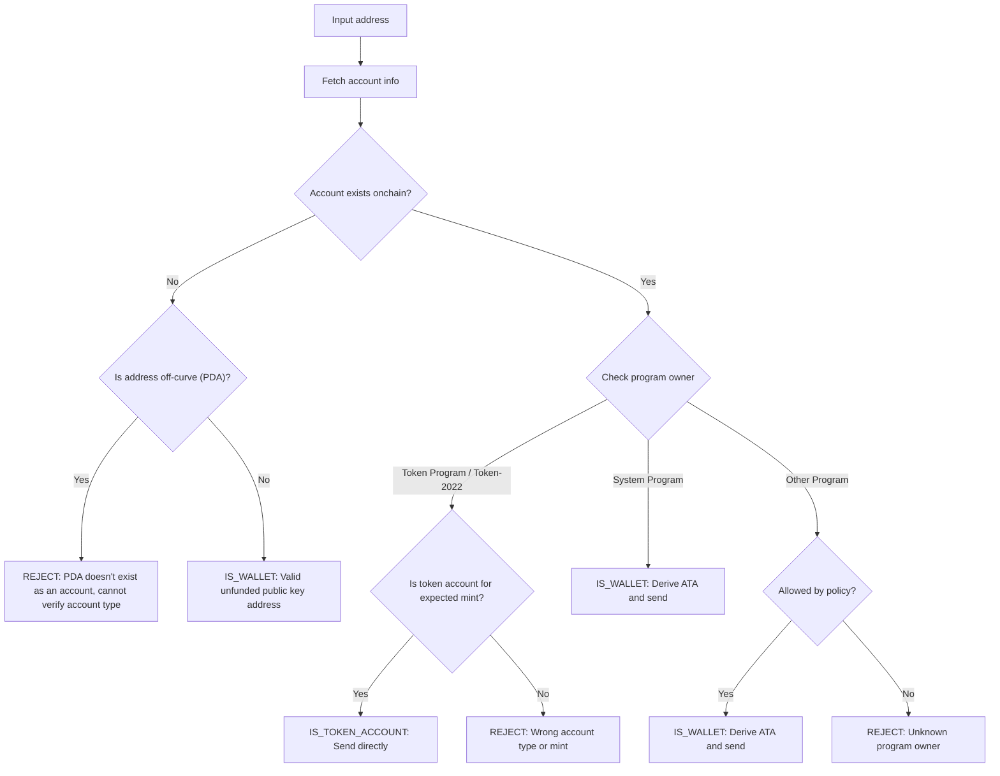

Inviare fondi a un indirizzo errato può comportare una perdita permanente. La
verifica dell'indirizzo garantisce che tu invii fondi solo a indirizzi in grado
di riceverli e accedervi correttamente.

La validazione dipende da ciò che si invia:

- **I token SPL** sono in parte auto-protetti. Il Token Program rifiuta un
  trasferimento i cui account non corrispondono al mint previsto, quindi un
  trasferimento di token indirizzato erroneamente fallisce senza perdita di
  fondi. La maggior parte di questa pagina riguarda l'invio di token SPL.
- **SOL nativo** non dispone di tale protezione. Un trasferimento tramite System
  Program ha successo in qualsiasi account, quindi un destinatario errato blocca
  permanentemente i SOL. Vedi [Invio di SOL nativo](#sending-native-sol).

<Callout>
  Vedi [Come funzionano i pagamenti su Solana](/docs/payments/how-payments-work)
  per i concetti fondamentali sui pagamenti.
</Callout>

## Comprendere gli indirizzi Solana

Gli account Solana hanno due tipi di indirizzi: on-curve e off-curve.

### Indirizzi On-Curve

Gli indirizzi standard sono le chiavi pubbliche dei keypair Ed25519. Questi
indirizzi:

- Hanno una chiave privata corrispondente in grado di firmare le transazioni
- Vengono utilizzati come indirizzi di wallet

### Indirizzi Off-Curve (PDA)

I [Program Derived Address](/docs/core/pda) sono derivati deterministicamente da
un ID di programma e da seed. Questi indirizzi:

- **Non** hanno una chiave privata corrispondente
- Possono essere firmati solo dal programma da cui l'indirizzo è stato derivato

## Tipi di account nei pagamenti

Usa l'indirizzo per recuperare un [account](/docs/core/accounts) dalla rete,
controlla il proprietario del programma e il tipo di account per determinare
come gestire l'indirizzo.

<Callout>
  Sapere se un indirizzo è on-curve o off-curve non indica il tipo di account,
  il programma che lo possiede, né se esiste un account a quell'indirizzo. È
  necessario recuperare l'account dalla rete per determinare questi dettagli.
</Callout>

### System Program Accounts (Portafogli)

Gli account di proprietà del System Program sono portafogli standard. Per
inviare token SPL a un portafoglio, è necessario derivare e utilizzare il suo
[Associated Token Account (ATA)](/docs/tokens/basics/create-token-account#whats-an-associated-token-account).

Dopo aver derivato l'indirizzo ATA, verifica se il token account esiste onchain.
Se l'ATA non esiste, puoi includere un'istruzione per creare il token account
del destinatario nella stessa transazione del trasferimento. Tuttavia, questo
richiede il pagamento del rent per il nuovo token account. Poiché il
destinatario è il proprietario dell'ATA, il SOL pagato per il rent non può
essere recuperato dal mittente.

<Callout type="warn">
  Senza adeguate misure di sicurezza, il finanziamento della creazione degli ATA
  può essere sfruttato a scopo malevolo. Un utente malintenzionato potrebbe
  richiedere un trasferimento, far creare il proprio ATA a tue spese, chiudere
  l'ATA per recuperare il rent SOL e ripetere l'operazione.
</Callout>

### Token Accounts

I [token account](/docs/tokens/basics/create-token-account) sono di proprietà
del Token Program o del Token-2022 Program e contengono i saldi dei token. Se
l'indirizzo che ricevi è di proprietà di un token program, dovresti verificare
che l'account sia un token account (e non un mint account) e che corrisponda al
mint account del token atteso prima di procedere all'invio.

<Callout type="info">
  I Token Programs verificano automaticamente che entrambi i token account
  coinvolti in un trasferimento contengano token dello stesso mint. Se la
  verifica fallisce, la transazione viene rifiutata e nessun fondo viene perso.
</Callout>

### Mint Accounts

I [mint account](/docs/tokens/basics/create-mint) tracciano la fornitura di
token e i metadati di un token specifico. I mint account sono anch'essi di
proprietà dei Token Program, ma **non** sono destinatari validi per i
trasferimenti di token. Il tentativo di inviare token a un indirizzo mint
comporta il fallimento della transazione, ma nessun fondo viene perso.

### Altri Account

Gli account di proprietà di altri programmi richiedono una decisione strategica.
Alcuni account (ad es. portafogli multisig) possono essere proprietari validi di
token account, mentre altri devono essere rifiutati.

## Invio di SOL nativo

La classificazione sopra indicata determina dove possono essere inviati i token
SPL. Il SOL nativo è più restrittivo: l'unico destinatario sicuro è un
**portafoglio System Program** (o un indirizzo non finanziato sulla curva che ne
diventa uno).

Un trasferimento tramite System Program aggiunge lamport a qualsiasi account,
inclusi mint, token account, program account e PDA. I lamport possono essere
prelevati solo dal programma proprietario dell'account, quindi inviare SOL a un
destinatario errato può comportare la perdita permanente dei fondi.

A differenza di un trasferimento di token SPL, la transazione **non** fallisce
quando il destinatario è un indirizzo inatteso.

Quando si invia SOL nativo, è accettabile solo un risultato `IS_WALLET`.
`IS_TOKEN_ACCOUNT` **non** lo è: un token account contiene token SPL e il SOL
inviato lì è fuori dal controllo del mittente.

<Callout type="warn">
  Questo è un modo comune in cui il SOL viene perso: un utente incolla
  l'indirizzo mint di un token (o un indirizzo di programma) in un prelievo SOL.
  Il trasferimento va a buon fine e il SOL è irrecuperabile. Classificare sempre
  il destinatario prima di firmare un trasferimento SOL.
</Callout>

## Flusso di Verifica

Il diagramma seguente mostra un albero decisionale di riferimento per la
validazione di un indirizzo:


```mermaid title="Address Verification Flow"
flowchart TD
    A["Input address"]
    B["Fetch account info"]

    A --> B
    B --> C{"Account exists onchain?"}

    %% --- Non-existent account path ---
    C -- "No" --> D{"Is address off-curve (PDA)?"}
    D -- "Yes" --> R1["REJECT: PDA doesn't exist as an account, cannot verify account type"]
    D -- "No" --> W1["IS_WALLET: Valid unfunded public key address"]

    %% --- Existing account path ---
    C -- "Yes" --> F{"Check program owner"}

    F -- "Token Program / Token-2022" --> G{"Is token account for expected mint?"}
    G -- "Yes" --> T1["IS_TOKEN_ACCOUNT: Send directly"]
    G -- "No" --> R2["REJECT: Wrong account type or mint"]

    F -- "System Program" --> W2["IS_WALLET: Derive ATA and send"]

    F -- "Other Program" --> K{"Allowed by policy?"}
    K -- "Yes" --> W3["IS_WALLET: Derive ATA and send"]
    K -- "No" --> R3["REJECT: Unknown program owner"]
```

<Steps>
<Step>

### Recupera account

Utilizza l'indirizzo per recuperare i dettagli dell'account dalla rete.

</Step>
<Step>

### L'account non esiste

Se non esiste alcun account a questo indirizzo, verifica se l'indirizzo è
on-curve o off-curve:

- **Off-curve (PDA)**: Per precauzione, rifiuta l'indirizzo per evitare di
  inviare a un ATA che potrebbe essere inaccessibile. Senza un account
  esistente, non è possibile determinare dal solo indirizzo quale programma
  abbia derivato questo PDA o se l'indirizzo sia relativo a un ATA. Derivare un
  ATA per questo indirizzo al fine di inviare token potrebbe comportare il
  blocco dei fondi in un token account inaccessibile.

- **On-curve**: Questo è un indirizzo wallet valido (chiave pubblica) che non è
  ancora stato finanziato. Deriva l'ATA, verifica se esiste e invia i token.
  Devi prendere una decisione di policy riguardo al finanziamento della
  creazione dell'ATA se non esiste.

</Step>
<Step>

### Account esistente

Se un account esiste, verifica quale programma ne è il proprietario:

- **System Program**: Questo è un wallet standard. Deriva l'ATA, verifica se
  esiste e invia i token. Devi prendere una decisione di policy riguardo al
  finanziamento della creazione dell'ATA se non esiste.

- **Token Program / Token-2022**: Verifica che l'account sia un token account
  (non un mint account) e che contenga il token (mint) che intendi inviare. Se
  valido, invia i token direttamente a questo indirizzo. Se è un mint account o
  un token account per un mint diverso, rifiuta l'indirizzo.

- **Altro programma**: Questa richiede una decisione di policy. Alcuni programmi
  come i wallet multisig possono essere proprietari accettabili di token
  account. Se la tua policy lo consente, deriva l'ATA e invia. Altrimenti,
  rifiuta l'indirizzo.

</Step>
</Steps>

## Demo

L'esempio seguente mostra solo la logica di validazione dell'indirizzo. Si
tratta di codice di riferimento a scopo illustrativo.

<Callout>
  La demo non mostra come derivare un ATA o costruire una transazione per
  inviare token. Consulta la documentazione sul [token
  account](/docs/tokens/basics/create-token-account#how-to-create-an-associated-token-account)
  e sul [trasferimento di token](/docs/tokens/basics/transfer-tokens) per esempi
  di codice.
</Callout>

La demo seguente utilizza tre possibili risultati:

| Risultato          | Significato             | Azione                                        |
| ------------------ | ----------------------- | --------------------------------------------- |
| `IS_WALLET`        | Indirizzo wallet valido | Deriva e invia all'associated token account   |
| `IS_TOKEN_ACCOUNT` | Token account valido    | Invia i token direttamente a questo indirizzo |
| `REJECT`           | Indirizzo non valido    | Non inviare                                   |

Mappa quindi ogni risultato all'accettabilità per asset con
`canReceiveNativeSol` (solo wallet) e `canReceiveSplToken` (wallet o token
accounts). Un token account restituisce `IS_TOKEN_ACCOUNT`, quindi può ricevere
token SPL ma **non** SOL nativo — la distinzione che impedisce al SOL di
rimanere bloccato.

<CodeTabs flags="r">

```ts !! title="Demo"
// !collapse(1:35) collapsed

import {
  type Address,
  type Rpc,
  type GetAccountInfoApi,
  createSolanaRpc,
  fetchJsonParsedAccount,
  isOffCurveAddress,
  generateKeyPairSigner,
  getProgramDerivedAddress
} from "@solana/kit";

// =============================================================================
// Constants
// =============================================================================

const defaultRpc = createSolanaRpc("https://api.mainnet-beta.solana.com");

const SYSTEM_PROGRAM = "11111111111111111111111111111111" as Address;
const TOKEN_PROGRAM = "TokenkegQfeZyiNwAJbNbGKPFXCWuBvf9Ss623VQ5DA" as Address;
const TOKEN_2022_PROGRAM =
  "TokenzQdBNbLqP5VEhdkAS6EPFLC1PHnBqCXEpPxuEb" as Address;

// =============================================================================
// Validation Function
// =============================================================================

/**
 * Possible validation results for an input address.
 */
export type ValidationResult =
  | { type: "IS_TOKEN_ACCOUNT" }
  | { type: "IS_WALLET" }
  | { type: "REJECT"; reason: string };

/**
 * Validates an input address and classifies it as a wallet, token account, or invalid.
 *
 * @param inputAddress - The address to validate
 * @param rpc - Optional RPC client (defaults to mainnet)
 * @returns Classification result:
 *   - IS_WALLET: Valid wallet address
 *   - IS_TOKEN_ACCOUNT: Valid token account
 *   - REJECT: Invalid address for transfers
 */
export async function validateAddress(
  inputAddress: Address,
  rpc: Rpc<GetAccountInfoApi> = defaultRpc
): Promise<ValidationResult> {
  const account = await fetchJsonParsedAccount(rpc, inputAddress);
  // Log the account data for demo
  console.log("\nAccount:", account);

  // Account doesn't exist onchain
  if (!account.exists) {
    // Off-curve = PDA that doesn't exist as an account
    // Reject conservatively to avoid sending to an address that may be inaccessible.
    if (isOffCurveAddress(inputAddress)) {
      return { type: "REJECT", reason: "PDA doesn't exist as an account" };
    }
    // On-curve = valid keypair address, treat as unfunded wallet
    return { type: "IS_WALLET" };
  }

  // Account exists, check program owner
  const owner = account.programAddress;

  // System Program = wallet
  if (owner === SYSTEM_PROGRAM) {
    return { type: "IS_WALLET" };
  }

  // Token Program or Token-2022, check if token account
  if (owner === TOKEN_PROGRAM || owner === TOKEN_2022_PROGRAM) {
    const accountType = (
      account.data as { parsedAccountMeta?: { type?: string } }
    ).parsedAccountMeta?.type;

    if (accountType === "account") {
      return { type: "IS_TOKEN_ACCOUNT" };
    }
    // Reject if not a token account (mint account)
    return {
      type: "REJECT",
      reason: "Not a token account"
    };
  }

  // Unknown program owner
  return { type: "REJECT", reason: "Unknown program owner" };
}

/**
 * Native SOL is only safe to send to a wallet. Any other account locks it.
 */
function canReceiveNativeSol(result: ValidationResult): boolean {
  return result.type === "IS_WALLET";
}

/**
 * SPL tokens can go to a wallet (via its ATA) or directly to a token account.
 */
function canReceiveSplToken(result: ValidationResult): boolean {
  return result.type === "IS_WALLET" || result.type === "IS_TOKEN_ACCOUNT";
}

// =============================================================================
// Examples
// =============================================================================
// !collapse(1:1000) collapsed

// Wallets
const EXISTING_WALLET =
  "H8sMJSCQxfKiFTCfDR3DUMLPwcRbM61LGFJ8N4dK3WjS" as Address;
const NEW_WALLET = (await generateKeyPairSigner()).address;

// Token accounts
const USDC_TOKEN_ACCOUNT =
  "3emsAVdmGKERbHjmGfQ6oZ1e35dkf5iYcS6U4CPKFVaa" as Address;
const PYUSD_TOKEN_ACCOUNT =
  "47od2TPRvqJipfPVWZdyenLEngPw8hC36nDxiLyvGsEP" as Address;

// Token mints (should be rejected)
const USDC_MINT = "EPjFWdd5AufqSSqeM2qN1xzybapC8G4wEGGkZwyTDt1v" as Address;
const PYUSD_MINT = "2b1kV6DkPAnxd5ixfnxCpjxmKwqjjaYmCZfHsFu24GXo" as Address;

// PDA that doesn't exist (should be rejected)
const [NON_EXISTENT_PDA] = await getProgramDerivedAddress({
  programAddress: (await generateKeyPairSigner()).address,
  seeds: ["seed"]
});

// Program account (should be rejected)
const PROGRAM_ACCOUNT =
  "p1exdMJcjVao65QdewkaZRUnU6VPSXhus9n2GzWfh98" as Address;

async function runExample(label: string, address: Address) {
  console.log(`\n${"─".repeat(60)}`);
  console.log(`Example: ${label}`);
  console.log(`Input: ${address}`);
  console.log(`${"─".repeat(60)}`);

  const result = await validateAddress(address);
  console.log("\nResult:", result);
  console.log(
    `Can receive SOL?   ${canReceiveNativeSol(result) ? "YES" : "NO"}`
  );
  console.log(
    `Can receive token? ${canReceiveSplToken(result) ? "YES" : "NO"}`
  );
}

console.log("\n" + "═".repeat(60));
console.log("  IS_WALLET Examples");
console.log("═".repeat(60));

await runExample("Existing funded wallet", EXISTING_WALLET);
await runExample("New wallet (unfunded)", NEW_WALLET);

console.log("\n" + "═".repeat(60));
console.log("  IS_TOKEN_ACCOUNT Examples");
console.log("═".repeat(60));

await runExample("USDC token account (Token Program)", USDC_TOKEN_ACCOUNT);
await runExample("PYUSD token account (Token-2022)", PYUSD_TOKEN_ACCOUNT);

console.log("\n" + "═".repeat(60));
console.log("  REJECT Examples");
console.log("═".repeat(60));

await runExample("USDC mint address", USDC_MINT);
await runExample("PYUSD mint address", PYUSD_MINT);
await runExample("Non-existent PDA", NON_EXISTENT_PDA);
await runExample("Program account", PROGRAM_ACCOUNT);

console.log("\n" + "═".repeat(60));
console.log("  Done!");
console.log("═".repeat(60) + "\n");
```

</CodeTabs>
