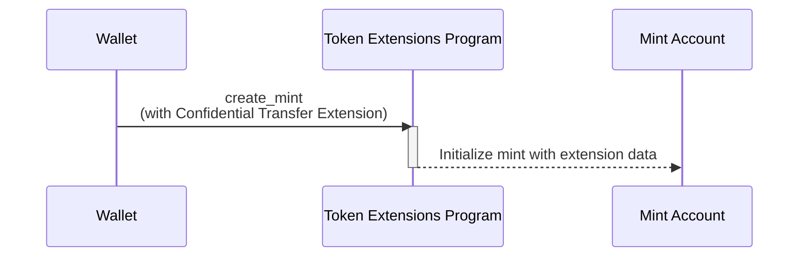

<Callout type="warn">
  Il Programma ZK ElGamal è temporaneamente disabilitato sulla mainnet e devnet
  mentre è sottoposto a un audit di sicurezza. Ciò significa che l'estensione
  per i trasferimenti confidenziali non è attualmente disponibile. Sebbene i
  concetti siano ancora validi, gli esempi di codice non funzioneranno.
</Callout>

## Come creare un mint con l'estensione Confidential Transfer

L'estensione Confidential Transfer permette trasferimenti privati di token
aggiungendo stato extra all'account mint. Questa sezione spiega come creare un
token mint con questa estensione abilitata.

Il seguente diagramma mostra i passaggi necessari per creare un mint con
l'estensione Confidential Transfer:



### Stato del Confidential Transfer Mint

L'estensione aggiunge lo stato
[ConfidentialTransferMint](https://github.com/solana-program/token-2022/blob/efd0c957fefbd79882d77df5fb2dac88c001249c/program/src/extension/confidential_transfer/mod.rs#L48-L69)
all'account mint:

```rust title="Confidential Mint State"
#[repr(C)]
#[derive(Clone, Copy, Debug, Default, PartialEq, Pod, Zeroable)]
pub struct ConfidentialTransferMint {
    /// Authority to modify the `ConfidentialTransferMint` configuration and to
    /// approve new accounts (if `auto_approve_new_accounts` is true)
    ///
    /// The legacy Token Multisig account is not supported as the authority
    pub authority: OptionalNonZeroPubkey,

    /// Indicate if newly configured accounts must be approved by the
    /// `authority` before they may be used by the user.
    ///
    /// * If `true`, no approval is required and new accounts may be used
    ///   immediately
    /// * If `false`, the authority must approve newly configured accounts (see
    ///   `ConfidentialTransferInstruction::ConfigureAccount`)
    pub auto_approve_new_accounts: PodBool,

    /// Authority to decode any transfer amount in a confidential transfer.
    pub auditor_elgamal_pubkey: OptionalNonZeroElGamalPubkey,
}
```

Il _rs`ConfidentialTransferMint`_ contiene tre campi di configurazione:

- **authority**: L'account che ha il permesso di modificare le impostazioni di
  trasferimento confidenziale per il mint e approvare nuovi account
  confidenziali se l'auto-approvazione è disabilitata.

- **auto_approve_new_accounts**: Quando impostato su true, gli utenti possono
  creare token account con trasferimenti confidenziali abilitati di default.
  Quando è false, l'authority deve approvare ogni nuovo token account prima che
  possa essere utilizzato per trasferimenti confidenziali.

- **auditor_elgamal_pubkey**: Un auditor opzionale che può decifrare gli importi
  dei trasferimenti nelle transazioni confidenziali, fornendo un meccanismo di
  conformità mantenendo la privacy rispetto al pubblico generale.

### Istruzioni richieste

La creazione di un mint con Confidential Transfer abilitato richiede tre
istruzioni in un'unica transazione:

1. **Creare l'account Mint**: Invocare l'istruzione _rs`CreateAccount`_ del
   System Program per creare l'account mint.

2. **Inizializzare l'estensione Confidential Transfer**: Invocare l'istruzione
   [ConfidentialTransferInstruction::InitializeMint](https://github.com/solana-program/token-2022/blob/efd0c957fefbd79882d77df5fb2dac88c001249c/program/src/extension/confidential_transfer/processor.rs#L48)
   del Token Extensions Program per configurare lo stato
   _rs`ConfidentialTransferMint`_ per il mint.

3. **Inizializza Mint**: Invoca l'istruzione _rs`Instruction::InitializeMint`_
   del Token Extension Program per inizializzare lo stato standard del mint.

Sebbene sia possibile scrivere queste istruzioni manualmente, il crate
`spl_token_client` fornisce un metodo `create_mint` che costruisce e invia una
transazione con tutte e tre le istruzioni in una singola chiamata di funzione,
come dimostrato nell'esempio qui sotto.

### Codice di esempio

Il seguente codice dimostra come creare un mint con l'estensione Confidential
Transfer.

Per eseguire l'esempio, avvia un validator locale con il Token Extension Program
clonato dalla mainnet usando il seguente comando. Devi avere la CLI di Solana
installata per avviare il validator locale.

```terminal
$ solana-test-validator --clone-upgradeable-program TokenzQdBNbLqP5VEhdkAS6EPFLC1PHnBqCXEpPxuEb --url https://api.mainnet.solana.com -r
```

<Callout type="info">
  Al momento della stesura, i Confidential Transfers non sono abilitati sul
  validator locale predefinito. Devi clonare il Token Extension Program dalla
  mainnet per eseguire il codice di esempio.
</Callout>

<CodeTabs>

```rust !! title="main.rs"
use anyhow::{Context, Result};
use solana_client::nonblocking::rpc_client::RpcClient;
use solana_sdk::{
    commitment_config::CommitmentConfig,
    signature::{Keypair, Signer},
};
use spl_token_client::{
    client::{ProgramRpcClient, ProgramRpcClientSendTransaction},
    spl_token_2022::id as token_2022_program_id,
    token::{ExtensionInitializationParams, Token},
};
use std::sync::Arc;

#[tokio::main]
async fn main() -> Result<()> {
    // Create connection to local test validator
    let rpc_client = RpcClient::new_with_commitment(
        String::from("http://localhost:8899"),
        CommitmentConfig::confirmed(),
    );

    // Load the default Solana CLI keypair to use as the fee payer
    // This will be the wallet paying for the transaction fees
    // Use Arc to prevent multiple clones of the keypair
    let payer = Arc::new(load_keypair()?);
    println!("Using payer: {}", payer.pubkey());

    // Generate a new keypair to use as the address of the token mint
    let mint = Keypair::new();
    println!("Mint keypair generated: {}", mint.pubkey());

    // Set up program client for Token client
    let program_client =
        ProgramRpcClient::new(Arc::new(rpc_client), ProgramRpcClientSendTransaction);

    // Number of decimals for the mint
    let decimals = 9;

    // Create a token client for the Token-2022 program
    // This provides high-level methods for token operations
    let token = Token::new(
        Arc::new(program_client),
        &token_2022_program_id(), // Use the Token-2022 program (newer version with extensions)
        &mint.pubkey(),           // Address of the new token mint
        Some(decimals),           // Number of decimal places
        payer.clone(),            // Fee payer for transactions (cloning Arc, not keypair)
    );

    // Create extension initialization parameters
    // The ConfidentialTransferMint extension enables confidential (private) transfers of tokens
    let extension_initialization_params =
        vec![ExtensionInitializationParams::ConfidentialTransferMint {
            authority: Some(payer.pubkey()), // Authority that can modify confidential transfer settings
            auto_approve_new_accounts: true, // Automatically approve new confidential accounts
            auditor_elgamal_pubkey: None,    // Optional auditor ElGamal public key
        }];

    // Create and initialize the mint with the ConfidentialTransferMint extension
    // This sends a transaction to create the new token mint
    let transaction_signature = token
        .create_mint(
            &payer.pubkey(),                 // Mint authority - can mint new tokens
            Some(&payer.pubkey()),           // Freeze authority - can freeze token accounts
            extension_initialization_params, // Add the ConfidentialTransferMint extension
            &[&mint],                        // Mint keypair needed as signer
        )
        .await?;

    // Print results for user verification
    println!("Mint Address: {}", mint.pubkey());
    println!("Transaction Signature: {}", transaction_signature);

    Ok(())
}

// Load the keypair from the default Solana CLI keypair path (~/.config/solana/id.json)
// This enables using the same wallet as the Solana CLI tools
fn load_keypair() -> Result<Keypair> {
    // Get the default keypair path
    let keypair_path = dirs::home_dir()
        .context("Could not find home directory")?
        .join(".config/solana/id.json");

    // Read the keypair file directly into bytes using serde_json
    // The keypair file is a JSON array of bytes
    let file = std::fs::File::open(&keypair_path)?;
    let keypair_bytes: Vec<u8> = serde_json::from_reader(file)?;

    // Create keypair from the loaded bytes
    // This converts the byte array into a keypair
    let keypair = Keypair::from_bytes(&keypair_bytes)?;

    Ok(keypair)
}
```

```toml !! title="Cargo.toml"
[package]
name = "confidential-transfer"
version = "0.1.0"
edition = "2021"

[dependencies]
[package]
name = "confidential-transfer"
version = "0.1.0"
edition = "2021"

[dependencies]
solana-client = "2.2.2"
solana-sdk = "2.2.2"
spl-associated-token-account = "6.0.0"
spl-token-client = "0.14.0"
spl-token-confidential-transfer-proof-extraction = "0.2.1"
spl-token-confidential-transfer-proof-generation = "0.3.0"

anyhow = "1.0.95"
dirs = "6.0.0"
serde_json = "1.0.135"
tokio = { version = "1.44.2", features = ["full"] }
```

</CodeTabs>
